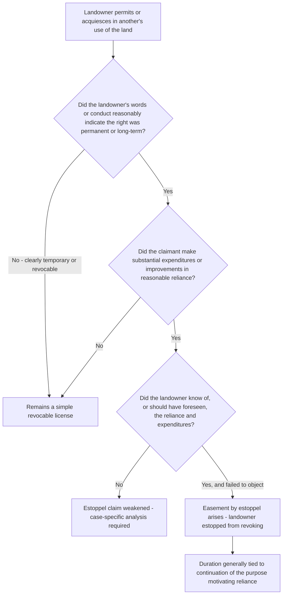

## Easements by Estoppel

### Overview

An easement by estoppel arises when a landowner's words or conduct lead another person to reasonably believe they have been granted a permanent right to use the landowner's land, and that person, in reasonable reliance on that belief, makes substantial improvements or expenditures. Rather than treating the arrangement as a freely revocable license, courts invoke equitable estoppel to prevent the landowner from later denying the existence of the right, effectively creating an easement-like interest despite the absence of a writing satisfying the Statute of Frauds. This doctrine functions as an equitable safety valve against the potential unfairness of strict Statute of Frauds enforcement.

### Doctrinal Foundation: Equitable Estoppel Applied to Land Use

**Key Points**

- Easement by estoppel is a specific application of the general doctrine of equitable estoppel (sometimes called promissory estoppel or estoppel in pais in this context) to the land-use setting.
- The doctrine does not require proof that the parties orally agreed to create a permanent easement (which would instead implicate the part-performance exception to the Statute of Frauds); it can arise from mere **permissive use** — conduct that would otherwise be a revocable license — coupled with detrimental reliance.
- **[Inference]** Courts and commentators sometimes blur the line between "easement by estoppel" and the "part performance" exception to the Statute of Frauds, since both can produce a functionally similar result (enforcement of an unwritten easement-like right), but the two doctrines rest on distinct theoretical foundations: part performance treats the oral agreement itself as enforceable due to corroborating conduct, while estoppel focuses on preventing injustice from the landowner's inconsistent later position, regardless of whether an actual oral agreement to create a permanent right was ever made.

### Elements Required for Easement by Estoppel

**1. Representation or conduct by the landowner (the party to be estopped)**

- The servient landowner must have made a representation — through words, conduct, or acquiescence — reasonably indicating that the other party has a right to use the land, typically on a permanent or long-term basis rather than merely a temporary or occasional basis.
- This can arise from an express oral statement ("you can build your driveway across that corner permanently"), or from silent acquiescence in the face of open, visible improvements being constructed by the other party (allowing construction to proceed without objection when a reasonable landowner would have spoken up if the use were meant to be temporary or revocable).

**2. Reasonable reliance by the licensee**

- The party claiming the easement must have reasonably relied on the landowner's representation or acquiescence, meaning a reasonable person in the claimant's position would have believed the right was intended to be permanent or long-term rather than merely a revocable favor.

**3. Substantial expenditures or improvements made in reliance**

- The claimant must have made **substantial, detrimental expenditures** — typically physical improvements (paving, constructing structures, installing utility connections, landscaping investments) — that would be wasted or significantly devalued if the use were later terminated.
- **Key Point**: Minor or easily reversible expenditures (e.g., informal, low-cost use requiring no real investment) are generally insufficient; courts look for expenditures substantial enough that permitting revocation would work a genuine, not merely theoretical, injustice.

**4. The landowner's knowledge of the reliance (or circumstances making it foreseeable)**

- Most formulations require that the landowner knew of, or should reasonably have foreseen, the claimant's reliance and expenditures, and failed to object or correct the claimant's mistaken belief despite a reasonable opportunity to do so.

### Scope and Duration of an Easement by Estoppel

**Key Points**

- Courts differ on the doctrinal characterization of the resulting right: some describe it as creating a true easement running with the land, enforceable against successors with notice, while others describe it more narrowly as a right personal to the claimant, enforceable only against the specific landowner who made the representation (and possibly successors who take with notice and do not independently object).
- Duration is generally tied to the continuation of the purpose for which reliance occurred — many courts hold the estoppel-based right continues for as long as the need or purpose motivating the original improvements persists, rather than being explicitly perpetual by its terms.
- **[Inference]** Because the doctrine is equitable and fact-intensive, its precise scope (whether it binds successor owners of the servient estate, whether it is assignable by the claimant, and its exact duration) tends to be resolved case-by-case based on the specific equities, rather than through a single settled rule applicable across all jurisdictions.

### Restatement (Third) Treatment

The **Restatement (Third) of Property: Servitudes § 2.10** recognizes servitudes arising by estoppel, providing that a servitude is created if the owner of the servient estate permits another to reasonably believe that a servitude exists or will be created, and the other party, in justifiable reliance, changes position such that it would be inequitable to deny the existence of the servitude. This formulation:

- Extends beyond the narrower "substantial expenditure" formulations found in some traditional case law, framing the test more broadly around reasonable belief and justifiable reliance-based change of position.
- Aligns the doctrine conceptually with implied easements and other operation-of-law creation methods, treating estoppel as one of several non-express pathways for servitude creation.

### Distinguishing Estoppel from Related Doctrines

**Comparative table**

| Feature | Easement by Estoppel | Part Performance Exception | Prescriptive Easement |
| --- | --- | --- | --- |
| Requires an actual (even if oral) agreement to create a permanent right | No — mere permissive use suffices | Typically yes — treats an oral agreement as enforceable | No — requires adverse (non-permissive) use |
| Requires landowner's permission/acquiescence | Yes — the use is with the landowner's knowledge and tacit or express approval | Yes, based on the oral agreement | No — use must be without the landowner's permission (hostile/adverse) |
| Requires substantial reliance/expenditure | Yes | Often required, or unequivocally referable conduct | No — mere continued use for the statutory period suffices |
| Requires a statutory time period | No | No | Yes — the applicable prescriptive period |

**Key distinguishing point**: Easement by estoppel and prescriptive easements are analytically opposite in one crucial respect — estoppel requires that the use be **permissive** (with the landowner's knowledge and acquiescence), while prescription requires that the use be **adverse** (without permission, hostile to the landowner's rights). A claimant cannot simultaneously argue both theories consistently, since permission negates the "hostile" element required for prescription, while lack of permission negates the reliance-on-representation element required for estoppel.

### Illustrative Examples

**Example**

*Classic estoppel fact pattern*: Neighbor A tells Neighbor B, "Feel free to run your driveway across that corner of my property; it's not doing me any good there." In reliance, B spends a substantial sum grading, paving, and installing drainage for a driveway crossing the corner, all in full view of A, who raises no objection during construction. Years later, A (or a successor who purchases with notice of the driveway and B's investment) attempts to revoke permission and block the driveway. A court is likely to hold A estopped from revoking, given B's substantial reliance expenditures made with A's knowledge and acquiescence, effectively creating an easement by estoppel.

**Example**

*Insufficient reliance*: Neighbor A gives similar oral permission to Neighbor B to cross a corner of A's lot, but B merely walks across occasionally without making any physical improvements or investments. If A later revokes permission, B has no easement by estoppel because there is no substantial detrimental reliance — the arrangement remains a simple revocable license.

**Example**

*Estoppel vs. prescription — a claimant must choose one consistent theory*: Neighbor B has used a path across Neighbor A's land for the statutory prescriptive period. If B claims the use was always with A's permission (relying on estoppel because B made substantial improvements in reliance on that permission), B cannot also argue the same use was simultaneously hostile and without permission to satisfy prescription; the two theories require inconsistent factual premises regarding the nature of A's consent.

### Diagram: Easement by Estoppel Analysis

**Next Steps**

- Part Performance Exception to the Statute of Frauds in Easement Creation
- Prescriptive Easements: The Requirement of Hostile, Non-Permissive Use
- Restatement (Third) § 2.10 on Servitudes Arising by Estoppel
- Revocable Licenses and the Threshold for Substantial Detrimental Reliance
- Whether Easements by Estoppel Bind Successor Owners of the Servient Estate
- Duration and Termination of Estoppel-Based Easement Rights
- Distinguishing Permissive Use from Adverse Use in Land Access Disputes
- Statute of Frauds Exceptions: Comparative Overview of Estoppel and Part Performance