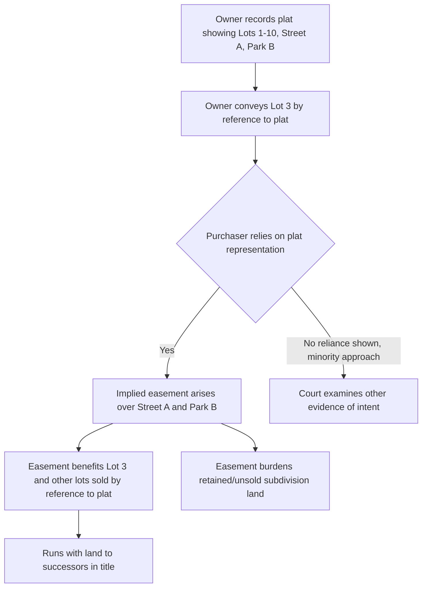

## Easements Implied from a Recorded Plat or Map

### Overview

An easement implied from a recorded plat or map arises when a landowner subdivides property and records a plat depicting streets, alleys, parks, waterfront access, or other common areas, then conveys lots by reference to that plat. Courts hold that purchasers who buy lots with reference to the recorded plat acquire an implied easement to use the depicted features, even though the deed itself contains no express easement language. The doctrine rests on the theory that the plat becomes part of the conveyance by incorporation, and that the developer's representation induces reliance by purchasers.

This doctrine is distinct from, though related to, easements implied by prior use and easements by necessity. It does not require severance of a dominant and servient estate from unity of title in the same transaction sense; instead, it is grounded in the act of platting, recording, and selling by reference to the plat.

### Doctrinal Elements

**Key Points**

- A plat or map is recorded (or otherwise made part of the public record or referenced in the chain of title) showing specific features: streets, alleys, easements, parks, beaches, or common areas.
- The grantor conveys one or more lots by reference to that plat (e.g., "Lot 7, Block 3, as shown on the Plat of Sunnyvale Subdivision, recorded in Plat Book 4, Page 22").
- The purchaser reasonably relies on the plat's representations as an inducement to purchase.
- The implied easement attaches to the specific features depicted — most commonly streets and access ways, but also parks, waterfront, and utility strips.

Courts differ on whether reliance must be actual and subjective or may be presumed from the reference to the plat itself. Many jurisdictions presume inducement once the deed references the plat, shifting the practical burden to the party opposing the easement. [Inference: the degree to which reliance is presumed versus required to be shown varies materially by jurisdiction, and no uniform national rule exists.]

### Theoretical Bases

Several overlapping theories support the doctrine, and courts often invoke more than one simultaneously:

1. **Estoppel theory** — The grantor is estopped from denying the existence of the streets/areas shown on the plat because the purchaser relied on those representations in paying the purchase price.
2. **Implied covenant / incorporation by reference theory** — The plat is treated as incorporated into the deed, so the deed is read as if the plat's depicted features were expressly granted.
3. **Dedication theory** — Recording and selling lots by reference to a plat may constitute an offer of dedication of the streets/commons to public use, which can be accepted by public use or by a municipality's acceptance, distinct from the private implied easement in favor of individual lot purchasers.
4. **Third-party beneficiary / general plan theory** — Where a plat shows a general development scheme (e.g., a private park reserved "for the use of lot owners"), each lot purchaser acquires an easement enforceable against other lot owners and the developer, similar to reciprocal negative easements in a common scheme.

### What the Easement Covers

**Streets and Alleys**

The most common application: a purchaser who buys a lot abutting a platted street acquires an easement of access over that street, even over the portion not adjacent to their own lot, sometimes extending to the street's connection with the general road system. Some jurisdictions limit this to access to and from the purchaser's lot; others recognize a broader right to use the street throughout the subdivision.

**Parks, Beaches, and Common Areas**

Where a plat designates an area as a "park," "commons," "beach," or similar, purchasers of lots in the subdivision — even lots not directly abutting the area — may acquire an implied easement to use it, on the theory that the designation was part of the general inducement to purchase throughout the development.

**Utility and Drainage Strips**

Plats often show utility easements or drainage ways; purchasers and, by extension, utility providers may acquire implied rights to use these strips consistent with their platted purpose.

### Scope and Duration

**Key Points**

- The scope of the implied easement is generally coextensive with the purpose depicted on the plat (e.g., a street easement is for travel and access, not general use).
- The easement typically benefits all lots sold with reference to the plat, and burdens the retained or unsold portions of the subdivider's land.
- Vacation of the plat, statutory vacation proceedings, or abandonment by the public authority does not necessarily extinguish the private easement rights of individual lot owners, which are treated as separate property interests. [Inference: courts frequently hold private rights survive public vacation, but statutory vacation schemes vary and some explicitly extinguish both public and private interests — the local vacation statute must be checked.]
- The easement generally runs with the land and passes to successors in title without need for restatement in subsequent deeds.

### Distinguishing from Statutory Dedication

Common-law implied easement from a plat (a private property right in favor of lot purchasers) is conceptually distinct from statutory dedication (a public law concept transferring an interest to a governmental body):

| Feature | Implied Easement (Private) | Statutory Dedication (Public) |
| --- | --- | --- |
| Beneficiary | Individual lot purchasers | The public / municipality |
| Basis | Estoppel, incorporation, reliance | Offer and acceptance under dedication statutes |
| Revocability | Generally vested, difficult to extinguish | May be revoked before acceptance |
| Requires recording statute compliance | Not necessarily | Often yes, under state plat acts |

Many jurisdictions apply both doctrines simultaneously to the same platted street: the public acquires a dedicated interest upon acceptance, while individual purchasers separately acquire a private easement that survives even if the public dedication is later vacated.

### Illustrative Diagram

### Illustrative Example

A developer records a subdivision plat depicting 40 lots, two interior streets, and a lakefront strip labeled "Reserved for Lot Owners." Over several years, the developer sells 35 lots by deeds that each reference "Plat Book 12, Page 8." The developer never expressly grants easement rights in any deed. Later, the developer (or a successor holding the remaining lots and the lakefront strip) attempts to sell the lakefront strip to a third party for exclusive development, fencing it off from the subdivision's lot owners.

Lot owners sue to establish an easement. Applying the doctrine: (1) a plat was recorded; (2) each lot owner's deed referenced the plat; (3) the plat depicted the lakefront strip as reserved for lot owners; (4) purchasers reasonably relied on this designation as part of the value and character of the subdivision. A court applying the majority approach would likely find an implied easement in favor of all 35 (and any subsequent) lot owners to use the lakefront strip, and would enjoin the fence or exclusive conveyance to the extent it interferes with that use.

### Litigation and Proof Considerations

**Key Points**

- Plaintiffs typically must produce the recorded plat and the deed(s) referencing it to establish the chain of incorporation.
- Extrinsic evidence (marketing materials, sales brochures depicting the same features) may support or substitute for a formal recorded plat in some jurisdictions, particularly where the plat itself is ambiguous.
- Defendants often argue: (a) the deed reference to the plat was merely for lot description/identification, not incorporation of all depicted features; (b) no reasonable reliance occurred; (c) the claimed easement was expressly negated elsewhere in the deed or in restrictive covenants; (d) laches, acquiescence, or adverse possession has extinguished the claimed right.
- Courts commonly distinguish between a plat referenced solely "for description purposes" and one referenced as part of a "general plan" — the latter more readily supports implication. [Inference: the description-only versus general-plan distinction is a well-recognized judicial fault line, but its application to specific plat language is fact-intensive and outcome varies by court.]

### Comparison to Related Implied Easement Doctrines

**Key Points**

- **Easement by prior use** requires unity of title followed by severance and continuation of a pre-existing apparent, continuous, and reasonably necessary use — it does not depend on a plat at all.
- **Easement by necessity** requires unity of title, severance, and strict necessity (usually landlocked access) — again independent of any recorded plat.
- **Easement from recorded plat** requires none of unity-of-title-then-severance in the traditional sense; instead the triggering acts are platting, recording, and conveyance by reference. Multiple purchasers from a common grantor, rather than a single severed parcel, is the typical fact pattern.
- These doctrines can overlap: a subdivision street shown on a plat that was also physically used prior to any sale could support claims under both the plat-implication doctrine and prior-use doctrine.

### Practical Drafting and Due Diligence Notes

- Developers wishing to avoid creating broad implied easements should include express, limited-purpose language in the plat and in deeds (e.g., "Streets shown are for ingress/egress only; no easement is created in the lakefront reserve") and should consider recording a declaration clarifying the scope of any common area rights.
- Purchasers' counsel and title examiners should review the recorded plat itself, not merely the deed, since the scope of implied rights often cannot be determined from the deed alone.
- Title insurers frequently except from coverage matters that "an accurate survey and inspection of the premises would disclose," which can include plat-based easement claims not appearing directly in the deed's granting language.

**Related Topics**

- Easements Implied from Prior Use (Quasi-Easements)
- Easements by Necessity
- Statutory Plat Acts and Dedication Requirements
- Common Development Scheme / Reciprocal Negative Easements
- Vacation of Plats and Effect on Private Rights
- Riparian and Littoral Rights in Platted Waterfront Subdivisions
- Title Insurance Exceptions for Unrecorded/Implied Easements