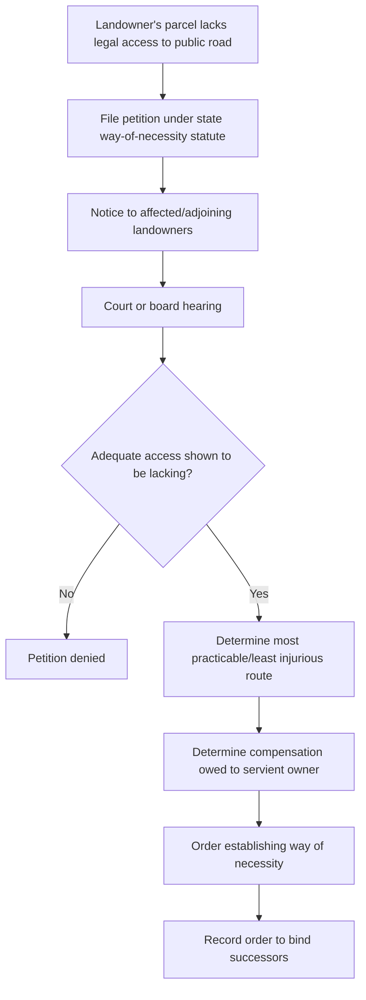

## Statutory and Common Law Ways of Necessity

### Overview

A way of necessity is an easement of access implied by law when a parcel of land is landlocked — lacking legally adequate access to a public road — as a result of a conveyance that severed a previously unified tract. Two parallel bodies of law create such rights: the common law doctrine of easement by necessity, developed through case law and grounded in implied grantor/grantee intent, and statutory ways of necessity, enacted in many states to provide a more predictable, sometimes broader, mechanism (often including a right to petition a court or administrative body for a way even where common law requirements are not strictly met, typically conditioned on payment of compensation).

### Common Law Easement by Necessity

**Elements**

1. **Unity of title** — The dominant and servient parcels were once part of a single tract owned by a common grantor.
2. **Severance** — The common owner conveyed part of the tract (or all of it in separate conveyances) such that one resulting parcel became landlocked.
3. **Strict necessity at the time of severance** — The landlocked parcel had no other legally adequate access to a public road at the moment of severance. Mere inconvenience is insufficient in the majority of jurisdictions; some minority jurisdictions apply a "reasonable necessity" standard closer to that used for easements implied from prior use.
4. **Necessity must generally continue** — Most jurisdictions hold the easement lasts only as long as the necessity persists; if the landlocked parcel later gains alternative legal access, the easement by necessity may terminate. [Inference: whether continuing necessity is a strict termination trigger or merely evidentiary varies by jurisdiction — some courts treat a vested easement by necessity as surviving the arising of alternate access, while others terminate it automatically.]

**Key Points**

- The doctrine is grounded in presumed intent: the law presumes the parties did not intend to render land useless by cutting off all access.
- No express grant is required and no writing satisfying the Statute of Frauds is needed, because the right arises by operation of law from the circumstances of severance.
- The easement is located, in the first instance, based on the parties' intent if discernible; absent that, courts select a route causing the least damage to the servient estate while providing adequate access, often called the "least injurious route" rule.
- Landlocked status must trace to a severance from common ownership. If the parcel was landlocked from a source unrelated to a common-ownership severance (e.g., purchased already landlocked from an unrelated stranger), common law necessity does not apply, though statutory necessity may.

### Distinguishing Necessity from Prior-Use Implied Easements

| Feature | Easement by Necessity | Easement Implied from Prior Use |
| --- | --- | --- |
| Requires unity of title and severance | Yes | Yes |
| Requires pre-existing apparent use at severance | No | Yes |
| Standard | Strict necessity (majority) | Reasonable necessity |
| Route determined by | Least injurious route absent shown intent | Location of prior existing use |
| Terminates if necessity ends | Often yes | No — once vested, generally permanent |

### Statutory Ways of Necessity

Most U.S. states have enacted statutes — sometimes called "private road statutes," "way of necessity acts," or similar — that supplement or, in some contexts, effectively displace the common law doctrine. Because these statutes are jurisdiction-specific, a practitioner must consult the applicable state code; the general architecture, however, is broadly consistent across enacting states:

**Typical Statutory Framework**

1. **Petition mechanism** — A landlocked owner may petition a court (or, in some states, county commissioners or a similar administrative board) for an order establishing a private way over neighboring land.
2. **No unity-of-title requirement** — Many statutes do not require that the landlocked parcel and the servient parcel were ever commonly owned; they simply require that the petitioner's land is without adequate access to a public road.
3. **Mandatory compensation** — Unlike common law easement by necessity (typically uncompensated, on the theory that the parties are presumed to have accounted for it in the original bargain), statutory ways of necessity typically require the petitioner to pay just compensation (often determined by appraisal or jury) to the servient landowner, reflecting the statute's closer kinship to eminent-domain-style takings for private benefit.
4. **Route and width determination** — The statute or presiding court/board typically selects the "most practicable route" causing the least damage, sometimes with specified width limits (e.g., a right-of-way of a defined number of feet for ingress/egress and utilities).
5. **Recording requirement** — Many statutes require the resulting order or easement to be recorded to bind successors in title.

**Key Points**

- Statutory ways of necessity raise a distinct constitutional dimension: because a private landowner (not a government entity) benefits from a forced easement over another private landowner's land, courts have scrutinized these statutes under state constitutional takings and "public use" clauses. Most state supreme courts have upheld such statutes on the theory that ensuring landlocked parcels have access serves a public purpose (preventing waste, promoting productive land use), but the reasoning and constitutional tests differ by state. [Inference: because this is state constitutional doctrine, the precise justification and level of scrutiny applied is not uniform, and some states have historically expressed skepticism toward compensated private-benefit takings before ultimately upholding such statutes.]
- Statutory relief is often available even where common law necessity fails (e.g., no historical unity of title), making it a broader remedy in practice.
- Some statutes are limited to agricultural, timber, or otherwise "landlocked for beneficial use" parcels; others are of general application.

### Procedural Flow (Illustrative — Statutory Petition)

### Illustrative Example

Owner A owns a 200-acre tract. In 1985, A sells the rear 80 acres to B, retaining the front 120 acres that fronts the only public road. B's 80 acres has no access to any public road except by crossing A's retained land or a third party's adjoining land. B never obtained an express easement.

**Common law analysis**: Unity of title existed (A owned both parcels); severance occurred (A's 1985 conveyance to B); strict necessity existed at severance (B's parcel had no other access). B (or B's successor) may establish an easement by necessity over A's retained land, with the specific route determined by any evidence of the parties' intent at the time of sale, or otherwise via the least injurious route across A's land.

**Statutory analysis (alternative or supplemental)**: If, instead, B's parcel had never been part of A's tract — for instance, B purchased already-landlocked land from an unrelated third party with no historical unity of title to any neighboring parcel — the common law doctrine would not apply. B could nonetheless petition under the state's statutory way-of-necessity act (where enacted) for a private road across the most practicable neighboring parcel, subject to paying compensation to that neighboring landowner.

### Termination and Modification

**Key Points**

- Common law easements by necessity generally terminate automatically upon the cessation of necessity in the majority of jurisdictions (e.g., the landlocked parcel is later joined to a road via new construction or a new legal access point).
- Statutory ways of necessity, once established and compensation paid, are often treated as more durable — some statutes provide that termination requires a separate judicial or administrative proceeding rather than automatic lapse, given that compensation has already changed hands. [Inference: this durability distinction is a recognized feature of many statutory schemes, but not universal; some statutes explicitly tie continuation to ongoing necessity as well.]
- Relocation of the way (by either party) is sometimes permitted under modern statutes or case law (following the trend seen in the Restatement (Third) of Property: Servitudes) if it does not materially impair the dominant owner's use of the easement and if the relocating party bears the cost.

### Litigation and Proof Considerations

- The dominant estate holder bears the burden of proving unity of title, severance, and strict necessity at the time of severance for common law claims — necessity arising after severance from a subsequent, independent event generally will not support the doctrine.
- Evidence of alternative access — even inconvenient, indirect, or costly access (e.g., a right to use a longer route, or access requiring construction of a bridge) — can defeat "strict necessity" in majority jurisdictions, though minority jurisdictions applying reasonable necessity are more forgiving.
- For statutory claims, procedural compliance (proper notice to servient owners, exhaustion of administrative steps, timely appraisal/compensation proceedings) is often outcome-determinative independent of the substantive merits.

**Related Topics**

- Easements Implied from Prior Use (Quasi-Easements)
- Easements Implied from a Recorded Plat or Map
- Eminent Domain and Public Use Doctrine (comparative constitutional framework)
- Restatement (Third) of Property: Servitudes — Relocation of Easements
- Landlocked Parcel Due Diligence in Title Examination
- Prescriptive Easements (contrast with necessity-based implication)