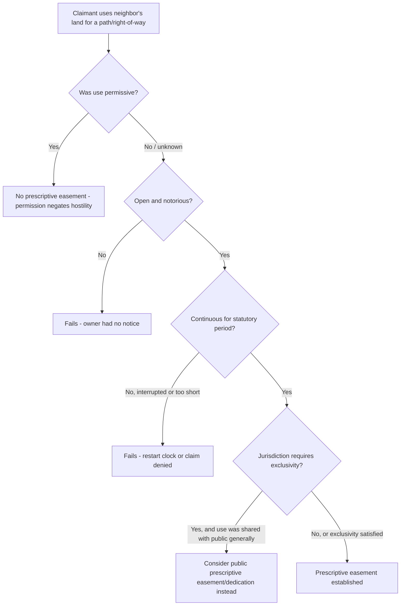

## Elements of Adverse Use for Prescription

### Overview

A prescriptive easement arises when a claimant uses another's land in a manner and for a duration sufficient to satisfy the elements traditionally associated with adverse possession, adapted to the context of a use right rather than possession of title. The doctrine rewards long-standing, openly asserted use while penalizing a landowner's failure to object within the statutory period, on the theory that the landowner is presumed to have acquiesced or forfeited the right to object. Because the doctrine is judge-made and statute-informed (the limitations period is set by statute even though the elements are largely common law), formulations vary across jurisdictions, but a recurring core set of elements appears almost universally.

### Core Elements

**Key Points**

1. **Open and notorious** — The use must be visible and apparent enough that a reasonably attentive owner, inspecting the property, would discover it.
2. **Adverse (hostile) and under a claim of right** — The use must be without the owner's permission and inconsistent with the owner's exclusive rights; it must not be merely permissive.
3. **Continuous and uninterrupted** — The use must persist, without abandonment, for the entire statutory period, though "continuous" is interpreted according to the nature of the use (e.g., seasonal or intermittent use consistent with the type of easement claimed can satisfy continuity).
4. **For the statutory period** — The use must persist for the length of time set by the jurisdiction's statute of limitations for adverse possession/prescription (commonly ranging from 5 to 20+ years depending on the state).
5. **(Majority additional element) Exclusive** — Some jurisdictions require that the use not be shared with the general public or the servient owner in the same manner, though "exclusive" in the easement context typically means exclusive of a right dependent on someone else's similar right, not literal sole use.

Some jurisdictions collapse or vary these into slightly different formulations (e.g., referring to "claim of right" as an element separate from "hostile," or omitting a distinct exclusivity requirement altogether for easements, reasoning that exclusivity is more suited to possession-of-title adverse possession claims than to non-possessory use rights).

### Open and Notorious

The purpose of this element is to ensure the landowner had a fair opportunity to learn of the use and object. Courts examine:

- Whether the use was visible upon reasonable inspection (a worn path, a fence, a pipeline marker, regular vehicular tracks).
- Whether the use was of a type ordinarily expected to be noticed (a permanent structure crossing the land is more readily "notorious" than infrequent foot traffic).
- Actual knowledge by the owner is not required if the use was sufficiently visible that knowledge should be imputed; however, actual knowledge strengthens the claim.

### Adverse and Under Claim of Right

**Key Points**

- Use with the owner's **permission** (a license) can never ripen into a prescriptive easement, no matter how long continued, because permissive use is not "hostile" — it acknowledges rather than denies the owner's superior right. This is the most commonly litigated element.
- Jurisdictions split on whether initial permission, once given, can later become adverse if the licensee's use exceeds the scope of the permission or continues after the owner revokes it and the owner fails to act.
- "Claim of right" (sometimes called "claim of title" in this context, though no title is actually claimed) generally does not require the claimant to subjectively believe they have a legal right — the majority "objective" or "state of mind is irrelevant" approach asks only whether the use was of a type that would give the owner notice of an adverse claim, regardless of the user's actual belief or intent. A significant minority "good faith" approach requires the claimant to have honestly (even if mistakenly) believed they had a right to use the land. A smaller "aggressive trespass" approach requires the claimant to know the land is not theirs and to use it anyway, intending to claim it. [Inference: the specific label and required mental state is one of the most jurisdiction-variable aspects of prescriptive easement doctrine, and practitioners must check local case law rather than assume the majority objective rule applies.]
- Use pursuant to a mistaken belief of a boundary line (e.g., a fence erected in the wrong location due to a survey error) is commonly treated as satisfying "hostility" under both the objective and good-faith approaches, though not universally under the aggressive-trespass approach.

### Presumption of Permission — Family, Neighborly, and Unenclosed Land Contexts

**Key Points**

- Use between family members, friends, or generally accommodating neighbors is often presumed permissive absent evidence otherwise, on the theory that neighborly accommodation, not hostile claim, better explains the use. This presumption can make prescriptive claims among relatives or amicable neighbors more difficult to establish.
- Many jurisdictions apply a presumption that use of unenclosed, unimproved, vacant land is permissive, reflecting a policy against penalizing landowners who tolerate incidental use of land they are not actively using — sometimes codified by statute.
- These presumptions are generally rebuttable by evidence of an actual adverse claim (e.g., express statements asserting a right, acts inconsistent with mere accommodation, or maintenance/improvement of the way by the claimant).

### Continuous and Uninterrupted

- The required continuity is measured against the nature of the claimed easement: a right-of-way used only during hunting season, for example, may still be "continuous" if used regularly each season over the requisite years, consistent with how such a way would ordinarily be used.
- **Tacking**: successive periods of adverse use by different users in privity (e.g., grantor to grantee, predecessor to successor) may be added together to satisfy the statutory period, provided there is a transfer of the claimed interest or at least an intent to transfer the benefit of the use along with the land.
- Interruption by the servient owner (e.g., physically blocking the way, filing suit to eject the user, or the user acknowledging the owner's superior right) resets or defeats the running of the prescriptive period. Mere protest without physical or legal action is generally insufficient to interrupt in most jurisdictions. [Inference: the sufficiency of verbal protest alone to interrupt prescription is treated inconsistently; some courts require an actual act of obstruction or legal action, while others accord weight to unambiguous, repeated objection.]

### Exclusivity (Where Required)

Where required as a distinct element, "exclusive" use for prescriptive easement purposes does not mean the claimant used the land to the exclusion of all others (unlike possessory adverse possession) — it means the claimant's use did not depend on a like right shared indiscriminately by the general public. Use shared with the general public (e.g., a way used by anyone passing through, not just the claimant) may support a public prescriptive easement or an implied dedication instead, rather than a private prescriptive easement in favor of one claimant.

### Prescription Compared to Adverse Possession

| Feature | Prescriptive Easement | Adverse Possession |
| --- | --- | --- |
| Interest acquired | Non-possessory use right | Fee title |
| Exclusivity required | Often relaxed or use-appropriate | Generally strict |
| Payment of taxes required | Rarely required | Required in many states |
| "Claim of right" standard | Objective (majority) / good faith (minority) | Similarly split, often mirroring the state's adverse possession rule |
| Effect of permission | Defeats claim entirely | Defeats claim entirely |

### Illustrative Flow of Analysis

### Illustrative Example

For 22 consecutive years, the owners of Lot 5 have driven a truck path across the rear corner of neighboring Lot 6 to reach a public road, the path having been created and continuously maintained (graded, occasionally graveled) by Lot 5's owners without ever asking Lot 6's owners for permission. Lot 6's owners were aware of the path (visible ruts, occasional passing vehicles) but never objected, granted permission, or attempted to block it. The statutory prescriptive period in the jurisdiction is 20 years.

Applying the elements: the use was open and notorious (visible path, known to Lot 6's owners); adverse and under claim of right (no permission was ever sought or given, and Lot 5's owners maintained the path as if entitled to do so, satisfying even a good-faith or objective standard); continuous for a period exceeding the statutory 20 years; and, if the jurisdiction requires exclusivity, satisfied because the path was not part of a public thoroughfare used indiscriminately by others. A court would likely recognize a prescriptive easement in favor of Lot 5 over the specific path traveled.

### Litigation and Proof Considerations

- The burden of proof for each element is generally on the claimant, and in a majority of jurisdictions must be established by "clear and convincing evidence," a heightened standard reflecting the law's reluctance to divest property rights without a deliberate, unambiguous course of conduct.
- Long-term use alone, without more, is frequently attacked as consistent with mere neighborly tolerance; claimants strengthen their position with evidence of maintenance, exclusion of others from the same path, express assertions of right, or improvements made without seeking consent.
- A defendant servient owner will often attempt to show permission was granted (even informally, e.g., "sure, go ahead") at any point, since a single instance of permission can convert an otherwise adverse use into a permissive one going forward, restarting the clock if adversity later resumes.
- Government or public land is subject to distinct and often more restrictive rules (many jurisdictions bar prescriptive rights against government-owned land entirely).

**Related Topics**

- Scope and Extent of Prescriptive Easements Once Established
- Tacking of Successive Adverse Uses
- Public Prescriptive Easements and Implied Dedication
- Termination of Prescriptive Easements (Abandonment, Merger, Estoppel)
- Comparative Elements: Adverse Possession of Fee Title
- Effect of Permissive Use and Revocable Licenses on Prescription