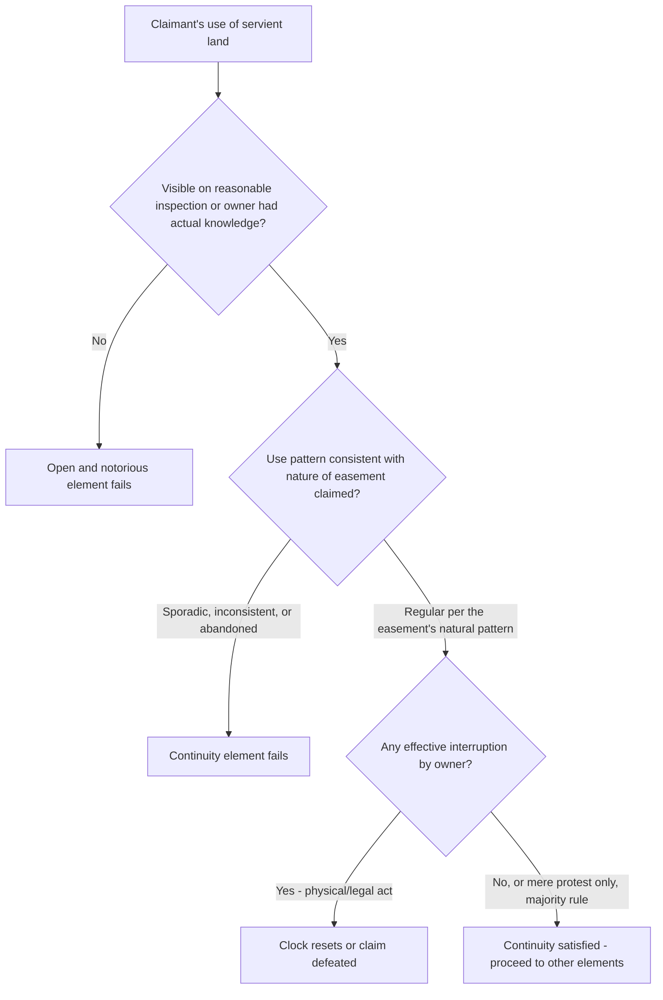

## Open, Notorious, and Continuous Use Requirements

### Overview

Among the elements required to establish a prescriptive easement, the "open and notorious" and "continuous" requirements serve a distinct evidentiary function separate from hostility: they ensure the servient landowner had both a fair opportunity to discover the adverse use and an uninterrupted course of conduct against which to measure the statutory period. This item examines these two elements in depth, including their interaction, common fact patterns, and the doctrinal tests courts use to determine whether a given pattern of use qualifies.

### Open and Notorious Use

**Purpose and Rationale**

The open and notorious requirement exists to protect the servient owner's due process interest in an opportunity to object. The law will not permit a stealthy or concealed use to ripen into a legal right, because the owner could never have taken action to prevent it. The requirement is thus about *visibility and discoverability*, not actual subjective knowledge.

**Key Points**

- The standard is typically **objective**: would a reasonably attentive owner, exercising ordinary diligence in inspecting the property, discover the use? Actual knowledge is not required if the use meets this objective visibility standard.
- Physical markers strengthen a finding of open and notorious use: a worn path, a fence, a ditch, utility poles or buried-line markers with surface indicia, a driveway, or a structure encroaching onto the servient land.
- Uses that are inherently visible from their nature (vehicular travel across an open field, livestock grazing, water diversion via a visible ditch or pipe) are more easily found open and notorious than uses that could plausibly go undetected (e.g., an underground utility line with no surface markings, particularly before it is excavated or serviced).
- Concealment or affirmative efforts to hide the use from the owner will defeat the element and can also undercut a claim of "hostility," since concealment suggests the user believed the use was not rightful.
- Where the servient owner had **actual knowledge**, some courts treat this as satisfying the requirement independently of visibility, on the theory that actual notice moots the need to inquire whether a hypothetical reasonable owner would have discovered it.

**Underground and Non-Visible Uses**

A recurring difficulty arises with uses not visible from a surface inspection — subterranean pipelines, underground drainage, or below-grade utility lines. Courts have adopted varying approaches:

- Some hold that open and notorious cannot be satisfied absent some surface indication (access covers, marker posts, visible trenching activity during installation, or a related visible structure).
- Others hold that if the servient owner had actual knowledge of the underground use (e.g., was present during installation, or received notice through other means), the open-and-notorious requirement is satisfied regardless of ongoing surface visibility.
- A minority of jurisdictions treat certain underground utility easements as more appropriately established via implication or estoppel theories rather than prescription, given the tension between concealment and the doctrine's rationale. [Inference: this is an area of genuine doctrinal split with no dominant national rule; the outcome is highly fact- and jurisdiction-dependent.]

### Continuous and Uninterrupted Use

**Purpose and Rationale**

The continuity requirement ensures that the prescriptive period runs as an unbroken course of adverse conduct, giving the servient owner a fair, ongoing opportunity to object throughout, and preventing sporadic or abandoned uses from ripening into permanent rights.

**Key Points**

- "Continuous" does not mean constant, uninterrupted physical use every single day. It means use of the frequency and pattern **consistent with the nature of the easement claimed**.
  - A right-of-way used only during hunting season, or only to access a summer cabin, can be continuous if used that way, season after season, throughout the statutory period.
  - A drainage easement carrying water only during storms is continuous if it functions that way whenever the relevant conditions occur.
- Continuity is broken by:
  - **Abandonment** by the claimant (cessation of use with intent not to resume) — mere non-use during an "off-season" consistent with the claimed use's natural pattern is not abandonment.
  - **Interruption** by the servient owner through an unequivocal act (physically obstructing the way, bringing a successful legal action to eject the user, or the user's acknowledgment of the owner's superior right), which is generally distinguished from mere verbal protest, which many jurisdictions treat as insufficient standing alone. [Inference: as with the hostility element, the threshold amount of owner action needed to interrupt continuity (protest alone vs. a physical or legal act) varies by jurisdiction and is frequently litigated.]
- **Tacking** allows successive periods of continuous adverse use by different users to be combined to meet the statutory period, provided there is privity between the successive users (e.g., the benefit of the use was transferred along with the dominant estate, whether by deed, inheritance, or other recognized succession), analogous to tacking in adverse possession of title.

### Interaction Between the Elements

Open, notorious, and continuous use requirements often overlap in application: intermittent, easily-missed use is simultaneously vulnerable to attack as not "open and notorious" (owner had no fair chance to notice it) and as not "continuous" (gaps suggest possible abandonment or lack of a settled course of conduct). Conversely, a permanent visible structure (like a paved driveway or fixed fence line) tends to satisfy both elements simultaneously, since its mere physical presence is both continuously "there" and inherently visible.

### Comparative Table: Open/Notorious vs. Continuous

| Feature | Open and Notorious | Continuous |
| --- | --- | --- |
| Primary purpose | Ensure owner had opportunity to discover use | Ensure unbroken course of adverse conduct over the statutory period |
| Measured by | Objective visibility (or actual knowledge) | Pattern of use appropriate to the type of easement claimed |
| Defeated by | Concealment; use not detectable on reasonable inspection | Abandonment by claimant; effective interruption by owner |
| Enhanced by | Physical markers, structures, visible activity | Regularity, consistency with easement's natural use pattern, tacking among successors |

### Illustrative Flow

### Illustrative Example

A rural property owner (Claimant) has used a dirt track across a neighbor's back forty acres to reach a seasonal fishing cabin every summer for 18 years, in a jurisdiction with a 15-year prescriptive period. The track is visible via tire ruts and a small hand-built wooden bridge over a creek, built by the Claimant in year 3 and visible year-round. The neighbor visited the property twice during this period and saw the bridge but said nothing.

**Open and notorious**: The bridge, a permanent structure, and the visible tire ruts satisfy the objective visibility standard; the neighbor's actual observation of the bridge reinforces the finding independently.

**Continuous**: Although the track is used only during summer months, this is the pattern natural to accessing a seasonal fishing cabin — courts would treat this as sufficiently continuous, analogous to seasonal-cabin access easements recognized in prescriptive easement case law. No abandonment occurred (use resumed every summer), and the neighbor never took any obstructing action or brought suit, so continuity was never interrupted.

Assuming the other elements (adversity, statutory period, any required exclusivity) are also met, a court would likely find these two elements satisfied notwithstanding the seasonal, non-constant nature of the use.

### Litigation and Proof Considerations

- Claimants should marshal evidence of physical, visible indicia of use (photographs over time, receipts for maintenance/improvement, testimony of neighbors or third parties who observed the use) to establish open and notorious use.
- For continuity, claimants benefit from documentary or testimonial evidence establishing a consistent pattern over the full statutory period — gaps in use should be explained as consistent with the natural use pattern (e.g., seasonal access) rather than as lapses.
- Servient owners defending against a claim often focus on demonstrating either (a) the use was not visible or discoverable through reasonable inspection, particularly for underground or intermittent uses, or (b) an actual interruption occurred (a fence erected, a lawsuit filed, explicit revocation communicated and acted upon) that reset the clock.
- Courts frequently require **corroborating physical or documentary evidence** beyond the claimant's own testimony, given the clear-and-convincing evidentiary standard applied in most jurisdictions to prescriptive claims.

**Related Topics**

- Elements of Adverse Use for Prescription (Hostility and Claim of Right)
- Tacking of Successive Adverse Uses
- Termination of Prescriptive Easements (Abandonment, Merger, Estoppel)
- Underground Utility Easements and Prescription
- Scope and Extent of Prescriptive Easements Once Established
- Presumption of Permissive Use on Unenclosed Land