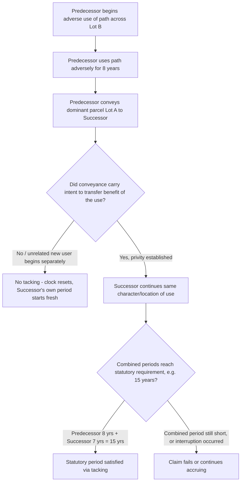

## Tacking of Successive Periods of Use

### Overview

Tacking is the doctrine that permits a claimant to combine (or "tack") their own period of adverse use with the adverse use of one or more predecessors in order to satisfy the statutory prescriptive period, where no single user's individual period of use meets the requisite duration on its own. Without tacking, a prescriptive claim would fail whenever land changed hands among a succession of adverse users before any one of them individually completed the statutory period — a result courts have generally viewed as inconsistent with the doctrine's underlying purposes. Tacking is a well-established feature of both prescriptive easement law and adverse possession of fee title, and the two bodies of doctrine developed largely in parallel.

### The Privity Requirement

**Key Points**

- Tacking is permitted only where there is **privity** between the successive adverse users — a legally recognized relationship or transfer connecting one user's claim to the next.
- Privity is typically established by a transfer of possession or use accompanied by an intent to transfer the benefit of the adverse use along with it — most commonly:
  - A deed conveying the dominant estate (even if the deed does not expressly mention the easement or adverse use, courts will often infer that use of the servient land passed along with the conveyance of the parcel benefiting from it).
  - Inheritance or intestate succession.
  - Other recognized modes of succession in interest (e.g., a lease assigning the tenant's rights, in some jurisdictions).
- Privity is generally **not** established merely because one adverse user abandons the use and a wholly unrelated stranger later begins a new, independent adverse use of the same path or area — in that scenario, each use is a separate, unconnected claim, and the clock restarts with the second user. [Inference: the precise dividing line between "successor in interest with intent to pass on the use" and "unrelated new user" is fact-specific and can be contested, particularly with informal or undocumented transfers of rural land.]

### Rationale

The doctrine reflects two related policy judgments:

1. Land is regularly bought, sold, and inherited; requiring one continuous *individual* period of use, without allowing successors to add their predecessor's time, would make prescriptive rights nearly impossible to establish on any land that changes hands within the statutory period — an outcome inconsistent with the doctrine's purpose of protecting settled, long-standing uses.
2. The servient owner's notice and opportunity-to-object rationale is unaffected by a change in *who* is exercising the adverse use, so long as the character, general location, and adverseness of the use continues without interruption — the owner had the same fair opportunity to object to the ongoing use regardless of which individual was making it.

### Requirements for Successful Tacking

**Key Points**

1. **Privity of estate or transfer**, as discussed above, connecting each successive claimant.
2. **Continuity of the use itself** — the nature, general location, and character of the use must remain substantially consistent across the successive periods; a marked change in the type or scope of use by a successor can break the chain (e.g., predecessor used a footpath for pedestrian access; successor begins using it for regular heavy truck traffic — some courts would treat this as expanding beyond what was tacked, potentially requiring a fresh prescriptive period for the expanded use).
3. **No effective interruption** during the transition between users or at any point across the combined periods (an interruption by the servient owner during the gap between predecessor's cessation and successor's commencement would break the chain, though a brief, non-abandoning gap consistent with the nature of the use — e.g., between seasons — typically does not).
4. Each individual period tacked must itself have been adverse (not permissive) — a period of permissive use by a predecessor cannot be tacked onto a later adverse use by a successor to make up statutory time, since permissive use never counts toward the prescriptive period regardless of who is using the land.

### Tacking Against the Servient Estate

Tacking can also operate on the servient side: successive owners of the servient estate are bound by the running prescriptive period regardless of changes in servient ownership, because the adverse use runs against the land, not merely against a particular owner personally. A servient owner cannot defeat an accruing prescriptive claim simply by selling the burdened parcel to a new owner, since the new owner takes subject to the continuing running of the period (though a bona fide purchaser without notice may have separate recording-act defenses in some contexts, particularly where the claim has not yet ripened and is not otherwise discoverable).

### Comparative Table: Tacking Requirements — Dominant Side vs. Servient Side

| Feature | Dominant (Claimant) Side | Servient (Burdened) Side |
| --- | --- | --- |
| What must connect successive parties | Privity of estate/transfer of dominant parcel or use | Mere continuity of ownership is not required — period runs against the land itself |
| Effect of sale mid-period | Successor may tack predecessor's adverse use if privity shown | New servient owner takes subject to the already-running period |
| Key risk | Break in privity (unrelated new user) resets the clock | N/A — burden runs with servient land regardless of transfer |

### Illustrative Flow

### Illustrative Example

The statutory prescriptive period in the jurisdiction is 15 years. Owner X of Lot A used a gravel driveway crossing the rear of neighboring Lot B for 9 years, openly, continuously, and without permission, to access a rear storage building. X then sold Lot A to Owner Y by a deed that conveyed "all my right, title, and interest in Lot A," making no specific mention of the driveway or any easement. Y continued using the same driveway, in the same manner and location, for an additional 7 years, again without permission from Lot B's owner, who never objected or took any obstructing action throughout the entire 16-year combined period.

Because Y is a successor in interest to X's dominant parcel (Lot A) via a conveyance that, under the majority approach, is presumed to carry with it the benefit of X's ongoing adverse use absent evidence of contrary intent, privity exists. The character and location of the use remained unchanged. Combining X's 9 years with Y's 7 years yields 16 years — exceeding the 15-year statutory period. Tacking allows Y to establish a prescriptive easement over the driveway even though Y's own individual period of use (7 years) alone would have been insufficient.

### Litigation and Proof Considerations

- The party asserting tacking bears the burden of establishing privity — typically through the deed or instrument of conveyance, testimony regarding intent to pass on the use, or circumstantial evidence that the successor simply continued the predecessor's established pattern of use without interruption or a fresh start.
- Defendants (servient owners) resisting tacking often argue: (a) no privity exists because the predecessor abandoned the use before the successor began (a gap that, if shown to reflect abandonment rather than mere pause, breaks the chain); (b) the character or scope of the use materially changed with the new user, exceeding what was originally established; or (c) the predecessor's use was itself permissive, so no adverse time accrued to tack in the first place.
- Documentary evidence — deeds, wills, probate records, or even informal correspondence referencing the driveway/path/use — is valuable in establishing the necessary intent to transfer the use along with the estate, particularly in rural or informally-conveyed property contexts where such rights are rarely mentioned expressly.
- Courts examining tacking claims frequently draw on adverse-possession tacking case law by analogy, given the substantially overlapping doctrinal architecture between the two areas.

**Related Topics**

- Elements of Adverse Use for Prescription (Hostility and Claim of Right)
- Open, Notorious, and Continuous Use Requirements
- Termination of Prescriptive Easements (Abandonment, Merger, Estoppel)
- Tacking in Adverse Possession of Fee Title (comparative doctrine)
- Scope and Extent of Prescriptive Easements Once Established
- Privity of Estate in Real Property Transfers