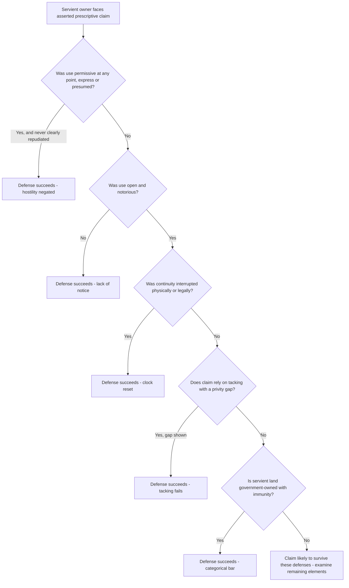

## Defenses Against Prescriptive Claims

### Overview

Because prescriptive easements divest a landowner of the ability to exclude another from a use of their land without compensation, the law affords servient owners a range of defenses to defeat an accruing or asserted prescriptive claim. These defenses generally operate either by negating one of the required elements (hostility, open and notorious use, continuity, or the statutory period) or by establishing an independent legal bar (permission, government ownership, statutory presumption, or procedural defect). A servient owner's counsel typically pursues multiple defenses simultaneously, since defeating any single required element is sufficient to defeat the entire claim.

### Permission (License) — The Primary Defense

**Key Points**

- The single most effective defense is proof that the use was, at all relevant times or at some point during the claimed period, **permissive** rather than adverse. Permission negates hostility entirely, and hostility cannot be revived without a distinct, later assertion of an adverse claim communicated or made evident to the owner.
- Permission may be shown by:
  - Express oral or written consent ("Sure, go ahead and use the path").
  - A revocable license, whether formal or informal.
  - Conduct reasonably interpreted as consent, such as the owner assisting in maintaining the way or acquiescing after being asked.
- Once permission is established for any part of the claimed period, the burden often shifts to the claimant to show a subsequent, distinct, and communicated repudiation of that permission and the commencement of a new adverse claim — mere continuation of the same use after permission was granted does not, without more, become adverse.
- Permission can sometimes be inferred retroactively from the relationship of the parties (see family/neighborly presumption below), effectively serving as a defense even without direct evidence of an actual grant of permission.

### Presumption of Permissive Use

**Key Points**

- **Family and close-relationship presumption**: use between family members, or sometimes between close friends or accommodating neighbors, is often presumed permissive absent evidence of an actual adverse claim, since courts view such arrangements as more consistent with informal accommodation than a hostile assertion of right.
- **Unenclosed/vacant/wild land presumption**: many jurisdictions, some by statute, presume that use of unenclosed, unimproved, or otherwise vacant land is permissive, reflecting a policy against penalizing landowners for tolerating incidental use of land they are not actively occupying or monitoring.
- These presumptions shift the burden to the claimant to rebut them with affirmative evidence of a hostile claim (e.g., explicit assertions of right, exclusion of the true owner or others, unauthorized improvements made without seeking consent).

### Lack of Open and Notorious Use

A servient owner may defend by showing the claimed use was not visible or discoverable through reasonable inspection — for example, an underground or intermittent use lacking any surface indicia, or a use so infrequent or unobtrusive that a reasonably attentive owner would not have discovered it. This defense directly negates the openness element rather than relying on an independent bar.

### Interruption of Continuity

**Key Points**

- An owner may defeat a prescriptive claim by demonstrating an effective interruption during the claimed period — most reliably, a physical act (erecting a barrier, locking a gate) or a successful legal action (an injunction, an ejectment suit) that stopped the use, even temporarily, in a manner sufficient to reset the running of the statutory clock.
- Mere verbal protest, without a follow-up physical or legal act, is treated as insufficient to interrupt continuity in a majority of jurisdictions, though this is one of the more contested points across jurisdictions and some courts give protest greater weight, particularly if repeated and unambiguous. [Inference: because the sufficiency of protest alone is genuinely split, a servient owner relying solely on verbal objection should not assume this defense will succeed without corroborating action.]
- Owners are well advised, as a practical/preventive matter, to escalate from protest to an actual obstruction or legal filing if the adverse use continues, precisely because protest alone is a fragile defense in many jurisdictions.

### Insufficient Duration / Statute of Limitations Not Met

A straightforward defense is simply that the claimed use has not persisted for the full statutory period, whether because the use began later than claimed, was interrupted (restarting the clock), or because a purported tacking chain fails for lack of privity (see below), leaving no single continuous period meeting the statutory minimum.

### Defeating Tacking (Break in Privity)

Where a claimant relies on tacking together the adverse use of a predecessor and a successor to meet the statutory period, the servient owner may defend by showing:

- No privity existed between the successive users (e.g., the second user was an unrelated party who began an independent, unconnected use after the first user's use ceased).
- The predecessor's use was abandoned (with intent not to resume) before the successor began, breaking the chain regardless of any later relationship between the parties.
- The character or scope of use materially changed between predecessor and successor, arguably requiring a fresh prescriptive period for the expanded or altered use.

### Government/Public Land Immunity

**Key Points**

- Many jurisdictions bar prescriptive claims against land owned by government entities (federal, state, or municipal) entirely, on sovereign immunity or public policy grounds, sometimes codified by statute expressly excluding public lands from prescriptive acquisition regardless of how long the adverse use continued.
- Some jurisdictions permit prescriptive claims against government land only for certain categories (e.g., land held in a proprietary rather than governmental capacity) or not at all — this is a jurisdiction-specific inquiry requiring review of the applicable state's statutes and case law. [Inference: the scope of any government-land exception varies significantly and cannot be assumed uniform.]

### Estoppel and Laches Asserted Against the Claimant

In some circumstances, a servient owner may argue that the claimant is estopped from asserting a prescriptive right, or that laches bars the claim, where the claimant's own conduct (e.g., prior acknowledgment of the owner's superior right, or an agreement inconsistent with an adverse claim) undermines the assertion of hostility.

### Comparative Table: Defenses and the Element(s) Each Attacks

| Defense | Element Negated / Basis |
| --- | --- |
| Express or implied permission | Hostility / claim of right |
| Family or unenclosed-land presumption | Hostility (via burden-shifting presumption) |
| Lack of visibility/discoverability | Open and notorious |
| Physical or legal interruption | Continuity |
| Insufficient elapsed time | Statutory period |
| Break in privity for tacking | Continuity across successive claimants |
| Government ownership | Independent categorical bar |
| Estoppel/laches based on claimant's own conduct | Hostility / equitable bar |

### Illustrative Flow

### Illustrative Example

A claimant asserts a prescriptive easement over a farm access road crossing the defendant's land, claiming 17 years of adverse use in a jurisdiction requiring 15 years. The defendant's evidence shows: (1) for the first 6 years, the claimant's father had explicitly asked the defendant's predecessor for permission to use the road, which was granted; (2) the claimant only began asserting the road was "mine to use" without asking anyone roughly 10 years before suit was filed; (3) no privity or transfer of any claimed adverse-use benefit was ever documented between the claimant and the father, and the father's use was permissive throughout, meaning no adverse time accrued during that period regardless of any relationship.

Because the first 6 years were permissive (not adverse), that time cannot count toward the statutory period at all, and there is no adverse use to tack forward even if privity existed. Only the remaining approximately 10 years of arguably adverse use (following the point the claimant began an unpermitted, assertive use) would count — falling short of the required 15 years. The defendant's permission defense, combined with the insufficient-duration point, would likely defeat the claim.

### Litigation and Proof Considerations

- Because prescriptive claims are typically subject to a **clear and convincing evidence** standard, defendants benefit from raising multiple, independently sufficient defenses (e.g., permission and insufficient duration) rather than resting on one.
- Contemporaneous documentation — old correspondence, family records, prior lawsuits or demand letters, survey records, or witness testimony about early conversations granting permission — is often decisive in permission-based defenses, particularly for long-standing rural or family-adjacent uses.
- Defendants should be cautious about actions that could be construed as *acquiescence* (such as helping maintain the claimed way) if their goal is to preserve a permission or lack-of-hostility defense, since such conduct can cut both ways depending on how it is characterized.
- Where a defense rests on interruption, defendants are better positioned when they can show an affirmative act (fence, gate, legal filing) rather than relying solely on verbal objection, given the jurisdictional split on the sufficiency of protest alone.

**Related Topics**

- Elements of Adverse Use for Prescription (Hostility and Claim of Right)
- Open, Notorious, and Continuous Use Requirements
- Tacking of Successive Periods of Use
- Termination of Prescriptive Easements (Abandonment, Merger, Estoppel)
- Presumption of Permissive Use on Unenclosed Land
- Prescriptive Rights Against Government-Owned Land