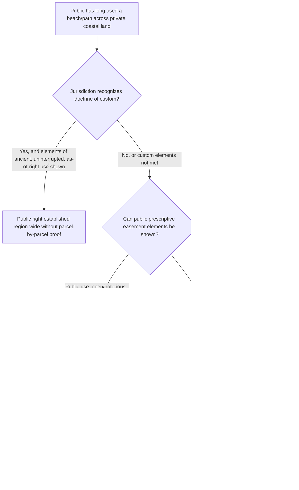

## Public Prescriptive Rights and Custom

### Overview

While most prescriptive easement doctrine addresses a private claimant acquiring a use right against a specific servient owner, land law also recognizes mechanisms by which the *general public* acquires rights of use over privately held land: public prescriptive easements and the related, more geographically specific doctrine of custom. Both doctrines allow long-continued, widespread use by the public — rather than by an identifiable individual claimant — to ripen into an enforceable right, but they rest on distinct theoretical foundations and are subject to different proof requirements and defenses.

### Public Prescriptive Easements

**Elements**

Public prescriptive easements generally require proof of the same core elements as private prescriptive easements, adapted to a collective claimant:

1. **Use by the public generally** (or a definable segment of it), rather than by one or a few identifiable individuals asserting an individual right.
2. **Open and notorious** use, visible to the servient owner.
3. **Adverse** — without permission, and inconsistent with the owner's exclusive control.
4. **Continuous** for the statutory period, consistent with the nature of the use claimed (e.g., seasonal beach access, consistent with seasonal recreational patterns).

**Key Points**

- The central conceptual difficulty is showing that use was by "the public" in a legally cognizable sense, rather than merely a large but unconnected series of individual trespassers, none of whom individually satisfies a private prescriptive claim. Courts have developed varying tests:
  - Some require evidence that the use was understood, by both the public and the owner, as a public right rather than a series of individual permissive or tolerated uses.
  - Others focus on whether a **local governmental entity or the public generally** exercised or maintained the way (e.g., grading a road, mowing a path) in a manner suggesting a public claim of right.
- Because no single private individual is asserting the claim, standing and enforcement mechanisms differ: the action is often brought by, or requires the involvement of, a public entity (attorney general, municipality) or is established through litigation initiated by an individual public user but adjudicated as establishing a right for the public generally.
- Public prescriptive easements are especially significant in the context of **beach and waterfront access**, where courts in coastal states have applied the doctrine (along with public trust and custom theories, discussed below) to preserve public access to dry-sand beach areas above the mean high tide line, notwithstanding private littoral ownership.

### The Doctrine of Custom

**Key Points**

- Custom is a related but analytically distinct doctrine, most prominently associated with certain U.S. coastal jurisdictions (with Oregon's adoption in the mid-20th century being a frequently cited example) and rooted in English common law tradition.
- Rather than requiring proof of the elements of prescription (which technically must be established anew, tract by tract, against each servient owner), custom asks whether a usage has been **so long and so generally practiced by the public in a particular region** that it has effectively become an attribute of the land itself in that area — meaning it can apply region-wide, rather than requiring separate proof against each individual parcel.
- Classic elements associated with the custom doctrine (adapted from historical English formulations) commonly include: the custom must be ancient (used from time immemorial, or as long as anyone can recall), exercised without interruption, exercised as of right (not by mere permission), certain and definite in nature and locale, reasonable, obligatory (not merely optional for those subject to it), and consistent with other customs or laws.
- The principal practical advantage of custom over prescription, where recognized, is that the public is not required to prove the elements separately against every individual parcel owner along a stretch of coastline or region — a single judicial recognition of a regional custom can establish public rights across an entire class of similarly situated land. [Inference: this efficiency-based rationale is the doctrine's central practical significance, but very few U.S. states have formally adopted custom as an independent doctrine distinct from prescription and public trust theories, making its geographic reach comparatively narrow.]

### Public Prescription and Custom Compared to Related Public-Access Doctrines

| Doctrine | Basis | Applies Region-Wide or Parcel-by-Parcel | Typical Context |
| --- | --- | --- | --- |
| Private prescriptive easement | Individual adverse use, all elements | Parcel-by-parcel, individual claimant | Any private land use dispute |
| Public prescriptive easement | Collective/public adverse use | Generally parcel-by-parcel, though may extend to a defined public way | Roads, paths, public accessways |
| Custom | Long-standing regional practice | Region-wide, once recognized | Coastal/beach access in adopting states |
| Public trust doctrine | Sovereign ownership of tidelands/navigable waters held for public benefit | Applies below defined tidal/navigability boundary, independent of prescription | Submerged lands, tidelands, navigable waterways |
| Implied dedication | Owner's conduct manifesting intent to dedicate to public use, plus public acceptance | Parcel-by-parcel | Streets, parks shown on plats; some beach access cases |

### Interaction with the Public Trust Doctrine

Public prescriptive rights and custom are frequently invoked alongside, but are doctrinally distinct from, the public trust doctrine, which holds that title to submerged lands and the foreshore (below the mean high tide line in most jurisdictions) is held by the state in trust for public uses such as navigation, fishing, and commerce, independent of any showing of adverse use over time. Custom and prescription become relevant primarily to extend public access rights *above* the public trust boundary — onto the dry-sand beach areas that are privately owned — where the public trust doctrine alone would not reach.

### Illustrative Flow

### Illustrative Example

For over 60 years, the general public has walked across a strip of dry-sand beach in front of a row of privately owned beachfront homes to reach the public wet-sand area, without ever seeking permission from the homeowners, and local residents have long treated the practice as a matter of right rather than owner tolerance. A new owner attempts to fence off the dry-sand strip in front of their home.

In a jurisdiction recognizing the doctrine of custom, a court might examine whether the practice satisfies the traditional elements (ancient, uninterrupted, exercised as of right, certain in its geographic scope, reasonable) across the region generally, and if so, could recognize a public right applicable to the entire stretch of similarly situated beachfront, without requiring the public to separately prove 60 years of adverse use against each individual homeowner's parcel. In a jurisdiction not recognizing custom, the public (or a government entity on its behalf) would instead need to establish a public prescriptive easement using the standard prescriptive elements, litigated with respect to the specific parcel(s) at issue, and any recognized right would in principle apply only to those specific parcels rather than automatically extending region-wide.

### Litigation and Proof Considerations

- Public prescriptive claims often require **historical evidence spanning decades**, including longtime resident testimony, historical photographs, newspaper accounts, government maintenance records, and tax or survey records, given the extended time periods and diffuse nature of "public" use.
- Because custom is recognized in only a small number of jurisdictions and only in relatively narrow contexts (predominantly coastal access), practitioners should not assume its availability without confirming the specific jurisdiction has adopted it as an independent doctrine.
- Government entities may play a distinct role in public prescriptive/custom litigation, either as the formal party asserting the right on the public's behalf, as an intervenor, or as an entity whose historical maintenance/acceptance conduct provides key evidence of the public character of the use.
- Servient owners resisting public prescriptive or custom claims often argue that the historical use was permissive/tolerated (particularly where the owner or predecessor had a longstanding practice of allowing beach walkers without objection), aiming to negate the "as of right" or "adverse" element common to both doctrines.

**Related Topics**

- Elements of Adverse Use for Prescription (Hostility and Claim of Right)
- Public Trust Doctrine and Tidelands Ownership
- Easements Implied from a Recorded Plat or Map (implied dedication comparison)
- Coastal Access Regulation and the Takings Clause
- Termination of Prescriptive Easements (Abandonment, Merger, Estoppel)
- Comparative State Approaches to Beach Access Rights