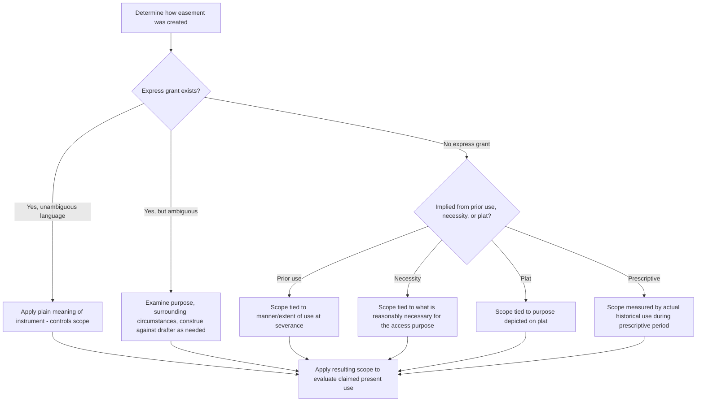

## Determining Permitted Use and Purpose

### Overview

Once an easement's existence has been established — whether by express grant, implication, necessity, or prescription — a distinct and frequently litigated question arises: what uses does the easement actually permit? Determining the permitted use and purpose of an easement requires courts to interpret the instrument (if express), the circumstances of creation (if implied), or the historical pattern of use (if prescriptive), applying different interpretive methodologies depending on the mode of creation. This item surveys the general interpretive framework courts apply across easement types before scope-specific doctrines (such as evolving use or overburdening) are addressed as separate items.

### Interpretive Priority: The Governing Instrument

**Key Points**

- For **express easements**, the language of the grant or reservation controls in the first instance. Courts apply ordinary rules of contract/deed interpretation: give effect to the plain meaning of the granting language, read the instrument as a whole, and consider the circumstances surrounding execution when the language is ambiguous.
- Express grants may be **general** (e.g., "a right of way for ingress and egress") or **specific** (e.g., "a right of way for the passage of vehicles not exceeding 10 tons, for agricultural purposes only"). General language is interpreted more expansively and is more readily adapted to changing circumstances; specific, limiting language confines the easement strictly to its stated purpose.
- Where the instrument specifies a **purpose** (e.g., "for access to the dairy barn"), courts generally hold that the easement's use is limited to that purpose and its reasonably related incidents, even if the language does not expressly restrict other uses. Where the instrument specifies no purpose at all, courts must resort to surrounding circumstances, the physical characteristics of the way, and the presumed intent of the original parties.
- Ambiguities are typically construed in a manner that:
  - Gives effect to the intent of the parties at the time of grant.
  - Avoids rendering any part of the grant meaningless.
  - In many jurisdictions, resolves genuine ambiguity **against** the grantor (as drafter) under the general contra proferentem principle applied to deeds, though this is a default rule of last resort, not a substitute for genuine interpretation.

### Interpretive Approach for Implied Easements

**Key Points**

- For easements **implied from prior use**, scope is generally tied to the use that existed at the time of severance — the manner, extent, and purpose of the pre-existing apparent use serves as the primary evidentiary anchor for what the parties are presumed to have intended to continue.
- For **easements by necessity**, scope is generally limited to what is reasonably necessary for the purpose that gave rise to the necessity (typically ingress/egress), rather than any broader use, since the necessity itself — not a specific historical use pattern — is the doctrinal source of the right.
- For easements implied **from a recorded plat**, scope is tied to the purpose depicted on the plat (a street easement is for travel/access; a park designation is for recreational/park-type use), and does not extend to unrelated uses merely because the same physical area is involved.

### Interpretive Approach for Prescriptive Easements

**Key Points**

- The scope of a prescriptive easement is generally limited to the manner, frequency, and purpose of the **use actually made during the prescriptive period** — the doctrine "measures the right by the use" (a frequently cited formulation), since the servient owner's acquiescence extended only to what was actually done, visibly, during the running of the statutory period.
- Courts are typically **reluctant to expand** a prescriptive easement's scope significantly beyond the historical pattern that gave rise to it, in contrast to the more flexible "reasonable development" doctrines sometimes applied to express or implied easements (addressed in a separate scope item covering evolving use standards).
- A change in the *degree* of the same general use (e.g., an increase in the frequency of vehicular trips over a right-of-way used for farm vehicle access) is often permitted as a natural evolution of the same purpose; a change in the *kind* of use (e.g., converting agricultural access to a commercial trucking route or subdividing the dominant parcel into many new residential lots each claiming the same access) presents a materially different question more likely to be found an impermissible overburdening or expansion of purpose.

### General Factors Courts Consider

Across all modes of creation, courts commonly weigh:

1. **Language of any instrument**, given controlling weight where express and unambiguous.
2. **Purpose stated or reasonably inferable** at the time of creation.
3. **Physical characteristics** of the way or area (width, surface, historical construction) as evidence of the scope contemplated.
4. **Nature and character of the dominant and servient estates** at the time of creation, and whether a claimed use is consistent with the general character then existing.
5. **Extent of use actually made**, particularly significant for implied and prescriptive easements.
6. **Reasonable necessity** for the dominant estate's use and enjoyment, balanced against the burden imposed on the servient estate.
7. **Custom and normal development** of similarly situated land, particularly where courts apply a more flexible "reasonably foreseeable development" approach (addressed separately as a distinct scope doctrine).

### Comparative Table: Scope Determination by Mode of Creation

| Mode of Creation | Primary Interpretive Anchor | Typical Flexibility for Changed Use |
| --- | --- | --- |
| Express grant (general language) | Plain meaning, purpose if stated, surrounding circumstances | Moderate to high — adapts to reasonable development consistent with stated purpose |
| Express grant (specific/limited language) | Precise terms of the grant | Low — confined to stated purpose and manner |
| Implied from prior use | Manner/extent of use existing at severance | Moderate — some evolution permitted if consistent with original purpose |
| By necessity | Purpose of the necessity (typically access) | Low to moderate — tied to what is reasonably necessary |
| From recorded plat | Purpose depicted on the plat | Low to moderate — tied to depicted use category |
| Prescriptive | Actual historical manner/frequency/purpose of use during the prescriptive period | Low — courts resist significant expansion beyond established pattern |

### Illustrative Flow

### Illustrative Example

A deed grants "a right of way, 20 feet in width, for agricultural purposes, over the north boundary of Grantor's land." Decades later, the dominant parcel's owner converts the land from farming to a commercial equestrian boarding facility and begins running horse trailers and regular client traffic over the 20-foot way daily.

Applying the interpretive framework: the express grant contains specific limiting language ("for agricultural purposes"), which controls in the first instance. A court would examine whether commercial equestrian boarding — including regular client and trailer traffic — falls within "agricultural purposes" as that term would have been understood at the time of grant, or whether it constitutes a materially different (and more burdensome) commercial use exceeding the granted purpose. Given the specific and limiting nature of the granting language, a court applying the low-flexibility approach appropriate to specifically-purposed express grants would likely scrutinize closely whether the new use remains within — or has exceeded — the agricultural purpose for which the way was originally granted, with the outcome turning on how broadly "agricultural purposes" is construed in that jurisdiction and whether equestrian boarding is treated as an agricultural or commercial activity. [Inference: whether courts classify equestrian boarding as agricultural varies by jurisdiction and by the specific statutory or common-law definitions applied to "agricultural use," making the outcome genuinely fact- and jurisdiction-dependent.]

### Litigation and Proof Considerations

- Where the instrument is ambiguous or silent on purpose, extrinsic evidence — the physical condition of the way at creation, contemporaneous correspondence, tax records reflecting the land's use, and the parties' subsequent conduct — becomes central to establishing intended scope.
- Courts often give significant weight to **how the parties themselves acted** for a substantial period following creation, on the theory that practical construction by the parties is strong evidence of their original intent (particularly relevant where decades have passed without dispute over a particular use).
- Dominant estate owners seeking to expand or change use bear the practical burden of showing the new use is consistent with, or a permissible evolution of, the originally established purpose; servient owners resisting expansion focus on demonstrating that the new use is different in kind, not merely degree, or that it exceeds what was reasonably contemplated at creation.
- Surveys, historical aerial photography, and expert testimony on customary land use practices in the relevant era and locale are frequently used to establish the physical and purposive scope of an easement whose origin documentation is sparse or ambiguous.

**Related Topics**

- Evolving and Changing Use of Easements Over Time
- Overburdening the Servient Estate
- Use of Easements to Benefit After-Acquired or Additional Land
- Width, Location, and Physical Characteristics of Easements
- Relocation of Easements by Servient Owners
- Termination of Easements by Misuse or Abandonment