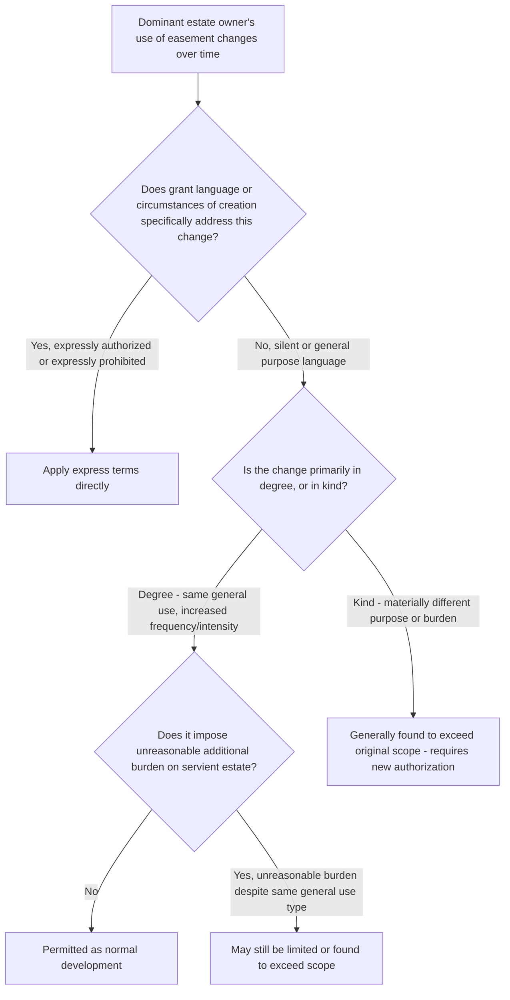

## Changes in Use and Technological Evolution

### Overview

Easements are typically created to endure over long periods, often decades or generations, during which the manner of using land — and the technology available to do so — inevitably changes. This item examines the doctrinal framework courts apply when a dominant estate owner's use of an easement evolves due to changed circumstances or new technology, distinguishing permissible natural development of an established use from an impermissible expansion that exceeds the scope originally granted, implied, or established by prescription.

### The Core Doctrinal Tension

**Key Points**

- On one hand, the law generally favors allowing easements to accommodate **normal, foreseeable development** of the dominant estate consistent with changing technology and land use practices, on the theory that parties creating a perpetual or long-term easement are presumed to have anticipated some degree of evolution rather than intending to freeze the use in the exact manner existing at creation.
- On the other hand, the servient estate owner is entitled to have the burden on their land remain within the bounds of what was actually granted, implied, or established — an easement holder cannot unilaterally expand the burden simply because new technology *could* be used, if doing so imposes a materially greater or different burden than originally contemplated.
- Courts resolve this tension through a **reasonable development / normal evolution** standard versus a **materially increased burden** limitation, examined below.

### The "Reasonable Development" Standard

**Key Points**

- The prevailing modern approach, reflected in the Restatement (Third) of Property: Servitudes, holds that unless the terms of the servitude (or the circumstances of its creation) indicate otherwise, the manner, frequency, and intensity of an easement's use may change over time to take advantage of developments in technology and to accommodate normal development of the dominant estate, provided the change does not:
  1. Impose an **unreasonable additional burden** on the servient estate beyond what was originally contemplated, or
  2. **Significantly change** the nature of the use in a way inconsistent with the original purpose.
- Under this standard, courts have generally permitted, for example:
  - An easement originally used for horse-and-buggy travel to accommodate automobile and modern vehicular traffic.
  - A right-of-way for a single residence to accommodate reasonable increases in traffic from ordinary residential development consistent with the character of the area.
  - A utility easement originally used for telephone lines to accommodate technologically updated cable, fiber-optic, or similar communications infrastructure serving substantially the same general purpose (transmission of communications), in many though not all jurisdictions.
- This standard is most readily applied to **general-purpose** express easements and easements implied from prior use, where the underlying purpose (e.g., "access," "communication," "drainage") is broad enough to encompass technological substitutes achieving the same functional purpose.

### Limits: Change in Kind vs. Change in Degree

**Key Points**

- Courts consistently distinguish between a **change in degree** of the same essential use (generally permitted) and a **change in kind** to a different, materially more burdensome, or purpose-inconsistent use (generally not permitted absent express authorization).
- Illustrative distinctions frequently drawn in case law:
  - Increased frequency of the same type of traffic on a residential access easement, consistent with the residential character of the dominant estate = typically a permitted change in degree.
  - Conversion of a residential access easement to serve a newly built commercial shopping center on the dominant parcel = typically found a change in kind, exceeding the original scope.
  - Upgrading an easement's utility line from telephone to broadband/fiber = often treated as within the same general communications purpose in many jurisdictions, though outcomes vary based on the specific language of the grant and the degree of physical disruption caused by the upgrade (e.g., new poles, wider trenching, different maintenance access needs). [Inference: because "communications" technology has changed dramatically and continues to do so, and because grant language from earlier eras rarely anticipated fiber-optic or wireless technology, courts applying older easement grants to modern telecommunications infrastructure reach genuinely divergent results, and the outcome is highly dependent on specific grant language and jurisdictional precedent.]
  - Placement of solar panels, cell towers, or other significant fixed infrastructure within a right-of-way easement originally granted only for travel purposes is generally treated as a change in kind exceeding the travel-purpose scope, absent express authorization.

### Technological Evolution in Utility Easements Specifically

**Key Points**

- Utility easements present a recurring and heavily litigated context for this doctrine, because utility technology has changed dramatically since many such easements were originally granted (often in the early-to-mid 20th century for telephone or electric lines).
- A significant body of case law addresses whether an easement granted for one type of utility service (e.g., a telephone line easement) permits use for a different or additional purpose (e.g., co-locating fiber-optic cable used for internet or third-party data transmission services unrelated to the original utility's own operations).
- Some courts hold that if the new use serves a **substantially similar communications function** and does not increase the physical burden on the servient estate, it falls within the scope of a broadly worded utility easement. Other courts hold that using the same physical wires/poles/conduit for a *new commercial purpose* by a *different entity* (e.g., leasing fiber capacity to third-party telecom carriers unrelated to the original utility grantee) exceeds the scope of the original grant, treating it as a new use requiring separate authorization or compensation. [Inference: this fiber-optic/telecommunications overburdening question has produced a genuine, ongoing jurisdictional split without a uniform national rule, and outcomes often turn on fine distinctions regarding whether the new use serves the "utility's own purposes" versus generates an independent commercial benefit unrelated to the original grant.]

### Comparative Table: Change in Degree vs. Change in Kind

| Feature | Change in Degree (Generally Permitted) | Change in Kind (Generally Not Permitted) |
| --- | --- | --- |
| Underlying purpose | Remains the same | Materially different from original purpose |
| Physical burden on servient estate | Same general character, possibly increased frequency | New or substantially different type of burden |
| Consistency with original grant language | Consistent, especially with general-purpose language | Inconsistent, especially with specific/limited language |
| Typical example | More vehicle trips over a residential access way | Converting residential access way to serve new commercial development |
| Utility context example | Same utility upgrading transmission technology for its own service | New/different entity using the easement for an unrelated commercial purpose |

### Illustrative Flow

### Illustrative Example

An easement was granted in 1962 as "a right of way for the erection and maintenance of telephone and electric transmission lines" across a rural parcel, benefiting the utility company and, through it, the surrounding community. In the following decades, the utility upgrades its infrastructure to include fiber-optic cable strung on the same poles, used both for its own internal grid communications and, later, leased to a separate internet service provider to deliver residential broadband to unrelated customers throughout the region.

Applying the framework: the upgrade from copper telephone lines to fiber-optic cable for the utility's own communications purposes would likely be treated by most courts as a permitted change in degree — a technological evolution of the same essential "telephone and electric transmission" purpose, causing no materially different physical burden. However, the subsequent leasing of excess fiber capacity to an unrelated third-party ISP for its own independent commercial broadband service raises the more contested question addressed above: some courts would find this exceeds the original utility-purpose grant (a new commercial use by a different entity for a different purpose), while others might find it a permissible incidental use of the same physical infrastructure serving a substantially similar communications function. The outcome would depend heavily on the specific jurisdiction's case law and the precise original grant language.

### Litigation and Proof Considerations

- Dominant estate owners advocating for permitted evolution typically present evidence of the general, broad, or forward-looking language of the original grant, the absence of any express limitation, and expert or historical testimony establishing that the new use serves substantially the same functional purpose without materially increasing the servient burden.
- Servient owners resisting expanded use focus on specific or limiting grant language, evidence of a materially increased physical burden (additional excavation, wider clearance requirements, increased traffic or noise), and the involvement of new, unrelated commercial beneficiaries not contemplated by the original grant.
- Courts frequently require expert testimony (engineering, land use planning, or utility industry practice) to assess whether a given technological substitution genuinely serves the same function with the same or lesser burden, or represents a materially different undertaking.
- Because this area is particularly unsettled with respect to modern telecommunications infrastructure, practitioners drafting new easements are increasingly advised to include express language anticipating future technological development (e.g., "including future technologies serving substantially the same purpose") to reduce future litigation risk — a preventive drafting point relevant to counsel structuring new easement grants today.

**Related Topics**

- Determining Permitted Use and Purpose
- Overburdening the Servient Estate
- Utility Easements and Co-Location of Telecommunications Infrastructure
- Restatement (Third) of Property: Servitudes — General Interpretive Principles
- Use of Easements to Benefit After-Acquired or Additional Land
- Termination of Easements by Misuse or Abandonment