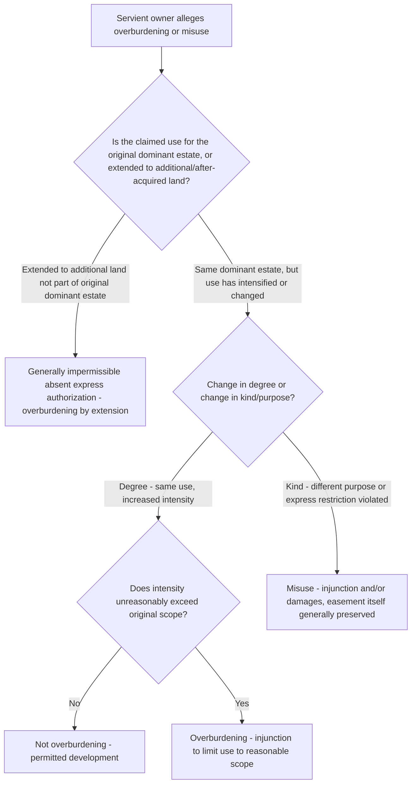

## Overburdening and Misuse of an Easement

### Overview

Overburdening occurs when a dominant estate owner's use of an easement exceeds the scope originally granted, implied, or established by prescription, imposing a greater or different burden on the servient estate than was contemplated. Misuse is a related but broader concept encompassing any use inconsistent with the easement's terms or purpose, including overburdening as one specific manifestation. Both doctrines protect the servient owner's interest in having the burden on their land remain confined to what was actually authorized, and both give rise to a range of remedies distinct from a claim that the easement never existed at all.

### Overburdening Defined

**Key Points**

- Overburdening most commonly arises in two related fact patterns:
  1. **Increased intensity of the same use** beyond what is reasonable given the easement's scope (e.g., a right-of-way originally serving a single-family residence now serving a 200-unit apartment complex built on the dominant parcel).
  2. **Use to benefit land beyond the original dominant estate** — extending the easement's benefit to additional or after-acquired parcels not originally intended to be served, a distinct doctrine addressed in depth elsewhere but closely related to overburdening.
- The touchstone inquiry is generally whether the change **imposes an unreasonable additional burden** on the servient estate, assessed against what the original parties intended or what is reasonable given the easement's stated or implied purpose — not simply whether the use has changed at all.
- Overburdening is a matter of degree, not a bright-line test: courts weigh the character of the original use, the extent of the claimed increase, the physical capacity of the way or area, and the servient owner's reasonable expectations at the time of creation.

### Distinguishing Overburdening from Permitted Evolution

Overburdening exists in tension with the doctrine permitting reasonable technological and developmental evolution of easement use (addressed as a related, distinct topic). The dividing line generally tracks the change-in-kind versus change-in-degree distinction:

| Feature | Reasonable Evolution (Not Overburdening) | Overburdening |
| --- | --- | --- |
| Nature of change | Same essential use, modernized or intensified within reasonable bounds | Materially different or excessive use exceeding original scope |
| Burden on servient estate | Comparable to, or only modestly greater than, original burden | Substantially greater or qualitatively different burden |
| Consistency with original purpose | Consistent | Inconsistent or exceeds original purpose |
| Typical remedy if disputed | Use upheld as within scope | Injunction limiting use, or damages |

### Extending Use to Serve Additional or After-Acquired Land

**Key Points**

- A well-established application of the overburdening doctrine holds that an easement appurtenant to a specific dominant parcel generally **cannot be used to benefit other land** owned by the same dominant owner, even adjoining land, unless the grant expressly permits such extended use.
- This rule applies even where the additional land is contiguous with the original dominant estate and even where using the easement to serve both parcels would not, as a practical physical matter, increase traffic or burden beyond what a single larger single parcel might generate — the doctrine is generally applied categorically rather than based purely on a showing of increased physical burden, because it protects the servient owner's right to have the burden defined by reference to a specific, identifiable dominant estate. [Inference: while this categorical rule is well established as a default, some jurisdictions and the Restatement (Third) of Property: Servitudes have moved toward a more flexible reasonableness-based analysis in certain circumstances rather than an absolute bar, so the strictness of application varies.]
- Where a dominant parcel is **subdivided** into multiple smaller lots after the easement's creation, courts generally permit each resulting lot to use the easement for access, provided the aggregate use does not unreasonably exceed what was contemplated for the original single parcel — subdivision into a reasonable number of residential lots is often upheld, while subdivision into an unreasonably large number of lots or conversion to a fundamentally different use (e.g., commercial development) may be found to overburden the easement.

### Misuse Beyond Overburdening

**Key Points**

- Misuse also encompasses uses that violate express restrictions in the grant, even without necessarily increasing the physical burden — for example, using a right-of-way restricted to "residential purposes only" to access a home-based commercial operation with regular client visits and deliveries violates the purpose restriction directly, independent of whether the resulting traffic increase would otherwise be considered a change in degree.
- **Excessive width or improper construction** — improving or widening a right-of-way beyond what the grant authorizes, or paving/constructing improvements not contemplated by the original grant, can constitute misuse independent of the intensity-of-use analysis.
- **Use for an unrelated purpose entirely** — using a drainage easement to also run vehicular traffic, or using a pedestrian footpath easement for regular vehicular access, is a straightforward misuse claim based on purpose inconsistency rather than a degree-of-burden analysis.

### Remedies for Overburdening and Misuse

**Key Points**

- **Injunctive relief** is the most common remedy sought — an order limiting the dominant owner's use to what is within the proper scope of the easement, without necessarily terminating the easement altogether.
- **Damages** may be available for harm caused by the excessive use, particularly where physical damage to the servient estate has occurred (e.g., excessive wear from heavy vehicle traffic beyond what the way was designed or authorized to bear).
- Courts are generally reluctant to **terminate** an easement entirely as a remedy for overburdening or misuse, reserving termination for egregious or willful misuse doctrines discussed separately (misuse-based termination is a distinct, narrower doctrine from simply scaling back an overuse) — the default remedy is to enjoin the excess use while preserving the underlying, properly-scoped easement.
- Where a use serves both the original dominant estate and improperly extends to additional land, courts may craft a remedy permitting continued lawful use for the original dominant estate while enjoining the extended use benefiting the additional parcel, rather than eliminating the easement's use entirely.

### Illustrative Flow

### Illustrative Example

A right-of-way easement, granted in 1975, provides access "for the benefit of the single-family residence located on the Dominant Parcel." The dominant parcel's current owner demolishes the residence and constructs a 12-unit apartment building on the same parcel, generating substantially increased daily vehicle trips, delivery traffic, and trash collection service over the shared right-of-way, and separately begins using a spur of the same right-of-way to access an adjoining parcel the owner purchased more recently, which has no independent access.

Applying the framework: the redevelopment from a single-family residence to a 12-unit apartment building on the *same* dominant parcel raises an overburdening-by-intensity question — a court would assess whether the resulting increase in traffic and use unreasonably exceeds what was contemplated by a right-of-way originally serving one residence, likely weighing the physical capacity of the way, its original construction, and the character of the surrounding area. Separately, and more clearly, using the easement to access the *newly acquired adjoining parcel* — land outside the original dominant estate — is a straightforward overburdening-by-extension claim, which courts applying the traditional categorical rule would likely enjoin regardless of whether it adds significant additional physical burden, since that adjoining parcel was never part of the dominant estate for which the easement was granted.

### Litigation and Proof Considerations

- Servient owners bringing overburdening claims should document baseline historical use (photographs, traffic counts, witness testimony about historical patterns) to establish a comparison point against the claimed excessive current use.
- Claims involving extension to after-acquired land often turn on a relatively narrow, more legal (rather than factual) question — whether the additional parcel was, in fact, part of the original dominant estate — making title history and the original grant's legal description particularly important.
- Dominant estate owners defending against overburdening claims often argue the change is one of degree, not kind, consistent with normal development of the character of area, and supported by expert testimony (traffic engineering, land use planning) that the way's physical capacity accommodates the increased use without meaningful additional burden.
- Courts are attentive to the servient owner's own conduct — a servient owner who long acquiesced to an expanded or extended use without objection may face laches or estoppel arguments limiting the availability of injunctive relief, though this does not typically convert an unauthorized extension into a permanently vested right absent independent prescriptive elements being separately established.

**Related Topics**

- Determining Permitted Use and Purpose
- Changes in Use and Technological Evolution
- Use of Easements to Benefit After-Acquired or Additional Land
- Subdivision of the Dominant Estate and Easement Rights
- Termination of Easements by Misuse or Abandonment
- Remedies for Interference with Easement Rights