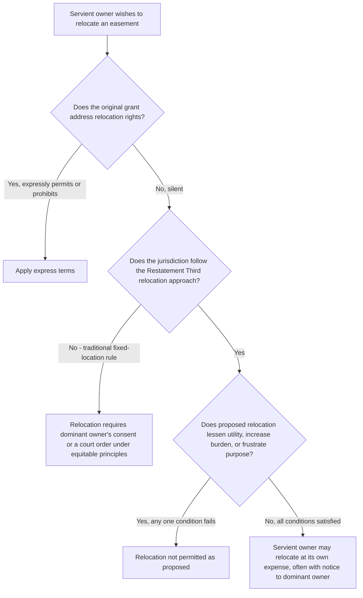

## Relocation of Easements

### Overview

Relocation addresses whether, and under what circumstances, an easement's physical location can be changed after its creation — either by the servient owner seeking to move the burden to a different part of their land, or occasionally by mutual agreement or dominant-owner initiative. Historically, the common law treated an easement's location, once fixed, as essentially permanent, requiring the consent of both parties for any change. Modern law, led by the Restatement (Third) of Property: Servitudes, has moved toward a more flexible unilateral relocation doctrine in many jurisdictions, creating a significant and ongoing area of doctrinal divergence.

### The Traditional Common Law Rule: Fixed Location

**Key Points**

- Under the traditional rule, once an easement's location is fixed — either by the express terms of the grant, by the parties' subsequent agreement, or by the actual manner of use over a period of time — that location **cannot be unilaterally changed** by either party without the other's consent.
- Fixation of location typically occurs:
  - Immediately, if the grant specifies a particular location (metes and bounds description, or reference to a specific existing path/road).
  - By the parties' subsequent conduct, where a grant is general as to location (e.g., "a right of way across Grantor's land" with no specific route described) but the parties then establish a specific route through actual use, which many courts hold fixes the location as firmly as if it had been specified in the original grant.
- Under this traditional approach, a servient owner wishing to relocate an easement — even to accommodate their own legitimate development plans, and even where an alternative route would be equally convenient for the dominant owner — generally could not do so without the dominant owner's consent, absent express reservation of a relocation right in the original grant.
- This rule has been criticized as unnecessarily rigid, particularly where a proposed relocation would impose no meaningful burden on the dominant owner's use while allowing significantly more efficient use of the servient estate.

### The Modern Restatement Approach: Conditional Unilateral Relocation

**Key Points**

- The Restatement (Third) of Property: Servitudes § 4.8(3) reflects a significant modern departure, providing that, unless the original instrument expressly prohibits it, the **servient estate owner may unilaterally relocate** an easement, at the servient owner's own expense, provided the relocation:
  1. Does not significantly lessen the utility of the easement to the dominant owner.
  2. Does not increase the burden on the dominant owner's use and enjoyment of the easement.
  3. Does not frustrate the purpose for which the easement was created.
- This approach has been adopted, in whole or substantial part, by a number of state courts and legislatures, though it remains **far from universally accepted**, and a meaningful number of jurisdictions continue to apply the traditional fixed-location rule requiring mutual consent. [Inference: because this represents an active, ongoing shift in the law with meaningfully divided authority, the applicable rule in any specific jurisdiction requires direct verification of that state's current case law or statutes rather than an assumption that the Restatement approach controls.]
- Where adopted, the Restatement approach generally places the **burden and cost of relocation** entirely on the servient owner seeking the change, including the cost of constructing the new route to a standard equal to or better than the original.
- Some jurisdictions applying a relocation-friendly approach require the servient owner to provide advance notice to the dominant owner and, in some cases, seek prior judicial approval or a declaratory judgment before proceeding, rather than permitting purely self-help relocation.

### Factors Courts Weigh in Relocation Disputes

Even in jurisdictions permitting relocation, courts typically examine:

1. **Comparative convenience and safety** of the original versus proposed new route for the dominant owner's use.
2. **Cost of construction** of the new route and who bears it (generally the servient owner, in jurisdictions favoring relocation).
3. **Disruption during the transition** — whether the dominant owner will have adequate continued access during construction of the new route.
4. **Consistency with the easement's original purpose** — a proposed relocation that would work but fundamentally change the character of access (e.g., a longer, less direct, or more difficult route) is more likely to be rejected even under a relocation-friendly standard.
5. **Reliance and improvements** — where the dominant owner has made substantial improvements keyed to the existing location (e.g., paving, landscaping, or structures oriented around the fixed route), courts are more reluctant to permit relocation even under otherwise permissive standards.

### Relocation by Agreement or Judicial Action

**Key Points**

- Regardless of which default rule a jurisdiction applies, the parties may always **agree** to relocate an easement by mutual consent, typically documented in a written and recorded amendment or new grant to ensure the change is reflected in the chain of title and binds successors.
- Where the parties cannot agree, a servient owner in a jurisdiction not recognizing unilateral relocation, or one uncertain of local law, may seek a **declaratory judgment** or specific judicial approval of a proposed relocation, allowing a court to weigh the same reasonableness factors before any physical change occurs — a more cautious approach than self-help relocation.
- Courts have occasionally ordered relocation as an **equitable remedy** in disputes independent of the Restatement's specific relocation doctrine — for instance, as part of resolving a boundary dispute, an overburdening claim, or a dispute over necessary expansion, where relocating rather than eliminating the easement serves as an equitable middle-ground resolution.

### Comparative Table: Traditional vs. Restatement Approach

| Feature | Traditional Fixed-Location Rule | Restatement (Third) Approach |
| --- | --- | --- |
| Who may relocate | Neither party unilaterally; requires mutual consent | Servient owner may unilaterally relocate, subject to conditions |
| Cost of relocation | N/A absent agreement | Borne by servient owner |
| Key limiting conditions | None needed — consent required regardless | Must not lessen utility, increase burden, or frustrate purpose |
| Adoption status | Traditional majority historically; still followed in many states | Growing but not universal adoption |
| Dominant owner's leverage | High — can block any change | Reduced — burden shifts to showing relocation fails the conditions |

### Illustrative Flow

### Illustrative Example

A right-of-way easement crosses diagonally through the middle of a servient parcel, having been established decades ago by a grant simply describing "a right of way across Grantor's land" with no specific route, the route having since been fixed by consistent use along the current diagonal path. The servient owner wishes to develop the parcel and proposes relocating the right-of-way to run along the parcel's boundary instead — a route that would be roughly the same length, equally suitable for the dominant owner's vehicular access needs, and would not interfere with the dominant owner's existing improvements (which are all located near the dominant parcel's boundary with the easement, not along the current diagonal path itself).

In a jurisdiction following the traditional rule, the servient owner would need the dominant owner's consent to make this change, regardless of how reasonable or cost-free the proposed alternative might be, because the diagonal route has already been fixed by historical use. In a jurisdiction following the Restatement approach, the servient owner could potentially relocate the easement unilaterally at its own expense, provided the new boundary route does not lessen the utility of the access, does not increase the burden on the dominant owner (e.g., similar length, similar ease of travel, similar drainage/surface conditions), and does not frustrate the original access purpose — factors that, on these facts, appear favorable to the servient owner's proposed relocation, though the dominant owner could still contest whether the new route genuinely satisfies each condition (for instance, if the boundary route has worse drainage or requires a steeper grade).

### Litigation and Proof Considerations

- The threshold jurisdictional question — whether the traditional fixed-location rule or the Restatement's conditional relocation approach applies — should be confirmed first, as it fundamentally shapes the burden of proof and the parties' respective leverage.
- In relocation-friendly jurisdictions, servient owners bear the burden of demonstrating each Restatement condition is satisfied; dominant owners resisting relocation focus on any respect in which the new route is less convenient, more burdensome, less safe, or inconsistent with the easement's original purpose, even in relatively minor ways.
- Engineering and surveying evidence (comparative route length, grade, drainage, surface conditions, sightlines for vehicular safety) is frequently central to relocation disputes given the fact-intensive nature of the utility/burden comparison.
- Where a dominant owner has made substantial improvements reliant on the existing fixed location, documentation of those improvements (investment, timing, permits) strengthens an argument that relocation would cause disproportionate harm or upset reasonable reliance, even under an otherwise permissive relocation standard.

**Related Topics**

- Determining Permitted Use and Purpose
- Overburdening and Misuse of an Easement
- Repair and Maintenance Obligations
- Restatement (Third) of Property: Servitudes — General Principles
- Termination of Easements by Merger, Release, or Abandonment
- Remedies for Interference with Easement Rights