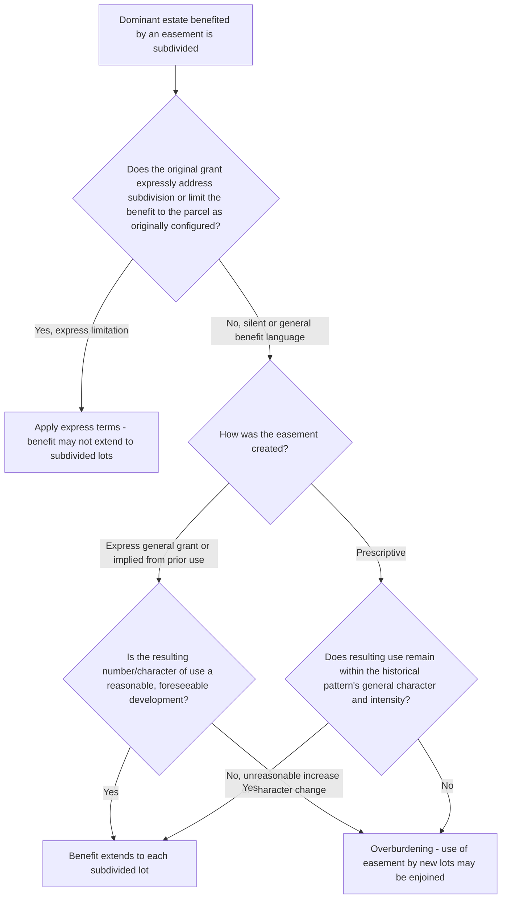

## Subdivision of the Dominant Estate

### Overview

When a dominant estate benefited by an appurtenant easement is subdivided into multiple smaller parcels, a recurring question arises: does the easement's benefit extend to each of the resulting subdivided lots, or is it confined to a single portion of the original parcel? This item examines the doctrinal default allowing subdivision to share in an easement's benefit, the limiting principle preventing unreasonable multiplication of use, and how this doctrine interacts with the broader overburdening framework.

### The General Default Rule: Easements Run to Each Subdivided Parcel

**Key Points**

- The prevailing default rule holds that an easement appurtenant, being attached to and passing with the dominant estate, **benefits each parcel** resulting from a subsequent subdivision of that dominant estate, unless the original grant expressly limits the benefit to the parcel as it existed at the time of creation.
- This rule reflects the general principle that appurtenant easements run with the land — as the dominant estate is divided among successors, each successor in interest to a portion of the original parcel is generally entitled to a proportionate share of the easement's benefit, much as each would inherit a share of other appurtenant rights.
- The rule applies most readily to easements of a general character (e.g., a right-of-way for access) that are reasonably capable of serving multiple resulting parcels without a fundamental change in the nature of the burden — access easements are the paradigm case in the case law.

### The Limiting Principle: No Unreasonable Increase in Burden

**Key Points**

- The default rule is qualified by the overarching principle that subdivision **cannot unreasonably increase the burden** on the servient estate beyond what was originally contemplated — subdivision does not license unlimited multiplication of use simply because each new lot is technically part of the original dominant estate.
- Courts examine factors such as:
  - The **number of resulting lots** relative to what would be considered normal or foreseeable development of the original parcel given its size, zoning, and character at the time of easement creation.
  - Whether the **character of use** changes fundamentally (e.g., subdividing a single large residential lot into a modest number of additional residential lots is more readily permitted than subdividing agricultural land into a large-scale residential subdivision or converting to commercial use).
  - The **physical capacity** of the easement (width, surface, construction) to accommodate the resulting aggregate traffic without unreasonable deterioration or congestion.
- A subdivision resulting in an **unreasonably excessive number of lots**, or one that changes the fundamental character of use in a way inconsistent with the easement's original purpose, may be found to overburden the servient estate — intersecting directly with the overburdening doctrine, of which unreasonable subdivision is essentially a specific application.

### Distinguishing Reasonable Subdivision from Overburdening by Subdivision

| Feature | Reasonable Subdivision (Benefit Extends) | Overburdening by Subdivision |
| --- | --- | --- |
| Number of resulting lots | Modest, consistent with foreseeable development | Excessive relative to original character/size |
| Character of use | Same general character (e.g., residential to residential) | Fundamental change (e.g., agricultural to dense residential or commercial) |
| Physical capacity of the way | Adequate to absorb resulting traffic | Inadequate, causing unreasonable deterioration or congestion |
| Consistency with original purpose | Consistent | Inconsistent or unforeseen at creation |

### Interaction with Easements Created by Different Modes

**Key Points**

- For **express easements**, the granting language controls in the first instance — a grant expressly limited to benefiting "the parcel as presently configured" or a specifically described metes-and-bounds parcel is construed more narrowly than a grant simply benefiting "the Dominant Parcel" without further limitation, though even the latter is subject to the reasonable-burden limitation.
- For easements **implied from prior use**, the same limiting principle generally applies: subdivision resulting in only modest additional use consistent with the original use pattern is more likely upheld than subdivision generating substantially different aggregate use.
- For **prescriptive easements**, courts are typically the **most restrictive** regarding subdivision-driven expansion, since the doctrine's scope is measured strictly by the historical pattern of use during the prescriptive period — a significant increase in the number of users or intensity resulting from subdivision is more readily found to exceed the established prescriptive scope than would be the case for an express or implied easement with more flexible interpretive room. [Inference: while this comparative restrictiveness for prescriptive easements is a recognized trend in the case law, the degree of restriction still varies across jurisdictions, and no precise numerical threshold for "how many new lots is too many" exists in any jurisdiction's law.]

### Illustrative Flow

### Illustrative Example

A five-acre parcel benefited by an express right-of-way easement ("for the benefit of the Dominant Parcel, for ingress and egress") was originally developed with a single residence. The owner later subdivides the five acres into four one-acre residential lots, each intended for a single-family home, consistent with the zoning and general residential character of the surrounding area.

Applying the framework: because the grant benefits "the Dominant Parcel" generally, without limiting language confining the benefit to the parcel's original single-residence configuration, the default rule would extend the easement's benefit to each of the four resulting lots. Because the resulting use — four single-family residences instead of one, generating a modest, foreseeable increase in residential traffic consistent with the surrounding area's zoning and character — represents a reasonable development rather than an excessive multiplication or character change, a court would likely find no overburdening, and each of the four subdivided lots would be entitled to use the right-of-way for access. The analysis would differ significantly if the subdivision instead created forty lots, or converted the parcel to a commercial use, either of which would raise a much stronger overburdening argument under the same doctrinal framework.

### Litigation and Proof Considerations

- Because the reasonableness inquiry is comparative (original character/size versus resulting subdivision), evidence of the parcel's size, zoning classification, and character at the time of the easement's creation is central to establishing what degree of subdivision was foreseeable.
- Servient owners resisting extended use to multiple subdivided lots should focus on the physical capacity of the way (width, construction, drainage) relative to the aggregate traffic the subdivision would generate, and on any evidence the original grant contemplated only a single-parcel use.
- Dominant estate owners (or subdivision developers) seeking to confirm easement rights extend to new lots often seek a declaratory judgment before completing subdivision or sale of the new lots, to resolve title uncertainty and avoid future disputes with purchasers relying on the easement for access.
- Title examiners and purchasers of subdivided lots relying on a shared access easement should confirm, ideally in advance of purchase, that no overburdening challenge is pending or reasonably likely, since a successful challenge could leave a purchased lot without confirmed legal access.

**Related Topics**

- Determining Permitted Use and Purpose
- Overburdening and Misuse of an Easement
- Use of Easements to Benefit After-Acquired or Additional Land
- Repair and Maintenance Obligations
- Easements Implied from a Recorded Plat or Map
- Relocation of Easements