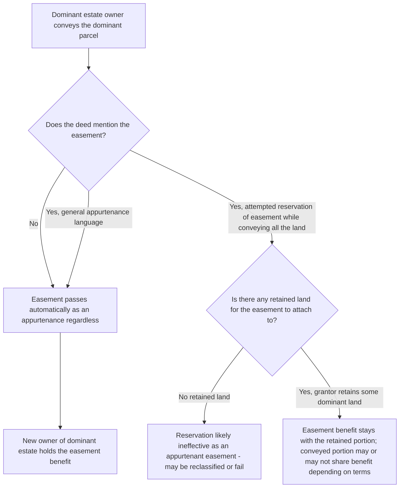

## Assignability of Easements Appurtenant

### Overview

An easement appurtenant is, by definition, attached to a dominant estate rather than held personally by an individual, and this attachment fundamentally shapes how such easements transfer. This item examines the default rule that easements appurtenant automatically pass with conveyances of the dominant estate, the limited circumstances under which they may be severed or separately assigned, and the treatment of the servient estate's burden through successive transfers.

### The Default Rule: Automatic Transfer with the Dominant Estate

**Key Points**

- An easement appurtenant **automatically passes** with a conveyance of the dominant estate to which it is attached, whether or not the conveying instrument mentions the easement at all. The easement is treated as an inseparable incident of the dominant estate, following the maxim that an appurtenance passes with the principal thing.
- This automatic transfer occurs regardless of the **form of conveyance** — sale, gift, devise by will, or intestate succession — because the easement is not conceived of as a separate item of property being transferred, but as a characteristic or attribute of the dominant parcel itself.
- A deed conveying the dominant estate using general language (e.g., "together with all appurtenances thereunto belonging") is understood to include the easement even without this language, since the appurtenant easement passes as a matter of law; such boilerplate language is typically confirmatory rather than operative.
- Because the easement automatically follows the dominant estate, a grantor conveying the dominant parcel **cannot retain the easement separately** for their own personal use while divesting themselves of the underlying land, absent an express reservation — and even an attempted reservation of the easement alone (detached from any retained land) raises the question of whether what remains is even a valid appurtenant easement at all, since appurtenant easements require a dominant estate to attach to.

### Inseparability from the Dominant Estate

**Key Points**

- The corollary to automatic transfer is that an easement appurtenant generally **cannot be separately assigned or transferred apart from the dominant estate** to a third party who has no interest in that estate — attempting to sell or assign "the easement" alone, detached from the dominant parcel, is typically ineffective, because there would be no dominant estate left for the easement to benefit, and easements appurtenant are not held as freestanding, transferable personal property interests.
- This inseparability is what distinguishes an easement appurtenant from an **easement in gross**, which benefits a particular person or entity personally rather than a parcel of land, and which is transferable according to different rules (commercial easements in gross are broadly assignable in modern law; historically, some jurisdictions restricted the assignability of purely personal, non-commercial easements in gross, though this restriction has substantially eroded under modern authority).
- If a court determines that an instrument, though using the language of an easement "appurtenant," was actually intended to benefit a person rather than a parcel of land — because the stated benefit does not naturally or reasonably relate to use of any identifiable dominant parcel — the interest may be reclassified as an easement in gross for transferability purposes, notwithstanding the label used in the instrument. Courts generally construe ambiguous grants in favor of appurtenant status due to the general policy preference for easements appurtenant, but a grant clearly benefiting only an individual regardless of land ownership will be treated as in gross.

### Partial Transfers of the Dominant Estate

**Key Points**

- Where the dominant estate is conveyed in parts — either through simultaneous subdivision and sale, or through successive partial conveyances over time — the general rule (addressed in greater depth as a related, distinct topic on subdivision) is that the easement's benefit extends to each resulting parcel, subject to the limitation that the aggregate use may not unreasonably increase the burden on the servient estate.
- A grantor conveying only a portion of the dominant estate while retaining the remainder generally retains the easement's benefit for the retained portion as well, absent express language limiting the benefit to the conveyed portion specifically.

### Transfer of the Servient Estate: The Burden Runs With the Land

**Key Points**

- Just as the benefit of an easement appurtenant runs with the dominant estate, the **burden** runs with the servient estate — a successor owner of the servient parcel takes the land subject to the existing easement, regardless of whether the conveying instrument to the new servient owner mentions the easement.
- This is subject to ordinary **recording act principles**: a bona fide purchaser of the servient estate, for value and without notice (actual, constructive, or inquiry notice) of an unrecorded easement, may take free of that easement in a majority of jurisdictions, depending on the specific recording statute (race, notice, or race-notice) in effect.
- **Constructive notice** through the recorded chain of title is the most common basis defeating a bona fide purchaser defense — if the easement is properly recorded (typically in the servient estate's chain of title), subsequent purchasers of the servient estate are charged with notice regardless of actual awareness.
- **Inquiry notice** may also defeat a bona fide purchaser claim even absent proper recording, where visible physical evidence of the easement's use (a visible road, utility poles, a drainage structure) would prompt a reasonable purchaser to investigate further.

### Comparative Table: Easement Appurtenant vs. Easement in Gross — Assignability

| Feature | Easement Appurtenant | Easement in Gross |
| --- | --- | --- |
| Attached to | Dominant estate (land) | A person or entity personally |
| Transfers automatically with | Conveyance of the dominant estate | Does not transfer with any land; governed by its own assignability rules |
| Separate assignment apart from land | Generally not possible | Possible, particularly for commercial easements in gross under modern law |
| Default construction preference | Favored where grant is ambiguous | Requires clearer indication of personal, non-land-based benefit |

### Illustrative Flow

### Illustrative Example

A property owner holds a right-of-way easement appurtenant benefiting their five-acre parcel, allowing access across a neighboring parcel to reach a public road. The owner sells the five-acre parcel to a buyer using a standard deed that transfers "the real property described below, together with all appurtenances," making no specific mention of the right-of-way easement by name.

Because the easement is appurtenant to the five-acre dominant parcel, it automatically passes to the buyer as a matter of law upon conveyance of that parcel, regardless of whether the deed specifically names the easement — the general "appurtenances" language is merely confirmatory of what already occurs automatically. If the seller had instead attempted to convey the five-acre parcel while purporting to "retain" the right-of-way easement for the seller's personal continued use, that reservation would be analytically problematic: since the seller would no longer own any dominant estate for the easement to benefit, the attempted retention could not function as a valid easement appurtenant, and a court would need to determine whether the parties actually intended to create a new, personal easement in gross in the seller's favor (a distinct and separately analyzed interest) rather than treating this as an ordinary appurtenant transfer.

### Litigation and Proof Considerations

- Disputes over whether an easement is appurtenant or in gross often arise precisely in the assignability context — a party seeking to prevent transfer, or seeking to establish that a claimed transfer was ineffective, will argue for whichever characterization defeats the transfer, requiring courts to examine the original grant's language and the relationship (if any) between the claimed benefit and use of a specific parcel.
- For servient-estate bona fide purchaser disputes, the dominant owner asserting the easement survives the servient transfer bears the burden of establishing proper recording or, alternatively, facts supporting inquiry notice (physical evidence a reasonable purchaser would have investigated).
- Chain-of-title examination for both the dominant and servient estates is essential in easement assignability disputes — title insurers and examiners routinely trace easement-related instruments through both chains to confirm proper transfer and recording.
- Where an easement's original grant is genuinely ambiguous as to appurtenant versus in-gross character, courts examine the practical relationship between the claimed benefit and any identifiable parcel, applying the general interpretive preference for the appurtenant characterization due to its more limited, land-tethered nature.

**Related Topics**

- Easements Appurtenant vs. Easements in Gross (Classification)
- Assignability of Commercial Easements in Gross
- Subdivision of the Dominant Estate
- Recording Acts and Bona Fide Purchaser Doctrine
- Overburdening and Misuse of an Easement
- Termination of Easements by Merger