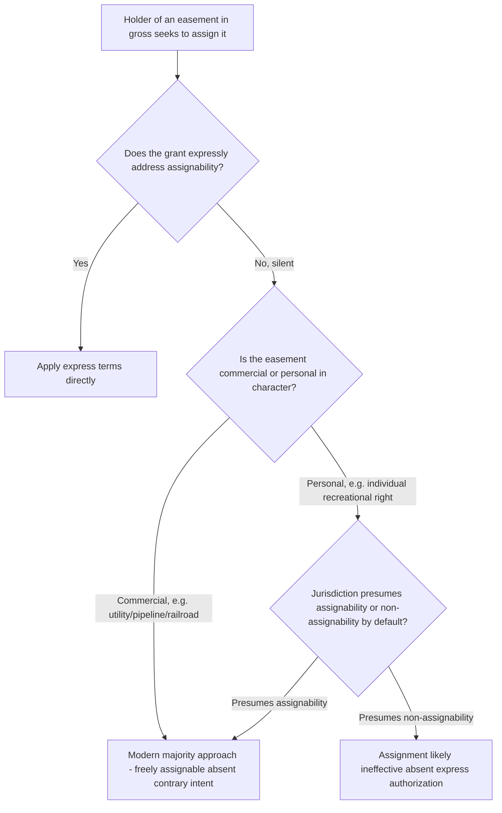

## Assignability of Easements in Gross

### Overview

An easement in gross benefits a specific person or entity personally, rather than attaching to a dominant estate, distinguishing it fundamentally from an easement appurtenant. This structural difference historically produced significant restrictions on the transferability of easements in gross, particularly for those characterized as personal rather than commercial. Modern law has substantially liberalized these restrictions, especially for commercial easements in gross, though meaningful distinctions and jurisdictional variation persist.

### The Historical Common Law Restriction

**Key Points**

- Under the traditional common law approach, easements in gross were generally treated as **non-assignable**, on the theory that because such an easement was personal to the original grantee (not tied to land ownership), allowing free transfer would permit the burden on the servient estate to be imposed on behalf of an ever-changing, potentially unlimited class of strangers never contemplated by the original grantor.
- This restriction was particularly strict for what courts characterized as **purely personal** easements in gross — for example, a right granted to a specific individual to fish, hunt, or recreate on the servient land for that individual's personal enjoyment — where the personal, non-transferable character of the right was thought to be inherent in its nature.
- The traditional rule reflected a broader historical hostility toward easements in gross generally (compared to the favored status of easements appurtenant), rooted in a policy preference for tying land burdens to land ownership rather than to freely circulating personal rights.

### The Modern Rule: Commercial Easements in Gross Are Freely Assignable

**Key Points**

- Modern law, reflected in the Restatement (Third) of Property: Servitudes and the significant majority of contemporary case law, has largely abandoned the traditional non-assignability rule for **commercial** easements in gross, holding that such interests are freely assignable absent contrary intent expressed in the grant.
- **Commercial easements in gross** are those held for an economic or commercial purpose rather than purely personal enjoyment — the paradigm examples being utility easements (electric, gas, telephone, pipeline, fiber-optic), railroad rights-of-way, and billboard or advertising easements, all typically held by a company or entity for business purposes rather than by an individual for personal use.
- The modern rationale recognizes that commercial entities routinely need to transfer, merge, sell, or restructure their easement holdings as part of ordinary business operations (e.g., a utility selling its distribution assets to another utility, or a pipeline company being acquired), and that the servient owner's expectations at the time of granting a commercial easement typically already account for the possibility of assignment to a similar commercial successor.
- Under this modern approach, the identity of the specific assignee does not typically increase the burden on the servient estate in a manner different from the original grantee, provided the assignee uses the easement for substantially the same purpose — a key distinguishing feature from purely personal easements, where the specific identity and personal characteristics of the holder were often central to the grant's purpose.

### Personal (Non-Commercial) Easements in Gross: A Narrower, More Contested Category

**Key Points**

- For easements in gross characterized as personal — most commonly recreational rights (hunting, fishing, hiking) granted to a specific named individual — courts remain more divided regarding assignability.
- Some modern courts and the Restatement approach extend a presumption of assignability even to personal easements in gross absent express language restricting transfer, reflecting a general modern trend toward greater alienability of property interests generally.
- Other courts continue to apply a **more restrictive default**, treating personal recreational easements in gross as non-assignable absent express language affirmatively authorizing assignment, particularly where the grant's language or circumstances suggest the servient owner's consent was specifically premised on the personal identity, character, or relationship with the original grantee (e.g., a hunting easement granted to a personal friend, where the servient owner's willingness to permit hunting activity was clearly tied to trust in that specific individual). [Inference: this split regarding the default assignability of personal, non-commercial easements in gross is a genuine and continuing area of jurisdictional divergence, meaning the applicable default cannot be assumed without checking the specific jurisdiction's current approach.]
- Express language in the grant is the most reliable way to resolve this ambiguity in either direction — grants intended to be personal and non-assignable should say so explicitly (e.g., "personal to Grantee and non-transferable"), and grants intended to be freely assignable should likewise say so, given the mixed default rules across jurisdictions.

### Divisibility and Apportionment of Easements in Gross

**Key Points**

- A related but distinct question from simple assignability is whether an easement in gross may be **divided** among multiple assignees (e.g., a single utility easement's benefit being split among several successor utility companies each using a portion of the capacity).
- The Restatement approach and much modern authority permits divisibility of commercial easements in gross **unless doing so would unreasonably increase the burden on the servient estate** beyond what was originally contemplated — echoing the same reasonable-burden limiting principle applied to subdivision of dominant estates in the appurtenant context.
- Exclusive commercial easements in gross (where the grant gives the holder the sole right to conduct the specified activity — for example, an exclusive right to install and operate a pipeline) are generally treated as more freely divisible/apportionable, since exclusivity was presumably bargained for specifically by the original grantee, and dividing that exclusive right among the grantee's own successors or licensees does not typically increase the burden on the servient estate.
- **Non-exclusive** commercial easements in gross (where the servient owner may have granted similar rights to others) raise a greater risk that dividing the easement among numerous holders could produce a cumulative, unreasonably increased burden — courts scrutinize apportionment of non-exclusive easements in gross more closely for this reason.

### Comparative Table: Assignability by Type of Easement in Gross

| Type | Default Assignability (Absent Express Language) | Divisibility |
| --- | --- | --- |
| Commercial (utility, pipeline, railroad) | Freely assignable under modern majority approach | Generally divisible if no unreasonable burden increase; more freely so if exclusive |
| Personal/recreational (hunting, fishing rights to a named individual) | Split — some jurisdictions presume assignability, others presume non-assignability absent express authorization | More restricted; courts scrutinize closely given personal character |

### Illustrative Flow

### Illustrative Example

A utility company obtains an easement in gross across a rural parcel "for the construction, operation, and maintenance of electric transmission facilities." Years later, the original utility is acquired by a larger regional utility holding company, which seeks to have the easement transfer along with the acquired assets to continue operating the same transmission line for the same purpose.

Applying the modern majority rule for commercial easements in gross, this easement would be freely assignable to the successor utility absent express language in the original grant restricting assignment, since the easement serves a commercial purpose, the identity of the specific corporate utility holder does not meaningfully affect the burden on the servient estate, and the successor intends to use the easement for substantially the same purpose as the original grantee. Compare this to a hypothetical easement granted to a named individual "for Grantee's personal use in hunting on the property," which that individual later attempts to assign to an unrelated hunting club for commercial guided hunts — courts in a jurisdiction applying the more restrictive default for personal easements in gross would likely find this attempted assignment ineffective absent express authorizing language, given both the personal character of the original grant and the transformation of the use from personal to commercial.

### Litigation and Proof Considerations

- Determining whether an easement in gross is "commercial" or "personal" in character is often the threshold and outcome-determinative question — courts examine the nature of the grantee (individual versus business entity), the stated purpose, and the surrounding circumstances of the original grant.
- Servient owners resisting an assignment often argue either that the easement is personal in character (invoking the more restrictive default or requiring express authorization) or that even if assignable, the specific assignment or subsequent apportionment among multiple assignees unreasonably increases the burden beyond what was originally contemplated.
- Successor entities relying on an assigned commercial easement (particularly following corporate mergers, acquisitions, or asset sales) should ensure proper recording of the assignment in the servient estate's chain of title to protect against bona fide purchaser challenges by subsequent servient estate owners.
- Drafting attorneys creating new easements in gross are increasingly advised to include explicit assignability language addressing both simple assignment and divisibility/apportionment, given the continued jurisdictional uncertainty regarding default rules, particularly for personal or mixed-character grants.

**Related Topics**

- Easements Appurtenant vs. Easements in Gross (Classification)
- Assignability of Easements Appurtenant
- Divisibility and Apportionment of Commercial Easements
- Restatement (Third) of Property: Servitudes — General Principles
- Recording Acts and Bona Fide Purchaser Doctrine
- Drafting Considerations for Express Easement Grants