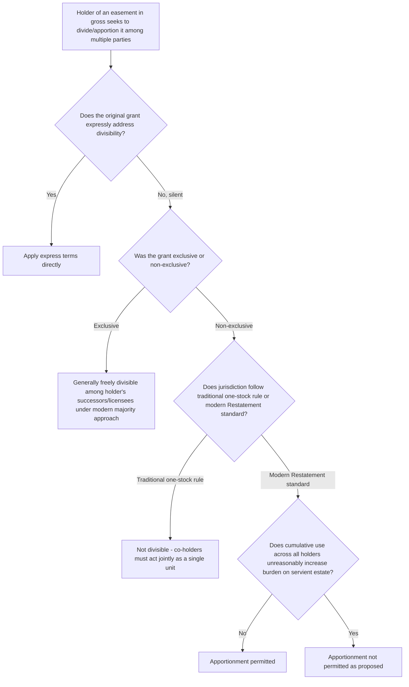

## Apportionment and Divisibility of Easements in Gross

### Overview

Apportionment and divisibility address a distinct question from simple assignability: not whether an easement in gross may be transferred at all, but whether it may be **split** — shared among multiple holders exercising the right simultaneously or in coordination, whether by dividing capacity, dividing geographic segments, or licensing multiple independent users. Because dividing a single grant among several holders raises a heightened risk of unreasonably increasing the burden on the servient estate compared to a straightforward one-for-one assignment, courts have developed a distinct analytical framework for this question, most influentially organized around the presence or absence of exclusivity in the original grant.

### The Foundational Distinction: Exclusive vs. Non-Exclusive Grants

**Key Points**

- The single most significant factor courts examine in apportionment disputes is whether the original grant conferred an **exclusive** right (the sole right to conduct the specified activity on the servient land) or a **non-exclusive** right (a right that the servient owner remained free to also grant to others).
- **Exclusive commercial easements in gross** are generally treated as **freely divisible/apportionable** among the holder's own successors, licensees, or joint venturers, under the modern majority approach reflected in the Restatement (Third) of Property: Servitudes. The rationale is that the servient owner, having already agreed to grant exclusive rights to a single party, bore the risk of that party's own internal business arrangements for exploiting the right, and the servient owner's total burden is not increased merely because the exclusive holder chooses to share the right among multiple sub-users or successors, provided the aggregate exercise does not exceed what exclusivity already contemplated.
- **Non-exclusive commercial easements in gross** are subject to a more cautious, traditionally more restrictive default: because the servient owner did not bargain for exclusivity, dividing the right among numerous holders — each of whom might now independently exercise a similar right, on top of others the servient owner may have separately granted or could grant to third parties — raises a materially greater risk of cumulative overburdening that exclusive grants do not present.

### The Traditional "One Stock" Rule for Non-Exclusive Easements in Gross

**Key Points**

- The traditional common law approach to non-exclusive easements in gross, sometimes referred to as the "one stock" rule, held that such rights were generally **not divisible** at all — the several would-be co-owners of a non-exclusive easement in gross were required to act together as a single unit ("one stock") in exercising the right, rather than independently exploiting separate portions or shares of it.
- Under this traditional rule, if multiple parties held or claimed a share of a single non-exclusive easement in gross, they were treated as joint holders of one undivided right, obligated to exercise it collectively (e.g., jointly deciding how many fish to take, how much timber to cut, or how the right would be used) rather than as several independent holders each entitled to exercise a fractional share on their own initiative.
- This rule aimed to prevent exactly the cumulative overburdening risk described above — the servient owner had agreed to tolerate one exercise of the right by the original grantee (or grantees acting jointly), not multiple independent, uncoordinated exercises by an expanding group of separate rights-holders.

### The Modern Restatement Approach

**Key Points**

- The Restatement (Third) of Property: Servitudes has moved toward a more flexible, burden-focused standard, generally holding that a non-exclusive easement in gross **may be divided or apportioned** among multiple holders, provided the resulting cumulative use does **not unreasonably increase the burden** on the servient estate beyond what the original grant contemplated — displacing the rigid "one stock" bright-line rule with a case-by-case reasonableness inquiry closely paralleling the standard used for subdivision of dominant estates in the appurtenant context.
- Under this approach, courts examine factors such as: the total cumulative intensity of use across all holders compared to what a single holder would have generated; whether the servient owner's practical experience of the burden materially changes based on the identity or number of holders (as opposed to merely the volume/intensity of activity); and whether the original grant's language or circumstances suggest the parties contemplated or foreclosed the possibility of multiple simultaneous holders.
- Adoption of this more flexible approach, as with several other Restatement (Third) innovations discussed in adjacent scope-of-easement doctrines, is **not universal** — a number of jurisdictions continue to apply the traditional one-stock restriction for non-exclusive easements in gross, particularly for older grants predating the Restatement's influence. [Inference: because this is another area of active doctrinal transition with divided authority, the governing rule in a specific jurisdiction requires direct confirmation rather than an assumption that the Restatement standard has been adopted.]

### Comparative Table: Apportionment Rules

| Grant Type | Traditional Rule | Modern Restatement Approach |
| --- | --- | --- |
| Exclusive commercial easement in gross | Generally divisible among grantee's own successors/licensees | Generally divisible, same result |
| Non-exclusive commercial easement in gross | "One stock" rule — not divisible; joint holders must act as a unit | Divisible if cumulative use does not unreasonably increase burden |
| Personal (non-commercial) easement in gross | Generally not divisible | More restrictive than commercial grants even under modern approach; scrutinized closely |

### Illustrative Flow

### Illustrative Example

A pipeline company holds an **exclusive** easement in gross granting it "the sole and exclusive right to construct, operate, and maintain pipelines" across a servient parcel. The company later enters a joint venture, granting a co-venturer the right to also use the same easement corridor to lay an additional, separate pipeline for a related but distinct product line, with both companies coordinating maintenance and access.

Because the original grant was exclusive, the servient owner already bore the risk that the sole grantee might structure its own commercial arrangements involving multiple pipelines or joint venturers — the servient owner's total burden (a pipeline corridor of a certain physical footprint) is not necessarily increased by the identity or number of entities operating within that already-exclusive right, provided the joint venturer's use remains within the physical and operational scope originally granted. Compare this to a hypothetical **non-exclusive** grant of "a right to lay a single pipeline" (with the servient owner free to grant similar non-exclusive rights to others), where the original holder then attempts to license three unrelated companies to each independently lay separate pipelines under the same non-exclusive grant — in a traditional one-stock jurisdiction, this would likely be found impermissible because the co-licensees are not acting as a single unified stock but as multiple independent holders; even under the more flexible modern approach, a court would scrutinize whether three independent pipelines cumulatively exceed what the servient owner's non-exclusive grant to a single original party contemplated.

### Litigation and Proof Considerations

- The threshold factual and legal question in most apportionment disputes is the exclusive/non-exclusive character of the original grant — ambiguous grants require close examination of the specific language used and the surrounding circumstances and negotiating context, where available.
- For non-exclusive grants, evidence regarding the servient owner's original expectations (what volume or type of use was contemplated, whether the grantor retained the right to grant similar interests to others, and whether any language addresses multiple holders) is central to both the traditional one-stock analysis and the modern burden-based Restatement analysis.
- Parties structuring commercial joint ventures, mergers, or licensing arrangements involving an existing easement in gross should conduct title and grant-language review specifically addressing apportionment before finalizing arrangements that depend on shared or divided use of a single underlying easement, given the risk that an unauthorized division could be challenged by the servient owner as exceeding the original grant.
- Where an apportionment dispute is litigated, expert testimony regarding the physical and operational burden of the proposed multiple-holder arrangement, compared to the burden a single holder's exercise would have generated, is frequently central to resolving the reasonableness inquiry under the modern approach.

**Related Topics**

- Assignability of Easements in Gross
- Assignability of Easements Appurtenant
- Subdivision of the Dominant Estate
- Overburdening and Misuse of an Easement
- Restatement (Third) of Property: Servitudes — General Principles
- Drafting Considerations for Express Easement Grants