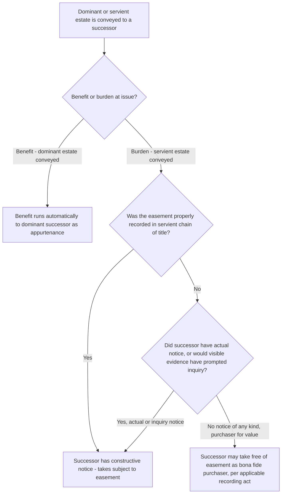

## Running of Easement Benefits and Burdens to Successors

### Overview

For an easement to function as a durable property interest rather than a mere personal arrangement between the original parties, its benefit and burden must be capable of "running" to successive owners of the dominant and servient estates. This item consolidates and examines the general doctrinal requirements governing when an easement's benefit and burden bind successors — synthesizing touch-and-concern, notice, privity, and intent principles that operate across the specific transfer contexts (appurtenant assignability, in-gross assignability, apportionment) addressed as separate items in this chapter.

### The Traditional Requirements for Running Covenants and Easements

**Key Points**

- Historically, American courts analyzed whether property interests like easements would "run with the land" using a framework substantially borrowed from real covenant law, generally requiring:
  1. **Intent** that the interest run to successors, discernible from the instrument or circumstances of creation.
  2. **Touch and concern** — the interest must relate to the use, value, or enjoyment of the land itself, not be a purely personal arrangement collateral to land ownership.
  3. **Notice** to a successor servient owner (actual, constructive/record, or inquiry notice) for the burden to bind that successor.
  4. **Horizontal and vertical privity** in various formulations, historically a significant technical hurdle for covenants generally, though easements have traditionally been treated as running more readily than affirmative covenants, in part because easements are themselves a recognized form of estate/interest in land rather than a personal contractual promise.
- Easements have historically enjoyed **more favorable treatment** than covenants regarding the running requirement, because an easement is conceptually an interest in land (a non-possessory property right) from its inception, rather than a personal promise that must separately satisfy technical requirements to be treated as running with land — this is a key reason why the privity requirements that heavily complicated covenant enforcement historically posed less of an obstacle for easements specifically.

### The Modern Restatement Simplification

**Key Points**

- The Restatement (Third) of Property: Servitudes substantially simplifies this analysis for servitudes generally, including easements, by **abandoning the touch-and-concern and privity requirements** as independent, freestanding tests, replacing them with a more direct, streamlined inquiry: a servitude runs with the land and binds and benefits successors unless illegal, unconstitutional, or contrary to public policy, or unless the servitude is barred by some other, unrelated defense (such as lack of notice for the burden to bind a bona fide purchaser).
- Under this modern approach, the central running requirements for an easement effectively reduce to:
  1. **Intent** that the easement benefit/burden run to successors (generally presumed for easements appurtenant, given their inherent land-attachment character).
  2. **Notice** to bind a servient successor (actual, constructive/record, or inquiry notice), governed by ordinary recording act principles.
- This modern approach has been influential and is increasingly reflected in state case law, though — consistent with the pattern seen throughout the Restatement (Third)'s treatment of servitudes — its adoption is not universal, and some jurisdictions continue to reference the traditional touch-and-concern/privity framework, particularly for older instruments or in jurisdictions whose case law has not been substantially updated. [Inference: as with other Restatement (Third) innovations discussed elsewhere in this material, the degree of adoption varies by jurisdiction, and practitioners should not assume the simplified modern framework controls without confirming local law.]

### Running of the Benefit vs. Running of the Burden

**Key Points**

- The running of the **benefit** (to successive dominant estate owners) and the running of the **burden** (to successive servient estate owners) are analytically separate questions, though they are often addressed together.
- The benefit of an easement appurtenant runs automatically to successors of the dominant estate, as addressed in depth in the assignability item — this is rarely contested, since successors to the dominant estate are typically eager to claim the benefit rather than resist it.
- The burden running to servient successors is the more frequently contested question, because a successor servient owner may prefer to take the land free of the easement — this is where notice and recording act principles become the dispositive practical battleground in most litigated disputes.

### Notice as the Central Practical Issue for the Burden

**Key Points**

- **Constructive (record) notice**: if the easement is properly recorded in a manner that appears in the servient estate's chain of title, subsequent purchasers are charged with notice as a matter of law, regardless of actual awareness, and take subject to the easement.
- **Actual notice**: a successor servient owner who had actual knowledge of the easement, however acquired, takes subject to it regardless of whether it was properly recorded.
- **Inquiry notice**: visible physical evidence of the easement's existence and use (a visible road, utility poles or markers, a maintained ditch or drainage structure) may charge a purchaser with notice sufficient to defeat bona fide purchaser status, even absent proper recording, on the theory that a reasonable purchaser would have investigated the visible condition and discovered the easement.
- A **bona fide purchaser** of the servient estate — for value, without actual, constructive, or inquiry notice — may, depending on the jurisdiction's specific recording act (race, notice, or race-notice statute), take the servient estate free of an unrecorded, undiscoverable easement, extinguishing the burden as to that successor (though not necessarily as to the original grantor, who may remain liable on any express warranties made in the original instrument creating the easement).

### Comparative Table: Traditional vs. Modern Running Requirements

| Requirement | Traditional Framework | Modern Restatement Approach |
| --- | --- | --- |
| Intent to run | Required | Required (generally presumed for appurtenant easements) |
| Touch and concern | Required as independent test | Abandoned as a freestanding requirement |
| Horizontal/vertical privity | Required in various formulations | Abandoned as a freestanding requirement |
| Notice (for burden to bind servient successor) | Required | Required — remains central under both frameworks |
| Legality/public policy limits | Implicit | Made explicit as the primary substantive limit |

### Illustrative Flow

### Illustrative Example

An easement for a shared driveway was created by an express grant between two neighboring landowners thirty years ago and properly recorded in the servient parcel's chain of title at that time. Both the dominant and servient parcels have since changed hands multiple times through ordinary market sales, with none of the subsequent deeds specifically mentioning the driveway easement.

Applying the framework: the benefit passed automatically to each successive dominant estate owner as an appurtenance, requiring no specific mention in any conveying deed. The burden similarly passed to each successive servient estate owner because the easement was properly recorded at its creation, giving each subsequent servient purchaser constructive notice as a matter of law through the chain of title search that any competent purchaser (or their title company) would have conducted — regardless of whether any individual servient successor happened to have actual, personal awareness of the driveway arrangement before purchasing. The current servient owner, therefore, takes the land subject to the easement despite having no personal historical knowledge of how or why it was created, and despite the absence of any mention in their own specific deed.

### Litigation and Proof Considerations

- Chain-of-title examination remains the central evidentiary task in disputes over whether an easement's burden binds a current servient owner — establishing whether and where the easement was recorded, and whether it appears in a search of the servient parcel's specific chain of title (as opposed to, for instance, being recorded only against the dominant parcel, which may not provide constructive notice to servient successors depending on the jurisdiction's indexing system).
- Where proper recording is absent or uncertain, parties frequently litigate the inquiry notice question through evidence of physical, visible conditions on the ground at the time of the successor's purchase (photographs from the relevant period, survey records, testimony about visible use).
- Modern title insurance practice substantially mitigates this risk for purchasers by conducting thorough title searches and physical inspections (or requiring surveys) precisely to identify recorded and visible unrecorded easements before a purchase closes, shifting much of this historical common-law risk into a due diligence and insurance context in contemporary transactions.
- Practitioners should distinguish disputes about **whether** an easement's burden runs to a successor (the notice/recording inquiry addressed here) from disputes about the **scope** of an easement that indisputably does run (addressed under the scope-of-use doctrines), since these are analytically separate questions frequently conflated in practice.

**Related Topics**

- Assignability of Easements Appurtenant
- Assignability of Easements in Gross
- Recording Acts and Bona Fide Purchaser Doctrine
- Restatement (Third) of Property: Servitudes — General Principles
- Determining Permitted Use and Purpose
- Termination of Easements by Merger, Release, or Abandonment