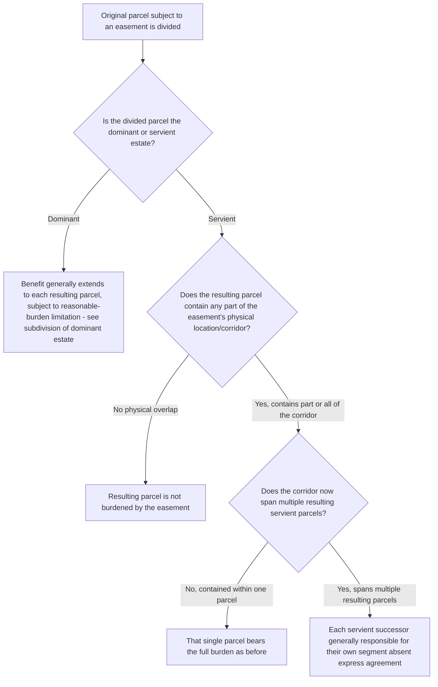

## Effect of Estate Division on Easement Rights

### Overview

This item addresses how the division of either the dominant or servient estate — through partition, sale of portions, subdivision, or other splitting of a formerly unified parcel — affects existing easement rights and obligations, consolidating principles that arise across dominant-side subdivision, servient-side division, and the more particular question of how the burden distributes when a servient estate is split among multiple successor owners. Where the dominant-side subdivision question is addressed in focused depth elsewhere, this item emphasizes the servient-side division question and the general cross-cutting principles governing estate division generally.

### Division of the Dominant Estate: Summary Cross-Reference

**Key Points**

- As addressed in depth as a distinct, focused topic, division of the dominant estate generally allows the easement's benefit to extend to each resulting subdivided parcel, subject to the limiting principle that the aggregate resulting use may not unreasonably increase the burden on the servient estate beyond what was originally contemplated.
- This item does not restate that analysis in full but incorporates it as the dominant-side half of the broader estate-division framework, with the present focus directed principally at the servient side.

### Division of the Servient Estate: General Rule

**Key Points**

- When the servient estate is divided among multiple successor owners — whether through sale of portions, partition among co-owners, or subdivision for development — the default rule holds that **each resulting servient parcel remains subject to the easement** to the extent that parcel is actually burdened by the easement's physical location or operation.
- A servient owner cannot divide their land in a manner that **extinguishes or diminishes** the easement's burden on the affected portion — dividing the servient estate does not provide an opportunity to escape an existing, validly created easement, since the burden runs with the specific land actually subject to it regardless of how that land is subsequently divided among different owners.
- The more nuanced question is **which resulting servient parcel(s)** bear which specific obligations, particularly where the easement's physical corridor crosses only part of the original servient parcel, or where maintenance obligations must now be allocated among what were previously unified ownership interests.

### Servient Parcels Not Physically Burdened by the Easement's Corridor

**Key Points**

- Where the servient estate is divided such that the easement's physical location (e.g., a right-of-way corridor) falls entirely within one resulting parcel, and other resulting parcels from the same original servient estate contain no part of the physical easement corridor, the general rule holds that **only the parcel actually containing the easement's physical location** remains burdened — a resulting parcel with no physical overlap with the easement corridor is not burdened merely because it was once part of the same larger original servient parcel.
- This principle can create a materially different practical outcome than the treatment of dominant-side subdivision (where the benefit generally extends to all resulting parcels) — servient-side division is generally analyzed by reference to actual physical location of the burden, not by reference to which resulting parcel "inherits" a share of a burden the way dominant parcels inherit a share of a benefit.

### Allocation of Maintenance and Other Obligations Following Servient Division

**Key Points**

- Where a division of the servient estate results in **multiple owners each holding a portion of the same physical easement corridor** (for example, a long right-of-way that, after division, now crosses land owned by three different servient successors rather than one), questions arise regarding how maintenance obligations, liability for interference, and similar responsibilities are allocated among these multiple servient successors.
- Absent express agreement addressing this allocation (which sophisticated development or subdivision plans increasingly include), courts generally allocate such servient-side obligations **by reference to the specific segment of the easement located on each owner's particular parcel** — each servient successor is responsible for conditions and interference arising on their own portion of the corridor, rather than being held jointly responsible for the entire length of the easement regardless of location.
- This segment-based allocation differs from the more holistic proportionate-sharing approach applied to multiple **dominant** owners sharing a single easement (addressed in the maintenance obligations item), reflecting the different nature of the interests: dominant owners share a common benefit requiring coordinated maintenance of the whole, while servient owners each bear a burden localized to their own specific portion of land.

### Partition Among Co-Owners

**Key Points**

- Where land subject to an easement (either dominant or servient) is held by co-owners (tenants in common, joint tenants) who subsequently partition the property — dividing it into separate, individually owned parcels — the same general principles apply: on the dominant side, the benefit generally extends proportionately to the resulting parcels (subject to the reasonable-burden limitation); on the servient side, each resulting parcel remains subject to the easement only to the extent it is physically burdened by the easement's location.
- Partition actions, being judicial or agreed-upon proceedings that definitively reallocate specific portions of previously undivided co-ownership interests, often present a useful and relatively clear-cut occasion for the parties or the court to **expressly address and clarify** easement rights and obligations going forward, reducing the ambiguity that might otherwise arise from a purely informal, unaddressed division.

### Comparative Table: Dominant vs. Servient Division

| Feature | Dominant Estate Division | Servient Estate Division |
| --- | --- | --- |
| Default treatment of easement interest | Benefit extends to each resulting parcel (subject to no-unreasonable-burden limit) | Burden remains only on parcel(s) actually containing the easement's physical location |
| Basis for allocation | Appurtenant nature of the benefit — follows the land generally | Physical location of the easement corridor — follows the specific burdened land |
| Multiple resulting owners' shared obligations | Proportionate/shared maintenance obligation among all benefited parcels | Segment-based responsibility tied to each owner's specific physical portion |
| Risk of unreasonable expansion | Overburdening from too many resulting dominant users | Generally minimal — burden does not expand merely from division |

### Illustrative Flow

### Illustrative Example

A large rural parcel, burdened by a right-of-way easement running along its northern boundary, is sold off by its owner in three separate transactions to three different buyers: Buyer A purchases the northern strip containing the entire right-of-way corridor; Buyer B purchases the central portion, with no physical overlap with the corridor; and Buyer C purchases the southern portion, likewise with no physical overlap.

Applying the framework: Buyer A's parcel remains fully subject to the right-of-way easement, since it contains the entire physical corridor — Buyer A cannot argue that purchasing only a portion of the original servient estate somehow reduces or eliminates the pre-existing burden. Buyers B and C, by contrast, take their respective parcels free of the easement's burden entirely, because neither resulting parcel contains any part of the physical location where the easement actually operates — the mere fact that their land was once part of the same larger original servient parcel that happened to be burdened elsewhere does not extend the burden to portions never actually crossed by the right-of-way. Had the original right-of-way instead run diagonally across what became all three resulting parcels, each of Buyers A, B, and C would bear responsibility for the specific segment crossing their own land, with segment-based maintenance responsibility applying absent an express agreement among them addressing the corridor as a whole.

### Litigation and Proof Considerations

- Disputes over servient-side division typically turn on precise, often survey-dependent factual questions regarding the exact physical location of the easement corridor relative to the boundaries of the resulting divided parcels — professional survey evidence is frequently necessary and often dispositive.
- Where multiple servient successors now share responsibility for different segments of a single easement corridor, disputes can arise regarding whether an interference or maintenance failure on one owner's segment has caused damage extending onto, or affecting use across, another owner's segment — potentially implicating both segment-based responsibility and broader interference/nuisance principles.
- Purchasers of a portion of a formerly larger servient parcel should conduct careful survey and title review specifically identifying whether their particular resulting parcel contains any portion of an existing easement's physical location, since this determination is frequently outcome-determinative and not always obvious from deed language alone if the original easement was vaguely described.
- Development and subdivision plans that anticipate splitting land already subject to an easement are well advised, as a preventive drafting matter, to include express agreements allocating maintenance and interference responsibility among the resulting servient parcels' successors, given the potential ambiguity and disputes generated by relying solely on the segment-based default.

**Related Topics**

- Subdivision of the Dominant Estate
- Running of Easement Benefits and Burdens to Successors
- Repair and Maintenance Obligations
- Relocation of Easements
- Overburdening and Misuse of an Easement
- Recording Acts and Bona Fide Purchaser Doctrine