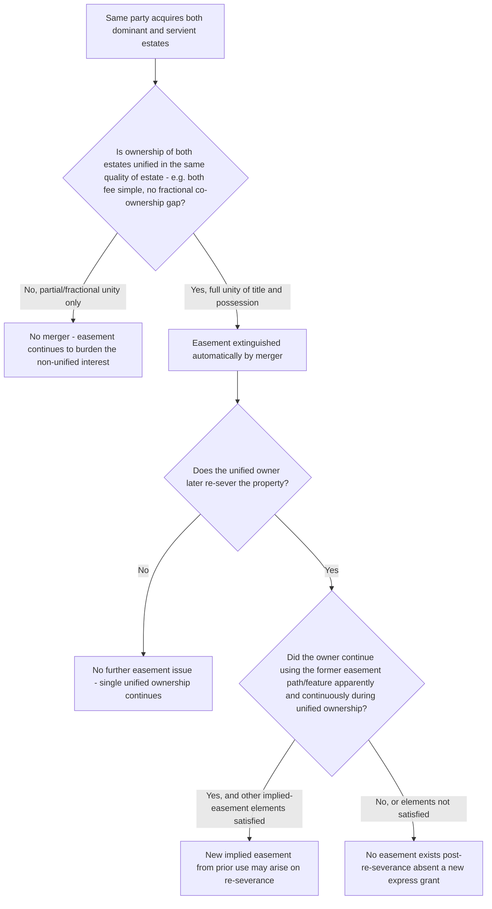

## Termination by Merger of Estates

### Overview

Merger is a mode of easement termination that occurs when the dominant and servient estates come into common ownership, based on the foundational principle that a landowner cannot hold an easement over their own land — an easement is, by definition, a right in the land of another, and that necessary duality collapses once a single owner holds both the benefited and burdened parcels. This item examines the requirements for merger, the scope of unity of title and possession required, and the important doctrine of revival that can restore an easement after a subsequent re-severance.

### The Doctrinal Basis for Merger

**Key Points**

- An easement, as a non-possessory interest in the land of *another*, is conceptually incompatible with unified ownership: if the same person owns both the dominant and servient estates outright, there is no longer a "another's land" for the easement to burden, and the previously separate rights of use collapse into the unified owner's general possessory rights over the whole.
- Merger is generally treated as **automatic** upon satisfaction of its requirements — it does not require any affirmative act of extinguishment or any specific intent to terminate the easement (in contrast to termination by express release, which requires an affirmative act, or termination by abandonment, which requires intent).
- The doctrine applies regardless of how the original easement was created — express grant, implication, necessity, or prescription — since the incompatibility between common ownership and an easement's fundamental nature as a right against another's land is the same regardless of the easement's origin.

### Requirements: Unity of Title and Estate

**Key Points**

- Merger requires **unity of title** in the same person or entity as to both the dominant and servient estates, and this unity must generally be of the **same quality of estate** — the classic formulation requires unity of both title and possession in a single fee simple owner (or equivalent unified estate) as to both parcels.
- **Partial unity is generally insufficient**: if the same person owns the dominant estate in fee simple but owns only a life estate, leasehold, or other lesser interest in the servient estate (or vice versa), merger typically does not occur, because the estates held are not of the same quality — merger requires unity of the underlying fee interests, not merely a coincidental overlap in some lesser interest held by the same person.
- Similarly, if one person owns the entire dominant estate but only a **fractional or co-ownership interest** in the servient estate (e.g., as a tenant in common with others), most courts hold this partial ownership interest is insufficient to merge the easement, since the servient estate is not wholly owned by the same party who holds the dominant estate — the easement continues to burden the servient estate as to the co-owners who do not also hold the dominant estate. [Inference: while the general principle that partial/fractional unity does not trigger merger is well established, the precise treatment of more complex partial-unity fact patterns can vary, and courts examine the specific configuration of ownership interests closely rather than applying a single mechanical formula.]

### Merger and Subsequent Re-Severance: The Revival Doctrine

**Key Points**

- A significant and frequently tested doctrine addresses what happens if, after merger has extinguished an easement, the unified owner subsequently **re-severs** the property by conveying part of it to a new owner, recreating separate dominant and servient parcels.
- The traditional rule holds that once an easement is extinguished by merger, it does **not automatically revive** upon a later re-severance — the easement is gone, and a new easement must be separately created (by express grant, or potentially by implication if the facts otherwise support an implied easement arising from the new severance) if the parties wish the same right of use to continue.
- However, courts frequently find that an **easement implied from prior use** arises upon the re-severance, based on the same doctrinal analysis applied to any other severance-based implication: if the unified owner had continued to use the former easement's physical path or feature in an apparent, continuous manner during the period of unified ownership (even though technically no formal easement existed during that period, since merger had extinguished it), and severance is later effected, courts may find the elements of an implied easement from prior use are satisfied on the new severance — effectively producing a *functionally* similar result to revival, though analytically it is understood as a *new* implied easement rather than a revived old one.
- This distinction matters because the *new* implied easement arising on re-severance is analyzed under the ordinary implied-easement-from-prior-use elements (apparent use, reasonable necessity, continuity of use during the unified ownership period) rather than automatically importing the scope or terms of the original, now-extinguished express easement — the new easement's scope is determined independently based on the use pattern that existed leading up to the re-severance, which may or may not match the original terminated easement precisely.

### Comparative Table: Merger vs. Revival Analysis

| Scenario | Result |
| --- | --- |
| Dominant and servient estates come under common fee ownership | Easement extinguished by merger, automatically |
| Common owner later re-severs by conveying part of the unified parcel | Original easement does not automatically revive |
| Common owner continued using the former easement path/feature during unified ownership, in a manner apparent/continuous, and severance creates a fact pattern satisfying implied-easement elements | New implied easement from prior use may arise on re-severance (functionally similar result, but a new, separately analyzed right) |
| No apparent/continuous use during unified ownership, or other implied-easement elements not met | No easement exists following re-severance absent an express grant |

### Illustrative Flow

### Illustrative Example

Owner A holds the dominant estate benefited by an express right-of-way easement across neighboring Lot B, owned by Owner C. A later purchases Lot B outright from C, becoming the sole fee simple owner of both the original dominant parcel and Lot B. During the period A owns both parcels, A continues to use the same right-of-way path regularly to travel between the two portions of what is now A's unified holding, maintaining the path in visibly worn condition.

Upon A's purchase of Lot B, the original express easement is extinguished by merger, since A now holds full fee ownership of both the previously dominant and previously servient estates. Several years later, A sells the former Lot B portion to a new buyer, D, while retaining the original dominant parcel, thereby re-severing the two parcels. Because A had continued to use the path in an apparent, continuous manner throughout the period of unified ownership, and assuming the other elements of an implied easement from prior use are satisfied (reasonable necessity, apparent use at the time of the new severance), a court would likely find that a **new** implied easement from prior use arises benefiting A's retained parcel over the path across the land now sold to D — even though the original express easement was permanently extinguished by the earlier merger and never technically "revived" as such.

### Litigation and Proof Considerations

- Establishing merger itself is typically straightforward once common ownership in the same quality of estate is shown through chain-of-title records — the more litigated questions usually arise regarding the sufficiency of the unity (partial/fractional interests) or the post-re-severance revival/new-implication question.
- Parties seeking to establish a new implied easement following re-severance bear the same evidentiary burden applicable to any implied-easement-from-prior-use claim — evidence of the use's apparent, continuous nature during the period of unified ownership (photographs, testimony, physical wear or improvements to the path) is central.
- Because the post-re-severance analysis produces a genuinely new easement (potentially with a different scope than the original), parties who wish to ensure continuity of the exact original terms following an anticipated merger-then-resale transaction are well advised to execute a new express easement at the time of re-severance, rather than relying on the uncertain and scope-limited implied-easement analysis.
- Title examiners should be alert to any period of common ownership in a property's history, since such a period may have extinguished a previously recorded easement by merger — a recorded easement document remaining in the chain of title does not necessarily mean the easement currently exists if an intervening period of unified ownership occurred, an issue that can create significant title uncertainty requiring further investigation.

**Related Topics**

- Running of Easement Benefits and Burdens to Successors
- Easements Implied from Prior Use (Quasi-Easements)
- Termination of Easements by Release
- Termination of Easements by Abandonment
- Recording Acts and Bona Fide Purchaser Doctrine
- Title Examination and Easement Due Diligence