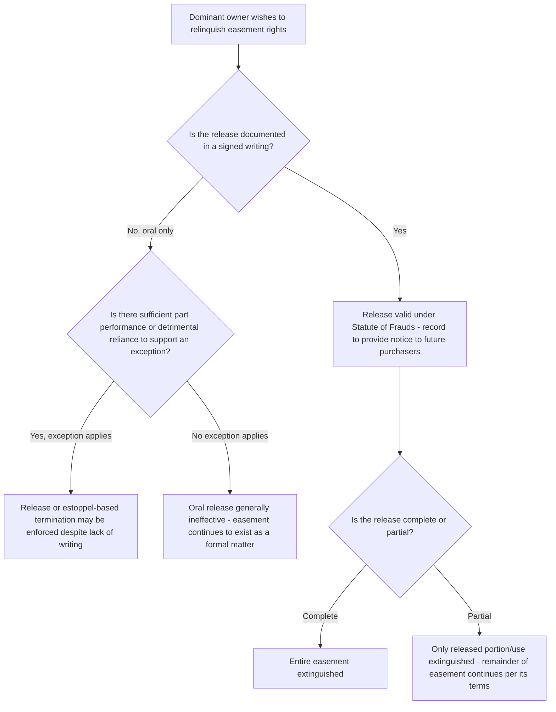

## Termination by Release

### Overview

Release is the most straightforward mode of easement termination: a voluntary, express relinquishment of easement rights by the party holding those rights, typically the dominant estate owner surrendering the benefit back to the servient owner. Because release involves an affirmative, intentional act rather than operation of law (as with merger) or inferred intent (as with abandonment), it is generally treated as requiring formal compliance with property conveyancing requirements, making it doctrinally the cleanest and most easily proven termination mechanism when properly executed.

### The General Requirement: Writing Satisfying the Statute of Frauds

**Key Points**

- Because an easement is an interest in real property, its termination by release generally must satisfy the same formalities required to create such an interest in the first instance — most significantly, the **Statute of Frauds**, requiring a written instrument, typically signed by the party relinquishing the right (the dominant owner, releasing the benefit).
- An oral release, standing alone, is generally **ineffective** to terminate an easement under the Statute of Frauds, mirroring the general rule that oral agreements affecting interests in land are unenforceable absent an exception.
- The releasing instrument (commonly called a "deed of release," "quitclaim of easement rights," or similar) is typically recorded in the servient estate's chain of title, both to provide public notice of the termination and to protect subsequent purchasers of the dominant estate from mistakenly believing the easement still exists.

### Exceptions and Related Doctrines Softening the Writing Requirement

**Key Points**

- **Part performance** — as with other Statute of Frauds contexts, some jurisdictions recognize that sufficient part performance by the parties consistent with an oral release agreement (for example, the dominant owner ceasing use entirely and the servient owner making substantial improvements to the formerly burdened area in reliance on the oral release) may support enforcement of an oral release despite the absence of a writing, though this exception is narrowly and inconsistently applied.
- **Estoppel** — a dominant owner who orally agrees to release an easement, and whose conduct induces the servient owner to detrimentally rely on that agreement (e.g., constructing a permanent structure across the former easement path), may be estopped from later asserting the easement continues to exist, even absent a written release — this operates as an equitable doctrine distinct from, though related to, formal release, and is discussed in greater depth as part of easement-related estoppel doctrines generally. [Inference: the degree to which courts require substantial detrimental reliance before applying estoppel in this context, versus a lower threshold, varies by jurisdiction, and the doctrine is applied cautiously given its potential to circumvent the Statute of Frauds' general policy.]
- These exceptions function as alternative, distinct bases for extinguishing an easement's practical enforceability rather than as a relaxation of the release doctrine itself — courts generally continue to insist that a *release*, properly so called, requires a writing, while recognizing that other doctrines (part performance, estoppel) may independently produce a similar practical result on sufficiently compelling facts.

### Scope of Release: Partial vs. Complete

**Key Points**

- A release may be **complete**, extinguishing the entire easement, or **partial**, relinquishing only a portion of the easement's rights — for example, releasing the right to use a certain segment of a right-of-way while retaining the right to use the remainder, or releasing the right to a particular use while retaining the easement for other authorized purposes.
- Partial releases require careful drafting to clearly specify precisely what is being released and what, if anything, is being retained, since ambiguous partial release language can generate significant future disputes regarding the easement's remaining scope.
- A release may also be structured to apply only to a **specific portion of the servient estate** (relevant particularly following servient estate division, addressed elsewhere), releasing the burden as to one resulting parcel while leaving it intact as to others.

### Release Distinguished from Related Termination Doctrines

**Key Points**

- Release differs from **abandonment** in that release requires an affirmative, express act (typically written) manifesting present intent to relinquish the right, whereas abandonment is inferred from conduct (non-use combined with other affirmative evidence of intent to abandon) without any formal instrument.
- Release differs from **merger** in that release can occur between parties who remain distinct owners of the dominant and servient estates — no common ownership is required or relevant to a release, unlike merger, which depends entirely on unified ownership.
- Release differs from **estoppel-based termination** (though related, as noted above) in that release is fundamentally a voluntary act of the rights-holder, memorialized formally, while estoppel arises from the equities of a situation involving reliance, potentially even absent the rights-holder's clear, deliberate intent to permanently give up the right.

### Consideration and Compensation

**Key Points**

- A release may be given **with or without consideration** — a dominant owner may voluntarily and gratuitously release an easement, or may negotiate compensation from the servient owner in exchange for the release, particularly where the easement has independent value (as is often the case with commercial or utility easements).
- Where a servient owner seeks a release to facilitate development or remove an encumbrance discovered during a sale, negotiated releases (often for monetary consideration) are a common and practical mechanism for clearing title, frequently preferred over litigation-based termination theories (abandonment, misuse) given the certainty a properly executed release provides compared to the more fact-intensive and uncertain litigation required to establish those other doctrines.

### Comparative Table: Release vs. Other Voluntary/Formal Termination Mechanisms

| Feature | Release | Merger | Abandonment |
| --- | --- | --- | --- |
| Requires written instrument | Yes (Statute of Frauds), with narrow exceptions | No — automatic upon unified ownership | No — but requires clear proof of intent plus non-use |
| Requires common ownership | No | Yes | No |
| Requires affirmative act by rights-holder | Yes | No — occurs automatically | No formal act required, but affirmative intent must be shown |
| Typical evidentiary certainty | High, once writing is produced | High, once unity of title shown | Lower — fact-intensive, contested |

### Illustrative Flow

### Illustrative Example

A servient landowner wishes to develop a portion of their property that is currently crossed by an underused right-of-way easement benefiting a neighboring dominant parcel. The dominant owner no longer needs the full width of the right-of-way, having developed an alternative access point, but wishes to retain a narrower pedestrian path across the same general area for occasional use.

The parties negotiate a **partial release**: the dominant owner executes and records a written deed of release, specifically describing the release as applying to the portion of the original right-of-way's width and length no longer needed for pedestrian access, while expressly retaining and re-describing a narrower remaining pedestrian easement over a defined portion of the original corridor. Because this release satisfies the Statute of Frauds through a signed, recorded writing, and clearly delineates what is released versus retained, it provides a legally certain and clean resolution — the servient owner can proceed with development on the released portion with confidence the easement no longer burdens that area, while the dominant owner retains clearly defined, enforceable rights to the narrower remaining path.

### Litigation and Proof Considerations

- Disputes over release most commonly center on either (a) whether a purported oral agreement to release rises to the level of an enforceable exception (part performance or estoppel) despite lacking a writing, or (b) ambiguity in the scope of a written partial release, requiring interpretation of exactly what was released versus retained.
- Because release requires an affirmative act by the *dominant* owner (the party relinquishing a benefit), a servient owner asserting a release defense bears the burden of producing the written instrument (or establishing an applicable exception) — mere non-use by the dominant owner, without more, is not evidence of release and would instead need to be analyzed under the distinct abandonment doctrine, which has its own, generally more demanding evidentiary requirements.
- Where a release is negotiated for consideration, proper documentation of the transaction (a formal release deed, appropriately recorded) is essential both to bind future successors and to avoid future disputes regarding whether a payment was for a full release, a partial release, or some other arrangement (such as a temporary license or relocation agreement) with different legal consequences than outright termination.
- Title examiners should specifically search for recorded releases affecting a known easement, since a properly recorded release extinguishing or modifying an otherwise-appearing easement is a critical, easily-overlooked component of accurately determining the current state of title.

**Related Topics**

- Termination by Merger of Estates
- Termination of Easements by Abandonment
- Relocation of Easements
- Recording Acts and Bona Fide Purchaser Doctrine
- Drafting Considerations for Express Easement Grants
- Estoppel-Based Termination and Modification of Easements