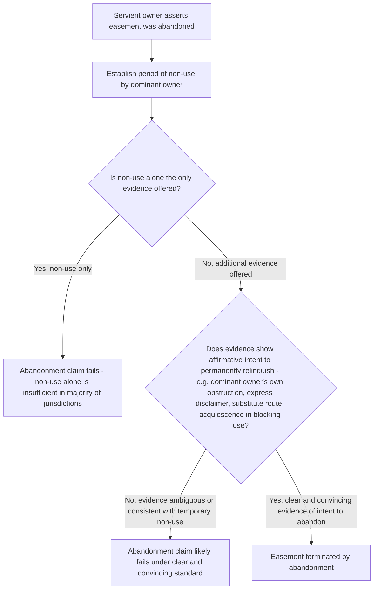

## Termination by Abandonment

### Overview

Abandonment terminates an easement when the dominant estate owner's conduct manifests a clear, unequivocal intent to permanently relinquish the right of use. Unlike release, abandonment requires no written instrument; unlike merger, it requires no common ownership. Instead, it is an equitable doctrine inferred from the dominant owner's conduct, most centrally the combination of non-use with additional affirmative evidence of an intent never to resume use. Because abandonment forfeits a property right without any formal act or compensation, courts apply a demanding evidentiary standard, making mere non-use — however prolonged — insufficient standing alone in the overwhelming majority of jurisdictions.

### The Central Rule: Non-Use Alone Is Insufficient

**Key Points**

- The near-universal rule across American jurisdictions holds that **mere non-use of an easement, no matter how long continued, does not by itself constitute abandonment**. An easement, once validly created, is treated as a vested property right that does not expire through simple disuse, in contrast to some other property interests that can lapse through non-exercise.
- This rule reflects the law's general reluctance to divest vested property interests without clear, affirmative evidence of intent, and also practical recognition that a dominant owner may have entirely legitimate reasons for not currently using an easement (seasonal needs, alternative access temporarily available, delayed development plans) without ever intending to permanently give up the right.
- Non-use, however extensive, is nonetheless treated as **relevant evidence** bearing on the ultimate question of intent — it is simply not sufficient by itself and must be accompanied by additional affirmative conduct or circumstances demonstrating a clear intent never to resume use.

### Additional Affirmative Evidence Required

**Key Points**

Courts look for conduct beyond mere non-use that affirmatively demonstrates an intent to permanently abandon, commonly including:

1. **Construction of permanent obstructions** by the dominant owner that are physically inconsistent with continued use (e.g., the dominant owner themselves erecting a permanent structure blocking their own right-of-way, rather than the servient owner doing so).
2. **Express statements** by the dominant owner disclaiming any further interest in the easement, communicated to the servient owner or otherwise documented.
3. **Acquiescence in the servient owner's inconsistent use** — for example, standing by without objection while the servient owner builds a permanent structure that physically blocks or eliminates the easement's usability, particularly over a substantial period, can support an inference of abandonment (this overlaps conceptually with estoppel-based termination, discussed as a related doctrine).
4. **Creation and use of a substitute access route** by the dominant owner in a manner suggesting permanent replacement rather than temporary supplementation of the original easement — particularly persuasive where the dominant owner invests substantially in the alternative route in a manner inconsistent with any intent to return to the original easement.
5. **Conduct in a real estate transaction** — for instance, a dominant owner selling the dominant estate and expressly excluding or disclaiming the easement in the transaction documents, or otherwise representing to a purchaser or lender that no such easement rights exist or are being conveyed.

### The Clear and Convincing Evidence Standard

**Key Points**

- Because abandonment forfeits a vested property right, the majority of jurisdictions require the party asserting abandonment (typically the servient owner) to prove it by **clear and convincing evidence**, a heightened standard reflecting the law's institutional caution against inferring the permanent loss of property rights from ambiguous conduct.
- This heightened standard means that servient owners face a genuinely difficult evidentiary burden in abandonment litigation — courts routinely reject abandonment claims resting primarily on extended non-use even where the non-use period is very long (decades in some reported cases), absent the kind of additional affirmative evidence described above.

### Abandonment Distinguished from Related Doctrines

| Feature | Abandonment | Release | Estoppel |
| --- | --- | --- | --- |
| Requires writing | No | Yes (Statute of Frauds), with narrow exceptions | No |
| Requires affirmative express act | No — inferred from conduct | Yes — express relinquishment | No — arises from reliance on conduct/representations |
| Core showing required | Non-use plus additional affirmative evidence of intent to permanently relinquish | Signed instrument evidencing intent to release | Detrimental reliance by servient owner on dominant owner's conduct/representations |
| Evidentiary standard | Clear and convincing (majority) | Ordinary contract/deed proof once writing produced | Equitable, fact-specific |

### Abandonment vs. Termination of Prescriptive Easements by Non-Use

**Key Points**

- Some jurisdictions apply a **distinct, sometimes more lenient** non-use-based termination rule specifically to **prescriptive** easements, reasoning that because a prescriptive easement arises without the formality of an express grant, a period of non-use consistent with an intent to abandon may more readily support termination compared to an expressly granted easement, though this remains subject to jurisdictional variation and many courts apply essentially the same abandonment analysis regardless of the easement's mode of creation. [Inference: whether prescriptive easements are subject to a genuinely relaxed abandonment standard, or whether courts simply apply the same general framework with the practical effect that non-use evidence carries somewhat more weight in the prescriptive context, is treated inconsistently across jurisdictions.]

### Illustrative Flow

### Illustrative Example

A dominant owner has not used a rear right-of-way easement crossing a neighboring parcel for 22 years, having instead relied on an alternative front access route developed early in that period. During this time, the dominant owner also constructed a permanent fence and a paved patio directly across their own end of the original right-of-way corridor, materially obstructing any practical ability to use it, and never objected when the servient owner subsequently planted a row of mature trees along the same corridor.

Applying the framework: the 22-year non-use period alone would be insufficient to establish abandonment under the majority rule. However, the dominant owner's own affirmative construction of a permanent fence and patio blocking their own access point is strong, self-inflicted evidence of an intent to permanently forgo use — conduct fundamentally different from a dominant owner simply not currently exercising a right they still intend to preserve. Combined with the dominant owner's acquiescence in the servient owner's inconsistent planting of mature trees along the corridor without any objection, a court would likely find clear and convincing evidence supporting abandonment, since the totality of the dominant owner's own conduct (not merely their passive non-use) affirmatively demonstrates an intent to relinquish the right permanently.

### Litigation and Proof Considerations

- Servient owners asserting abandonment should focus discovery and evidence-gathering on **conduct by the dominant owner** — physical obstructions the dominant owner constructed, statements made, or transactional conduct — rather than resting primarily on the length of non-use, given the majority rule's insistence on evidence beyond mere non-use.
- Dominant owners defending against abandonment claims typically emphasize legitimate, non-permanent explanations for the non-use (delayed development plans, seasonal access needs, availability of temporary alternative access) to counter any inference of permanent intent to relinquish.
- Because the clear and convincing standard is demanding, servient owners are often better served pursuing a **release** (if the dominant owner will cooperate) or negotiating **compensation for a voluntary termination**, rather than relying on the more uncertain and heavily fact-dependent abandonment theory, particularly where the non-use evidence, while lengthy, lacks clear corroborating conduct.
- Courts frequently examine the **totality of circumstances** rather than any single dispositive fact, meaning practitioners should marshal as complete an evidentiary picture as possible (physical condition of the easement area over time, aerial photography, permitting/construction records for any obstructions, communications between the parties) rather than relying on any one piece of evidence in isolation.

**Related Topics**

- Termination by Release
- Termination by Merger of Estates
- Estoppel-Based Termination and Modification of Easements
- Overburdening and Misuse of an Easement
- Elements of Adverse Use for Prescription (comparative non-use context)
- Remedies for Interference with Easement Rights