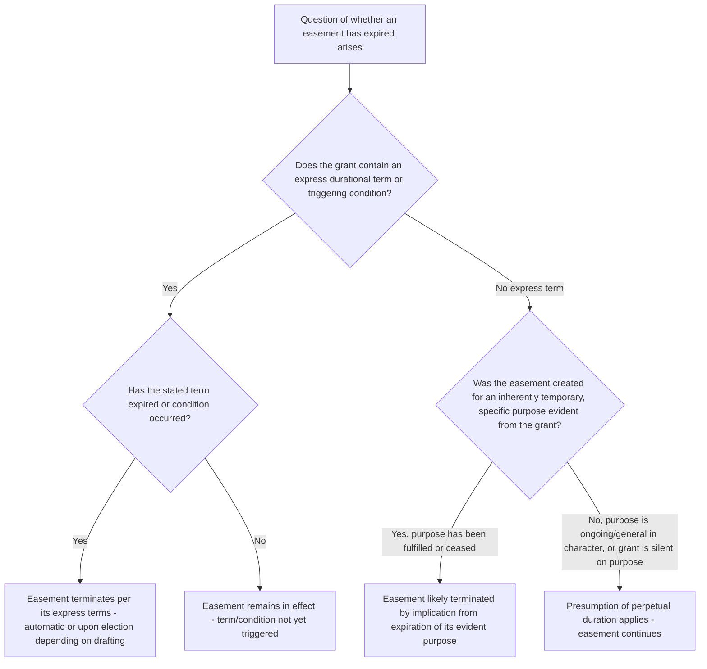

## Termination by Expiration of Purpose or Term

### Overview

Some easements are inherently limited in duration, either by an express term set at creation or by their purpose being tied to circumstances that will eventually cease to exist. Termination by expiration addresses these self-limiting easements, distinguishing them from perpetual easements (the default assumption absent contrary language) and from easements by necessity (which terminate when the underlying necessity ends, a related but analytically distinct doctrine addressed in its own chapter). This item examines express term limitations, purpose-based expiration, and the doctrinal presumption favoring perpetual duration absent clear limiting language.

### The Default Presumption: Easements Are Perpetual

**Key Points**

- Absent express language limiting its duration, an easement is presumed to be of **perpetual duration** — intended to last indefinitely, running with the land through successive owners without any built-in expiration date or event.
- This default presumption reflects the general policy favoring the stability and permanence of property interests, and places the burden on a party asserting that an easement was intended to be temporary or conditional to point to clear supporting language or circumstances, rather than requiring the party asserting perpetual duration to affirmatively prove it.
- Courts are generally reluctant to infer a durational limitation from ambiguous language, applying instead a presumption favoring the broader, more permanent interpretation where genuine ambiguity exists — mirroring the general interpretive caution applied throughout easement law against reading limitations into a grant that the language does not clearly support.

### Express Term Limitations

**Key Points**

- Parties may expressly limit an easement's duration in the creating instrument through several common mechanisms:
  - **A fixed calendar term** (e.g., "for a period of twenty-five years from the date of this grant").
  - **A specified condition or event** (e.g., "until such time as a public road is constructed providing alternative access to the Dominant Parcel").
  - **The life of a named individual** (a life estate-like limitation, e.g., "for so long as Grantee shall live").
  - **A defined purpose whose fulfillment or cessation triggers expiration** (e.g., "for construction access during the building of the Dominant Parcel's residence," expiring upon completion of construction).
- Where such express limiting language is used, courts generally give it effect according to its terms, applying ordinary rules of instrument interpretation — an easement expressly limited to a term or condition terminates automatically upon expiration of that term or occurrence of that condition, without requiring any additional formal act (release, judicial declaration) to effectuate the termination, though as a practical matter parties frequently record a confirmatory document to clear title once expiration has occurred.

### Purpose-Based Expiration Without an Express Term

**Key Points**

- Even absent an express durational term, some easements are created for a **specific, inherently temporary purpose** such that the easement's own logic implies termination upon fulfillment or cessation of that purpose, even without explicit "until" or "for a period of" language.
- Common examples include:
  - **Construction or staging easements**, granted to facilitate access during a specific construction project, which courts frequently construe as terminating upon completion of the project even absent explicit termination language, based on the evident, limited purpose for which the right was granted.
  - **Temporary utility connections**, granted while permanent utility infrastructure is being installed elsewhere.
  - Easements whose stated purpose is tied to a specific, identifiable, and inherently finite undertaking rather than an ongoing, indefinite use.
- This purpose-based expiration analysis requires courts to distinguish between an easement whose purpose is **inherently temporary** (supporting an inferred expiration) and one whose purpose, while specific, is nonetheless of an ongoing, continuing character not inherently time-limited (e.g., "access to the residence" is an ongoing purpose without an inherent endpoint, even though it is specific rather than general). [Inference: this line-drawing exercise is fact-intensive, and courts do not apply a bright-line rule distinguishing inherently temporary from ongoing purposes — the outcome depends closely on the specific language and evident circumstances of each grant.]

### Distinguishing Purpose-Expiration from Easement by Necessity Termination

**Key Points**

- Termination by expiration of purpose should be distinguished from the termination of an **easement by necessity** upon cessation of the underlying necessity, addressed in depth in the necessity-focused chapter of this material — though both involve an easement ending because its underlying rationale has ceased, they arise in different doctrinal contexts: necessity-based termination is a default rule specific to easements implied by necessity, arising from the nature of that particular mode of creation, while purpose-based expiration discussed here can apply to expressly granted easements whose own terms tie duration to a defined purpose.
- The two doctrines can overlap in some fact patterns (for example, an express easement granted "for access until the Dominant Parcel obtains alternative legal access" closely parallels the necessity-termination rationale) but remain analytically distinct bases for termination, relevant depending on how the specific easement was created and worded.

### Termination Upon Occurrence of a Stated Condition Subsequent

**Key Points**

- Some easements are structured with a **condition subsequent** — the easement continues indefinitely unless and until a specified triggering event occurs, at which point it automatically terminates (or, depending on the precise drafting, becomes subject to termination at the servient owner's election).
- The distinction between an easement that **automatically terminates** upon a stated condition versus one that **becomes terminable** (requiring an affirmative act by the servient owner to actually terminate it once the condition occurs) is a matter of drafting and interpretation — precise language matters significantly, and ambiguous drafting in this area can generate substantial dispute regarding whether termination was self-executing or required further action.

### Comparative Table: Modes of Duration-Related Termination

| Mechanism | Basis | Requires Affirmative Act to Terminate |
| --- | --- | --- |
| Express fixed term | Stated calendar period in the grant | Generally no — automatic upon expiration |
| Express condition/event | Stated triggering condition in the grant | Depends on drafting — may be automatic or may require servient owner's election |
| Purpose-based (no express term) | Inferred from inherently temporary nature of stated purpose | Generally no — automatic upon fulfillment/cessation of purpose |
| Easement by necessity (comparative) | Cessation of the necessity that gave rise to the easement (distinct chapter) | Varies by jurisdiction — some automatic, some require a showing of continuing necessity in litigation |

### Illustrative Flow

### Illustrative Example

A developer grants a neighboring landowner "a temporary construction easement across the northern 20 feet of Grantor's parcel, for the purpose of staging equipment and materials during construction of Grantee's residence, said easement to terminate automatically upon issuance of a certificate of occupancy for Grantee's residence." Construction is completed and a certificate of occupancy is issued eighteen months later.

Applying the framework: because the grant contains both an express statement of temporary purpose and an explicit triggering condition (issuance of the certificate of occupancy) tied to automatic termination, the easement terminates by its own terms immediately upon that event occurring, without requiring any further action by either party — though the parties would be well advised, as a practical title-clearing matter, to record a confirmatory notice of termination to ensure the expired easement does not continue to cloud title or create confusion for future purchasers relying on a title search. Compare this to a hypothetical grant of "an easement for construction access" with no stated termination trigger — a court would need to determine, based on the evident circumstances and any other available evidence of intent, whether the parties intended this to expire upon completion of construction (a purpose-based expiration analysis) or whether the language, despite referencing construction, was intended to grant a more general, ongoing access right without an inherent endpoint.

### Litigation and Proof Considerations

- Where an express term or condition exists, disputes typically center on **factual questions** regarding whether the stated triggering event has actually occurred (e.g., whether a construction project is genuinely "complete" as that term was intended in the grant) rather than on the legal effect of the term itself, which is usually clear once the triggering fact is established.
- Where no express term exists and a party argues for purpose-based expiration, the evidentiary focus shifts to the **circumstances surrounding the grant's creation** — correspondence, the physical nature and duration of the stated purpose, and any other evidence bearing on whether the parties intended an inherently temporary or an ongoing right.
- Parties relying on an easement they believe may be subject to an expiration argument should consider seeking a **declaratory judgment** to resolve the question definitively, particularly before undertaking significant reliance (construction, investment) premised on the easement's continued existence.
- Drafting attorneies creating genuinely temporary easements are well advised to include explicit, clearly triggered termination language (as in the construction-easement example above) rather than relying on courts to infer purpose-based expiration from ambiguous or general language, given the interpretive uncertainty and default presumption favoring perpetual duration that a court would otherwise apply.

**Related Topics**

- Statutory and Common Law Ways of Necessity (comparative necessity-based termination)
- Termination by Release
- Termination by Abandonment
- Determining Permitted Use and Purpose
- Drafting Considerations for Express Easement Grants
- Recording Acts and Bona Fide Purchaser Doctrine