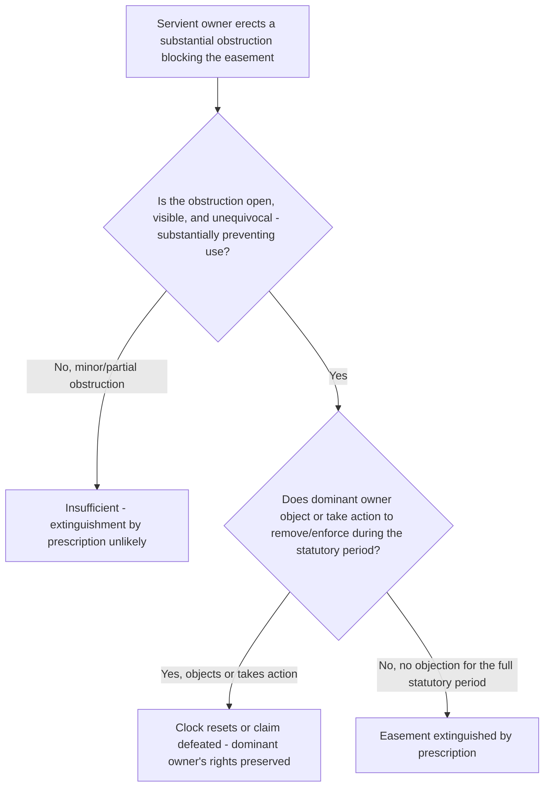

## Extinguishment by Prescription

### Overview

Just as a prescriptive easement can be created through adverse use over a statutory period, an existing easement can be extinguished through the mirror-image doctrine of extinguishment by prescription: the servient owner's adverse, open, continuous, and hostile interference with or obstruction of the dominant owner's use, continued for the statutory period, without objection or assertion of rights by the dominant owner. This doctrine effectively reverses the burden and benefit of ordinary prescriptive analysis — here, the servient owner adversely asserts a right to be free of the easement, rather than a claimant adversely asserting a right to use another's land.

### Elements of Extinguishment by Prescription

**Key Points**

Courts generally require the servient owner to establish elements paralleling those required for prescriptive easement creation, adapted to the extinguishment context:

1. **Obstruction or interference** by the servient owner that is inconsistent with, and effectively prevents or substantially impairs, the dominant owner's use of the easement.
2. **Open and notorious** — the obstruction must be visible and apparent to the dominant owner, such that a reasonably attentive dominant owner would discover the interference.
3. **Adverse to the dominant owner's rights** — the obstruction must be made without the dominant owner's permission and must be inconsistent with the dominant owner's continued enjoyment of the easement, rather than, for example, a temporary or incidental obstruction the dominant owner might reasonably tolerate without it signaling a challenge to the underlying right.
4. **Continuous** for the full statutory period, without interruption by the dominant owner reasserting or resuming use.
5. **The dominant owner's failure to object or assert rights** during the running of the period — critically, the dominant owner's acquiescence (whether through inaction, failure to object, or failure to take legal action to remove the obstruction) throughout the statutory period is central to the doctrine, since it is this failure that mirrors the servient owner's traditional acquiescence in ordinary prescriptive easement creation.

### The Central Distinction from Simple Abandonment

**Key Points**

- Extinguishment by prescription is conceptually and evidentially distinct from termination by **abandonment** (addressed as a separate doctrine): abandonment focuses on the *dominant owner's* affirmative conduct and intent to relinquish the right, whereas extinguishment by prescription focuses on the *servient owner's* affirmative, adverse act of obstruction, continued for the statutory period, combined with the dominant owner's failure to timely object.
- In practice, these doctrines frequently overlap on similar facts (a servient owner blocks an easement; the dominant owner does nothing for many years), and courts sometimes analyze such fact patterns under either or both theories, but the formal elements and burdens differ: abandonment centers on the dominant owner's intent (requiring evidence beyond mere non-use), while extinguishment by prescription centers on the servient owner's affirmative adverse conduct and its open, continuous, unobjected-to character for the statutory period.
- A key practical difference: extinguishment by prescription can succeed even where the dominant owner's failure to object reflects mere neglect or oversight rather than any actual intent to give up the right, provided the servient owner's obstruction was sufficiently open, adverse, and continuous — this is a meaningfully lower bar for the servient owner than proving the dominant owner's subjective intent to abandon, which the clear-and-convincing abandonment standard otherwise demands.

### What Constitutes Sufficient Obstruction

**Key Points**

- Courts generally require the obstruction to be **substantial and unequivocal** — a fence entirely blocking a right-of-way, a permanent structure built directly across the easement's path, or similar conduct clearly and physically preventing the dominant owner's use.
- **Partial obstructions** that merely inconvenience but do not substantially prevent use (e.g., a gate that remains unlocked and passable, or a narrowing that still permits the dominant owner's established use) are less likely to support extinguishment, since they do not clearly and unequivocally assert a right inconsistent with the easement's continued existence in the way a complete blockage does.
- The obstruction must be maintained **continuously** for the full statutory period — removal or interruption of the obstruction (whether by the servient owner voluntarily, by the dominant owner's action, or by any other cause) during the running of the period resets the clock, mirroring the continuity requirement applicable to ordinary prescriptive easement creation.

### Statutory Period

**Key Points**

- The statutory period applied is generally the **same prescriptive period** used for creating a prescriptive easement (or adverse possession) in the relevant jurisdiction, reflecting the doctrine's function as essentially a mirror-image application of the same underlying prescriptive principles, though some jurisdictions apply their statute somewhat differently in this specific extinguishment context. [Inference: while using the same general statutory period is the typical approach, the degree to which courts import every technical element of prescriptive-easement-creation doctrine (such as tacking principles) wholesale into the extinguishment context, versus adapting them, varies and is not uniformly settled across jurisdictions.]

### Comparative Table: Extinguishment by Prescription vs. Abandonment

| Feature | Extinguishment by Prescription | Abandonment |
| --- | --- | --- |
| Whose conduct is central | Servient owner's affirmative obstruction | Dominant owner's conduct evidencing intent to relinquish |
| Core requirement | Open, adverse, continuous obstruction for statutory period, unobjected to | Non-use plus additional affirmative evidence of intent to permanently give up the right |
| Dominant owner's subjective intent relevant? | Not directly — failure to object/acquiescence is what matters, regardless of underlying reason | Central — the entire inquiry focuses on inferring the dominant owner's intent |
| Evidentiary standard | Generally mirrors prescriptive easement creation standards (often clear and convincing) | Clear and convincing evidence of intent (majority rule) |

### Illustrative Flow

### Illustrative Example

A servient landowner erects a solid fence completely blocking a recorded right-of-way easement benefiting a neighboring parcel, in a jurisdiction with a 15-year prescriptive period. The dominant owner, who had an alternative (though less convenient) means of access, never objects to the fence, never demands its removal, and never attempts to use or assert the right-of-way for the entire 17 years that pass before a dispute arises when the dominant parcel is sold and the new owner discovers and objects to the fence upon reviewing title records.

Applying the framework: the fence constitutes a substantial, unequivocal, open, and continuous obstruction, maintained without interruption for well over the statutory 15-year period, and the original dominant owner's complete failure to object or assert the easement throughout that period satisfies the acquiescence element. A court would likely find the easement extinguished by prescription — and this result would follow even if the original dominant owner's inaction reflected mere convenience (having an adequate alternative route) rather than any deliberate intent to give up the right, illustrating the doctrine's lower reliance on subjective intent compared to abandonment. The new owner, having purchased after extinguishment already occurred, would take the dominant parcel without the benefit of the easement, regardless of what the recorded title documents might still show, since prescriptive extinguishment (like prescriptive creation) operates by operation of law independent of the recording system.

### Litigation and Proof Considerations

- Servient owners asserting extinguishment by prescription bear the burden of establishing each element, generally by clear and convincing evidence given the doctrine's kinship to ordinary prescriptive easement creation — precise dating of when the obstruction was erected and evidence of its continuous, unbroken maintenance throughout the full statutory period are central.
- Dominant owners defending against extinguishment should investigate whether any objection, demand for removal, partial use, or other assertion of rights occurred at any point during the claimed period, since even a single instance of resumed use or objection may interrupt the running of the prescriptive period and defeat the claim.
- Because this doctrine can extinguish a recorded easement without any corresponding change to the public record, it presents a **title risk not readily discoverable through a standard title search alone** — a physical inspection or survey of the property, checking for actual, on-the-ground obstructions inconsistent with a recorded easement, is often necessary to identify a potential prescriptive extinguishment issue that a title search would miss entirely.
- Purchasers of a dominant estate relying on a recorded easement should be particularly attentive to this risk, since the recorded instrument may no longer reflect actual, enforceable rights if extinguishment by prescription has already occurred — a physical inspection prior to purchase is a key preventive due diligence step.

**Related Topics**

- Elements of Adverse Use for Prescription (Hostility and Claim of Right)
- Termination by Abandonment
- Open, Notorious, and Continuous Use Requirements
- Remedies for Interference with Easement Rights
- Recording Acts and Bona Fide Purchaser Doctrine
- Title Examination and Easement Due Diligence