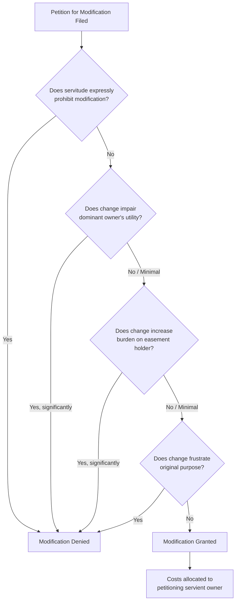

## Judicial Modification of Easement Terms

### Overview

Judicial modification of easement terms refers to the power of courts, sitting in equity, to alter the location, dimensions, scope, or manner of use of an existing easement without terminating it entirely. Unlike termination doctrines (merger, abandonment, prescription, estoppel), modification preserves the underlying property interest while adjusting its exercise to accommodate changed circumstances. This power derives from courts' general equitable authority over servitudes and, in many modern jurisdictions, from the Restatement (Third) of Property: Servitudes § 4.8 and § 7.10.

### Legal Foundations

#### Common Law Baseline

At traditional common law, an easement's location and terms, once fixed by grant, prescription, or implication, were considered permanently fixed absent agreement by both parties. The servient owner could not unilaterally relocate or narrow the easement, and courts were historically reluctant to rewrite negotiated property rights. This rigidity produced the classic rule: **"once located, an easement cannot be relocated without the consent of both parties."**

#### Restatement (Third) Approach

The Restatement (Third) of Property: Servitudes § 4.8(3) substantially liberalized this position, providing that unless expressly denied by the terms of the servitude, the servient estate owner is entitled to make reasonable changes in the location or dimensions of an easement, at the servient owner's own expense, provided the change does not:

- Significantly lessen the utility of the easement
- Increase burdens on the easement holder in its use and enjoyment
- Frustrate the purpose for which the easement was created

This represents a shift from a consent-based model to a reasonableness-based judicial modification model, and has been adopted or cited approvingly in a growing number of state courts.

#### Distinguishing Modification from Related Doctrines

| Doctrine | Court Action | Effect on Easement |
| --- | --- | --- |
| Judicial modification | Alters terms/location | Easement survives, adjusted |
| Termination (merger/abandonment) | Extinguishes right | Easement ceases entirely |
| Relocation (§4.8(3)) | Moves physical location | Same scope, new path |
| Equitable reformation | Corrects drafting error | Restores parties' original intent |

### Grounds for Judicial Modification

#### 1. Changed Circumstances

Courts may modify easement terms where a fundamental change in circumstances since the easement's creation has rendered the original terms impractical, inequitable, or obsolete. This mirrors the doctrine applied to real covenants and equitable servitudes under the "changed conditions" doctrine.

**Key Points**

- The change must be substantial and generally unforeseen at creation
- Mere inconvenience to the servient owner is typically insufficient
- Courts weigh the easement holder's continued need against the burden imposed

#### 2. Relocation Requests by Servient Owner

Under the Restatement § 4.8(3) approach, a servient owner seeking to develop or reconfigure their land may petition (or in some jurisdictions unilaterally act, subject to later judicial review) to relocate an easement, provided:

- The dominant owner's use and enjoyment is not materially impaired
- The cost of relocation is borne by the servient owner
- The new location provides substantially equivalent access, utility, and safety

**Example**

A driveway easement crossing the front of a servient parcel prevents the servient owner from building a garage. If shifting the easement ten feet to the property's side boundary preserves the dominant owner's access without added distance, grade change, or reduced capacity, a court applying § 4.8(3) may authorize relocation over the dominant owner's objection.

#### 3. Ambiguous or Incomplete Original Grant

Where the original instrument is silent or ambiguous as to width, surface type, or permitted uses, courts may exercise a quasi-modification function by construing and fixing "reasonable" terms — sometimes characterized as interpretation rather than modification, but functionally similar in effect.

#### 4. Overburdening Correction

If the dominant estate's use has expanded beyond the scope contemplated by the original grant (e.g., agricultural access easement now serving a subdivided residential development), courts may modify the terms to cap or condition use rather than terminate the easement outright, particularly where partial use remains legitimate.

#### 5. Necessity-Based Adjustment

For easements by necessity, courts retain ongoing authority to adjust scope as the necessity changes — for instance, narrowing an access easement once an alternative route becomes available, or modifying terms if the necessity diminishes but does not disappear entirely.

### Procedural Framework

#### 1. Standing and Parties

Both dominant and servient estate holders have standing to petition for modification. All parties with a recorded interest in either estate (mortgagees, subsequent easement holders) are typically necessary parties to the action.

#### 2. Burden of Proof

The party seeking modification generally bears the burden of demonstrating:

- A change in circumstances or a basis under the applicable reasonableness standard
- That the proposed modification does not materially impair the other party's rights
- That equitable relief is more appropriate than damages or termination

#### 3. Judicial Balancing Test

Courts commonly apply a multi-factor balancing analysis:

#### 4. Cost Allocation

The Restatement approach and most modern case law place the cost of physically implementing a court-ordered relocation or modification on the party requesting the change — typically the servient owner seeking relocation.

### Substantive Limits on Judicial Power

#### Express Prohibitions

If the granting instrument contains explicit language fixing the easement's location or barring relocation ("this easement shall run along the following described course and shall not be relocated"), courts are generally bound to honor that restriction and cannot invoke reasonableness-based modification to override express terms.

#### Material Impairment Standard

Modification will be denied if it would:

- Reduce accessibility (e.g., grade changes making a route impassable for vehicles previously accommodated)
- Increase distance or travel time significantly
- Diminish safety or reasonable convenience
- Undermine the easement's original economic or functional purpose

#### Vested Rights and Reliance

Courts are more reluctant to modify easement terms where the dominant owner has made substantial improvements or investments in reliance on the easement's specific location or terms (e.g., constructed a building oriented around a fixed driveway alignment).

### Jurisdictional Variation

**Key Points**

- States that have expressly adopted Restatement (Third) § 4.8(3): includes jurisdictions like Massachusetts (*M.P.M. Builders, LLC v. Dwyer*, 2004), and several others have cited it favorably in dicta
- States retaining the traditional "fixed location" rule require mutual consent absent statutory or equitable exception
- Some jurisdictions distinguish between express easements (harder to modify) and easements by implication or necessity (more flexible, since courts already construct their scope based on reasonable use)
- [Inference] Because this remains an evolving area, the applicable rule can differ meaningfully by state, and practitioners should verify current case law in the relevant jurisdiction before advising clients on relocation strategy.

### Illustrative Case Pattern

**Example**

*M.P.M. Builders, LLC v. Dwyer*, 809 N.E.2d 1053 (Mass. 2004) — The Massachusetts Supreme Judicial Court adopted the Restatement (Third) § 4.8(3) approach, holding that a servient estate owner may relocate an easement at their own expense without the dominant owner's consent, so long as the relocation does not materially lessen the utility of the easement, increase the burden on its owner, or frustrate its purpose. This case is frequently cited as the leading modern authority for judicial/self-help modification of easement location.

### Drafting Implications

To reduce future litigation over modification, drafters of easement instruments should consider:

- Expressly stating whether relocation or modification is permitted, and under what conditions
- Defining precise metes-and-bounds location versus a "floating" easement subject to later specification
- Including a relocation mechanism (e.g., requiring written consent, arbitration, or a defined reasonableness standard) directly in the instrument
- Addressing cost allocation for any future relocation

### Remedies and Enforcement

Where a court grants modification, the resulting order or decree should:

- Precisely describe the new location, dimensions, or terms (often via updated legal description or survey)
- Direct recording of the modified easement or a boundary line/easement relocation agreement in the land records
- Address responsibility for restoration of the original easement area (e.g., removal of prior improvements, landscaping)

Failure to record the modification can create title defects and disputes with subsequent purchasers who rely on the original recorded instrument — a practical risk independent of the modification's substantive validity.

### Related Topics

- Relocation of Easements Under Restatement (Third) § 4.8(3)
- Termination by Merger of Dominant and Servient Estates
- Abandonment of Easements
- Prescriptive Modification and Scope Expansion
- Equitable Servitudes and the Changed Conditions Doctrine
- Overburdening and Misuse of Easements
- Easements by Necessity: Creation, Scope, and Termination
- Recording Requirements for Easement Amendments
- Drafting Enforceable Relocation Clauses in Easement Instruments