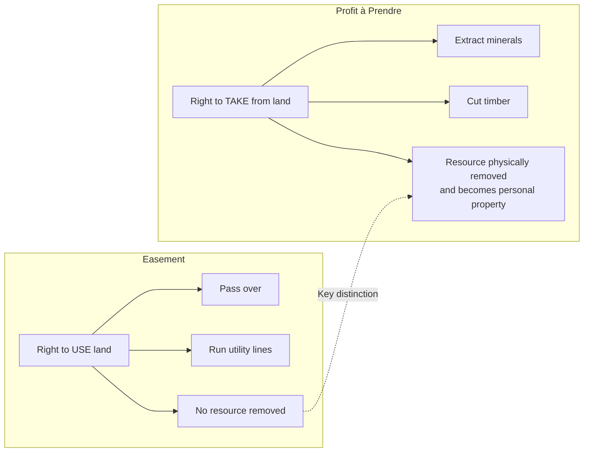

## Definition and Distinction from Easements

### Overview

A profit à prendre (commonly shortened to "profit") is a nonpossessory interest in land that grants its holder the right to enter another's land and remove some part of the soil or its natural products — such as timber, minerals, oil, gas, gravel, crops, game, or fish. Profits share substantial doctrinal overlap with easements but are historically and conceptually distinct because a profit necessarily involves the severance and removal of a physical resource, whereas an easement typically authorizes only use or passage without extraction of the land's substance.

### Historical and Doctrinal Origins

The profit à prendre derives from English common law, where it developed alongside easements but was classified separately because it involved an interest closer to ownership of a part of the land itself — the severed resource — rather than a mere right of use. Early treatises (e.g., Gale on Easements) treated profits as a distinct category of incorporeal hereditament, sharing procedural rules with easements (creation, prescription, apportionment) but differing in substantive character.

### Core Definition

A profit à prendre is:

- A nonpossessory interest in real property
- Held in the land of another (the servient estate)
- Conferring the right to enter and take some product of the soil or the soil itself
- Capable of existing "in gross" (personal to the holder) or "appurtenant" (attached to a dominant estate)

**Key Points**

- The defining feature is the right of *severance and removal* — taking something away that was part of the land
- Once severed, the resource becomes personal property (chattel) belonging to the profit holder
- Profits are traditionally categorized among the broader family of "incorporeal hereditaments," alongside easements, rents, and franchises

### Distinction from Easements

#### 1. Subject Matter: Use vs. Extraction

| Feature | Easement | Profit à Prendre |
| --- | --- | --- |
| Core right | Use or passage over land | Removal of soil/resources from land |
| Physical taking | No | Yes — resource is severed and taken |
| Example | Right-of-way, utility line | Mineral rights, timber rights, right to graze |
| Effect on servient estate | Burdened but not depleted | Servient estate is physically diminished |

The Restatement (Third) of Property: Servitudes § 1.2 actually **merges** profits into the broader definition of "easement" for modern doctrinal purposes, treating a profit as an easement that additionally confers the right to remove a resource. Many jurisdictions still analyze profits separately, however, particularly regarding gross transferability and apportionment rules.

#### 2. In Gross vs. Appurtenant

A critical historical distinction: profits à prendre, unlike most easements, were freely permitted to exist and be transferred **in gross** at common law — that is, without being attached to any dominant estate. This is because the value of extracting minerals, timber, or game does not inherently depend on ownership of adjacent land.

- **Easements in gross**: Historically disfavored, restricted (e.g., not assignable) at common law, though modern law increasingly permits commercial easements in gross (utility easements) to be freely transferable
- **Profits in gross**: Historically freely alienable and inheritable even without a dominant estate — a mineral rights holder need not own neighboring land

**Example**

A mining company acquires the right to extract coal from a landowner's property without owning any adjacent parcel. This is a profit à prendre in gross — a freestanding commercial interest, assignable and devisable independent of any other landholding.

#### 3. Apportionability

Profits in gross were traditionally divisible (apportionable) among multiple holders in a way that easements in gross were not. A profit holder could sell fractional interests (e.g., 25% of extraction rights) to multiple parties, subject to the "one stock" rule limiting the *aggregate* exercise of the right to what the original grant contemplated, to prevent overburdening the servient estate.

- **Exclusive profits**: Grant the sole right to extract the resource; the profit holder may exclude even the landowner from taking the resource, and apportionment among multiple takers is generally permitted without limit on the number of parties (subject to the total quantity granted)
- **Nonexclusive (common) profits**: Landowner retains the right to extract alongside the profit holder; apportionment is more restricted, historically limited by the "one stock" rule to prevent the servient estate from being burdened beyond what a single unified exercise of the right would entail

#### 4. Creation Methods

Profits can be created through largely the same methods as easements, with some nuances:

- **Express grant or reservation** — most common for mineral, oil, and gas rights, subject to the Statute of Frauds
- **Prescription** — a profit can be acquired by open, notorious, continuous, and adverse exercise of the taking right for the statutory period, mirroring prescriptive easement doctrine
- **Implication** — less commonly recognized for profits than for easements, though some jurisdictions allow implied profits by prior use in narrow circumstances
- **Necessity** — rarely applied to profits, since extraction rights are less commonly "necessary" in the way access easements are

#### 5. Termination

Profits terminate through mechanisms substantially parallel to easements:

- Merger of dominant/servient estates (for appurtenant profits) or merger of the profit with fee ownership (for profits in gross)
- Abandonment (non-use plus intent to abandon)
- Release
- Expiration of a stated term (e.g., a 10-year timber-cutting profit)
- **Exhaustion of the resource** — a termination ground unique to profits; once the granted resource (e.g., all merchantable timber, or a defined quantity of gravel) is fully extracted, the profit terminates by its own terms, a concept with no direct equivalent in ordinary easement law

### Modern Statutory Overlay

In most U.S. jurisdictions, the most economically significant profits à prendre today are:

- **Mineral rights / mineral servitudes** — governed heavily by state oil and gas law, severed mineral estate doctrine, and the "dominant estate" rule (mineral estate is typically dominant over the surface estate)
- **Timber rights** — often governed by specific timber deed statutes distinguishing standing timber sales (treated as sales of realty until severance) from cutting rights (treated as profits)
- **Hunting and fishing rights ("game profits")** — increasingly regulated by statute, particularly regarding conservation easements and public trust doctrine limitations on private profits over wildlife

**Example**

A landowner conveys "all coal and other minerals" beneath their property to a coal company via a mineral deed, reserving the surface estate. This severs the mineral estate as a profit à prendre (or, in many jurisdictions, a fee interest in the minerals themselves), giving the coal company the right to enter, extract, and remove coal, subject to any surface use accommodations required by state law.

### Visual Comparison

### [Inference] Areas of Continuing Doctrinal Uncertainty

- Some modern courts and the Restatement (Third) approach have functionally collapsed profits into the easement category for purposes of creation, transfer, and termination rules, which means practitioners should check whether the relevant jurisdiction still treats profits as a wholly separate doctrinal category or has merged the analysis
- The precise scope of the "one stock" apportionment rule for nonexclusive profits varies significantly by jurisdiction and is not uniformly applied

### Practical Drafting Considerations

- Clearly specify whether the grant is **exclusive** or **nonexclusive**, since this affects apportionment rights and the landowner's retained ability to extract the same resource
- Address **surface use rights** explicitly (access roads, drilling pads, staging areas) since a profit to extract a subsurface resource does not automatically include unlimited surface disturbance rights
- Specify **duration and exhaustion terms** — whether the profit terminates upon depletion of a defined quantity, expiration of a term of years, or continues indefinitely
- Address **assignability and divisibility** if the parties intend the profit to be freely transferable or fractionally apportionable

### Related Topics

- Profits Appurtenant vs. Profits in Gross
- The "One Stock" Rule and Apportionment of Profits
- Severed Mineral Estates and the Dominant Estate Doctrine
- Creation of Profits by Prescription
- Termination of Profits by Exhaustion of Resource
- Timber Deeds: Sale of Standing Timber vs. Profit to Cut
- Oil and Gas Leases as Profits à Prendre
- Restatement (Third) of Property: Servitudes — Merger of Profits into Easement Doctrine
- Public Trust Doctrine Limitations on Game and Fishing Profits