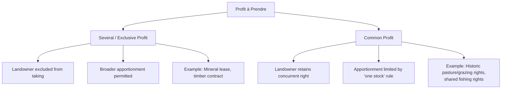

## Common and Several Profits

### Overview

Common and several profits describe two structurally distinct categories of profits à prendre, classified according to whether the right to take the resource is shared with others (including the servient landowner) or held exclusively by a single party. This classification determines the profit holder's rights against the landowner and other profit takers, the applicable apportionment rules, and the remedies available for overexploitation of the servient estate. The terminology traces to English common law categories — "profit in common" (or "common of profit") versus "several profit" (sometimes called "sole" or "exclusive" profit).

### Core Distinction

#### Several (Exclusive) Profits

A **several profit** — also called a **sole** or **exclusive profit** — grants the holder the sole and exclusive right to take the specified resource from the servient land, to the exclusion of the landowner and all third parties.

**Key Points**

- The landowner retains no concurrent right to extract the same resource
- The profit holder may sue in trespass or conversion against the landowner or any third party who takes the resource
- Because the right is exclusive, courts generally permit broader subdivision and apportionment among multiple assignees, since the total quantity taken remains capped by the original grant
- Most modern commercial extraction rights (mineral leases, timber contracts, oil and gas leases) are structured as several profits

#### Common Profits

A **common profit** (profit in common / "common of profit") grants the holder a right to take the resource **concurrently** with the landowner and, often, with other commoners — the right is shared rather than exclusive.

**Key Points**

- The landowner retains the right to take the same resource alongside the profit holder
- Multiple parties may simultaneously hold rights to extract from the same land
- Because multiple parties draw from a single, non-exclusive resource pool, courts apply stricter apportionment limits to prevent overexploitation
- Historically associated with common-of-pasture, common-of-piscary (fishing), common-of-turbary (peat cutting), and common-of-estovers (wood gathering) — classic English common-land rights

### Comparative Table

| Feature | Several (Exclusive) Profit | Common Profit |
| --- | --- | --- |
| Landowner's concurrent right | Excluded | Retained |
| Other profit holders | Permitted by grant terms | Often multiple co-holders (commoners) |
| Apportionment among assignees | Generally freer | Restricted by "one stock" rule |
| Risk of overexploitation | Lower (single controlled taker) | Higher (multiple simultaneous takers) |
| Typical modern examples | Mineral leases, timber contracts | Historic grazing/pasture rights, some fishing rights |
| Remedy against landowner's own taking | Trespass/conversion available | Not available — landowner has a coextensive right |

### The Historical English Categories of Common Profits

Common law recognized several traditional subtypes of common profit, most now of largely historical or comparative interest in U.S. law but foundational to understanding the doctrine's structure:

- **Common of pasture** — right to graze livestock on another's land alongside the landowner's own livestock
- **Common of piscary** — right to fish in another's waters
- **Common of turbary** — right to cut peat or turf for fuel
- **Common of estovers** — right to take wood for repairs, fuel, or fencing (also historically arising as an incident of certain tenancies)

These categories illustrate the shared logic of common profits: multiple parties drawing on a single finite resource, requiring regulation to prevent the "tragedy of the commons" dynamic that unrestricted concurrent taking would create.

### Apportionment: The "One Stock" Rule

The central doctrinal mechanism distinguishing common from several profits in practice is the **rule of "one stock"** (sometimes called the "stint" or "sans nombre" limitation in historical pasture-rights cases):

- For **common (nonexclusive) profits**, when a profit holder attempts to assign or divide their interest among multiple new parties, courts historically limited the *aggregate* exercise of the divided rights to no more than what a *single* holder exercising the original grant would have taken — preventing subdivision from increasing the total burden on the servient estate
- For **several (exclusive) profits**, this restriction is relaxed because the exclusivity of the right, combined with a defined total quantity or duration in the grant, already caps the burden regardless of how many parties share in the proceeds

**Example**

A landowner grants a several profit permitting extraction of "up to 10,000 tons of gravel annually" to Company A. Company A may sell fractional shares of this right to Companies B and C, so long as the combined extraction by A, B, and C does not exceed 10,000 tons per year — the exclusivity and defined cap make this subdivision permissible.

By contrast, if a landowner grants a common right of pasture allowing the profit holder to graze livestock "in common with" the landowner's own herd, and the profit holder attempts to assign grazing rights to five separate parties, courts applying the one-stock rule would restrict the *combined* herds of all five assignees to no more than what the original single holder could have grazed — because the resource (pasture) is shared concurrently with the landowner, uncontrolled subdivision risks overgrazing to the landowner's detriment.

### Visual Structure

### Modern Application in U.S. Law

While the "common profit" terminology and its English pasture-law origins are largely of historical and comparative-law interest, the underlying **shared-resource apportionment problem** remains highly relevant in modern contexts:

- **Co-tenancy in mineral estates** — where multiple mineral rights holders (cotenants) hold undivided interests and each may extract without the consent of the others, subject to a duty to account for profits to co-owners, an analog to the common-profit apportionment concern
- **Correlative rights doctrine (oil and gas law)** — modern state regulatory regimes (well-spacing rules, unitization statutes) function as a statutory successor to the one-stock rule, preventing any single operator from over-extracting from a shared subsurface pool (reservoir) to the detriment of other rights holders drawing from the same formation
- **Water rights doctrines** — riparian and prior appropriation systems address a structurally similar problem (multiple concurrent takers of a shared, finite resource) though governed by separate doctrinal frameworks rather than profit à prendre law directly

**Example**

Under many state oil and gas regulatory schemes, where multiple leaseholders sit atop a single common reservoir, correlative rights rules cap each operator's extraction rate and require unitization agreements — conceptually descended from the same overexploitation concern the historical "one stock" rule addressed for common profits like pasture and turbary.

### [Inference] Practical Note on Terminology

Because "common profit" terminology is rarely used in modern American deeds and case law (having been substantially displaced by statutory mineral, oil/gas, and water regulatory frameworks), practitioners are more likely to encounter the underlying *exclusive vs. nonexclusive* extraction-rights distinction phrased in those terms, or through correlative rights and co-tenancy accounting doctrines, rather than the historical "common" and "several" labels — though the labels remain standard in law school and bar-exam treatment of the topic.

### Related Topics

- Definition and Distinction from Easements (Profits à Prendre)
- Profits Appurtenant vs. Profits in Gross
- The "One Stock" Rule and Apportionment of Profits
- Correlative Rights Doctrine in Oil and Gas Law
- Co-Tenancy and Accounting Duties in Mineral Estates
- Unitization and Well-Spacing Regulation
- Historical English Common Land Rights (Pasture, Piscary, Turbary, Estovers)
- Exhaustion of Resource as Termination Ground