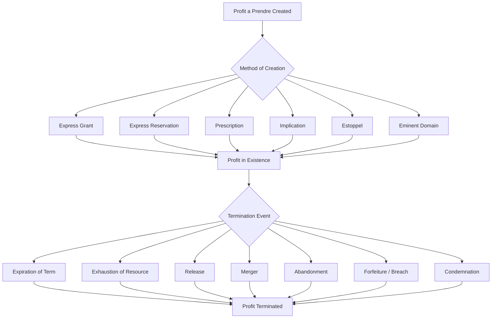

## Creation and Termination of Profits

### Overview

Profits à prendre are created and terminated through methods that substantially mirror easement doctrine, given their shared classification as nonpossessory interests in land, but with important variations reflecting the unique character of a profit as a right to sever and remove part of the land's substance. This section addresses the full lifecycle of a profit: the recognized methods of creation, the formalities each requires, and the grounds on which a profit may be extinguished.

### Methods of Creation

#### 1. Express Grant

The most common method of creating a profit, particularly for commercially significant interests such as mineral, timber, and oil and gas rights.

**Key Points**

- Must satisfy the Statute of Frauds — generally requires a signed writing identifying the parties, the land, and the resource or right conveyed
- Typically created by deed, using operative words of grant ("grants, bargains, and sells the right to extract...")
- May be structured as either **appurtenant** (attached to a dominant estate) or **in gross** (personal to the holder, unattached to any other land)
- Should specify whether the profit is **exclusive (several)** or **nonexclusive (common)**, duration, and any quantity limitations

**Example**

A deed conveying "the exclusive right to enter upon the Grantor's land and extract, remove, and sell all merchantable timber for a period of fifteen (15) years" creates an express profit in gross, several in nature, with a defined term.

#### 2. Express Reservation

A landowner conveying the fee may reserve a profit for themselves rather than granting it to a third party — most commonly seen in mineral deeds where the surface estate is sold but subsurface mineral rights are retained.

**Example**

"Grantor conveys the above-described land to Grantee, reserving unto Grantor, Grantor's heirs and assigns, all oil, gas, and other minerals in, on, and under the land, together with the right of ingress and egress necessary for exploration and extraction." This severs the mineral estate as a retained profit (or, in many jurisdictions, a retained fee interest in the minerals) distinct from the conveyed surface estate.

#### 3. Prescription

A profit may be acquired through prescriptive use, applying the same core elements as prescriptive easements:

- **Open and notorious** use of the taking right
- **Continuous** exercise for the statutory period (varies by jurisdiction, often the same period as adverse possession)
- **Adverse** (without the landowner's permission) — some jurisdictions require a claim of right
- **Actual** exercise of the specific taking right claimed

**Key Points**

- Courts have historically been more cautious in recognizing prescriptive profits than prescriptive easements, given the more invasive and destructive character of resource extraction
- Some jurisdictions impose heightened evidentiary standards (clear and convincing evidence) for prescriptive profits, reflecting judicial reluctance to divest landowners of subsurface or resource wealth through mere long-term use
- [Inference] Prescriptive acquisition of profits is comparatively rare in modern reported cases relative to prescriptive easements, likely because commercially significant extraction activity (mining, drilling) is difficult to conduct "quietly" or without the landowner's knowledge, undermining a claim of adversity, and because modern extraction typically proceeds under negotiated leases rather than informal long-term use

#### 4. Implication

Profits by implication are recognized in a narrower range of circumstances than implied easements:

- Some jurisdictions allow an implied profit where prior use existed before a unity of ownership was severed, mirroring the "easement implied from prior use" doctrine
- Generally requires apparent, continuous prior use and reasonable necessity for the profit-holder's enjoyment of a related interest
- Courts apply this doctrine more restrictively for profits than for easements, given the more significant economic consequence of implying a right to physically deplete another's land

#### 5. Estoppel

A profit may arise by estoppel where a landowner permits another to enter and extract resources, and that party reasonably relies on the permission by making substantial investments (e.g., constructing extraction equipment, access roads, processing facilities), such that it would be inequitable to allow the landowner to revoke the permission.

#### 6. Condemnation / Eminent Domain

In limited circumstances, a governmental or quasi-governmental entity may acquire a profit through eminent domain — for example, condemning gravel or timber extraction rights for a public infrastructure project — subject to just compensation requirements.

### Creation Comparison Table

| Method | Formalities Required | Common Modern Use |
| --- | --- | --- |
| Express grant | Statute of Frauds — signed writing | Mineral leases, timber contracts |
| Express reservation | Statute of Frauds — signed writing | Severed mineral estates |
| Prescription | Statutory period + adverse use elements | Rare in modern practice |
| Implication | Prior use + severance of unified title | Uncommon; jurisdiction-dependent |
| Estoppel | Reasonable reliance on permission | Fact-specific, limited application |
| Eminent domain | Public use + just compensation | Infrastructure/resource projects |

### Methods of Termination

#### 1. Expiration of Term

Profits created for a defined duration (e.g., "for ten years" or "until 50,000 tons of coal have been extracted") terminate automatically upon expiration of the stated period.

#### 2. Exhaustion of the Resource

A termination ground unique to profits among nonpossessory interests: where a profit is granted with respect to a finite, quantified resource, the profit terminates once that resource is fully extracted, even absent an express durational term.

**Example**

A profit granting "the right to extract all merchantable timber currently standing on the Property" terminates once all qualifying timber has been harvested, regardless of how much time that process takes — the grant is defined by the resource's exhaustion, not a calendar term.

#### 3. Release

The profit holder may voluntarily release the interest back to the servient landowner. Because a profit is an interest in real property, a release generally must satisfy the Statute of Frauds (a signed writing).

#### 4. Merger

Where the profit holder acquires fee title to the servient estate (or vice versa — the servient owner acquires the profit), the profit merges into the unified fee and is extinguished, applying the same merger logic as easements.

#### 5. Abandonment

Termination by abandonment requires:

- Nonuse of the profit for a significant period, and
- Affirmative evidence of intent to abandon (mere nonuse alone is typically insufficient)

**Key Points**

- Courts often require more than simple nonuse — some overt act or declaration inconsistent with continued claim to the right
- For profits tied to cyclical or intermittent resources (seasonal hunting/fishing rights, periodic timber harvesting), extended nonuse consistent with the resource's natural cycle is less likely to support an abandonment finding
- [Inference] Because commercial extraction rights (mineral, oil, and gas) often carry significant economic value even during periods of nonuse (e.g., awaiting favorable commodity prices), courts are frequently reluctant to find abandonment absent strong evidence of intent, particularly for profits in gross tied to valuable subsurface estates

#### 6. Forfeiture

Some profits, particularly those created by lease-like instruments (oil and gas leases, timber contracts), contain express forfeiture clauses triggering termination upon breach of specified conditions (e.g., failure to commence drilling operations, failure to pay royalties, failure to comply with environmental or safety conditions).

#### 7. Condemnation of the Servient Estate

Where the servient estate itself is condemned for public use in a manner inconsistent with continued exercise of the profit, the profit may be extinguished, with the profit holder typically entitled to compensation for the value of the extinguished interest.

#### 8. Destruction of the Servient Land's Capacity to Yield the Resource

Where the physical land or resource base underlying the profit is destroyed (e.g., by natural disaster rendering the land incapable of producing the granted resource), the profit may terminate by operation of the underlying impossibility, though this ground is fact-specific and less commonly litigated.

### Termination Comparison Table

| Termination Ground | Requires Intent? | Common Context |
| --- | --- | --- |
| Expiration of term | No | Fixed-duration grants |
| Exhaustion of resource | No | Quantified extraction rights |
| Release | Yes (voluntary) | Negotiated buyouts |
| Merger | No | Unity of title acquisition |
| Abandonment | Yes | Long-term nonuse with intent |
| Forfeiture | No (breach-triggered) | Lease-based profits |
| Condemnation | No | Public infrastructure projects |

### Lifecycle Diagram

### Recording and Priority Considerations

- Express profits should be promptly recorded in the land records to establish priority against subsequent purchasers and encumbrancers under applicable recording acts
- Unrecorded profits may be vulnerable to defeat by a bona fide purchaser of the servient estate without notice, depending on the jurisdiction's recording statute (race, notice, or race-notice)
- Termination events (release, expiration, forfeiture) should similarly be documented and recorded to clear title and avoid future disputes with successors in interest

### Drafting Considerations for Practitioners

- **At creation**: specify duration or quantity limits precisely, address exclusivity (several vs. common), define permitted access and surface use rights, and address assignability
- **For termination planning**: include express forfeiture or default provisions in lease-like profits, and consider requiring written notice and cure periods before termination for breach
- **For long-term commercial profits**: consider including automatic extension clauses tied to continued production or operations (common in oil and gas "habendum clauses," which extend the primary term "for so long thereafter as oil or gas is produced")

### Related Topics

- Definition and Distinction from Easements
- Common and Several Profits
- Profits Appurtenant vs. Profits in Gross
- Prescriptive Easements: Elements and Burden of Proof
- Severed Mineral Estates and the Dominant Estate Doctrine
- Oil and Gas Leases: Habendum Clauses and Held-by-Production Terms
- Abandonment of Nonpossessory Interests
- Recording Acts and Priority of Unrecorded Interests