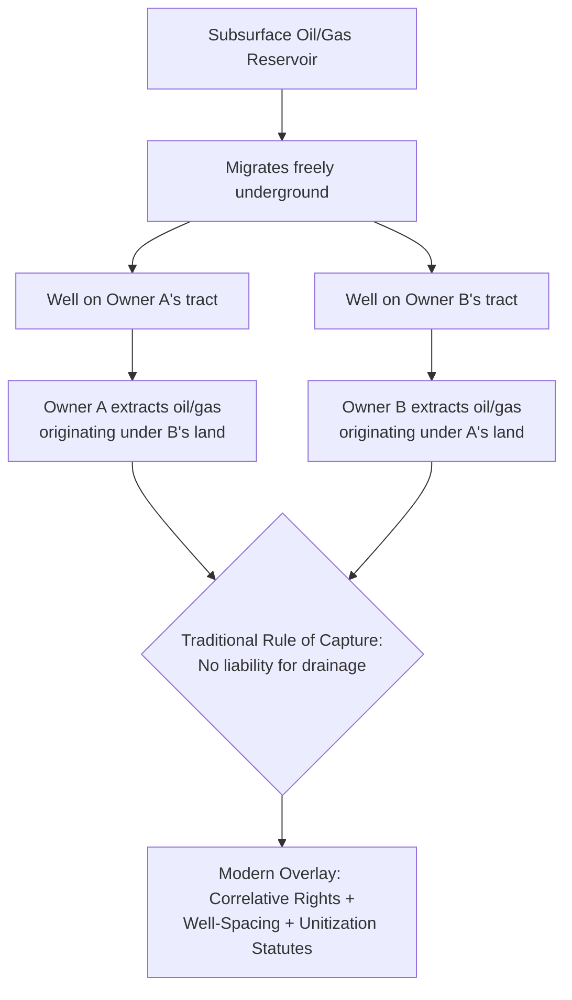

## Profits in Natural Resource Extraction

### Overview

Natural resource extraction represents the most economically significant modern application of profit à prendre doctrine. While the historical common law developed the profit concept largely around agrarian rights (pasture, turbary, estovers), contemporary practice centers on mineral, oil and gas, timber, water, and aggregate (sand/gravel) extraction — industries governed by a dense overlay of common law profit doctrine, specialized property doctrines (the severed mineral estate, the rule of capture), and extensive state and federal regulatory regimes.

### Categories of Extraction Profits

#### 1. Mineral Rights (Hard Minerals)

The right to extract solid minerals — coal, metallic ores, industrial minerals — from beneath the surface.

**Key Points**

- Typically created by mineral deed, severing the mineral estate from the surface estate
- The severed mineral estate is traditionally treated as the **dominant estate**, carrying an implied right to use the surface as reasonably necessary for extraction, subject to accommodation doctrines in many jurisdictions requiring the mineral owner to avoid unnecessary surface damage where alternative extraction methods exist
- May be held as a fee simple interest in the minerals themselves (in jurisdictions applying the "ownership-in-place" theory) or as a profit à prendre / right to extract (in jurisdictions applying the "nonownership" theory), a distinction with significant consequences for abandonment and adverse possession analysis

#### 2. Oil and Gas Rights

Governed by a specialized body of law distinct from hard mineral rights, owing to the migratory nature of oil and gas within a subsurface reservoir.

**Key Points**

- The **rule of capture** historically permitted a surface owner (or lessee) to extract oil and gas migrating from beneath a neighbor's land, without liability, so long as extraction occurred from a well located on the extractor's own property — a doctrine with obvious tension to ordinary profit/trespass principles
- Modern state regulation substantially modifies pure capture-rule outcomes through **correlative rights doctrine**, well-spacing requirements, and **unitization** statutes requiring or incentivizing joint development of a shared reservoir
- Oil and gas leases function as profits à prendre, typically structured with a **primary term** (fixed years) and a **habendum clause** extending the interest "for so long thereafter as oil or gas is produced in paying quantities" — a mechanism unique to extraction profits, effectively making the term perpetual contingent on continued production
- **Royalty interests** (a share of production revenue, without the right to conduct operations) are distinguished from **working interests** (the operational right to explore and produce, bearing costs), both derived from the underlying profit

**Example**

A landowner executes an oil and gas lease granting a company "the exclusive right to explore, drill, and produce oil and gas" for a three-year primary term, "and as long thereafter as oil or gas is produced in paying quantities." This creates a several, exclusive profit with a habendum-clause duration mechanism — the lease survives past the three-year term only if production continues.

#### 3. Timber Rights

The right to cut and remove standing timber, distinguished in most jurisdictions from an outright sale of timber as personalty.

**Key Points**

- A conveyance of standing timber is generally treated as a sale of an interest in real property (since timber is part of the land until severed), requiring Statute of Frauds compliance, while cut/severed timber is personalty
- "Cutting contracts" granting the right to enter and harvest timber over a defined period function as profits à prendre
- Many states impose statutory time limits on timber-cutting rights absent express contrary agreement, and some apply a "reasonable time" doctrine to cut and remove timber if the deed is silent on duration
- Termination by exhaustion is especially prominent here — a right to "all merchantable timber currently standing" terminates once that specific timber is harvested, even if additional timber grows on the tract afterward

#### 4. Aggregate Extraction (Sand, Gravel, Stone, Clay)

Common in construction-adjacent industries, typically structured as either a several profit (exclusive extraction rights) with tonnage or acreage limits, or a royalty-based extraction lease.

**Key Points**

- Often includes reclamation obligations, either by contract or increasingly by state surface-mining and reclamation statutes
- Duration frequently tied to exhaustion of a defined deposit or a fixed lease term with renewal options

#### 5. Water as an Extraction Resource

Water rights occupy a doctrinally distinct space from classical profit à prendre analysis, governed instead by riparian rights, prior appropriation, or hybrid regulatory systems depending on the jurisdiction, though the underlying conceptual problem (a right to remove/take a resource from land, shared among multiple users) parallels the common-profit apportionment concerns discussed in that context.

### Comparative Table of Extraction Profit Types

| Resource Type | Governing Doctrine | Typical Duration Mechanism | Key Regulatory Overlay |
| --- | --- | --- | --- |
| Hard minerals (coal, ore) | Severed mineral estate / dominant estate rule | Fixed term or exhaustion | State mining & reclamation law |
| Oil and gas | Rule of capture + correlative rights | Habendum clause (primary term + production) | State oil & gas commissions; unitization statutes |
| Timber | Real property interest until severance | Fixed term, exhaustion, or "reasonable time" | State timber harvest statutes |
| Aggregate (sand/gravel) | Several profit, often royalty-based | Fixed term or deposit exhaustion | Surface mining reclamation acts |
| Water | Riparian / prior appropriation (distinct doctrine) | Continuous use / permit-based | State water codes; federal Clean Water Act overlay |

### The Accommodation Doctrine

Where a severed mineral (or other extraction) estate is dominant over the surface estate, courts in many jurisdictions apply an **accommodation doctrine** (sometimes called the "due regard" or "reasonable use" standard) requiring the extraction-rights holder to:

- Use only so much of the surface as is reasonably necessary for extraction
- Where alternative, reasonable extraction methods exist that would avoid or reduce surface damage, and the surface owner's existing use would otherwise be precluded, adopt the less damaging method if reasonably available

**Example**

Where a surface owner operates an active irrigation system, and the mineral owner's proposed drilling location would destroy that system while an alternative drilling site on the same tract would not, the accommodation doctrine may require the mineral owner to use the alternative site if it is reasonably available and does not materially impair extraction — balancing the dominant estate's extraction rights against the servient surface owner's existing use.

### Rule of Capture — Diagram

### Environmental and Regulatory Overlay

Modern extraction profits operate within a substantial regulatory framework layered atop the common law property interest:

- **Federal**: Clean Water Act, Clean Air Act, Surface Mining Control and Reclamation Act (SMCRA), National Environmental Policy Act (NEPA) review for federal lands/leases
- **State**: Oil and gas conservation commissions (well permitting, spacing, unitization), state mining and reclamation statutes, state environmental review requirements
- **Local**: Zoning and land use restrictions on extraction activities, setback requirements

[Inference] Because environmental and regulatory law in this area is subject to frequent legislative and administrative change, practitioners should verify current statutory and regulatory requirements in the specific jurisdiction and resource sector before advising on extraction rights, as the underlying property-law profit doctrine may be substantially constrained or conditioned by regulatory compliance obligations that vary over time.

### Interaction with Surface Owner Rights

| Issue | Typical Rule |
| --- | --- |
| Priority of mineral vs. surface estate | Mineral/extraction estate generally dominant |
| Surface damage | Accommodation doctrine may limit unnecessary damage; some states require statutory surface damage compensation |
| Support rights | Extraction may not be conducted so as to remove necessary subjacent support for the surface, absent express waiver |
| Reclamation | Increasingly mandated by statute regardless of contractual silence |

### Drafting Considerations for Extraction Profits

- Define the resource precisely (species of mineral, timber grade/diameter thresholds, aggregate type)
- Address **surface use rights** explicitly, including access roads, staging areas, and equipment storage
- Include **duration mechanisms** appropriate to the resource — habendum clauses for oil/gas, exhaustion or fixed-term provisions for timber and aggregate
- Address **royalty vs. working interest** structures and payment/accounting obligations
- Include **reclamation and restoration obligations**, aligned with applicable state statutory minimums
- Address **assignability and apportionment** consistent with several/common profit classification

### Related Topics

- Definition and Distinction from Easements
- Common and Several Profits
- Creation and Termination of Profits
- Severed Mineral Estates and the Dominant Estate Doctrine
- The Rule of Capture and Correlative Rights Doctrine
- Habendum Clauses and Held-by-Production Lease Terms
- The Accommodation Doctrine in Surface/Mineral Estate Conflicts
- State Oil and Gas Unitization Statutes
- Surface Mining Control and Reclamation Act (SMCRA) Compliance
- Royalty Interests vs. Working Interests