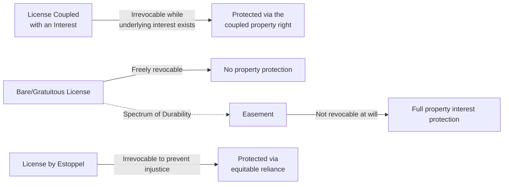

## Definition and Characteristics of a License

### Overview

A license is the most limited and precarious form of land use right in property law — a personal, revocable permission to enter or use another's land for a specific purpose, which creates no estate or interest in the land itself. Licenses sit at the doctrinal opposite end of a spectrum from easements: where an easement is a durable, transferable, nonpossessory *property interest*, a license is merely a *personal privilege* that the licensor retains the power to revoke at will, subject to narrow equitable exceptions.

### Core Definition

A license is:

- Permission, given by the possessor of land (the licensor), to another (the licensee)
- To do some act on the licensor's land
- That would otherwise constitute a trespass
- Without conferring any estate, interest, or possessory right in the land

**Key Points**

- A license is a defense to trespass, not a property right — its legal character is closer to contract or tort doctrine than to real property doctrine
- Because it creates no interest in land, a license generally need not satisfy the Statute of Frauds, and may be created orally or even by conduct/implication
- The defining and most consequential characteristic of a license is **revocability at the will of the licensor**

### Distinguishing Licenses from Easements

| Feature | License | Easement |
| --- | --- | --- |
| Nature of right | Personal permission | Interest in land |
| Revocability | Revocable at will (with narrow exceptions) | Not revocable absent termination doctrine |
| Statute of Frauds | Generally not required | Generally required (except prescriptive/implied) |
| Assignability | Generally not assignable | Generally assignable (appurtenant) |
| Survives transfer of land | No — terminates on transfer of either estate | Yes — runs with the land |
| Duration | Typically at-will or for a stated personal purpose | May be perpetual or term-defined |

**Example**

A homeowner tells a neighbor, "Feel free to cut through my backyard to get to the lake." This is a license — informal, revocable at any time, and personal to the neighbor. If instead the homeowner executed and recorded a deed granting "a permanent right-of-way across the rear twenty feet of the property for pedestrian access to the lake," this would be an easement — a durable property interest that runs with the land regardless of who later owns either parcel.

### Categories of Licenses

#### 1. Bare (Gratuitous) License

Granted without consideration, purely as a matter of permission or goodwill.

- Freely revocable at any time, for any reason, by the licensor
- No cause of action typically lies for revocation, even if inconvenient to the licensee
- Example: inviting a guest into one's home, or permitting a neighbor informal, occasional passage

#### 2. License Coupled with an Interest

Arises where the license is granted in connection with, and as necessary to exercise, some other property interest the licensee holds in personal property located on the licensor's land.

**Key Points**

- Because the license is "coupled" with an independently valid interest, it becomes **irrevocable** for so long as that underlying interest exists
- Classic example: A buys standing timber from B, with the right to enter B's land to cut and remove it. The license to enter is coupled with A's property interest in the timber (a profit à prendre) and cannot be unilaterally revoked by B
- Similarly, if a landowner sells goods stored on the land and grants the buyer a right to enter and retrieve them, the license to enter is coupled with the buyer's ownership interest in the goods

#### 3. License by Estoppel (Irrevocable License)

The most doctrinally significant exception to at-will revocability. A license becomes irrevocable, in whole or substantial part, where:

- The licensor grants permission to use the land
- The licensee, in reasonable reliance on that permission, makes substantial expenditures or improvements
- The licensor knew or should have known of the reliance
- Revocation would work a substantial injustice on the licensee

**Example**

A landowner orally permits a neighbor to build and maintain a driveway crossing a corner of the landowner's lot. The neighbor, relying on the permission, spends significant money paving and grading the driveway. Under license-by-estoppel doctrine, many courts will hold the license irrevocable for so long as necessary to prevent injustice — effectively giving the licensee protection functionally similar to an easement, despite the absence of a writing satisfying the Statute of Frauds.

- [Inference] Courts vary considerably in the doctrinal label and precise remedy applied in these circumstances — some jurisdictions describe the result as an "irrevocable license," others effectively treat the outcome as creating an easement by estoppel, and the duration of the resulting right (permanent vs. limited to recoupment of the investment) is not uniformly resolved across jurisdictions
- This doctrine functions as a real-property analog to promissory estoppel, borrowing the core reliance-and-injustice elements from contract doctrine

### Termination of Licenses

| Termination Event | Effect |
| --- | --- |
| Revocation by licensor | Terminates bare license immediately (subject to estoppel exception) |
| Death of licensor or licensee | Generally terminates a personal license |
| Transfer of the licensor's land | Terminates the license (new owner not bound) |
| Transfer of the licensee's interest | Generally terminates, since licenses are not assignable absent express provision |
| Completion of the licensed purpose | Terminates automatically once the purpose is accomplished |
| Abandonment by licensee | Terminates the license |

### Visual: License Revocability Spectrum

### Common Law Rule and Its Rationale

The traditional common law rule that licenses are freely revocable, even where revocation is unfair to the licensee, rests on several policy justifications:

- Preserving the Statute of Frauds' purpose by preventing informal oral arrangements from ripening into durable property interests without the formalities the law requires for land transfers
- Protecting a landowner's ability to control and reclaim use of their own land without being bound by informal, undocumented permissions
- Avoiding the practical uncertainty that would result if courts had to determine, for every informal permission, whether it was intended to be perpetual

The estoppel exception exists in tension with these policies, reflecting courts' recognition that rigid application of the revocability rule can produce inequitable results where a licensee has been induced to invest substantially in reliance on the licensor's permission.

### Practical Examples Across Contexts

**Example**

- A ticket to a sporting event or concert is a license to enter and remain on the venue's land for the duration of the event — revocable (subject to contractual and consumer protection constraints), and automatically terminating when the event ends or the ticketholder is ejected for cause
- A parking permit granting the right to park in a specific lot is a license, not a leasehold, because it typically grants no exclusive possessory right to a specific space and remains revocable per the terms of the permit
- A utility meter reader's routine access to a customer's property is typically structured as a license (often established by contract or tariff) rather than an easement, notwithstanding its recurring nature

### Practical Drafting and Practice Considerations

- Parties intending to create a durable, transferable property right should use easement language and formalities, not license terminology, to avoid the risk that a court construes the arrangement as a revocable license
- Landowners granting informal permissions who wish to preserve revocability should avoid conduct that could support a reliance-based estoppel claim — particularly, avoid silently permitting the licensee to make substantial improvements without addressing the arrangement's terms
- Practitioners representing a licensee who has made substantial improvements in reliance on oral permission should evaluate the license-by-estoppel doctrine as a potential basis for protecting the client's investment, and gather contemporaneous evidence of the licensor's knowledge and encouragement of the improvements

### Related Topics

- License Coupled with an Interest
- License by Estoppel and Irrevocable Licenses
- Easements by Estoppel — Comparison and Overlap
- Statute of Frauds and Its Application to Land Use Rights
- Revocation and Termination of Licenses
- Leases vs. Licenses: The Possessory Distinction
- Profits à Prendre — Interests Underlying Coupled Licenses