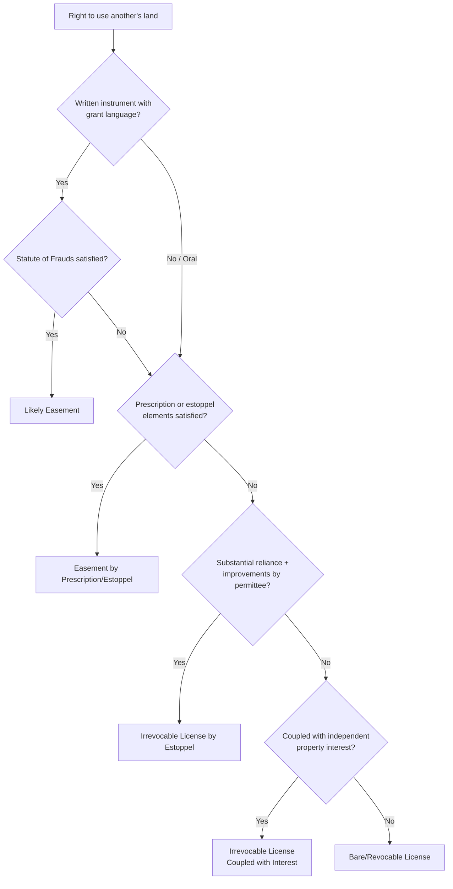

## License Distinguished from Easement

### Overview

The distinction between a license and an easement is one of the most frequently litigated classification questions in land use law, because the two doctrines can arise from strikingly similar facts — informal permission to cross, use, or occupy another's land — yet produce dramatically different legal consequences. Correctly classifying an arrangement determines whether the right survives transfer of the land, whether it can be revoked, whether it must satisfy the Statute of Frauds, and what remedies are available if the arrangement is later disputed. This topic examines the doctrinal tests, factors, and consequences courts apply in drawing this line.

### The Fundamental Conceptual Divide

| Dimension | License | Easement |
| --- | --- | --- |
| Legal character | Personal permission (defense to trespass) | Nonpossessory interest in real property |
| Revocability | Revocable at will (subject to estoppel exception) | Not revocable absent recognized termination doctrine |
| Statute of Frauds | Generally not required | Generally required, except by prescription/implication |
| Runs with the land | No | Yes (if appurtenant) |
| Transferability | Generally not assignable | Generally assignable |
| Survives transfer of servient land | No — new owner takes free of it | Yes — binds successors with notice |
| Duration | Typically indefinite/at-will, terminable | May be perpetual or term-limited by grant |
| Remedies for interference | Contract/estoppel-based, limited | Injunction, damages, real property remedies |

### Why the Same Facts Can Support Either Classification

The practical difficulty is that a landowner's oral statement — "go ahead and use my driveway" — is, standing alone, textually indistinguishable between an intended permanent grant and a casual, revocable permission. Courts therefore look past the label used by the parties (which is not controlling) to substantive factors indicating the parties' actual intent and the formalities employed.

### Key Factors Courts Examine

#### 1. Formality and Writing

- A written instrument using grant language ("grants, conveys, and warrants an easement...") strongly signals an easement
- Oral or informal arrangements presumptively create a license, since easements generally require Statute of Frauds compliance
- **Key Points**: The mere absence of a writing does not automatically mean a license was intended — an oral arrangement that otherwise satisfies the elements of a prescriptive or estoppel-based easement can still ripen into a property interest despite lacking a writing, illustrating that the writing requirement is evidentiary of intent rather than strictly dispositive of outcome

#### 2. Intended Duration

- Language suggesting **permanence** ("forever," "in perpetuity," "and its successors and assigns") favors an easement
- Language suggesting **personal or temporary** use ("as long as you're living here," "while you own the property," "for your personal convenience") favors a license
- A right granted "to A" without more (no reference to A's heirs, successors, or assigns) is more consistent with a personal license or, at most, an easement in gross rather than one appurtenant and inheritable

#### 3. Consideration Paid

- Payment of consideration specifically for the right to use land is more consistent with an intended durable property interest (easement), since parties rarely pay substantial sums for something freely revocable at the grantor's whim
- A gratuitous, unpaid permission is more consistent with a bare license

#### 4. Exclusivity and Specificity of the Right

- A right described with the specificity typical of a property interest — fixed location, defined width, described by metes and bounds — suggests an easement
- A general, informal, non-specific permission suggests a license

#### 5. Reliance and Improvements

- Where the permittee has made substantial, visible improvements in reliance on the permission (paving a road, installing utility lines, constructing a structure), courts are more likely to find either that an easement was intended, or that a license has become irrevocable under the license-by-estoppel doctrine — reaching a functionally similar protective outcome through a different doctrinal path

#### 6. Whether the Right Is Coupled with an Independent Interest

- If the right to enter land is incidental to and necessary for exercising some other independently valid interest (e.g., ownership of a chattel located on the land, or a profit à prendre), this supports treating the access right as either an irrevocable license coupled with an interest, or as ancillary to the easement/profit itself

### Decision Framework

### The "Terminable at Will" Consequence

The single most significant practical consequence of the license classification is that, absent an estoppel or coupled-interest exception, the arrangement may be terminated by the landowner **at any time, for any reason**, without liability — a stark contrast to an easement, which can only be terminated through recognized doctrines (merger, abandonment, release, prescription, condemnation, etc.).

**Example**

A landowner allows a neighboring business to use a strip of the landowner's parking lot for overflow customer parking, with no writing and no payment. After several years, the landowner sells the property, and the new owner immediately blocks off the strip. Because this arrangement bears the hallmarks of a bare license (informal, gratuitous, no defined boundaries, no reliance-based improvements by the business), the new owner is generally not bound by it, and the business has no property-based remedy — illustrating the sharp consequence of the classification.

**Contrasting Example**

The same landowner instead executes a recorded instrument granting "an easement for parking, appurtenant to the adjoining commercial parcel, running with the land." Even after the underlying land is sold multiple times, successors take subject to the recorded easement (assuming proper notice under the jurisdiction's recording act), and the parking right survives regardless of who currently owns either parcel.

### Case Pattern Illustrating the Line-Drawing Problem

Courts frequently confront cases where a landowner permits a neighbor to construct a driveway, fence, or similar improvement crossing a boundary, without a formal writing. The outcome typically turns on:

- Whether the permission was accompanied by conduct suggesting permanence (e.g., the landowner helped pay for or plan the improvement)
- The value and permanence of the improvement itself
- Whether the landowner acquiesced in the improvement for a substantial period without objection
- Local jurisdictional treatment — some states are notably more protective of licensees who have relied to their detriment, effectively converting many "license" fact patterns into de facto easements by estoppel

[Inference] Because this line-drawing exercise is highly fact-intensive and jurisdiction-dependent, outcomes in closely analogous fact patterns can differ across states, and practitioners should research the specific jurisdiction's treatment of license-by-estoppel and easement-by-estoppel doctrines rather than assuming a uniform national rule.

### Practical Guidance for Drafters

To avoid unintended classification disputes:

- **If a durable, transferable right is intended**: use explicit easement language, satisfy the Statute of Frauds with a signed writing, describe the burdened area with precision, and record the instrument
- **If only temporary, revocable permission is intended**: consider documenting this intent as well, to avoid a later estoppel claim — a simple written license agreement stating the permission is temporary and revocable at will can help forestall a licensee's later argument that permanence was intended
- **If reliance-based improvements are anticipated**: parties on both sides should recognize that substantial improvements made with the landowner's knowledge and acquiescence create real litigation risk of an estoppel-based conversion into an irrevocable right, regardless of the parties' original informal intent

### Related Topics

- Definition and Characteristics of a License
- License Coupled with an Interest
- License by Estoppel and Irrevocable Licenses
- Easements by Estoppel
- Statute of Frauds and Its Application to Land Use Rights
- Prescriptive Easements: Elements and Burden of Proof
- Recording Acts and Notice to Subsequent Purchasers
- Leases vs. Licenses: The Possessory Distinction