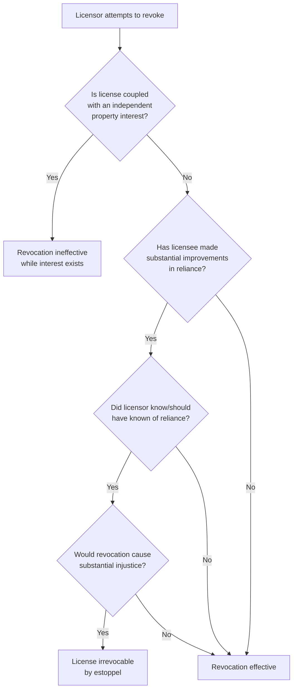

## Revocability of Licenses

### Overview

Revocability is the defining legal characteristic of a license and the primary axis distinguishing it from an easement. The general common law rule holds that a license may be revoked at the will of the licensor at any time, for any reason, without liability — but this rule is subject to significant, well-developed exceptions that can render a license irrevocable in whole or in part. Understanding the scope, mechanics, and limits of revocability is central to advising both licensors seeking to preserve control and licensees seeking to protect investments made in reliance on granted permissions.

### The General Rule: Revocation at Will

**Key Points**

- A bare, gratuitous license is revocable by the licensor at any time, without notice period, cause, or compensation, absent an applicable exception
- Revocation may be accomplished by express statement, by conduct inconsistent with continued permission (e.g., erecting a barrier), or by operation of law (death, transfer of title)
- Upon revocation, the licensee's continued presence or use becomes a trespass, and the licensor may pursue ejectment or trespass remedies
- The rule applies regardless of whether the license was for the licensee's convenience or benefit, or even where revocation is objectively unfair — the harshness of this rule is precisely what gave rise to the equitable exceptions discussed below

### Mechanisms of Revocation

| Mechanism | Description |
| --- | --- |
| Express revocation | Licensor directly communicates termination of permission |
| Revocation by conduct | Licensor erects fence, barrier, or otherwise physically forecloses continued use |
| Revocation by transfer | Licensor conveys the servient land; new owner is not bound and may exclude the licensee |
| Revocation by death | Death of either party generally terminates a personal license |
| Revocation by operation of law | E.g., loss of the licensor's own title through foreclosure or tax sale |

### Exceptions to At-Will Revocability

#### 1. License Coupled with an Interest

Where the license is granted incident to, and necessary for the exercise of, an independently valid property interest held by the licensee (most commonly ownership of personal property situated on the licensor's land, or a profit à prendre), the license becomes **irrevocable for the duration of the underlying interest**.

**Example**

A buys a stack of harvested logs located on B's land, together with the right to enter and haul them away. B cannot revoke A's right to enter, because the entry right is coupled with A's ownership of the logs themselves — revoking the license would effectively destroy A's already-vested property interest in the logs.

#### 2. License by Estoppel

The most significant and frequently litigated exception. A license becomes irrevocable, in whole or in substantial part, where:

- The licensor granted permission to use the land
- The licensee reasonably relied on that permission
- In reliance, the licensee made **substantial expenditures or improvements**
- The licensor knew, or reasonably should have known, of the licensee's reliance
- Allowing revocation would work a **substantial injustice** on the licensee

**Key Points**

- This doctrine is grounded in equitable estoppel principles borrowed from contract law, adapted to the property context
- [Inference] Courts differ on the scope and duration of the resulting protection: some hold the license irrevocable permanently (functionally equivalent to an easement), while others hold it irrevocable only for so long as necessary for the licensee to recoup or enjoy the value of the reliance-based investment — practitioners should verify the specific remedy applied in the relevant jurisdiction
- Some jurisdictions describe the resulting right as an "easement by estoppel" rather than an "irrevocable license," reflecting doctrinal overlap between the two theories

**Example**

A rural landowner orally permits a neighbor to run a water pipeline across the landowner's property to serve the neighbor's home. The neighbor spends substantial money trenching, laying pipe, and connecting the system, all with the landowner's knowledge and encouragement. Years later, a dispute arises and the landowner attempts to revoke the permission and demand removal of the pipeline. Under license-by-estoppel doctrine, a court is likely to hold the license irrevocable, at least to the extent necessary to prevent the substantial injustice of forcing removal of a costly, reasonably-relied-upon improvement.

#### 3. License Supported by Consideration (Minority/Contractual View)

Some jurisdictions and commentators hold that a license granted for valuable consideration, even absent reliance-based improvements, should be treated as a binding contract right, revocable only in accordance with its terms (e.g., breach, expiration), rather than freely at will — analyzing the dispute under contract remedies (damages for breach) rather than pure property-license doctrine.

**Key Points**

- [Inference] This approach is not universally adopted; many jurisdictions maintain the traditional rule that even a paid license remains technically revocable as to the underlying land-use permission itself, though revocation may still expose the licensor to a breach-of-contract damages claim for consideration already paid or the licensee's provable losses
- This distinction matters practically: even where "irrevocability" of a paid license is rejected as a property-law matter, the licensee may still have a contract remedy (damages) even if injunctive/specific real-property relief is unavailable

### Revocability Comparison Table

| License Type | Revocable at Will? | Available Protection if Revoked |
| --- | --- | --- |
| Bare/gratuitous license | Yes | None (trespass results upon continued use) |
| License coupled with an interest | No, while interest persists | Injunction / damages tied to underlying interest |
| License by estoppel | No, to extent of injustice prevention | Injunction preventing revocation, or damages |
| Paid/contractual license (minority view) | Contested | Possible contract damages even if not specific relief |

### Visual: Revocation Analysis Flow

### Remedies Upon Wrongful Continued Use After Valid Revocation

Where revocation is validly exercised (no exception applies), the licensor's remedies against a licensee who continues to use the land include:

- **Ejectment/trespass action** — to remove the licensee and recover possession
- **Damages** — for any harm caused by continued unauthorized use
- **Self-help removal** — permitted in many jurisdictions if it can be accomplished without breach of the peace, though this carries practical and legal risk and is generally disfavored as a primary strategy

### Remedies for Wrongful Revocation (Where an Exception Applies)

Where a court finds an exception applies and revocation was therefore wrongful or ineffective:

- **Injunctive relief** — barring the licensor from interfering with continued use
- **Declaratory judgment** — confirming the license's irrevocable status
- **Damages** — compensating the licensee for losses caused by attempted revocation or interference, where injunctive relief is inadequate or unavailable

### Interaction with Transfer of the Servient Estate

A critical revocability-adjacent rule: even a license that has become irrevocable as against the original licensor's attempted revocation may still be extinguished by a **bona fide purchaser** of the servient land who takes without notice of the license or the licensee's reliance-based investment, depending on the jurisdiction's recording act and the visibility of the licensee's improvements on the land. Visible, obvious improvements (a paved driveway, a structure) are more likely to constitute inquiry notice sufficient to bind a subsequent purchaser, even absent a recorded instrument.

**Key Points**

- This underscores a practical asymmetry: because licenses generally are not recorded (having no Statute of Frauds requirement), a licensee's protection against a *subsequent purchaser* often depends heavily on whether the improvements are open and visible enough to trigger inquiry notice, rather than on record notice
- [Inference] This creates meaningful jurisdiction-specific risk for licensees relying on estoppel protection, since the practical strength of that protection against a future purchaser is less predictable than the strength of a properly recorded easement

### Practical Guidance

**For licensors:**

- To preserve clean revocability, avoid silently permitting substantial improvements by a licensee, and consider documenting explicitly that any permission is temporary, gratuitous, and revocable at will
- If allowing improvements, consider requiring a written acknowledgment from the licensee confirming the arrangement's revocable nature to forestall a later estoppel claim

**For licensees:**

- Before making substantial investments in reliance on an oral or informal permission, consider seeking a written easement instead, to obtain durable, recordable protection
- If reliance-based investment has already occurred and revocation is threatened, gather contemporaneous evidence of the licensor's knowledge, encouragement, or acquiescence in the improvements to support an estoppel claim

### Related Topics

- Definition and Characteristics of a License
- License Coupled with an Interest
- License Distinguished from Easement
- Easements by Estoppel
- Recording Acts and Bona Fide Purchaser Doctrine
- Inquiry Notice from Visible Land Improvements
- Remedies for Trespass and Wrongful Interference with Land Use Rights