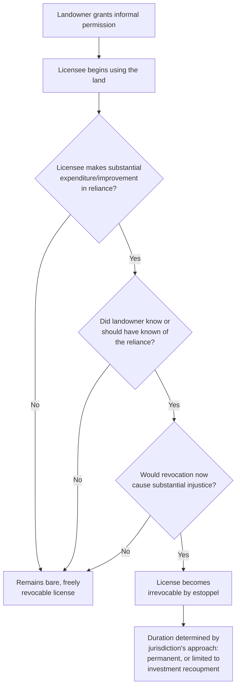

## Irrevocable Licenses and Estoppel

### Overview

Irrevocable licenses and the doctrine of license by estoppel represent the principal equitable exception to the common law rule that licenses are freely revocable at will. This doctrine addresses the tension between the property-law formalism of the Statute of Frauds (which nominally bars informal oral arrangements from creating durable rights in land) and the equitable imperative to prevent injustice where a licensee has reasonably and substantially relied on a landowner's permission. This topic examines the doctrine's elements, theoretical basis, scope of protection, and relationship to the closely allied doctrine of easement by estoppel.

### Theoretical Foundation

The doctrine of irrevocable license by estoppel developed as a judicial response to the harshness of strict application of the at-will revocability rule. Courts recognized that permitting a landowner to revoke permission after a licensee has made substantial, visible, and costly improvements in good-faith reliance would produce a result offensive to basic principles of fairness — effectively allowing the landowner to induce investment and then appropriate its benefit (or force its loss) by later withdrawing consent.

**Key Points**

- The doctrine borrows its core structure from equitable estoppel and promissory estoppel principles developed in contract law, transplanted into the real property context
- It operates as a judicially created exception to the Statute of Frauds, permitting an oral or informal arrangement to achieve durability functionally similar to a written easement, despite the absence of the formalities ordinarily required for interests in land
- The doctrine reflects a broader pattern in property law (shared with part performance doctrine and easements by estoppel) of using equitable principles to prevent the Statute of Frauds from becoming an instrument of injustice rather than its intended shield against fraud

### Elements of License by Estoppel

Courts generally require proof of the following elements, though formulations vary somewhat by jurisdiction:

1. **Permission granted** — the licensor gave express or implied permission to use the land for a specific purpose
2. **Reasonable reliance** — the licensee reasonably relied on that permission
3. **Substantial expenditure or improvement** — the licensee, in reliance, made a significant investment (constructing improvements, incurring costs) that would be lost or substantially diminished in value if the license were revoked
4. **Licensor's knowledge** — the licensor knew, or reasonably should have known, of the licensee's reliance and expenditures, and did not object
5. **Injustice from revocation** — permitting revocation at this point would work a substantial injustice on the licensee

**Example**

A landowner tells an adjoining neighbor they may build and use a shared driveway crossing a corner of the landowner's lot. The neighbor, relying on this permission, spends a significant sum grading, paving, and installing drainage for the driveway, all while the landowner watches the work proceed without objection. Several years later, following a falling-out, the landowner attempts to revoke permission and demands the neighbor stop using the driveway. Applying the estoppel elements: permission was granted, the neighbor reasonably relied, substantial expenditure occurred, the landowner had full knowledge of the ongoing construction, and revocation at this stage — after the investment is sunk — would work a clear injustice. A court is likely to hold the license irrevocable.

### Scope and Duration of Protection

[Inference] Because this is an equitable doctrine developed through case law rather than a uniform statutory rule, jurisdictions differ meaningfully on the scope of protection once the estoppel elements are established:

| Approach | Description |
| --- | --- |
| Permanent irrevocability | Some courts treat the license as irrevocable indefinitely, functionally equivalent to an easement, for so long as the purpose for which it was granted continues |
| Duration tied to investment recoupment | Other courts limit irrevocability to the period reasonably necessary for the licensee to realize the value of, or recoup, the reliance-based investment |
| Conversion to easement by estoppel | Some jurisdictions do not distinguish sharply between "irrevocable license" and "easement by estoppel," treating the doctrines as producing the same substantive outcome under different labels |

Given this variation, practitioners should research the specific jurisdiction's formulation rather than assuming any particular duration or remedy applies uniformly.

### Distinguishing Irrevocable License from Easement by Estoppel

The two doctrines are closely related and, in many jurisdictions, largely overlapping — both arise from reliance on informal permission, both bypass the Statute of Frauds through equitable reasoning, and both are triggered by substantial improvement-based reliance. Where jurisdictions do distinguish them:

| Feature | Irrevocable License (Estoppel) | Easement by Estoppel |
| --- | --- | --- |
| Doctrinal label | Personal right rendered irrevocable | Genuine easement-equivalent interest created |
| Runs with the land | Sometimes limited to original parties | More consistently treated as binding successors with notice |
| Conceptual framing | License remains a license, just non-revocable | Estoppel operates to actually create the property interest |
| Practical effect | Often functionally identical to an easement | Explicitly treated as an easement for most purposes |

**Key Points**

- [Inference] This is one of the more doctrinally unsettled corners of servitude law; some courts and commentators treat "irrevocable license" and "easement by estoppel" as simply two names for the same underlying doctrine, while others maintain the labels reflect genuinely different scope or duration consequences — verify the controlling terminology and substantive effect in the applicable jurisdiction

### Diagram: Path to Irrevocability

### What Counts as "Substantial" Reliance

Courts examine several factors in assessing whether reliance-based expenditures are sufficiently substantial to warrant estoppel protection:

- **Magnitude of expenditure** relative to the licensee's resources and the value of the underlying right
- **Permanence and fixed nature of the improvement** — a paved road, structure, or buried utility line weighs more heavily than removable or temporary improvements
- **Whether the improvement is uniquely tied to the licensed use** — an improvement with no alternative value if the license is revoked (e.g., a driveway serving only the licensee's access route) supports a stronger estoppel claim than an improvement with independent value to the licensee regardless of continued access

**Example**

A licensee who informally receives permission to store a small shed on a corner of a neighbor's field has made a comparatively modest, removable investment — unlikely to support estoppel protection if revoked, since the shed can simply be relocated. By contrast, a licensee who has buried a permanent water line, poured a concrete driveway, or constructed a building has made the kind of substantial, non-removable investment that squarely supports an estoppel claim.

### Interaction with Bona Fide Purchasers

A significant practical limitation on irrevocable license protection: because such licenses are typically unrecorded (and often unrecordable, given the absence of a Statute of Frauds-compliant writing), a subsequent bona fide purchaser of the servient land may take free of the license unless the purchaser had actual, record, or inquiry notice.

**Key Points**

- Visible, obvious physical improvements on the land (a paved road, a structure) often constitute sufficient **inquiry notice** to bind a subsequent purchaser, even absent recording, because a reasonable buyer would be prompted to investigate the basis for the visible use
- This creates an important practical difference from a properly recorded easement, which provides more predictable protection against subsequent purchasers regardless of the visibility of physical improvements
- [Inference] Because the strength of inquiry-notice protection depends heavily on the specific facts (visibility, obviousness, and character of the improvement) and varies by jurisdiction's recording act framework, licensees relying on estoppel protection face materially greater uncertainty against future purchasers than they would with a recorded easement

### Remedies

Where a court finds an irrevocable license by estoppel:

- **Injunctive relief** — barring the licensor (or a bound successor) from interfering with continued use
- **Declaratory judgment** — establishing the irrevocable status and scope of the right
- **Damages** — where injunctive relief is inadequate, compensating the licensee for the value of the reliance-based investment or the loss caused by wrongful interference

Where a court declines to find the doctrine's elements satisfied:

- The license remains revocable, and continued use following valid revocation constitutes trespass
- The licensee may, in limited circumstances, have a separate unjust enrichment or restitution claim against the licensor for the value conferred by improvements, independent of any continued right to use the land

### Practical Guidance

**For licensees seeking protection:**

- Document the landowner's knowledge and encouragement of improvements contemporaneously (written communications, photographs with dates, receipts for expenditures)
- Where possible, formalize significant investments with a written easement agreement rather than relying on estoppel doctrine, which carries greater litigation risk and uncertainty

**For licensors seeking to avoid unintended irrevocability:**

- Object promptly, in writing, to any improvements a licensee begins making on the theory of an informal permission, to defeat the "landowner's knowledge without objection" element
- Consider documenting any permission as expressly temporary and revocable, particularly before allowing any substantial improvement to proceed

### Related Topics

- Definition and Characteristics of a License
- License Coupled with an Interest
- Revocability of Licenses
- Easements by Estoppel
- Statute of Frauds and Its Application to Land Use Rights
- Part Performance Doctrine in Real Property Transactions
- Inquiry Notice and Bona Fide Purchaser Doctrine
- Unjust Enrichment and Restitution Claims in Land Use Disputes