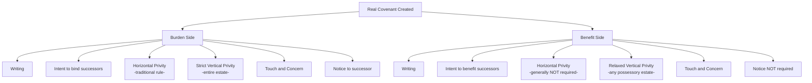

## Requirements for Covenants to Run with the Land

### Overview

For a real covenant to "run with the land" — that is, to bind and benefit successive owners of the burdened and benefited parcels rather than merely the original contracting parties — it must satisfy a demanding set of common law requirements. These requirements exist in service of a foundational tension in property law: covenants originate in contract (an agreement between two parties), yet the doctrine seeks to bind persons who were never parties to that agreement. Courts have historically imposed strict technical requirements to justify this departure from ordinary privity-of-contract principles. This topic addresses the requirements separately for the **burden** to run (binding successors of the covenantor) and the **benefit** to run (benefiting successors of the covenantee), since American common law has historically treated these with different degrees of strictness.

### The Core Analytical Framework

A real covenant that "runs with the land" allows an action for **damages** at law to be brought by or against a successor owner who was not an original party to the covenant. This is distinct from an equitable servitude, which permits **injunctive relief** and applies a more relaxed set of requirements (most notably, no horizontal privity requirement, and notice substituting for the touch-and-concern and privity elements in many formulations).

**Key Points**

- Real covenants are enforced through an action at law (damages); equitable servitudes are enforced in equity (injunction)
- The requirements below apply to the *legal* real covenant doctrine; equitable servitudes are addressed as a related but distinct topic
- Because of the strictness of these requirements, many modern disputes are litigated and resolved under the more flexible equitable servitude framework instead, though the real covenant requirements remain foundational and are still tested and applied

### Requirements for the Burden to Run

For the burden of a covenant to bind a successor owner of the burdened (servient) estate, most jurisdictions require:

#### 1. Writing (Statute of Frauds)

The covenant must be created in a writing that satisfies the Statute of Frauds, since it is fundamentally an interest touching real property.

#### 2. Intent

The original parties must have intended the covenant to bind successors in interest, not merely themselves personally. This intent is typically evidenced by language such as "heirs, successors, and assigns," though courts may find intent from the overall context and purpose of the covenant even without such express language.

#### 3. Horizontal Privity

The original covenanting parties must have been in a specified property relationship with each other at the time the covenant was created.

**Key Points**

- The traditional (English/majority historical) rule requires horizontal privity in the form of a **mutual, simultaneous interest** in the land independent of the covenant itself — classically, a landlord-tenant relationship, or a grantor-grantee relationship where the covenant is created as part of the same conveyance transferring an estate in the land
- A covenant created between neighbors who already independently own their respective parcels, with no simultaneous conveyance of an estate between them, historically fails horizontal privity under the strict majority rule — this is the single most technical and frequently criticized requirement in the entire doctrine
- The Restatement (Third) of Property: Servitudes has largely **abolished the horizontal privity requirement**, reflecting substantial modern criticism of the rule as an arbitrary formalism; jurisdictions vary in whether they have followed this modernization

**Example**

Developer sells Lot 1 to Buyer A, and the deed contains a covenant restricting Lot 1 to residential use, for the benefit of Developer's retained Lot 2. Because the covenant was created in the same instrument that conveyed the estate (the deed from Developer to Buyer A), horizontal privity is satisfied under the traditional rule — the parties were in a grantor-grantee relationship simultaneous with the covenant's creation.

By contrast, if neighboring landowners who already owned their separate parcels simply signed a side agreement restricting land use, with no accompanying transfer of any property interest between them, horizontal privity is absent under the strict traditional rule — even though the parties clearly intended the restriction to be binding.

#### 4. Vertical Privity

The successor against whom enforcement is sought must hold an estate derived from the original covenantor — generally satisfied by any successor taking the covenantor's entire estate (sale, inheritance, devise), though **not** satisfied by mere adverse possession in the traditional formulation, since adverse possession does not derive title from the covenantor.

**Key Points**

- For the burden to run, most jurisdictions require **strict vertical privity** — succession to the *entire* estate held by the original covenantor (not merely a lesser estate, such as a leasehold carved out of a fee)
- This stricter standard for burden-running (compared to the more relaxed standard often applied for benefit-running, discussed below) reflects courts' historical reluctance to impose new obligations on parties without a sufficiently direct chain of title

#### 5. Touch and Concern

The covenant must "touch and concern" the land — meaning it must relate to the use, enjoyment, or value of the land itself, rather than being a purely personal obligation unrelated to the property.

**Key Points**

- Covenants restricting land use (no commercial use, height restrictions, setback requirements), requiring maintenance of shared improvements, or requiring payment of assessments for services benefiting the land generally satisfy touch and concern
- Purely personal covenants (e.g., a promise to hire a specific individual, or to purchase goods exclusively from a specific business unrelated to use of the land) generally fail touch and concern
- The Restatement (Third) has moved away from "touch and concern" terminology, instead invalidating servitudes on public policy grounds directly, but many jurisdictions continue to apply the traditional touch and concern analysis

#### 6. Notice

The successor against whom the burden is sought to be enforced must have had notice of the covenant (actual, record, or inquiry) at the time of acquiring the property, consistent with the jurisdiction's recording act.

### Requirements for the Benefit to Run

American courts have traditionally applied a **more relaxed** standard for the benefit to run than for the burden to run, reflecting the policy judgment that allowing an unintended party to *enforce* a covenant is less troubling than *binding* an unintended party to an obligation.

| Requirement | Burden Running | Benefit Running |
| --- | --- | --- |
| Writing | Required | Required |
| Intent | Required | Required |
| Horizontal privity | Required (majority, traditional rule) | Not required in most jurisdictions |
| Vertical privity | Strict (entire estate) | Relaxed (any possessory estate succession suffices in many jurisdictions) |
| Touch and concern | Required | Required |
| Notice | Required | Not required (benefit runs regardless of successor's notice) |

**Key Points**

- Because notice protects a *burdened* party from being surprised by an unknown obligation, it is not required for the *benefit* to run — a successor benefiting from a covenant need not have known of it in advance to enforce it
- The relaxed vertical privity standard for benefits means even a partial successor (e.g., a tenant taking a leasehold from the original covenantee) may often enforce the benefit, unlike the strict entire-estate requirement typically applied to burden enforcement

### Visual: Running of Burden vs. Benefit

### Summary Checklist for Burden to Run

### The Restatement (Third) Modernization

The Restatement (Third) of Property: Servitudes substantially simplifies this framework by:

- **Eliminating the horizontal privity requirement** entirely
- **Eliminating strict vertical privity distinctions**, generally allowing both burdens and benefits to run to any successor with notice (for burdens) or any successor in possession (for benefits)
- **Replacing touch and concern** with a more flexible validity analysis focused on whether the servitude violates public policy (e.g., unreasonable restraints on alienation, unconstitutional discrimination, arbitrary restrictions unrelated to any legitimate purpose)
- Unifying much of the historically separate real covenant and equitable servitude doctrines under a single "servitude" framework

**Key Points**

- [Inference] Because jurisdictions vary considerably in the extent to which they have adopted the Restatement (Third) approach versus retaining the traditional common law elements, practitioners must verify which framework controls in the applicable state before analyzing whether a given covenant runs with the land

### Practical Consequence of Failing the Requirements

Where a covenant fails to satisfy the requirements for the burden or benefit to run as a **real covenant**, it may nonetheless be enforceable as an **equitable servitude** (enforceable by injunction against successors with notice, without a horizontal privity requirement), provided it satisfies the generally more relaxed equitable servitude elements — a critical practical fallback that shapes how modern litigants frame these disputes.

### Practical Drafting Guidance

To maximize the likelihood that a covenant will run with the land under either doctrine:

- Include the covenant in the deed conveying an estate in the property (satisfying horizontal privity under the traditional rule)
- Use explicit language binding "heirs, successors, and assigns" to establish clear intent
- Draft the covenant to relate directly to the use, value, or enjoyment of the land, avoiding purely personal obligations
- Record the instrument to ensure notice to subsequent purchasers
- Consider expressly structuring restrictive covenants within a recorded declaration for a planned development or common interest community, which typically provides the strongest and most predictable enforcement framework

### Related Topics

- Real Covenants vs. Equitable Servitudes
- Horizontal and Vertical Privity Doctrine
- The Touch and Concern Requirement
- Restatement (Third) of Property: Servitudes — Unified Framework
- Common Interest Communities and Declarations of Covenants
- Termination and Modification of Real Covenants
- Notice and Recording Acts in Covenant Enforcement