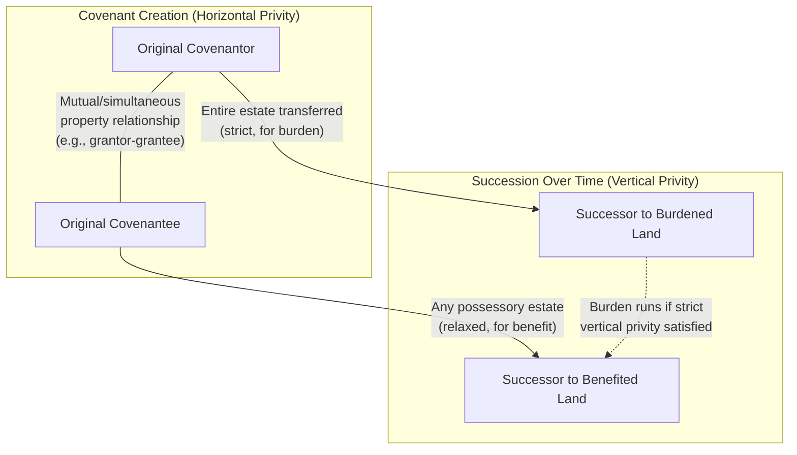
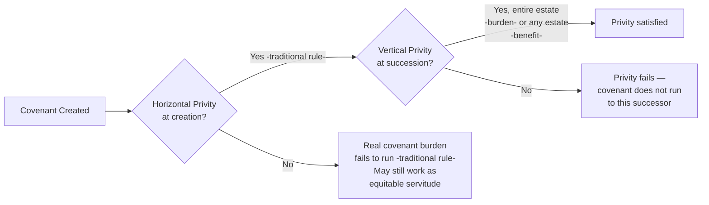

## Horizontal and Vertical Privity

### Overview

Privity requirements form the most technical and heavily criticized component of real covenant doctrine, serving as the mechanism by which courts justify binding parties to a contractual-origin obligation despite the absence of traditional privity of contract between them. The doctrine bifurcates into two distinct concepts — **horizontal privity** (the relationship between the *original* covenanting parties) and **vertical privity** (the relationship between an original party and their *successor* in interest) — each governed by separate rules and each applied differently depending on whether the burden or the benefit of the covenant is at issue.

### Conceptual Distinction

| Type | Relationship Examined | Point in Time |
| --- | --- | --- |
| Horizontal privity | Between the two original covenanting parties | At the moment the covenant is created |
| Vertical privity | Between an original party and a subsequent successor | At the moment title passes to the successor |

**Key Points**

- Horizontal privity asks: "Were the original promisor and promisee sufficiently connected in a property relationship when they made this covenant?"
- Vertical privity asks: "Is the current owner sufficiently connected, through the chain of title, to the original covenanting party whose obligation or benefit they now hold?"
- Both concepts exist independently and must each be separately satisfied for a covenant's burden (and, in jurisdictions requiring it, benefit) to run with the land

### Horizontal Privity

#### Traditional (Majority Historical) Rule

Horizontal privity requires that the original covenanting parties share a **mutual, simultaneous property interest** independent of the covenant itself, at the time the covenant is created. Historically recognized relationships satisfying this requirement include:

- **Landlord-tenant relationships** — a covenant created between a lessor and lessee as part of the leasehold
- **Grantor-grantee relationships** — a covenant created within the same instrument that conveys an estate in the land (the classic and most common modern scenario, where a developer sells a lot and includes restrictive covenants in the deed itself)
- Historically, some formulations recognized **mutual/successive interests** such as easement grants accompanied by covenants

**Key Points**

- The critical technical requirement is that the covenant be created **as part of** a transaction that also transfers a property interest — a covenant agreed to between parties who already independently own their separate parcels, with no accompanying conveyance between them, **fails** horizontal privity under the strict traditional rule
- This has been widely criticized as an arbitrary formalism: two neighbors who sign a mutual restrictive agreement without any accompanying land transfer are treated differently from a developer and buyer who include the identical restriction in a deed — despite functionally identical intent and content

**Example**

Developer conveys Lot 1 to Buyer, and the deed itself contains a covenant restricting Lot 1 to single-family residential use, benefiting Developer's retained Lot 2. Horizontal privity is satisfied because the covenant arose within the same instrument conveying the fee estate — Developer and Buyer were in a grantor-grantee relationship at the moment of the covenant's creation.

**Contrasting Example**

Two neighboring landowners, each having owned their lots for years with no relationship to one another beyond adjacency, sign a side agreement restricting both properties to residential use. No conveyance of any property interest accompanies this agreement. Under the strict traditional rule, horizontal privity is absent — even though the intent to create a running covenant is unmistakable — meaning the burden may not run as a *real covenant* to bind future owners (though the arrangement may still be enforceable as an equitable servitude, which does not require horizontal privity).

#### The Restatement (Third) Approach

The Restatement (Third) of Property: Servitudes **abolishes the horizontal privity requirement entirely**, reflecting near-universal modern academic criticism of the doctrine as serving no coherent policy purpose. Under this approach, a covenant's burden may run regardless of whether the original parties had any independent property relationship, so long as the other requirements (writing, intent, touch and concern, notice) are satisfied.

**Key Points**

- [Inference] The degree to which individual states have formally adopted this abolition, versus retaining the traditional horizontal privity requirement in some form, varies and should be verified against current case law in the applicable jurisdiction
- Even in jurisdictions retaining horizontal privity for real covenants, the doctrine's practical bite is substantially reduced because equitable servitude doctrine — which does not require horizontal privity — provides a functionally equivalent alternative enforcement path in equity

### Vertical Privity

#### General Concept

Vertical privity examines whether a **successor** in interest is sufficiently connected, through a valid chain of title, to the original covenanting party such that the covenant's burden or benefit should pass to them. This is generally satisfied by any non-adverse means of succession — sale, gift, devise (inheritance under a will), or intestate succession.

**Key Points**

- Vertical privity is **not** satisfied by adverse possession under the traditional formulation, because an adverse possessor's title does not derive from the covenantor — it arises independently through operation of law, defeating rather than continuing the chain of title
- This creates a notable doctrinal quirk: an adverse possessor may take the land free of covenants that would otherwise have run with it, because the required derivative chain of title is broken

#### Strict vs. Relaxed Vertical Privity

American courts have historically applied **different standards** of vertical privity depending on whether the burden or benefit is at issue:

| Aspect | Strict Vertical Privity (Burden) | Relaxed Vertical Privity (Benefit) |
| --- | --- | --- |
| Estate required | Succession to the *entire* estate held by covenantor | Succession to *any* possessory estate (even a lesser estate, like a leasehold) |
| Rationale | Reluctance to impose obligations broadly | Less troubling to allow broader enforcement rights |
| Example estate transfer satisfying | Fee-to-fee sale of entire parcel | Fee owner leasing to a tenant who then enforces the benefit |

**Example**

Original covenantor O sells the entire fee in the burdened parcel to Successor S. S succeeds to O's entire estate, satisfying strict vertical privity — the burden runs and binds S.

By contrast, if O had merely leased the burdened parcel to a tenant for a term of years (transferring less than the entire estate), many jurisdictions applying the strict traditional rule would hold that vertical privity for the **burden** is not satisfied as to the tenant, since the tenant did not succeed to O's entire estate — though some jurisdictions treat a long-term leasehold differently, and the Restatement (Third) approach relaxes this distinction considerably.

For the **benefit** side, a tenant taking even a partial leasehold interest from the original covenantee is generally permitted to enforce the benefit of a covenant under the relaxed standard, illustrating the asymmetry between burden and benefit vertical privity rules.

### Diagram: Horizontal vs. Vertical Privity in the Covenant Chain

### Combined Requirement Illustration

### Why These Doctrines Are Criticized

- Horizontal privity in particular is widely regarded by commentators as an arbitrary historical artifact, tracing to English feudal-era property relationships (tenurial and landlord-tenant bonds) with little continuing policy justification in a modern fee-simple-dominant system
- The strict/relaxed asymmetry between burden and benefit vertical privity is sometimes criticized as producing inconsistent, unpredictable results depending on which side of a dispute is litigating
- Because equitable servitude doctrine achieves largely the same practical outcomes without a horizontal privity requirement, critics argue the real covenant privity doctrine has become a largely formalistic hurdle that sophisticated drafters and litigants can route around, while occasionally trapping unsophisticated parties who fail to structure their transactions to satisfy it

### Practical Significance Despite Criticism

Notwithstanding substantial criticism, privity doctrine remains a **frequently tested** and practically relevant framework because:

- It continues to control outcomes in jurisdictions that have not adopted the Restatement (Third) reforms
- It explains *why* certain covenant arrangements are more litigation-resistant than others (e.g., developer-drafted deed covenants versus informal neighbor agreements)
- Understanding the doctrine clarifies why practitioners are well-advised to draft restrictive covenants **within** a conveyancing instrument (deed) rather than as a freestanding side agreement, to ensure horizontal privity is satisfied regardless of jurisdiction

### Practical Drafting Guidance

- **To satisfy horizontal privity reliably**: include covenants within the deed or lease that conveys the relevant property interest, rather than as a separate freestanding agreement between existing owners
- **To satisfy vertical privity for burden enforcement**: structure transfers to pass the covenantor's entire estate where the intent is for the burden to bind the full range of successors
- **As a fallback strategy**: where horizontal or strict vertical privity cannot be satisfied, plan for enforcement under equitable servitude doctrine instead, ensuring the covenant satisfies the notice and touch-and-concern requirements applicable to that framework

### Related Topics

- Requirements for Covenants to Run with the Land
- Real Covenants vs. Equitable Servitudes
- The Touch and Concern Requirement
- Restatement (Third) of Property: Servitudes — Unified Framework
- Adverse Possession and Its Effect on Running Covenants
- Notice and Recording Acts in Covenant Enforcement
- Common Interest Communities and Declarations of Covenants