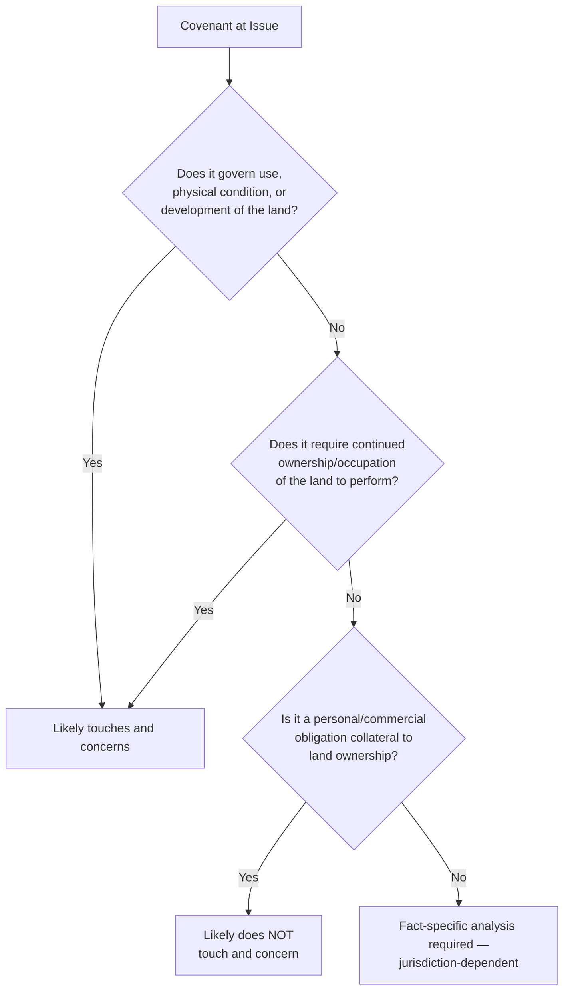

## The Touch and Concern Requirement

### Overview

The touch and concern requirement is the substantive limitation on real covenant doctrine that restricts which promises may run with the land, ensuring that only obligations genuinely connected to the property's use, value, or enjoyment bind successors, while purely personal contractual obligations remain confined to the original parties. Alongside privity, it is one of the most conceptually contested elements of covenant law — courts and commentators have struggled for over a century to articulate a precise test, and the doctrine remains a significant source of litigation and inconsistent outcomes.

### Purpose and Policy Rationale

The requirement serves several interconnected policy functions:

- **Limiting the alienability burden** — preventing land from becoming encumbered with purely personal obligations unrelated to its use, which would reduce marketability and impose obligations on successors who had no meaningful opportunity to negotiate them
- **Preserving the boundary between contract and property** — ensuring that ordinary personal contracts (which bind only the parties) are not converted into property-binding obligations merely by attaching them to a conveyance
- **Protecting successor owners** — successors take title without having personally negotiated the covenant's terms; touch and concern helps ensure the obligations they inherit are at least logically connected to the property they are acquiring

### The Traditional Test

**Key Points**

- A covenant "touches and concerns" the land if it relates to the parties' interests **as landowners** — affecting the use, value, or enjoyment of the property — rather than existing as a personal, collateral obligation that happens to be attached to a conveyance
- The classic formulation asks whether the covenant makes the promisor's land **less valuable** (burden touches and concerns) and the promisee's land **more valuable** (benefit touches and concerns) — the "value-based" test associated with early Restatement (First) analysis
- An alternative, more functional formulation asks whether the covenant **relates to the use or physical condition** of the land, rather than being a purely personal promise

### Categories Commonly Satisfying Touch and Concern

| Covenant Type | Touch and Concern Analysis |
| --- | --- |
| Use restrictions (residential-only, no commercial use) | Satisfies — directly restricts land use |
| Height, setback, or architectural restrictions | Satisfies — governs physical development of the land |
| Covenants to maintain shared facilities (fences, drainage) | Satisfies — relates to physical condition/use |
| Covenants to pay homeowners' association assessments | Satisfies — funds services/maintenance affecting the land |
| Covenants not to compete (running with commercial property) | Frequently contested — traditionally often failed as "personal," though modern courts increasingly find touch and concern where tied to specific premises |
| Covenants to purchase goods/services from a specific party unrelated to the land | Typically fails — purely personal/commercial obligation |
| Racially or similarly discriminatory restrictive covenants | Void as against public policy (regardless of touch and concern analysis) — see *Shelley v. Kraemer* and subsequent constitutional and statutory developments |

### Illustrative Examples

**Example**

A deed contains a covenant that the burdened lot "shall be used for residential purposes only, and no structure shall exceed two stories in height." This plainly touches and concerns the land — it directly governs permitted land use and physical development, affecting both the burdened parcel's value (restricted use) and the benefited parcel's value (protected from incompatible development nearby).

**Contrasting Example**

A deed contains a covenant that the buyer "shall purchase all heating oil exclusively from Seller's company for a period of twenty years." Courts applying the traditional touch and concern test have frequently held such "tying" covenants **fail** to touch and concern the land, reasoning that the obligation is a personal commercial arrangement collateral to land ownership — the land itself is not meaningfully more or less valuable because of who supplies its heating oil, as distinguished from a use restriction that directly shapes what may physically occur on the property. [Inference] Courts have not been fully uniform on this category, however, and some jurisdictions have found touch and concern where the tying arrangement is closely tied to a business specifically operated on the premises (e.g., a covenant tied to operation of a specific type of business on that exact parcel).

### The Bigelow/Restatement Functional Test

Modern commentary (notably associated with Professor Bigelow's influential analysis, later reflected in evolving Restatement treatment) proposed a more functional inquiry:

- Does the covenant, viewed practically, affect the parties **in their capacity as landowners**, or does it affect them in some other capacity (as a business competitor, employer, or unrelated commercial party)?
- Does performance of the covenant **require the promisor's continued ownership or occupation** of the land, or could the obligation be performed entirely independent of any connection to the specific parcel?

This functional approach attempts to move past the more mechanical "value increase/decrease" test toward a substantive inquiry into the covenant's actual relationship to the land.

### Touch and Concern Analysis Flow

### Affirmative Covenants and the "Touch and Concern" Debate

Historically, courts applied heightened scrutiny to **affirmative covenants** (obligations to do something, such as pay money or perform maintenance) compared to **negative covenants** (restrictions on use), based on a traditional aversion to imposing affirmative personal obligations on unconsenting successors.

**Key Points**

- Covenants to pay money (homeowners' association dues, maintenance assessments) have historically faced more skepticism under touch and concern analysis than simple use restrictions, though modern courts and the widespread adoption of common interest community statutes have largely resolved this tension in favor of enforceability, provided the funds are used for purposes benefiting the property (shared amenities, maintenance, insurance)
- A minority historical view held that purely affirmative money covenants could **never** touch and concern the land — this view has been substantially abandoned in modern practice, particularly given the ubiquity of HOA assessment covenants in contemporary real estate

### The Restatement (Third) Departure

The Restatement (Third) of Property: Servitudes takes a notably different approach, **abandoning the "touch and concern" terminology and test entirely**. Instead, it provides that a servitude is valid unless it is illegal, unconstitutional, or violates public policy, with public policy violations including:

- Servitudes that are **arbitrary, spiteful, or capricious**
- Unreasonable restraints on alienation or on trade/competition
- Restrictions violating anti-discrimination law
- Servitudes imposing unreasonable burdens on a fundamental constitutional right

**Key Points**

- This reframing shifts the analysis from a categorical "does this type of promise touch and concern land" inquiry to a case-by-case validity/public-policy inquiry
- [Inference] Because this is a significant doctrinal departure, and adoption varies by state, practitioners must determine whether the controlling jurisdiction continues to apply traditional touch and concern analysis or has shifted to the Restatement (Third)'s public policy framework, as the two approaches can produce different outcomes for borderline covenants (e.g., certain commercial tying arrangements or non-compete covenants)

### Comparison: Traditional vs. Restatement (Third) Approaches

| Feature | Traditional Touch and Concern | Restatement (Third) Public Policy |
| --- | --- | --- |
| Core question | Does the covenant relate to land use/value? | Is the covenant illegal, unconstitutional, or against public policy? |
| Categorical distinctions | Affirmative vs. negative covenants historically treated differently | No formal affirmative/negative distinction |
| Predictability | Criticized as vague and inconsistently applied | Also criticized as vague, but reframes the inquiry around clearer policy categories |
| Treatment of personal/commercial covenants | Often fails as "not touching and concerning" | Analyzed for restraint on alienation/trade concerns instead |

### Practical Litigation Significance

Touch and concern remains a live issue particularly in disputes involving:

- **Non-compete and exclusive dealing covenants** attached to commercial property conveyances
- **Right of first refusal** provisions tied to land, where courts assess whether the restriction on alienation is reasonable
- **Homeowners' association fee and assessment covenants**, especially in older developments predating modern common-interest-community statutes
- **Covenants tied to unrelated business operations** rather than the physical use of the specific parcel

### Practical Drafting Guidance

- Frame covenants explicitly in terms of **land use, physical condition, or development** wherever possible, to maximize the likelihood of satisfying touch and concern under the traditional test
- For affirmative payment obligations (assessments, dues), tie the obligation explicitly to maintenance, services, or amenities that benefit the specific property, and reference the applicable common interest community statute where available
- For commercial tying or non-compete arrangements intended to run with the land, consider structuring the restriction as an equitable servitude with clear language tying the restriction to use of the specific premises, and be aware of independent restraint-of-trade and antitrust scrutiny that may apply regardless of touch and concern analysis
- Where the controlling jurisdiction has adopted the Restatement (Third) approach, focus drafting analysis on avoiding arbitrary, discriminatory, or unreasonably restrictive terms rather than on the traditional touch and concern categories

### Related Topics

- Requirements for Covenants to Run with the Land
- Horizontal and Vertical Privity
- Real Covenants vs. Equitable Servitudes
- Restatement (Third) of Property: Servitudes — Unified Framework
- Racially Restrictive Covenants and Constitutional Limits (*Shelley v. Kraemer*)
- Common Interest Communities and Assessment Covenants
- Restraints on Alienation and Public Policy Limits on Servitudes