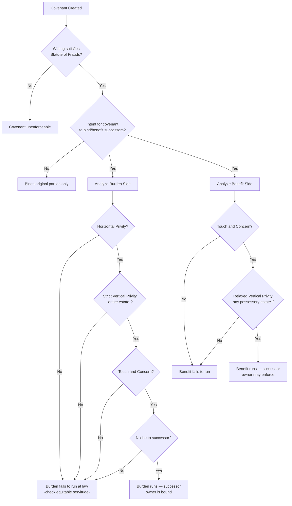

## Running of Benefits and Burdens at Law

### Overview

The running of benefits and burdens at law is the doctrinal core of real covenant analysis — the process by which a legal remedy (damages) becomes available to or against a successor owner who was not an original party to the covenant. This topic synthesizes the individual requirements (writing, intent, horizontal and vertical privity, touch and concern, notice) into the unified analytical framework courts apply, and clarifies the distinct treatment of benefit-running versus burden-running that recurs throughout real covenant doctrine. The phrase "at law" is significant: it distinguishes this analysis from equitable servitude enforcement, which uses a related but distinct framework to obtain injunctive relief.

### Legal vs. Equitable Enforcement Distinguished

| Feature | Real Covenant (At Law) | Equitable Servitude (In Equity) |
| --- | --- | --- |
| Remedy | Damages | Injunction (specific relief) |
| Horizontal privity | Required (traditional rule) | Not required |
| Vertical privity | Required (strict for burden) | Not required — notice substitutes |
| Touch and concern | Required | Required (though analyzed more flexibly by some courts) |
| Historical origin | Common law courts | Courts of equity (*Tulk v. Moxhay*) |

**Key Points**

- A covenant may fail to run at law (e.g., because horizontal privity is absent) yet still be enforceable in equity as a servitude against a successor with notice — this is why modern litigants frequently plead both theories
- The "running at law" framework remains doctrinally important because damages remedies are sometimes preferred or required (e.g., where injunctive relief is unavailable or inadequate, or where a jurisdiction's procedural posture calls for a legal claim)

### The Complete Elements Checklist

For the **burden** to run at law, binding a successor owner of the burdened estate:

1. Valid writing satisfying the Statute of Frauds
2. Intent that the covenant bind successors
3. Horizontal privity between the original parties (traditional rule)
4. Strict vertical privity — successor takes the covenantor's entire estate
5. Touch and concern with the burdened land
6. Notice to the successor (actual, record, or inquiry)

For the **benefit** to run at law, allowing a successor owner of the benefited estate to sue:

1. Valid writing satisfying the Statute of Frauds
2. Intent that the covenant benefit successors
3. Horizontal privity — generally **not required** in most jurisdictions
4. Relaxed vertical privity — succession to any possessory estate suffices
5. Touch and concern with the benefited land
6. Notice — **not required** for benefit enforcement

### Unified Diagram: Complete Running Analysis

### Who May Sue Whom: The Four Party Combinations

Real covenant litigation frequently requires distinguishing among four possible party configurations, since the analysis differs depending on whether original parties or successors are involved on each side:

| Scenario | Analysis Required |
| --- | --- |
| Original covenantor vs. original covenantee | Ordinary contract enforcement — no running analysis needed |
| Original covenantor vs. successor to benefited land | Only benefit-running elements at issue (burden stays with original party) |
| Successor to burdened land vs. original covenantee | Only burden-running elements at issue (benefit stays with original party) |
| Successor to burdened land vs. successor to benefited land | **Both** burden-running and benefit-running elements must independently be satisfied |

**Key Points**

- This four-way framework is essential to correct exam and litigation analysis — a common error is applying burden-running requirements to a benefit-side successor, or vice versa, when in fact only one side of the transaction involves a successor
- Where both sides involve successors, each side's elements must be analyzed **completely independently** — satisfying the (generally easier) benefit-running elements says nothing about whether the (generally harder) burden-running elements are also met

**Example**

Developer (original covenantor) sells Lot 1 subject to a use restriction benefiting Lot 2, which Developer retains. Developer later sells Lot 2 to Buyer B. If Developer (still holding Lot 1... more precisely, assume Developer sold Lot 1 to Owner A subject to the restriction) is sued by B for violating the restriction on Lot 1, only the **benefit**-running elements matter (is B, as successor to the originally benefited Lot 2, entitled to enforce?) — since Developer, the original covenantor, remains bound directly on the burden side without any running analysis needed.

If instead Owner A (successor to burdened Lot 1) is sued by Developer (still holding benefited Lot 2, the original covenantee), only the **burden**-running elements matter — is Owner A, as successor to the burdened land, bound?

If Owner A (successor, burden side) is sued by Buyer B (successor, benefit side), **both** sets of elements must be independently satisfied — burden-running elements to bind Owner A, and benefit-running elements to allow B to sue.

### The Historical Asymmetry Rationale Revisited

The differential treatment of burden versus benefit running — stricter privity requirements for the burden, more relaxed for the benefit — reflects a consistent policy thread running throughout the doctrine:

- **Binding** an unconsenting successor to a new obligation (burden) is viewed as the more consequential and potentially unfair outcome, warranting stricter safeguards (horizontal privity, strict vertical privity, notice)
- **Allowing** a successor to enforce a benefit they did not personally negotiate is viewed as comparatively low-risk — at worst, the successor gains an enforceable right they didn't know they had, rather than being saddled with an unexpected obligation

This asymmetry explains why, in practice, benefit-running disputes are resolved more readily in favor of enforceability, while burden-running disputes present the more frequent litigation battleground, especially over horizontal privity and touch and concern.

### Interaction with Assignment and Apportionment

Where a benefited parcel is subdivided among multiple successor owners, courts must additionally determine whether the benefit is **apportionable** — capable of being divided among the multiple new owners — or **indivisible** (entire), such that only one designated party may enforce, or all must act jointly.

**Key Points**

- Courts generally look to the covenant's language and the parties' intent to determine apportionability
- Where a benefit is appurtenant to an entire tract that is later subdivided, most courts presume the benefit runs to each subdivided portion, absent evidence the original parties intended otherwise
- [Inference] Because apportionment rules are not perfectly uniform across jurisdictions, and depend heavily on the specific covenant language and subdivision circumstances, practitioners should analyze the applicable jurisdiction's specific case law on this point rather than assuming automatic apportionment in every case

### Damages as the Distinguishing Remedy

Because real covenant enforcement at law sounds in damages rather than injunctive relief, practical considerations include:

- **Measuring damages** — typically based on diminution in the value of the benefited land caused by the burden-side breach, though jurisdictions vary in the precise measure applied
- **Adequacy of remedy** — where damages are inadequate to address an ongoing or repeated violation (e.g., continuing construction in violation of a height restriction), plaintiffs typically plead equitable servitude theory in the alternative to obtain injunctive relief
- **Statute of limitations** — legal damages claims are subject to the jurisdiction's standard limitations period for breach of covenant/contract-adjacent claims, which may differ from equitable laches-based timing analysis applicable to injunctive claims

### Modern Practical Significance

**Key Points**

- [Inference] In contemporary practice, the vast majority of real covenant disputes — particularly those arising in planned developments and common interest communities — are litigated and resolved primarily under equitable servitude and/or governing statutory frameworks (state common interest community acts), with the strict "running at law" analysis functioning more as a doctrinal backstop and academic/bar-exam framework than the primary practical vehicle for modern enforcement
- Nonetheless, understanding the "running at law" framework remains essential because it clarifies *why* equitable servitude doctrine developed the way it did (as a deliberate relaxation of these exact technical hurdles), and continues to govern cases seeking damages remedies specifically

### Related Topics

- Requirements for Covenants to Run with the Land
- Horizontal and Vertical Privity
- The Touch and Concern Requirement
- Real Covenants vs. Equitable Servitudes
- Apportionment of Covenant Benefits Upon Subdivision
- Restatement (Third) of Property: Servitudes — Unified Framework
- Common Interest Communities and Declarations of Covenants
- Termination and Modification of Real Covenants