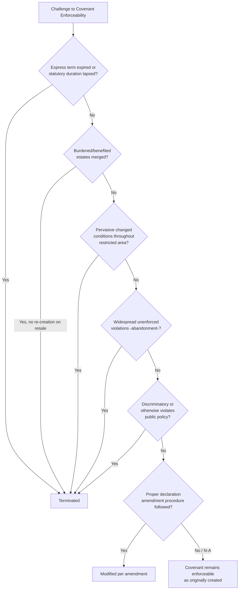

## Termination and Modification of Real Covenants

### Overview

Real covenants, though designed to run with the land and bind successive owners, are not immutable — a substantial body of doctrine governs when and how they may be terminated or modified. This body of law reflects a persistent tension between honoring the original parties' intent to create durable land use restrictions and preventing outdated, unfair, or socially obsolete restrictions from perpetually encumbering property against evolving community needs and changed conditions. This topic addresses the full range of termination and modification doctrines applicable to real covenants and their close relative, equitable servitudes.

### Termination Doctrines

#### 1. Release

The benefited party (or all benefited parties, where multiple exist) may voluntarily release the burdened party from the covenant's obligations.

**Key Points**

- A release should satisfy the Statute of Frauds, given its effect on an interest in real property, and should be recorded to provide notice to future purchasers
- Where a benefit is held by multiple parties (e.g., all lot owners in a subdivision), release typically requires either unanimous consent or a mechanism specified in the governing declaration (e.g., a supermajority vote provision)

#### 2. Merger

Where the burdened and benefited estates come into common ownership, the covenant merges into the unified fee and is extinguished, applying the same logic as easement merger — since a person cannot hold a covenant benefit against themselves.

**Key Points**

- If the previously merged estates are later resubdivided and sold separately, the original covenant does **not** automatically revive absent an express re-creation in the new instruments of conveyance
- This creates an important drafting trap: developers who temporarily reacquire both a burdened and benefited lot (e.g., through foreclosure or buyback) must expressly reinstate covenants upon resale, or the restriction will be lost

#### 3. Expiration of a Stated Term

Covenants drafted with an express duration (e.g., "this covenant shall remain in effect for thirty years from the date of this instrument") automatically terminate upon expiration of that term, absent a renewal or extension mechanism.

**Key Points**

- Many jurisdictions have enacted **statutory duration limits** (often called "Marketable Title Acts" or covenant-specific sunset statutes) that automatically terminate old covenants after a specified period (commonly 30–40 years) unless the beneficiary files a formal re-recording or notice of continued enforcement within the statutory window
- [Inference] These statutes vary considerably in mechanics and duration across states, so practitioners must verify the applicable state's specific marketable title or covenant-expiration statute rather than assuming a uniform national rule

#### 4. Changed Conditions Doctrine

Perhaps the most significant and frequently litigated termination doctrine: a court may refuse to enforce (effectively terminating, at least as to injunctive relief) a covenant where the character of the surrounding area has changed so fundamentally since the covenant's creation that its original purpose can no longer be achieved.

**Key Points**

- The classic scenario involves residential-use covenants in an area that has since transitioned substantially to commercial or mixed-use development, such that enforcing the restriction against the remaining objecting owner would serve no continuing purpose while imposing a significant burden
- Courts generally require the changed conditions to be **pervasive throughout the restricted area**, not merely occurring at the fringes or affecting only a few lots — change limited to the boundary of a subdivision, while the interior remains as originally restricted, is typically insufficient to terminate the covenant for interior lots
- The doctrine is applied cautiously; courts are reluctant to deprive benefited owners of their bargained-for protection based on partial or localized change

**Example**

A subdivision originally restricted to single-family residential use, located along what was once a quiet rural road, later finds that road widened into a major commercial thoroughfare, with the majority of lots along the restriction's boundary converted to commercial use through prior covenant modifications or non-enforcement. If an owner seeks to build a small commercial structure and neighbors sue to enforce the original residential restriction, a court may apply the changed conditions doctrine to deny injunctive relief if the change has been so pervasive that the original residential character can no longer reasonably be restored or maintained — though a court is less likely to grant this relief if only the fringe lots have changed while the interior remains genuinely residential.

#### 5. Abandonment / Acquiescence

Where the benefited parties have failed to enforce a covenant against widespread, repeated violations over a significant period, courts may find the restriction abandoned, precluding later enforcement — reflecting an estoppel-like rationale that it would be unfair to selectively enforce a restriction that has been systematically disregarded.

**Key Points**

- Requires evidence of **substantial, community-wide violation**, not merely isolated or minor breaches
- Selective enforcement (enforcing against one owner while ignoring similar violations by others) can support an abandonment or waiver defense, and separately may raise equitable defenses of unclean hands or estoppel against the enforcing party

#### 6. Unclean Hands / Estoppel

A party seeking to enforce a covenant who has themselves violated the same or a related restriction may be barred from equitable relief under the unclean hands doctrine, or estopped from enforcement where their own conduct induced the violation.

#### 7. Eminent Domain / Condemnation

Where the burdened property is condemned for a public use inconsistent with the covenant, the covenant is extinguished as to that use, with benefited parties typically entitled to seek compensation for the value of their extinguished enforcement right in the condemnation proceeding, depending on the jurisdiction's treatment of covenant benefits as compensable property interests.

#### 8. Judicial Invalidation on Public Policy Grounds

Independent of changed conditions, a covenant may be terminated or rendered unenforceable from the outset where it:

- Violates constitutional or statutory anti-discrimination protections (most notably, racially restrictive covenants, which are void and unenforceable under *Shelley v. Kraemer* and the Fair Housing Act)
- Constitutes an unreasonable restraint on alienation
- Is otherwise found to violate public policy under the Restatement (Third)'s validity framework

### Modification Doctrines

#### 1. Amendment Procedures in Declarations

Modern planned developments and common interest communities typically include express amendment mechanisms within the governing declaration, permitting modification by a specified supermajority vote of lot/unit owners rather than requiring unanimous consent.

**Key Points**

- Courts generally enforce properly followed amendment procedures, provided they comply with the declaration's own terms and applicable state common interest community statutes
- Amendments adopted through a proper majority/supermajority mechanism generally bind dissenting owners and subsequent purchasers, provided adequate notice and procedural fairness were observed

#### 2. Cy Pres-Style Judicial Modification

In more limited circumstances, courts may reform or modify (rather than simply terminate) a covenant's terms to preserve its underlying purpose in light of changed circumstances, drawing loosely on principles analogous to the cy pres doctrine used in charitable trust law — adjusting specific terms while preserving the restriction's general intent, rather than eliminating it entirely.

#### 3. Relative Hardship Balancing

Courts may decline full enforcement (functioning as a partial modification through selective non-enforcement) where the hardship to the burdened party from strict enforcement grossly outweighs the benefit to the enforcing party, particularly in cases involving minor or technical violations.

### Comparative Table of Termination and Modification Mechanisms

| Mechanism | Requires Consent? | Basis |
| --- | --- | --- |
| Release | Yes (benefited party/parties) | Voluntary agreement |
| Merger | No | Operation of law upon unified ownership |
| Expiration of term | No | Contractual/statutory duration limit |
| Changed conditions | No | Judicial equitable doctrine |
| Abandonment/acquiescence | No | Judicial doctrine based on nonenforcement pattern |
| Unclean hands/estoppel | No | Equitable defense |
| Eminent domain | No | Governmental action + compensation |
| Public policy invalidation | No | Judicial/constitutional/statutory |
| Declaration amendment | Yes (specified supermajority) | Contractual mechanism in governing documents |

### Visual: Termination Pathway Analysis

### Marketable Title Acts — Statutory Overlay

Many states have enacted Marketable Title Acts (MTAs) that automatically extinguish certain old real property interests, including covenants, after a defined "root of title" period unless the interest holder files a preservation notice.

**Key Points**

- These statutes serve title-clearing policy goals distinct from the equitable termination doctrines above, operating through a purely statutory mechanism regardless of the covenant's continued practical relevance
- [Inference] The scope, duration period, and specific exceptions (e.g., some MTAs exempt certain categories of restrictions, such as utility easements or conservation restrictions) vary substantially by state, requiring jurisdiction-specific verification before relying on an MTA-based termination argument

### Practical Litigation Considerations

- Parties seeking to terminate a covenant via changed conditions should develop a comprehensive evidentiary record documenting the pervasiveness of change throughout the entire restricted area, not merely at isolated points
- Parties seeking to preserve a covenant against a changed-conditions challenge should focus on demonstrating the restriction continues to serve a meaningful protective purpose for the interior or core of the restricted area
- Selective enforcement patterns should be carefully documented (or avoided) by parties on both sides, given their relevance to abandonment and estoppel defenses

### Practical Drafting Guidance

- Include an explicit, clearly defined **amendment procedure** within any declaration of covenants, specifying the required vote threshold and notice procedures, to avoid reliance on unpredictable judicial modification doctrines
- Where perpetual duration is intended, expressly state this and consider periodic re-recording consistent with applicable state Marketable Title Act preservation requirements
- Where a temporary merger of burdened and benefited estates is anticipated (e.g., developer buyback), include express language in the resale instrument reinstating the covenant to avoid inadvertent termination
- Regularly and consistently enforce restrictions to avoid an abandonment defense arising from selective or lapsed enforcement

### Related Topics

- Requirements for Covenants to Run with the Land
- Horizontal and Vertical Privity
- The Touch and Concern Requirement
- Running of Benefits and Burdens at Law
- Real Covenants vs. Equitable Servitudes
- Marketable Title Acts and Statutory Covenant Expiration
- Racially Restrictive Covenants and Constitutional Limits (*Shelley v. Kraemer*)
- Common Interest Communities and Declaration Amendment Procedures