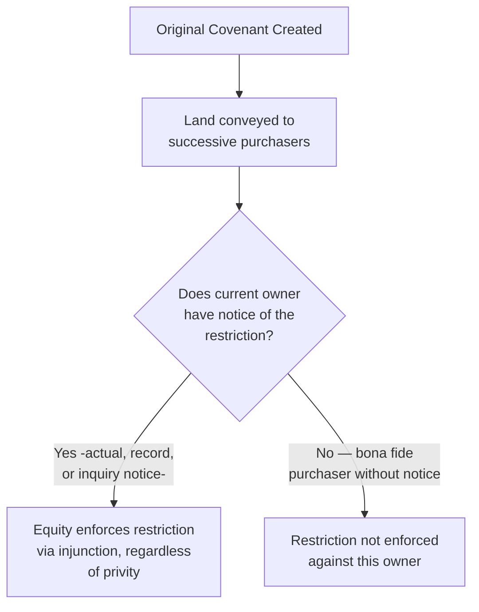

## Origins in Equity and the Notice Principle

### Overview

The equitable servitude emerged as a distinct doctrinal innovation of the English Court of Chancery, designed to overcome the rigid technical limitations of real covenant doctrine at law — particularly the strict horizontal and vertical privity requirements that frequently prevented enforcement against successors despite clear evidence of the parties' original intent. The foundational case establishing this doctrine, *Tulk v. Moxhay*, articulated a principle that has since become the doctrine's conceptual center of gravity: a successor who purchases land with **notice** of a restriction should not, in equity and good conscience, be permitted to use the land free of that restriction.

### The Foundational Case: Tulk v. Moxhay

**Key Points**

- Decided by the English Court of Chancery in 1848, *Tulk v. Moxhay* involved a covenant restricting the use of a garden square in London to keep it as an open pleasure ground, uncovered by buildings
- The original covenantor sold the burdened land, and it passed through several subsequent owners before reaching a purchaser (Moxhay) who sought to build on the square, in violation of the original restriction
- Because the burden had passed through multiple hands, the strict privity requirements for a real covenant to run at law were not satisfied as to this remote successor
- The Court of Chancery nonetheless granted an **injunction** against the successor, reasoning that since Moxhay purchased with actual notice of the restriction, and paid a correspondingly lower price reflecting that restriction, it would be inequitable — a fraud on the original covenantee — to permit him to use the land as if unrestricted

This decision established that equity would enforce restrictive covenants against successors **based on notice alone**, without requiring the technical privity elements that the law courts demanded.

### The Doctrinal Innovation: Substituting Notice for Privity

The core conceptual breakthrough of *Tulk v. Moxhay* and its progeny was to recognize that the underlying policy concern served by privity requirements — protecting a successor from being unfairly surprised by an unknown, unbargained-for obligation — could be addressed more directly and honestly through a **notice** inquiry, rather than through artificial technical relationships between the original parties.

**Key Points**

- If a successor purchased with knowledge of the restriction (actual, record, or inquiry notice), the fairness concern that privity doctrine indirectly protects is already satisfied — the successor was not, in fact, surprised
- If a successor purchased *without* notice, equity would not enforce the restriction against them (as a bona fide purchaser), regardless of whether privity technically existed — meaning notice functions as both a sufficient and, in equity, effectively a necessary condition
- This reframing allowed equity to enforce restrictions in situations where real covenant doctrine at law would fail — most significantly, where horizontal privity was absent because the covenant arose between neighbors without an accompanying conveyance, or where strict vertical privity was broken because a successor took less than the entire estate

### Why Equity, and Why Injunctive Relief

The choice of equitable rather than legal enforcement was not incidental — it reflected the practical reality of restrictive covenant disputes:

- **Damages are frequently inadequate** for ongoing or anticipated land use violations — money damages cannot undo a building already constructed in violation of a restriction, nor adequately compensate for the loss of a neighborhood's intended character
- **Injunctive relief directly prevents or halts the offending use**, providing the kind of specific, forward-looking remedy that land use restrictions typically require to be meaningful
- Equity courts historically possessed broader flexibility to fashion relief based on conscience and fairness principles, rather than being bound by the rigid categorical rules the law courts had developed for real covenants

### The Notice Principle Elaborated

**Key Points**

- **Actual notice** — the successor had genuine, subjective knowledge of the restriction, whether from direct communication, review of prior title documents, or other direct awareness
- **Record notice (constructive notice)** — the restriction was properly recorded in the chain of title in a manner discoverable through a reasonable title search, regardless of whether the successor actually reviewed the records
- **Inquiry notice** — circumstances existed that would prompt a reasonable purchaser to investigate further (e.g., visible uniform development patterns in a subdivision, or physical evidence of a restriction's existence), even absent a technically perfect record

**Example**

A subdivision developer records a declaration of covenants restricting all lots to residential use, properly indexed in the chain of title for each lot. A buyer who purchases Lot 12 without personally reading the declaration is still bound by the restriction under equitable servitude doctrine, because a reasonable title search would have revealed the recorded declaration — this is record (constructive) notice, sufficient to bind the successor even absent actual subjective knowledge.

**Contrasting Example**

If the same restriction had never been recorded and existed only as an unrecorded side agreement between the original developer and an early buyer, a later purchaser of a different lot who had no actual knowledge of the restriction, and for whom a reasonable title search would have revealed nothing, would generally take free of the restriction as a bona fide purchaser without notice — illustrating the centrality of the notice inquiry to the doctrine's operation.

### Visual: The Tulk v. Moxhay Framework

### Distinguishing Equitable Servitude from Real Covenant at Law

| Feature | Equitable Servitude | Real Covenant at Law |
| --- | --- | --- |
| Origin | Court of Chancery (*Tulk v. Moxhay*, 1848) | English common law courts |
| Central requirement | Notice | Privity (horizontal and vertical) |
| Remedy | Injunction | Damages |
| Horizontal privity | Not required | Required (traditional rule) |
| Vertical privity | Not required — notice substitutes | Required (strict for burden) |
| Touch and concern | Still generally required | Required |
| Writing | Generally required (Statute of Frauds), with narrow exceptions | Required |

### Why This Doctrinal Development Mattered

**Key Points**

- Prior to *Tulk v. Moxhay*, landowners seeking to create durable, enforceable neighborhood-wide land use restrictions faced significant technical obstacles under real covenant doctrine, particularly when restrictions arose outside the context of a single conveyance
- The notice-based equitable framework enabled the practical development of modern **planned residential subdivisions and common interest communities**, where a developer could record a single declaration of covenants applicable to numerous lots sold to unrelated buyers over time, without needing to establish privity between every buyer and every other buyer
- This doctrinal foundation underlies virtually all contemporary homeowners' association and subdivision covenant enforcement, making *Tulk v. Moxhay* one of the most practically consequential property law decisions in shaping the physical development pattern of modern residential real estate

### The Requirement That Touch and Concern Persisted

Even as equity relaxed the privity requirements, courts did not abandon the touch and concern requirement — a restriction still needed to relate to the use, value, or enjoyment of the land to warrant equitable enforcement against a successor, preserving the underlying distinction between property-related restrictions and purely personal, collateral obligations.

**Key Points**

- This continuity reflects that the notice principle addresses the *privity* problem specifically (fairness to an unwitting successor) but does not independently justify enforcing obligations that have nothing to do with the land itself
- Modern equitable servitude doctrine therefore retains: (1) intent, (2) touch and concern, and (3) notice as its core elements, having jettisoned horizontal and strict vertical privity relative to the real covenant framework

### American Reception and Development

**Key Points**

- American courts broadly adopted the *Tulk v. Moxhay* notice principle throughout the 19th and 20th centuries, and it became the dominant framework for enforcing subdivision-wide and neighborhood restrictions
- The Restatement (Third) of Property: Servitudes ultimately built on this foundation to propose a **unified servitude framework**, collapsing the historically separate real covenant and equitable servitude doctrines into a single body of law organized around intent, a relaxed validity inquiry (replacing touch and concern), and notice — reflecting the equitable servitude's notice-based approach as the doctrinally dominant model going forward

### Practical Significance for Modern Practice

- The notice principle explains why **recording** restrictive covenants is the single most important practical step a drafter can take to ensure durable enforceability against future purchasers
- It also explains why title searches and title insurance practices devote such close attention to identifying recorded declarations, restrictions, and covenants affecting a parcel — since a purchaser's exposure to equitable servitude enforcement turns directly on the notice such a search would (or should) reveal
- Practitioners representing purchasers should always review recorded covenants and restrictions as a standard part of due diligence, precisely because equitable enforcement does not require the technical privity protections that once limited exposure under real covenant doctrine

### Related Topics

- Real Covenants vs. Equitable Servitudes
- Requirements for Covenants to Run with the Land
- The Touch and Concern Requirement
- Notice and Recording Acts in Covenant Enforcement
- Restatement (Third) of Property: Servitudes — Unified Framework
- Common Interest Communities and Declarations of Covenants
- Bona Fide Purchaser Doctrine