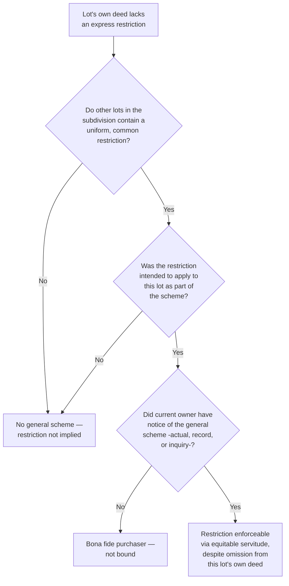

## Requirements for Enforcement in Equity

### Overview

Enforcement of an equitable servitude requires satisfaction of a distinct, more streamlined set of requirements than the real covenant framework at law, reflecting the doctrine's origin in the Court of Chancery's notice-based approach established in *Tulk v. Moxhay*. This topic addresses each required element in turn — writing, intent, touch and concern, and notice — along with the significant common law exception permitting implication from a general scheme, and the injunctive remedy that distinguishes equitable enforcement from legal damages actions.

### The Core Elements

Equitable servitude enforcement against a successor generally requires:

1. **Intent** that the restriction bind successors
2. **Touch and concern** with the land
3. **Notice** to the party against whom enforcement is sought
4. A **writing** satisfying the Statute of Frauds (subject to the general scheme exception)

Notably **absent** from this list, in contrast to real covenant doctrine at law: horizontal privity and strict vertical privity.

### 1. Intent

**Key Points**

- The original parties must have intended the restriction to bind successive owners of the burdened land, not merely themselves personally
- Intent is typically evidenced by explicit language ("this restriction shall run with the land and bind all successors, heirs, and assigns") but may also be inferred from context — particularly from a developer's recorded subdivision plan or declaration applicable to multiple lots, which strongly signals an intent for durable, community-wide restrictions
- Courts examine the overall instrument and surrounding circumstances rather than requiring rigid magic words, though clear language remains the most reliable drafting practice

### 2. Touch and Concern

**Key Points**

- Equitable servitudes require the same substantive touch and concern analysis as real covenants — the restriction must relate to the use, value, or enjoyment of the land, rather than constituting a purely personal, collateral obligation
- Use restrictions, architectural controls, maintenance obligations, and assessment covenants for community amenities generally satisfy this requirement
- Some courts apply touch and concern somewhat more flexibly in the equitable context, reflecting equity's general orientation toward substance over rigid formalism, though the underlying inquiry remains conceptually the same as at law
- Jurisdictions that have adopted the Restatement (Third) approach replace this analysis with a public-policy validity inquiry, as discussed in the touch and concern topic

### 3. Notice

**Key Points**

- The party against whom enforcement is sought must have had notice of the restriction — **actual, record (constructive), or inquiry notice** — at the time they acquired their interest in the burdened land
- This is the doctrine's signature departure from real covenant privity requirements: notice substitutes for the fairness-protective function that horizontal and vertical privity serve at law
- A subsequent purchaser who takes **without** any form of notice generally takes free of the restriction as a bona fide purchaser, regardless of how clearly the original parties intended the restriction to bind all future owners

**Example**

A developer records a declaration of covenants establishing uniform architectural and use restrictions across a 50-lot subdivision, properly indexed against each lot in the public land records. Buyer C purchases Lot 30 years later from an intermediate owner, without personally reading the declaration. Because a reasonable title search would have revealed the properly recorded and indexed declaration, Buyer C has record notice and is bound by the restrictions in equity — regardless of Buyer C's actual subjective awareness.

### 4. Writing and the Statute of Frauds

**Key Points**

- As an interest in real property, an equitable servitude generally must be created by a writing satisfying the Statute of Frauds
- However, equity has developed an important **exception**: restrictions may be implied from a **general (common) scheme of development**, even without an express writing restricting a particular lot, where the surrounding circumstances clearly establish the developer's intent to impose uniform restrictions across the subdivision

### The Implied Reciprocal Servitude / General Scheme Doctrine

This doctrine represents the most significant practical extension of equitable servitude enforcement beyond the strict writing requirement, addressing a common real-world problem: a developer sells multiple lots in a subdivision with restrictive covenants included in early deeds, but through oversight or changed circumstances, a later deed to a particular lot omits the restriction.

**Elements typically required:**

- A **general, common scheme** or plan of development for the subdivision, evidenced by uniform restrictions in most or substantially all of the deeds
- The restriction was **intended to apply to the lot in question** as part of that common scheme, even though omitted from its specific deed
- The current owner of the omitted lot had **notice** of the general scheme — commonly satisfied by:
  - Prior recorded deeds to other lots in the subdivision containing the restriction (record/inquiry notice)
  - Physical evidence of uniform development consistent with the restriction (inquiry notice)
  - A recorded subdivision plat referencing the restrictions

**Key Points**

- [Inference] Jurisdictions vary in exactly how they characterize this doctrine — some frame it as an exception to the writing requirement (an implied servitude), others frame it purely as an application of the inquiry notice principle (the buyer should have discovered the scheme through reasonable diligence) — and the precise doctrinal label can affect the analysis, so practitioners should verify the specific formulation applied in the relevant jurisdiction
- This doctrine is sometimes called the "implied reciprocal negative easement" doctrine in some jurisdictions, reflecting an alternative historical label for functionally the same concept

**Example**

A developer sells 40 lots in a subdivision, including a restriction limiting each lot to residential use in 38 of the 40 deeds. Due to a scrivener's oversight, two deeds omit the restriction. A buyer purchasing one of the two "omitted" lots may nonetheless be bound by the residential-use restriction under the general scheme doctrine, provided the buyer had notice — actual, record (via the other recorded deeds establishing the pattern), or inquiry (via the visibly uniform residential character of the neighborhood) — of the developer's common scheme, even though their own deed is silent on the point.

### Diagram: General Scheme Doctrine Analysis

### Comparative Element Summary

| Element | Required for Equitable Servitude? | Notes |
| --- | --- | --- |
| Writing | Generally yes, subject to general scheme exception | Statute of Frauds |
| Intent | Yes | May be inferred from recorded declaration/plat |
| Horizontal privity | No | Key departure from real covenant doctrine |
| Vertical privity | No | Notice substitutes for privity concerns |
| Touch and concern | Yes | Same substantive inquiry as real covenants |
| Notice | Yes | Actual, record, or inquiry — central requirement |

### The Injunctive Remedy

**Key Points**

- Equitable servitude enforcement proceeds through the traditional tools of equity — most commonly a **prohibitory injunction** barring a violation, or a **mandatory injunction** compelling removal of an existing violation (e.g., ordering demolition of a structure built in violation of a height restriction)
- Because injunctive relief is discretionary, courts apply traditional equitable defenses and considerations: **laches** (unreasonable delay in seeking enforcement causing prejudice), **unclean hands**, **balancing of hardships**, and the **changed conditions doctrine**
- Damages may be available as an alternative or supplemental remedy in some jurisdictions, particularly where injunctive relief would be disproportionate to a minor or technical violation, though the availability of damages in a pure equitable servitude action (as opposed to a real covenant action at law) varies by jurisdiction

### Defenses to Equitable Enforcement

| Defense | Basis |
| --- | --- |
| Lack of notice | Bona fide purchaser doctrine |
| Changed conditions | Restriction's purpose no longer served |
| Abandonment/acquiescence | Widespread unenforced violations |
| Laches | Unreasonable delay causing prejudice |
| Unclean hands | Plaintiff's own violation of same/related restriction |
| Relative hardship | Enforcement disproportionately burdensome relative to benefit |

### Practical Significance of the Relaxed Framework

**Key Points**

- The absence of horizontal and vertical privity requirements makes equitable servitude doctrine the practically dominant enforcement mechanism for modern subdivision and common interest community restrictions, since developers routinely convey lots to unrelated buyers over an extended period without the kind of simultaneous property relationships that real covenant privity doctrine historically demanded
- The general scheme doctrine provides an important safety net against drafting errors, though it should not be relied upon as a substitute for careful, consistent drafting across all deeds in a development
- [Inference] Because the general scheme doctrine and inquiry notice standards are fact-intensive and can produce different outcomes depending on the specific evidentiary record, developers and title examiners should not assume this doctrine will reliably cure an omission — it functions as an equitable backstop, not a guaranteed remedy

### Practical Drafting and Practice Guidance

- Ensure restrictive covenants are included **consistently** in every deed within a subdivision, and additionally recorded in a master declaration or subdivision plat to maximize record notice
- Where an omission is discovered, promptly record a corrective instrument or amended declaration referencing the omitted lot, rather than relying solely on the general scheme doctrine to fill the gap in later litigation
- Purchasers and their counsel should conduct thorough title searches encompassing the full subdivision's recorded declarations and plats, not merely the specific lot's own chain of title, given the potential for general-scheme-based restrictions not appearing directly in that lot's deed

### Related Topics

- Origins in Equity and the Notice Principle
- Real Covenants vs. Equitable Servitudes
- The Touch and Concern Requirement
- Implied Reciprocal Servitudes and the General Scheme Doctrine
- Notice and Recording Acts in Covenant Enforcement
- Termination and Modification of Real Covenants
- Common Interest Communities and Declarations of Covenants
- Laches and Equitable Defenses to Injunctive Relief