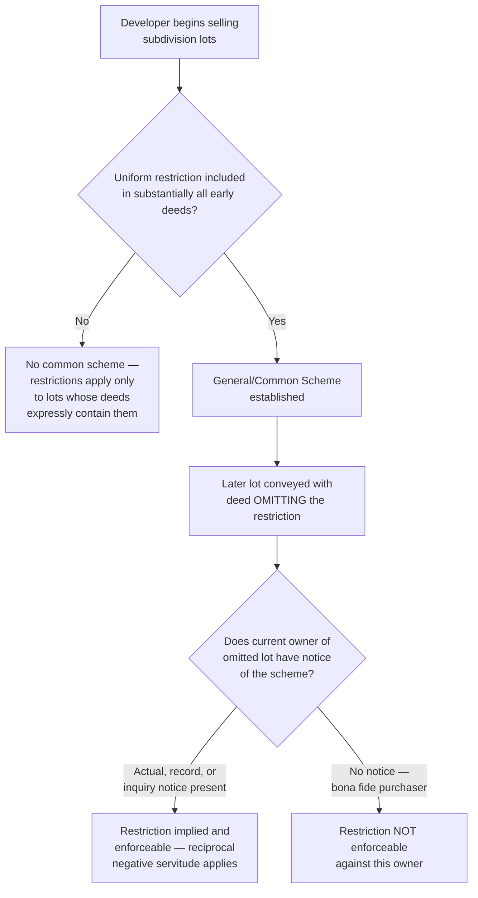
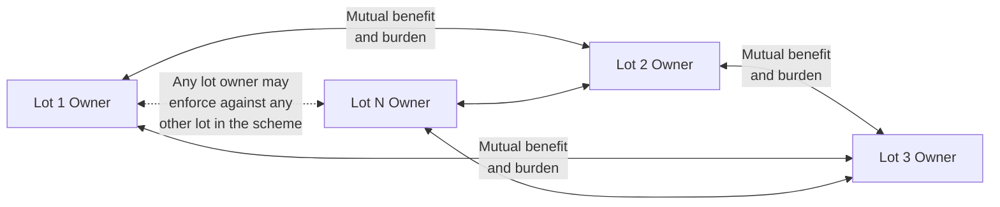

## Common Scheme and Reciprocal Negative Servitudes

### Overview

The common scheme (also called "reciprocal negative servitude" or "implied reciprocal easement") doctrine is the principal mechanism by which equity extends restrictive covenant enforcement beyond the literal terms of an individual deed, implying a restriction against a lot whose own conveyance is silent, based on evidence that the restriction was part of a coherent, uniform development plan. This doctrine addresses a recurring real-world problem in subdivision development: developers who impose restrictions across most lots sometimes fail — through oversight, changed drafting practices over time, or deliberate but unrecorded intent — to include identical restrictions in every deed, yet clearly intended the restrictions to apply uniformly.

### Historical Origin

The doctrine traces most prominently to the American case *Sanborn v. McLean* (Michigan, 1925), often cited as the leading formulation of the reciprocal negative easement concept, though the underlying principle draws on the same equitable notice-based foundation established in *Tulk v. Moxhay*.

**Key Points**

- *Sanborn v. McLean* involved a subdivision where the majority of deeds contained residential-use restrictions, but the specific lot in question — several lots removed from the original developer's sales — had passed through conveyances silent on the restriction
- The court held that where a general building scheme is shown to exist for the benefit of all lots in a subdivision, restrictions become reciprocally binding upon all lots as soon as the first lot is sold with the restriction — the scheme, once established, creates an "equitable easement" (or servitude) running with every lot in the tract, regardless of whether each individual subsequent deed repeats the restriction
- The court emphasized that a buyer purchasing in a subdivision with visible uniform development should reasonably inquire into whether restrictions exist, given the obvious character of the neighborhood

### Core Doctrinal Requirements

Courts applying the common scheme doctrine generally require:

1. **A general, common plan or scheme** of development for the subdivision as a whole, established at or before the time the first restricted lot was sold
2. **Uniform or substantially uniform restrictions** appearing in the deeds of most lots within the tract, demonstrating the scheme's existence
3. **Intent** that the restriction benefit and burden all lots reciprocally — not merely benefit the developer or a specific retained parcel
4. **Notice** to the current owner of the "omitted" lot — actual, record, or inquiry — of the general scheme

**Key Points**

- The doctrine is termed "reciprocal" because the restriction is understood to burden and benefit *all* lots simultaneously and mutually — each lot owner is both bound by, and entitled to enforce, the restriction against every other lot in the scheme, even absent privity between any two specific lot owners
- This reciprocal, mutual-benefit structure is what allows any lot owner within the scheme to sue any other lot owner for violations, a critical practical feature for subdivision-wide enforcement

### Establishing the Existence of a Common Scheme

Courts examine various forms of evidence to determine whether a genuine common scheme existed:

| Evidence Type | Significance |
| --- | --- |
| Recorded subdivision plat referencing restrictions | Strong evidence of an intended uniform scheme |
| Pattern of substantially identical restrictions in most deeds | Core evidentiary basis for the doctrine |
| Marketing materials describing the development as uniformly restricted | Supports inference of developer's original intent |
| Physical character of the neighborhood (uniform lot sizes, home types) | Supports inquiry notice argument |
| Timing — restrictions imposed from the outset of sales, not added later | Scheme must generally exist at or before first restricted sale |

**Key Points**

- A scheme established only after a substantial portion of lots have already been sold without restriction is generally insufficient — the doctrine requires the scheme's existence from the outset (or at least from before the specific lot's conveyance) to support a finding that all lots, including later ones, were intended to be bound
- Courts are more willing to find a common scheme where the developer's conduct and marketing consistently and publicly represented a uniformly restricted development, as opposed to sporadic or inconsistent restriction practices

### Illustrative Example

**Example**

A developer begins selling lots in a new subdivision in 1960, including a deed restriction limiting each lot to single-family residential use in the first 35 of 40 deeds conveyed. Due to a clerical oversight, deeds for Lots 36 through 40 omit the restriction. Decades later, the current owner of Lot 38 seeks to operate a home business in violation of what the neighborhood otherwise understands as a uniform residential restriction. Applying the *Sanborn v. McLean* framework: the pervasive restriction pattern across 35 of 40 lots, combined with the recorded subdivision plat and the neighborhood's visibly uniform residential character, establishes a general scheme. The current owner of Lot 38, purchasing into an obviously uniformly-developed residential subdivision, likely had at minimum inquiry notice of the scheme — sufficient to bind Lot 38 to the restriction despite its own deed's silence.

### Diagram: Common Scheme Doctrine Analysis

### Reciprocal Enforcement Structure

### Distinguishing the Doctrine from Ordinary Covenant Enforcement

| Feature | Ordinary Recorded Covenant | Common Scheme / Reciprocal Servitude |
| --- | --- | --- |
| Source of restriction on the specific lot | Express language in that lot's own deed | Implied from the pattern across other lots |
| Writing requirement | Directly satisfied by the lot's deed | Satisfied indirectly through the broader scheme's documented pattern |
| Who may enforce | Party expressly named as benefited | Any lot owner within the reciprocal scheme |
| Primary evidentiary focus | The instrument's text | The pattern, timing, and notice surrounding the overall development |

### Limits and Judicial Caution

**Key Points**

- Courts apply this doctrine cautiously because it operates as a form of implied restriction on land use and alienability without the omitted lot's own deed expressly imposing it — courts are wary of over-extending the doctrine to bind buyers who genuinely lacked any reasonable basis for notice
- The doctrine is more readily applied where the omission is clearly an isolated drafting anomaly against an otherwise overwhelming and consistent pattern, and less readily applied where the developer's practice was inconsistent or the restriction pattern was not clearly established from the outset
- [Inference] Because the strength of the "notice" inference from mere neighborhood character (as opposed to a recorded plat or declaration) varies considerably by jurisdiction and by the specific facts, outcomes in close cases are difficult to predict with certainty, and practitioners should not assume the doctrine will reliably cure a drafting omission

### Restatement (Third) Treatment

**Key Points**

- The Restatement (Third) of Property: Servitudes continues to recognize implication of servitudes from a general plan, integrating it into the broader unified servitude framework, while emphasizing that clear evidence of the developer's intent and adequate notice to affected parties remain central to the analysis
- [Inference] Practitioners should confirm whether the applicable jurisdiction continues to apply the traditional *Sanborn v. McLean*-style analysis or has shifted terminology and emphasis consistent with Restatement (Third) formulations, as this can affect both the framing of arguments and the specific evidentiary showing required

### Practical Drafting Guidance to Avoid Reliance on the Doctrine

- Include restrictive covenants **consistently** in every single deed within a subdivision from the outset of sales, eliminating the need to rely on implication
- Record a comprehensive **master declaration** or **subdivision plat** explicitly stating that all lots within the tract are subject to uniform restrictions, providing the strongest and most direct record notice mechanism
- Where an omission is later discovered, promptly execute and record a corrective instrument for the specific affected lot(s) rather than relying on future litigation to establish an implied reciprocal servitude
- Purchasers' counsel conducting title review in a subdivision context should examine not just the specific lot's chain of title but also a sampling of other lots' deeds and any recorded plat, to identify potential common scheme exposure even where the target lot's own deed appears unrestricted

### Related Topics

- Requirements for Enforcement in Equity
- Origins in Equity and the Notice Principle
- Real Covenants vs. Equitable Servitudes
- Notice and Recording Acts in Covenant Enforcement
- Common Interest Communities and Declarations of Covenants
- Termination and Modification of Real Covenants
- Restatement (Third) of Property: Servitudes — Unified Framework