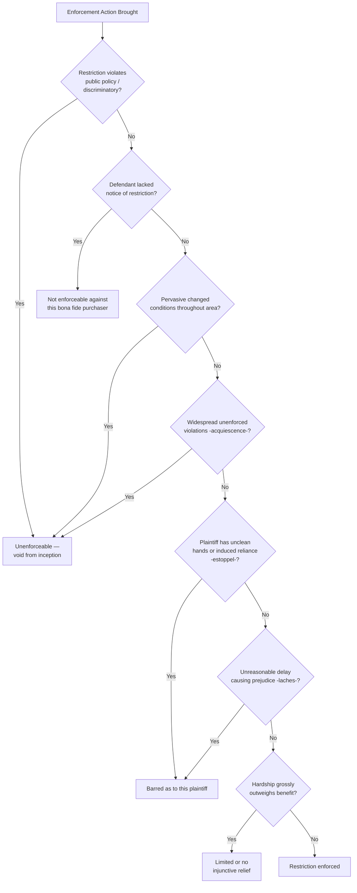

## Defenses to Enforcement

### Overview

Because equitable servitudes are enforced through the discretionary tools of equity, a substantial body of defenses may bar or limit enforcement even where the restriction's technical elements (intent, touch and concern, notice) are satisfied. These defenses draw heavily on traditional equitable maxims and doctrines, reflecting equity's underlying commitment to fairness and its historical reluctance to grant relief where enforcement would itself work an injustice. This topic surveys the principal defenses available to a party resisting enforcement of a restrictive covenant or equitable servitude.

### Categories of Defenses

Defenses to equitable servitude enforcement generally fall into several analytical categories: defenses challenging the servitude's continued validity or applicability (changed conditions, public policy invalidity), defenses based on the enforcing party's own conduct (unclean hands, acquiescence, estoppel), procedural/timing defenses (laches, statute of limitations), and discretionary balancing defenses (relative hardship).

### 1. Changed Conditions

**Key Points**

- Where the character of the restricted area has changed so fundamentally since the servitude's creation that its original purpose can no longer be achieved, a court may decline to enforce the restriction
- Requires **pervasive** change throughout the affected area, not merely at its periphery — courts are reluctant to release interior lots from restrictions based only on boundary-area change
- This defense does not retroactively invalidate the restriction for all purposes; it typically results in the court declining injunctive relief going forward, effectively treating the restriction as unenforceable in equity even though the underlying instrument remains formally in place

**Example**

A subdivision originally restricted to single-family residential use finds that a major highway now runs directly through what was once its interior, with widespread commercial conversion of adjacent lots on both sides of the restriction's boundary. If a remaining interior lot owner seeks to build a small retail structure and neighbors sue to enforce the residential restriction, a court may find the changed conditions defense applicable if the commercial transformation has become so pervasive that the original residential character can no longer meaningfully be preserved — though the defense would likely fail if only a narrow fringe near the highway had changed while the interior remains genuinely residential.

### 2. Acquiescence / Abandonment

**Key Points**

- Where the party seeking enforcement (or the community of benefited owners generally) has permitted widespread, uncontested violations of the same or similar restrictions over a significant period, courts may find the restriction abandoned or that enforcement has been waived
- Requires evidence of **substantial, community-wide** disregard of the restriction — isolated or minor violations are typically insufficient
- Distinguished from changed conditions: acquiescence focuses on the *pattern of non-enforcement*, while changed conditions focuses on the *transformation of the area's physical/economic character*, though the two often arise together on similar facts

**Example**

In a subdivision restricted to single-story construction, if numerous two-story homes have been built openly over many years without objection from any lot owner or the homeowners' association, a court may find the height restriction abandoned through acquiescence, barring a belated attempt to enforce it against a new violator — reasoning that selective, late enforcement against one owner while ignoring years of similar violations by others would be inequitable.

### 3. Unclean Hands

**Key Points**

- A plaintiff who has themselves violated the same or a closely related restriction, or who has engaged in inequitable conduct connected to the dispute, may be barred from obtaining equitable relief under the unclean hands doctrine
- The violation must generally bear a sufficiently close relationship to the restriction being enforced — courts do not apply unclean hands to bar relief based on wholly unrelated misconduct
- This defense reflects equity's core maxim that "one who seeks equity must do equity" and must come to the court with clean hands

**Example**

A homeowner who has built an unauthorized second-story addition in violation of a height restriction sues a neighbor for constructing a similar addition. A court may decline to grant an injunction against the neighbor on unclean hands grounds, given the plaintiff's own violation of the identical restriction.

### 4. Estoppel

**Key Points**

- Distinct from but related to acquiescence, estoppel bars enforcement where the party seeking to enforce the restriction engaged in conduct (words, actions, or a pattern of tolerance) that reasonably induced the defendant to believe the restriction would not be enforced, and the defendant detrimentally relied on that inducement
- Commonly arises where a benefited owner expressly or implicitly approved a plan for construction that violates the restriction, and the burdened owner proceeded with substantial expenditure in reliance, only to face a later enforcement suit from the same party

### 5. Laches

**Key Points**

- An equitable timing defense distinct from a statute of limitations: laches bars enforcement where the plaintiff **unreasonably delayed** bringing the enforcement action, and that delay caused **prejudice** to the defendant
- Commonly arises where a violation was visible and ongoing (e.g., construction of a prohibited structure) and the benefited party waited an unreasonable period — often until after substantial construction was completed — before seeking an injunction
- Distinguished from a statute of limitations, which applies a fixed statutory period regardless of prejudice; laches is a flexible, fact-specific equitable inquiry focused on the reasonableness of the delay and the resulting harm to the defendant

**Example**

A neighbor observes a violation beginning (foundation work for a structure that violates a setback restriction) but takes no action until the structure is fully completed eighteen months later, then sues for a mandatory injunction requiring demolition. A court may apply laches to deny the injunction, particularly given the substantial prejudice (cost of demolition) that could have been avoided by earlier objection, though the availability of laches as a defense and the precise delay threshold vary by jurisdiction and by how visible/apparent the violation was during construction.

### 6. Relative Hardship Balancing

**Key Points**

- Even absent a complete bar to enforcement, courts may decline to grant a full injunction (or may craft more limited relief) where the hardship of strict enforcement on the defendant grossly outweighs the benefit to the plaintiff, particularly for minor, technical, or good-faith violations
- This is a discretionary balancing exercise rather than an absolute defense, and courts vary in how readily they will decline injunctive relief on hardship grounds alone, especially where doing so would effectively rewrite the parties' original bargain

### 7. Lack of Notice (Bona Fide Purchaser Defense)

**Key Points**

- As discussed under the notice principle, a party who acquired the burdened land without actual, record, or inquiry notice of the restriction generally takes free of it as a bona fide purchaser
- This operates less as an affirmative "defense" in the traditional sense and more as a failure of one of the doctrine's core required elements, but is commonly asserted and analyzed as a defense in litigation practice

### 8. Public Policy Invalidity

**Key Points**

- A restriction that violates constitutional or statutory anti-discrimination protections (most notably racially restrictive covenants, void and unenforceable under *Shelley v. Kraemer* and the Fair Housing Act) is unenforceable regardless of notice, intent, or touch and concern
- Restrictions constituting unreasonable restraints on alienation, or otherwise found to violate public policy under the Restatement (Third)'s validity framework, may similarly be invalidated
- Unlike changed conditions or acquiescence (which reflect a restriction's loss of continued relevance over time), public policy invalidity typically reflects that the restriction was **never validly enforceable** from its inception

### Comparative Table of Defenses

| Defense | Focus | Requires Pattern/History? |
| --- | --- | --- |
| Changed conditions | Area's transformed character | Yes — pervasive area-wide change |
| Acquiescence/abandonment | Pattern of non-enforcement | Yes — widespread unenforced violations |
| Unclean hands | Plaintiff's own related misconduct | No — single related violation may suffice |
| Estoppel | Reliance on enforcing party's inducement | No — single instance of inducement may suffice |
| Laches | Unreasonable delay + prejudice | No — focused on this specific dispute's timing |
| Relative hardship | Disproportionate burden vs. benefit | No — case-specific balancing |
| Lack of notice | Absence of required element | No — turns on this defendant's specific knowledge |
| Public policy invalidity | Restriction's inherent invalidity | No — applies regardless of history |

### Diagram: Defense Analysis Framework

### Practical Litigation Strategy

**For defendants resisting enforcement:**

- Develop evidence of any pattern of non-enforcement or similar violations by other lot owners to support acquiescence/abandonment defenses
- Investigate the plaintiff's own compliance history for potential unclean hands arguments
- Document the timeline of the plaintiff's awareness of the violation and any delay in bringing suit for laches purposes
- Gather evidence of area-wide transformation, not merely isolated changes, to support a changed conditions defense

**For plaintiffs seeking enforcement:**

- Act promptly upon discovering a violation to avoid laches exposure
- Maintain consistent enforcement practices across the community to avoid future acquiescence defenses
- Ensure the plaintiff's own property is in compliance before initiating enforcement action against another owner

### Related Topics

- Requirements for Enforcement in Equity
- Origins in Equity and the Notice Principle
- Common Scheme and Reciprocal Negative Servitudes
- Termination and Modification of Real Covenants
- Racially Restrictive Covenants and Constitutional Limits (*Shelley v. Kraemer*)
- Injunctive Relief and Equitable Remedies in Property Disputes
- Common Interest Communities and Consistent Enforcement Practices