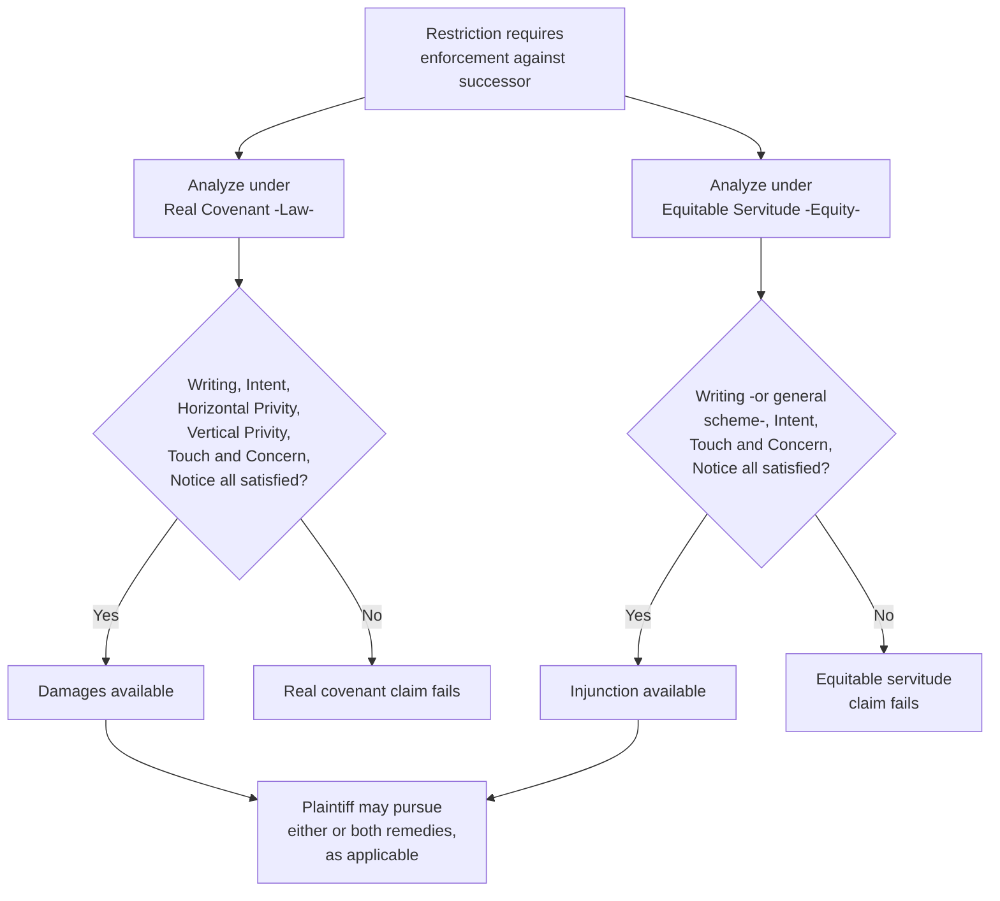

## Relationship Between Real Covenants and Equitable Servitudes

### Overview

Real covenants and equitable servitudes are historically distinct but substantively overlapping doctrines governing the enforceability of land use restrictions against successive owners. Understanding their relationship — where they converge, where they diverge, and how modern law has moved toward unifying them — is essential to correctly analyzing any covenant enforcement problem, since the same restriction may be enforceable under one doctrine but not the other, and litigants routinely plead both theories in the alternative.

### The Historical Split

**Key Points**

- Real covenant doctrine developed in the English common law courts, enforced through actions for **damages**, and burdened by strict technical requirements — most notably horizontal and vertical privity — reflecting law courts' general reluctance to extend contractual-origin obligations to non-parties
- Equitable servitude doctrine developed in the Court of Chancery, beginning with *Tulk v. Moxhay* (1848), enforced through **injunctive relief**, and organized around a more functional notice-based inquiry that dispensed with the privity requirements
- This split reflects the broader historical division between courts of law and courts of equity in the English legal system, a division that persists conceptually in American property law even though most American jurisdictions have merged law and equity procedurally into a single court system

### Side-by-Side Comparison

| Feature | Real Covenant (Law) | Equitable Servitude (Equity) |
| --- | --- | --- |
| Historical origin | Common law courts | Court of Chancery (*Tulk v. Moxhay*) |
| Remedy | Damages | Injunction |
| Writing (Statute of Frauds) | Required | Generally required, subject to general scheme exception |
| Intent | Required | Required |
| Horizontal privity | Required (traditional rule) | Not required |
| Vertical privity | Required — strict for burden, relaxed for benefit | Not required — notice substitutes |
| Touch and concern | Required | Required (same substantive inquiry) |
| Notice | Required for burden (via recording act) | Central, defining requirement |
| Implication from general scheme | Not generally applicable | Recognized (*Sanborn v. McLean*) |

### Where the Doctrines Converge

Both doctrines share a common substantive core:

- **Intent** that the restriction bind or benefit successors is required under both frameworks
- **Touch and concern** is required under both — a purely personal obligation unrelated to land use will not run under either doctrine
- **Writing** satisfying the Statute of Frauds is generally required under both, subject to the general scheme exception recognized primarily in the equitable context
- Both doctrines ultimately serve the same underlying policy goal: enabling durable land use restrictions to bind successive owners while protecting successors from unfair surprise

### Where the Doctrines Diverge

The critical divergence lies in the **mechanism** used to protect successors from unfair surprise:

- Real covenant doctrine uses **privity** — requiring the original parties to have been in a specified property relationship, and requiring successors to have derived title through the entire estate (for burden purposes)
- Equitable servitude doctrine uses **notice** directly — asking simply whether the current owner knew or should have known of the restriction, regardless of the relationship between the original parties or the precise estate the successor received

This divergence means a covenant can **fail** to run at law (no horizontal privity, e.g., neighbors' side agreement without an accompanying conveyance) while still being **fully enforceable** in equity (the current owner had record or inquiry notice).

### Practical Litigation Consequence: Pleading in the Alternative

**Key Points**

- Because the two doctrines have different requirements and different remedies, modern litigants seeking to enforce a restriction against a successor routinely plead **both** theories in the alternative — a real covenant claim for damages, and an equitable servitude claim for injunctive relief
- A plaintiff seeking to stop an ongoing violation (e.g., construction in violation of a height restriction) will typically prioritize the equitable servitude theory, since injunctive relief directly addresses the harm, while damages under the real covenant theory may be an inadequate remedy
- Conversely, where injunctive relief is unavailable or has become moot (e.g., the violating structure is already completed and demolition would be disproportionate), a damages claim under real covenant doctrine may become the primary or sole viable remedy

### Diagram: Dual-Track Analysis

### Illustrative Comparative Example

**Example**

Two neighboring landowners, who already independently own their respective lots, sign a written agreement restricting both properties to residential use, without any accompanying conveyance of a property interest between them. Years later, one party's successor violates the restriction.

- **Under real covenant doctrine**: horizontal privity is absent (no grantor-grantee or landlord-tenant relationship existed between the original parties at creation under the traditional rule), so the burden likely fails to run at law — a damages action against the successor is unlikely to succeed under strict traditional doctrine.
- **Under equitable servitude doctrine**: horizontal privity is irrelevant. If the successor had notice of the restriction (e.g., it was recorded, or the successor had actual knowledge), the restriction is enforceable via injunction despite the absence of privity.

This example crystallizes why equitable servitude doctrine has become the practically dominant framework for enforcing restrictions arising outside the classic developer-to-buyer conveyance context.

### The Restatement (Third) Unification

**Key Points**

- The Restatement (Third) of Property: Servitudes formally **merges** real covenants and equitable servitudes into a single unified category — the "servitude" — governed by common requirements: intent, a relaxed validity inquiry (replacing touch and concern with public policy analysis), and notice
- Under this unified approach, horizontal privity is abolished entirely, and the historical burden/benefit vertical privity asymmetry is substantially reduced
- The remedy (damages versus injunction) becomes a question of the appropriate relief for the specific case, rather than a doctrinal gateway determining which set of technical elements must first be satisfied
- [Inference] The degree to which individual states have formally adopted this unified Restatement (Third) approach, versus continuing to apply the traditional bifurcated common law framework, varies considerably, and the applicable jurisdiction's specific case law and any relevant statutory servitude provisions must be verified before assuming either framework controls

### Comparative Table: Traditional Bifurcated vs. Restatement (Third) Unified Approach

| Feature | Traditional Bifurcated Approach | Restatement (Third) Unified Approach |
| --- | --- | --- |
| Number of doctrines | Two separate frameworks (real covenant, equitable servitude) | One unified "servitude" framework |
| Horizontal privity | Required for real covenants | Abolished |
| Vertical privity | Strict/relaxed asymmetry for burden/benefit | Substantially relaxed for both |
| Touch and concern | Traditional categorical test | Replaced by public policy validity analysis |
| Remedy selection | Tied to which doctrine's elements are satisfied | Flexible — determined by appropriateness to the case |

### Why This Relationship Still Matters in Practice

**Key Points**

- Even in jurisdictions that have not formally adopted the Restatement (Third) unification, the practical reality is that equitable servitude doctrine — with its more relaxed privity-free framework — has become the dominant vehicle for modern covenant enforcement, particularly in common interest communities and subdivisions
- Nonetheless, real covenant doctrine remains relevant where **damages** are the desired or only available remedy, where a claim is time-barred under equitable laches principles but not under the legal statute of limitations (or vice versa), or in jurisdictions that have not extended equitable servitude protection as broadly
- Understanding both frameworks, and their point-by-point divergence, remains essential for correctly identifying which remedy is available against which party, and for recognizing that a covenant's failure under one theory does not resolve its enforceability under the other

### Practical Guidance for Practitioners

- When analyzing any covenant enforcement question, systematically work through **both** frameworks rather than assuming the outcome under one necessarily determines the outcome under the other
- When drafting new restrictions, satisfy the most demanding common denominator of both frameworks (writing, clear intent language, horizontal privity via inclusion in a conveyancing instrument, recording for notice purposes) to maximize enforceability regardless of which doctrine a future court applies
- When litigating, plead both theories in the alternative where the desired remedy or the specific factual gaps in the record make it unclear which framework will ultimately govern

### Related Topics

- Requirements for Covenants to Run with the Land
- Origins in Equity and the Notice Principle
- Requirements for Enforcement in Equity
- Horizontal and Vertical Privity
- The Touch and Concern Requirement
- Restatement (Third) of Property: Servitudes — Unified Framework
- Common Scheme and Reciprocal Negative Servitudes
- Defenses to Enforcement