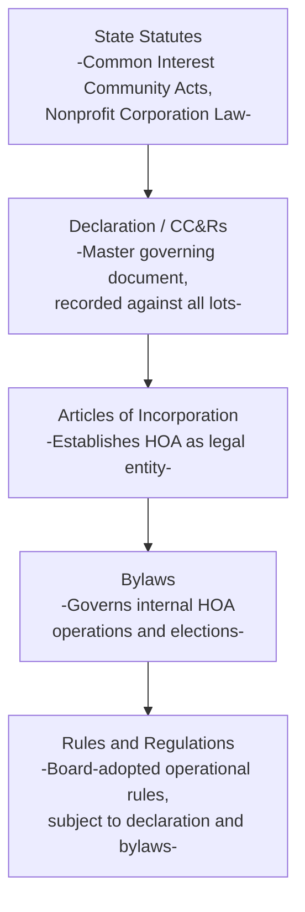
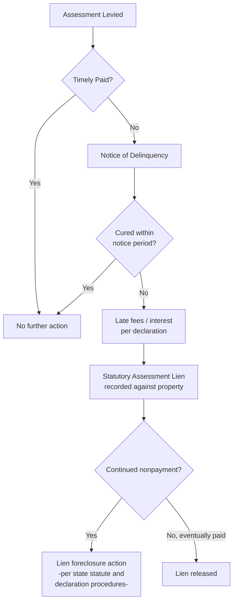

## Homeowners Associations and Governance Structures

### Overview

Homeowners associations (HOAs) are the primary governance mechanism through which common interest communities administer, enforce, and finance shared restrictions, amenities, and services. Legally structured as nonprofit corporations or unincorporated associations, HOAs occupy a distinctive position in property law — exercising quasi-governmental regulatory and financial authority over private residential communities, while deriving that authority from a combination of corporate law, contract law (the declaration and bylaws), and the underlying equitable servitude and real covenant doctrines governing the restrictions themselves.

### Legal Structure and Formation

**Key Points**

- Most HOAs are formed as **nonprofit corporations** under state nonprofit corporation statutes, providing the association with a formal legal identity capable of contracting, suing, being sued, holding title to common property, and levying assessments
- The HOA's authority derives from a hierarchy of governing documents, typically including the **declaration** (or CC&Rs — Covenants, Conditions, and Restrictions), **articles of incorporation**, **bylaws**, and **rules and regulations** adopted by the board
- Membership in the HOA is typically **automatic and mandatory** upon purchasing property within the community — a defining feature that distinguishes HOA membership from voluntary association membership generally, and one that has drawn both legal scrutiny and academic criticism regarding the extent of "consent" involved

### The Governing Documents Hierarchy

**Key Points**

- Each level of this hierarchy must be consistent with the levels above it — rules and regulations cannot contradict the bylaws, and bylaws cannot contradict the declaration or applicable state statute
- The declaration is generally the most difficult document to amend, typically requiring a supermajority vote of the membership (commonly 67% to 75%, though this varies), reflecting its foundational role in establishing the community's core restrictions
- Bylaws and rules are typically easier to amend through board action or simple majority membership votes, reflecting their more operational/administrative character

### Governance Structure: The Board of Directors

**Key Points**

- HOAs are typically governed by an elected **board of directors**, composed of homeowners elected by the membership, responsible for day-to-day administration, enforcement, budgeting, and contracting on behalf of the association
- Board members generally owe **fiduciary duties** to the association and its members, analogous to corporate director duties of care and loyalty, though the precise scope and enforcement of these duties varies by state HOA statute and case law
- Many HOAs additionally engage professional **community management companies** to handle day-to-day administrative functions, financial management, and vendor coordination, under contract with and oversight by the board

### Core Governance Functions

#### 1. Assessment Levying and Collection

- HOAs derive their primary funding through mandatory **assessments** (dues) levied against each member, typically calculated per the formula specified in the declaration (often equal shares, or proportional to unit size/value)
- Assessment covenants generally satisfy the touch and concern requirement because they fund maintenance, insurance, and amenities benefiting the community and its property values
- Most jurisdictions grant HOAs a **statutory lien** on member properties for unpaid assessments, often with priority provisions (some states grant limited "super-priority" status ahead of first mortgages for a capped amount of unpaid assessments)

#### 2. Rule Enforcement

- Boards are typically empowered to enforce the declaration's restrictions and adopted rules through a graduated enforcement process: notice of violation, opportunity to cure, fines, and ultimately legal action (injunctive relief or lien foreclosure for unpaid fines/assessments)
- Enforcement must generally be applied **consistently** across the membership, since selective or inconsistent enforcement can support abandonment, waiver, or estoppel defenses in later disputes

#### 3. Architectural Control

- Many declarations establish an **Architectural Review Committee (ARC)** or similar body with authority to review and approve proposed exterior modifications, new construction, and landscaping changes before they proceed
- Architectural control provisions are among the most frequently litigated HOA governance functions, given the inherently subjective judgments often involved in aesthetic approval standards

#### 4. Common Area Maintenance

- HOAs typically hold title to, or an easement/license over, **common areas** (shared amenities such as clubhouses, pools, private roads, and green spaces), and bear responsibility for their maintenance, insurance, and capital repair/replacement planning
- Reserve fund requirements — statutory or declaration-based obligations to accumulate funds for future major repairs — are an increasingly significant governance and financial planning function

### Comparative Table of Governing Document Functions

| Document | Primary Function | Typical Amendment Difficulty |
| --- | --- | --- |
| Declaration (CC&Rs) | Core restrictions, assessment obligations, easements | High (supermajority vote) |
| Articles of Incorporation | Establishes HOA as a legal corporate entity | Moderate (state filing + membership vote) |
| Bylaws | Internal governance — elections, meetings, board powers | Moderate (membership vote per bylaws) |
| Rules and Regulations | Day-to-day operational rules | Low (board resolution, often with notice) |

### Statutory Overlay: Common Interest Community Acts

**Key Points**

- Most states have enacted statutes specifically governing common interest communities and HOAs (often modeled in whole or part on the Uniform Common Interest Ownership Act, UCIOA, or predecessor uniform acts), imposing baseline requirements regarding disclosure, meeting procedures, financial transparency, assessment authority, and dispute resolution
- [Inference] Because these statutes vary considerably in scope, specific requirements, and the degree to which they override or supplement contrary declaration provisions, practitioners must consult the specific state's current common interest community statute rather than assuming uniform treatment
- Many states have adopted specific statutory protections for homeowners regarding fine and lien procedures, meeting notice and open-meeting requirements, and dispute resolution (including mandatory alternative dispute resolution before litigation in some states)

### Fiduciary Duties and the Business Judgment Rule

**Key Points**

- Board members typically owe duties of **care** (informed, reasonable decision-making) and **loyalty** (avoiding self-dealing and conflicts of interest) to the association
- Many jurisdictions apply a version of the corporate **business judgment rule** to HOA board decisions, affording deference to good-faith, informed board decisions within the scope of the board's authority, and limiting judicial second-guessing of routine governance and enforcement discretion
- [Inference] The precise scope of business judgment rule protection for HOA boards — and the degree to which it shields discretionary architectural or enforcement decisions from homeowner challenge — varies by jurisdiction and remains an evolving area of case law

### Diagram: Assessment Enforcement Pathway

### Common Disputes and Litigation Areas

- **Selective or inconsistent enforcement** of architectural or use restrictions, raising waiver/estoppel defenses
- **Assessment disputes**, including challenges to special assessments, reserve fund adequacy, and lien foreclosure procedures
- **Board authority disputes**, including challenges to board decisions as exceeding declaration authority or violating fiduciary duties
- **Amendment validity disputes**, particularly regarding whether proper supermajority procedures were followed
- **Disability and religious accommodation disputes** under the Fair Housing Act, particularly regarding architectural restrictions, service/support animals, and accessibility modifications — a significant and evolving area of federal overlay on HOA governance authority

### Interaction with Fair Housing and Other Federal Law

**Key Points**

- HOA rules and enforcement actions remain subject to the federal Fair Housing Act's prohibitions on discrimination and requirements to provide reasonable accommodations (e.g., for service animals, accessibility modifications) and reasonable modifications, notwithstanding contrary declaration provisions
- [Inference] Given the evolving nature of Fair Housing Act guidance and case law regarding HOA accommodation obligations, practitioners advising HOA boards on accommodation requests should verify current HUD guidance and recent case law rather than relying solely on the declaration's literal terms

### Practical Guidance

**For HOA boards:**

- Maintain consistent, well-documented enforcement practices to avoid waiver and selective enforcement challenges
- Ensure architectural review standards are as objective and clearly articulated as possible to reduce litigation risk
- Maintain adequate reserve funding and transparent financial reporting consistent with state statutory requirements

**For homeowners:**

- Review the full governing document hierarchy (not just the declaration) before purchasing into a common interest community, since bylaws and rules can materially affect day-to-day living
- Understand the assessment lien and foreclosure risk associated with delinquent assessments, which can be a serious and sometimes underappreciated consequence of nonpayment

### Related Topics

- Common Scheme and Reciprocal Negative Servitudes
- Termination and Modification of Real Covenants
- Assessment Liens and Foreclosure Procedures
- Architectural Review Committees and Design Control
- Uniform Common Interest Ownership Act (UCIOA)
- Fair Housing Act Accommodation Requirements in Common Interest Communities
- Fiduciary Duties of HOA Board Members and the Business Judgment Rule
- Declaration Amendment Procedures and Supermajority Requirements