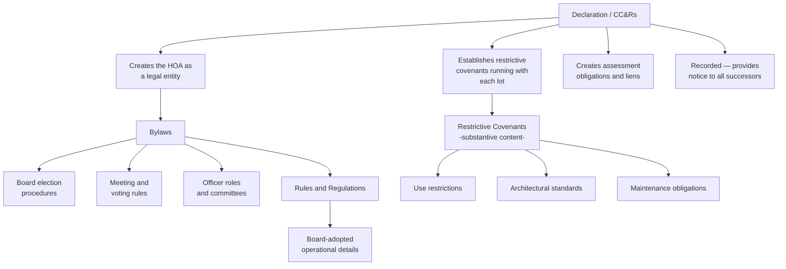

## Declarations, Bylaws, and Restrictive Covenants

### Overview

The declaration, bylaws, and restrictive covenants together form the constitutional framework of a common interest community — the layered set of governing instruments that create, define, and regulate the servitude regime binding every lot and unit owner. While closely related and frequently referenced collectively as "governing documents," each instrument serves a distinct legal function, is created and amended through different procedures, and carries different doctrinal significance under property, corporate, and contract law. This topic examines each instrument individually and clarifies how they interact as a unified regulatory structure.

### The Declaration (CC&Rs)

#### Legal Character and Function

**Key Points**

- The declaration — commonly styled as the "Declaration of Covenants, Conditions, and Restrictions" (CC&Rs) — is the foundational instrument that **creates** the common interest community's servitude regime, recorded against every lot or unit within the development
- It functions simultaneously as a real property instrument (creating covenants and easements running with the land) and as a quasi-constitutional document establishing the community's basic structure, including the creation of the homeowners association itself and members' mandatory membership in it
- Because it is recorded in the chain of title for every affected parcel, the declaration provides the essential **notice** foundation for equitable servitude enforcement against all current and future owners

#### Typical Contents

| Component | Purpose |
| --- | --- |
| Use restrictions | Residential-only use, prohibited activities, rental restrictions |
| Architectural standards | Design review requirements, prohibited exterior modifications |
| Assessment obligations | Basis for mandatory dues, special assessment authority |
| Easements | Utility easements, access easements, common area easements |
| Common area definitions | Identifies and allocates shared amenities and maintenance responsibility |
| HOA creation and powers | Establishes the association and delegates enforcement/governance authority |
| Amendment procedures | Specifies required vote thresholds for future changes |
| Enforcement mechanisms | Fines, liens, and legal remedies available for violations |

#### Amendment of the Declaration

**Key Points**

- Because the declaration establishes the community's foundational restrictions, most declarations require a **supermajority vote** of the membership to amend (commonly ranging from 67% to 75%, though this varies significantly by community and state), reflecting the heightened importance and difficulty of altering core restrictions
- Some declarations include **staged or graduated amendment thresholds** depending on the provision being amended (e.g., a lower threshold for administrative changes, a higher threshold for use restriction changes)
- Amendments must generally be recorded to provide continued notice to future purchasers, and improperly recorded or procedurally deficient amendments are a frequent source of litigation

### The Bylaws

#### Legal Character and Function

**Key Points**

- Bylaws govern the **internal corporate operations** of the homeowners association itself — they are fundamentally a corporate governance document, distinct from the declaration's property-law function of creating servitudes
- Typical bylaw provisions include: board of directors composition and election procedures, officer roles and responsibilities, meeting notice and quorum requirements, voting procedures, and committee structures
- Bylaws are generally **easier to amend** than the declaration, often requiring only a majority vote of the membership or, for certain provisions, board action alone, reflecting their more operational and less foundational character

#### Distinguishing Bylaws from the Declaration

| Feature | Declaration | Bylaws |
| --- | --- | --- |
| Primary legal character | Real property instrument (servitude-creating) | Corporate governance instrument |
| Recorded against the land? | Yes | Typically not recorded against individual lots (though often publicly filed) |
| Amendment difficulty | High (supermajority) | Moderate (majority or board action) |
| Subject matter | Use restrictions, assessments, easements | Elections, meetings, board structure |
| Runs with the land? | Yes — binds successive owners as a servitude | Governs the corporate entity, indirectly binding members through mandatory HOA membership |

### Restrictive Covenants — The Substantive Content

**Key Points**

- "Restrictive covenants" is not a separate governing document per se, but rather describes the **substantive land use restrictions** contained within the declaration — the actual servitude obligations (use limitations, architectural requirements, maintenance duties) that run with each lot
- These are the provisions analyzed under real covenant and equitable servitude doctrine — requiring intent, touch and concern, and notice (or, at law, privity) to bind successive owners
- Common categories include: **use restrictions** (residential-only, no home businesses, occupancy limits), **architectural/aesthetic restrictions** (approved exterior colors, landscaping standards, prohibited structures), **nuisance-type restrictions** (noise limitations, parking restrictions, pet restrictions), and **affirmative obligations** (mandatory landscaping maintenance, assessment payment)

### Diagram: Instrument Relationship and Function

### Interaction and Hierarchy

**Key Points**

- Where a conflict exists between the declaration and the bylaws (or rules and regulations), the **declaration generally controls**, given its foundational, supermajority-protected status and its character as the property-law instrument actually creating the enforceable servitudes
- Rules and regulations adopted by the board must be consistent with both the declaration and the bylaws; a board cannot use its rule-making authority to effectively amend the declaration's substantive restrictions without following the declaration's own amendment procedure
- [Inference] The precise doctrinal treatment of conflicts between these documents, and the degree of deference given to board interpretation, varies by jurisdiction and by the specific language of the governing documents themselves, so practitioners should examine the specific declaration's own internal hierarchy and conflict-resolution provisions rather than assuming a universal rule

### Recording and Notice Considerations

**Key Points**

- The declaration's recording is what provides the **constructive notice** foundation essential to equitable servitude enforcement against all subsequent purchasers, consistent with the notice principle established in *Tulk v. Moxhay*
- Bylaws and rules, by contrast, typically bind members through their **contractual relationship with the HOA** (arising from mandatory membership established by the declaration) rather than through independent real-property notice principles, though many jurisdictions and title practices also encourage recording or referencing bylaws for maximum clarity
- Amendments to any of these documents should be promptly and properly recorded (for the declaration) or maintained in the HOA's official records (for bylaws and rules) to preserve enforceability and provide adequate notice to prospective purchasers conducting due diligence

### Statutory Overlay

**Key Points**

- State common interest community statutes (many modeled on the Uniform Common Interest Ownership Act or predecessor uniform acts) frequently impose baseline requirements for declaration content, disclosure obligations to prospective purchasers, and amendment procedures that may supplement or override contrary provisions in the governing documents themselves
- [Inference] Because these statutory requirements vary by state and are subject to periodic legislative revision, practitioners drafting or amending governing documents should verify current statutory requirements in the applicable jurisdiction rather than relying solely on the community's existing document templates

### Practical Drafting Guidance

**For declarations:**

- Draft restrictive covenants with precise, objective standards wherever possible to minimize touch-and-concern and enforcement disputes
- Include clear, workable amendment procedures with realistic (not excessively high) supermajority thresholds to allow the community to adapt over time without becoming practically unamendable
- Expressly address the relationship and hierarchy between the declaration, bylaws, and rules to preempt future conflict disputes

**For bylaws:**

- Ensure bylaws remain consistent with the declaration's substantive restrictions and the applicable state nonprofit corporation and common interest community statutes
- Establish clear, fair election and meeting procedures to reduce governance disputes and challenges to board legitimacy

**For purchasers and their counsel:**

- Review the complete document hierarchy — declaration, articles, bylaws, and current rules — as part of standard due diligence, since restrictions can appear in any of these layers
- Pay particular attention to amendment history and recorded amendments, since a community's current restrictions may differ substantially from its original declaration

### Related Topics

- Homeowners Associations and Governance Structures
- Common Scheme and Reciprocal Negative Servitudes
- Origins in Equity and the Notice Principle
- Requirements for Enforcement in Equity
- Termination and Modification of Real Covenants
- Uniform Common Interest Ownership Act (UCIOA)
- Assessment Liens and Foreclosure Procedures
- Declaration Amendment Procedures and Supermajority Requirements