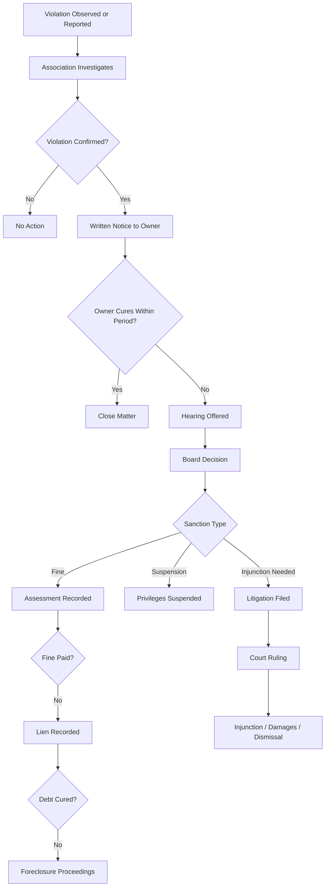

## Enforcement of Community Restrictions

### Overview

Enforcement of community restrictions concerns the legal mechanisms by which common interest communities (CICs) — homeowners associations (HOAs), condominium associations, and cooperative housing corporations — compel compliance with governing documents, including declarations of covenants, conditions, and restrictions (CC&Rs), bylaws, and rules and regulations. Enforcement transforms restrictions from aspirational text into binding obligations, and the mechanisms available, the standards courts apply, and the defenses owners may raise together define the practical power of a CIC's governance regime.

### Sources of Enforcement Authority

**Key Points**

- Enforcement authority derives from multiple layered sources, and an association's power is only as strong as its weakest link in this chain.
- **Declaration (CC&Rs)**: The primary source, typically recorded against the land and running with title, granting the association authority to enforce restrictions against current and future owners.
- **Bylaws**: Govern internal association procedures, including board authority to initiate enforcement actions and required voting thresholds.
- **Rules and Regulations**: Board-adopted policies implementing the declaration's general restrictions with specific, often more detailed, standards (e.g., "no fences over 4 feet" implementing a general "no unsightly structures" covenant).
- **Enabling Statutes**: State common interest community acts (e.g., Uniform Common Interest Ownership Act (UCIOA), Uniform Condominium Act (UCA), or state-specific statutes) often supply default enforcement powers, procedural requirements, and limits that apply even when the declaration is silent or conflicting.

The declaration is generally supreme among governing documents; rules and regulations that exceed or contradict declaration authority are frequently held unenforceable, since a board's rulemaking power is delegated and interstitial rather than freestanding.

### Enforcement Mechanisms

#### Self-Help Remedies

**Key Points**

- **Fines**: Monetary penalties assessed against the violating owner, often escalating for continuing or repeat violations. Many statutes require notice and an opportunity for hearing before a fine becomes a valid assessment.
- **Suspension of Privileges**: Temporary denial of access to common amenities (pools, clubhouses, parking) pending cure of a violation. Courts scrutinize suspensions that affect essential services (e.g., utilities routed through common areas) far more strictly than amenity suspensions.
- **Self-Help Abatement**: The association enters the lot or unit to correct the violation directly (e.g., mowing an overgrown lawn, removing a prohibited structure) and charges the cost back to the owner. This remedy carries elevated litigation risk because it involves physical entry onto private property and is typically permitted only when the declaration expressly authorizes it and adequate notice is given.

#### Assessment Liens

**Key Points**

- Unpaid fines, if the declaration classifies them as assessments, and unpaid regular or special assessments become liens against the owner's unit or lot, typically arising automatically upon recordation of the declaration (self-executing lien) or upon recording a notice of lien.
- Lien priority relative to first mortgages varies significantly by jurisdiction. Some states grant "super-priority" status to a limited portion of unpaid assessments (commonly six to nine months' worth under UCIOA-influenced statutes), meaning that portion survives foreclosure of a senior mortgage; the remainder is typically subordinate.
- Liens are ultimately enforceable through foreclosure, discussed below.

#### Injunctive Relief

**Key Points**

- Courts may issue **prohibitory injunctions** (ordering an owner to stop a violation, e.g., stop operating a home business) or **mandatory injunctions** (ordering affirmative action, e.g., remove a non-conforming structure).
- Because injunctions are equitable, courts weigh factors such as the balance of hardships, whether damages would be an adequate remedy, laches (unreasonable delay by the association), and the clarity of the restriction violated.
- Associations seeking mandatory injunctions to compel demolition of a completed structure (as opposed to enjoining ongoing construction) often face heightened judicial reluctance due to the disproportionate hardship of demolition versus the harm from the violation — though courts frequently grant such relief where the restriction is unambiguous and the owner proceeded with notice of the violation.

#### Monetary Damages and Judgment Liens

**Key Points**

- Associations may sue for compensatory damages where a violation causes quantifiable harm (e.g., diminished property values in the community, cost of repairs to common elements).
- Many declarations and statutes authorize recovery of **attorney's fees and costs** to the prevailing party in enforcement litigation, which materially affects the economics of enforcement and can deter owner resistance — or, conversely, deter meritorious owner defenses in weaker jurisdictions.
- A money judgment obtained in litigation can itself be recorded and enforced as a judgment lien, separate from the assessment lien mechanism.

#### Foreclosure

**Key Points**

- Associations may foreclose their assessment lien through **judicial foreclosure** (court-supervised sale, required in most jurisdictions) or, where authorized by statute or declaration, **nonjudicial foreclosure** (power-of-sale process, faster and less costly but subject to stricter statutory procedural safeguards in many states).
- Foreclosure for relatively small assessment debts has drawn significant judicial and legislative scrutiny; several states impose minimum debt thresholds, mandatory pre-foreclosure notice and cure periods, or outright restrict nonjudicial foreclosure for assessment liens.
- [Inference] The trend across state legislatures over the past two decades has generally moved toward greater procedural protection for owners facing assessment-lien foreclosure, though the specific protections vary considerably by state and this should be verified against current statutory text for any given jurisdiction.

### Standards of Review

**Key Points**

- **Business Judgment Rule**: Many courts defer to board enforcement decisions made in good faith, within the board's authority, and in a manner reasonably related to the association's legitimate purposes — analogous to corporate director deference.
- **Reasonableness Standard**: Particularly for rules (as opposed to declaration-based restrictions), courts often ask whether the rule and its enforcement are reasonable in relation to the purposes of the community, rather than simply deferring to the board.
- **Strict Scrutiny for Use Restrictions**: Some jurisdictions apply heightened review to restrictions on fundamental use rights (e.g., restrictions burdening protected classes, religious practice, or free speech in common areas), particularly where constitutional state-action doctrines apply to large planned communities.
- Courts frequently distinguish between the **validity** of a restriction (is it enforceable at all) and the **reasonableness of its enforcement** (was this particular enforcement action proportionate and procedurally fair) — an association can hold a valid restriction yet still lose an enforcement action for selective or arbitrary application.

### Owner Defenses

**Key Points**

- **Selective Enforcement**: The association enforced the restriction against this owner while knowingly tolerating comparable violations by others, undermining the restriction's legitimacy and often barring enforcement under waiver or estoppel theories.
- **Waiver / Abandonment**: A pattern of non-enforcement over time may be held to waive or abandon a restriction community-wide, particularly for restrictions the association knew were being violated and did nothing about.
- **Laches**: Unreasonable delay in bringing an enforcement action, causing prejudice to the owner (e.g., the owner completed a structure in reliance on the association's silence).
- **Estoppel**: The association's prior conduct (e.g., approving similar plans for a neighbor) induced reasonable reliance by the owner.
- **Ambiguity**: Restrictions are generally construed against the drafter and in favor of free use of land where genuinely ambiguous, though courts also enforce clear restrictions according to their terms without inventing ambiguity.
- **Statute of Limitations**: Enforcement actions, particularly for damages, are subject to applicable limitations periods that begin running from discovery or occurrence of the violation depending on jurisdiction and claim type.
- **Procedural Defects**: Failure to follow the association's own notice-and-hearing procedures, or statutory prerequisites, before imposing a fine or lien can render the resulting sanction void or voidable.

### Procedural Due Process Requirements

**Key Points**

- Most modern statutes and well-drafted governing documents require, before a fine or suspension takes effect: (1) written notice describing the alleged violation and the rule or covenant violated, (2) an opportunity for a hearing before the board or a designated committee, and (3) a written decision.
- Some jurisdictions extend additional protections for lien-based remedies specifically, given their severity, including separate notice-of-intent-to-lien requirements and mandatory cure periods distinct from the general violation hearing process.
- Failure to observe required process is one of the most common and successful grounds on which owners defeat enforcement actions, independent of whether the underlying violation actually occurred.

### Enforcement Process Flow

### Illustrative Example

A homeowner in a planned community constructs a detached storage shed exceeding the height limit specified in the declaration's architectural restrictions, without submitting plans to the architectural review committee as the CC&Rs require. The association sends written notice citing the specific covenant, offers a 30-day cure period and a hearing. The owner does not respond. The board votes to impose a daily fine after the cure period lapses and, when the fine remains unpaid, records an assessment lien. If the owner later sells, the lien must typically be satisfied at closing; if the owner does not sell and the debt remains unpaid, the association may pursue foreclosure, subject to any statutory minimum-debt or notice thresholds. Had the association tolerated three prior sheds of similar height built by other owners without objection, the owner could likely raise a selective enforcement or waiver defense that would substantially weaken the association's position regardless of the shed's literal noncompliance.

### Related Topics

- Architectural Review Committees and Approval Processes
- Validity and Construction of Restrictive Covenants
- Assessment Liens and Lien Priority
- Business Judgment Rule in Community Association Governance
- Judicial versus Nonjudicial Foreclosure Procedures
- Fair Housing Act Constraints on Restriction Enforcement
- Amendment and Termination of Declarations