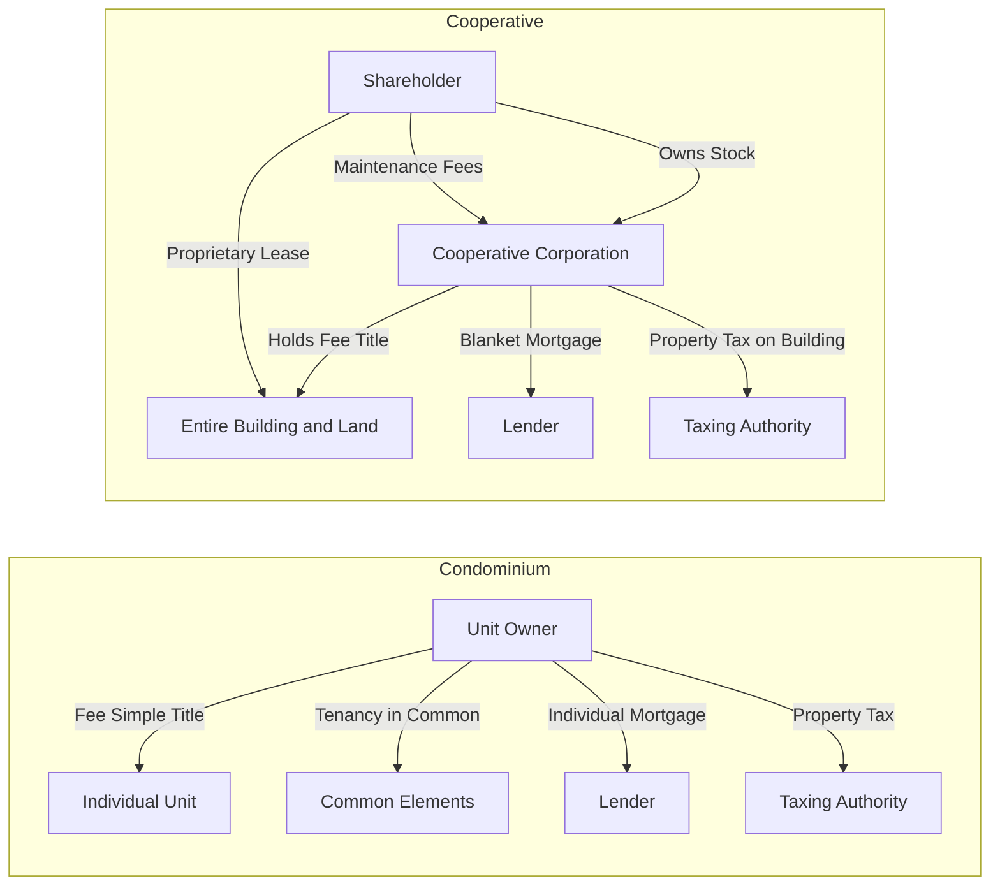

## Condominium and Cooperative Ownership

### Overview

Condominium and cooperative ownership are the two dominant legal structures for multi-unit common interest communities, each solving the same core problem — enabling exclusive private use of a housing unit combined with shared ownership and management of common facilities — through fundamentally different property law architectures. Condominiums fragment fee simple title itself, while cooperatives retain unified title in a corporate entity and distribute use rights through securities and leasehold interests. This structural divergence drives significant differences in financing, taxation, transferability, liability, and governance.

### Condominium Ownership

#### Legal Structure

**Key Points**

- A condominium unit owner holds **fee simple title** to the interior airspace of an individual unit combined with a **tenancy in common interest** (an undivided fractional interest) in the common elements — hallways, roofs, structural components, land, amenities.
- The unit and its common element interest are legally inseparable; a condominium deed conveys both together, and the common element percentage typically cannot be partitioned or severed from the unit under most enabling statutes.
- Governed by a **declaration** (also called a "master deed" or "declaration of condominium") recorded against the land, which creates the condominium regime, defines unit boundaries, allocates common element percentages, and establishes the condominium association.
- The condominium association, usually a nonprofit corporation or unincorporated association, manages common elements and enforces the declaration, bylaws, and rules, funded by mandatory assessments against unit owners.

#### Enabling Statutes

**Key Points**

- Condominiums did not exist at common law; they require enabling legislation because fee ownership of horizontally stacked airspace (a unit on the fifth floor, for instance) was not a recognized estate under traditional property doctrine.
- Most U.S. states adopted condominium statutes beginning in the 1960s, many modeled on the **Uniform Condominium Act (UCA)** or later consolidated into the broader **Uniform Common Interest Ownership Act (UCIOA)**, which also covers planned communities and cooperatives.
- These statutes typically address unit boundary definitions (often "walls-in" — interior surfaces of perimeter walls — unless the declaration specifies otherwise), common element allocation formulas, association powers, assessment lien priority, and disclosure requirements for developers selling units.

#### Unit Boundaries and Common Elements

**Key Points**

- **General common elements**: Shared by all owners (land, structure, roof, lobbies, elevators).
- **Limited common elements**: Reserved for the exclusive use of one or a few units despite being technically part of the common elements (a balcony accessible only from one unit, an assigned parking space, a storage locker).
- Unit boundary definitions matter significantly in practice: a "walls-in" boundary places responsibility for plumbing and wiring within walls on the association (as common elements), while some declarations shift more components into the unit, altering both maintenance responsibility and insurance allocation.

#### Financing and Taxation

**Key Points**

- Because each unit carries separate fee title, condominium units are individually mortgageable and individually assessed for **property tax purposes**, functioning much like single-family home financing from a lender's perspective.
- Owners qualify for conventional mortgage products, and lenders evaluate both the individual unit and, often, the overall financial health of the association (reserve funding, delinquency rates, litigation exposure) since association distress can impair unit collateral value.

### Cooperative Ownership

#### Legal Structure

**Key Points**

- A cooperative ("co-op") corporation holds **fee simple title to the entire building and land**. A resident does not own real property directly; rather, the resident owns **shares of stock** in the cooperative corporation, with the share allocation for each unit typically weighted by unit size or value.
- Stock ownership is paired with a **proprietary lease** (or occupancy agreement) between the corporation and the shareholder, granting the exclusive right to occupy a specific unit.
- Because the interest is technically personal property (shares plus a leasehold), not real property, cooperative ownership is sometimes analyzed under corporate and contract law principles in addition to real property and landlord-tenant doctrine.

#### Governance and the Underlying Mortgage

**Key Points**

- The cooperative corporation is typically financed by a **single blanket mortgage** on the entire building, with debt service apportioned among shareholders through **maintenance fees** rather than individually mortgaged units.
- This blanket-mortgage structure creates interdependent financial exposure: if a significant number of shareholders default on maintenance obligations, the corporation may struggle to service the underlying mortgage, potentially jeopardizing all residents regardless of their individual payment history.
- Governance is exercised through a **board of directors** elected by shareholders, which typically holds broad discretion — often reviewed under a highly deferential business judgment standard — including authority to approve or reject prospective purchasers of shares, a power condominium associations generally lack in equivalent form.

#### Transfer Restrictions

**Key Points**

- Cooperative boards commonly reserve a **right of first refusal** and **approval rights** over any proposed transfer of shares (sale, sublease, or gift), including review of the prospective buyer's finances, background, and sometimes personal interview.
- This approval power, while narrowed over time by fair housing law, remains substantially broader than the transfer restrictions typically permitted for condominiums, where a "right of first refusal" is the most common association control and outright rejection of a financially and legally qualified buyer is far less common and, in many jurisdictions, disfavored or restricted by statute.
- [Inference] The degree of judicial deference to cooperative board rejection decisions varies by state, with some jurisdictions applying a highly deferential business-judgment standard and others requiring the board to articulate legitimate, non-discriminatory reasons; this should be verified against the specific jurisdiction's case law for any concrete transaction.

#### Financing Complications for Purchasers

**Key Points**

- Because the purchaser acquires stock and a leasehold rather than real property, cooperative purchase financing uses a **share loan** secured by the stock certificate and proprietary lease (a personal property security interest, typically under UCC Article 9) rather than a conventional real estate mortgage.
- This structural difference historically limited the pool of lenders willing to finance cooperative purchases and can affect available loan terms compared to condominium financing.

### Comparative Table

| Feature | Condominium | Cooperative |
| --- | --- | --- |
| What owner holds | Fee simple to unit + tenancy in common in common elements | Stock shares + proprietary lease |
| Property tax | Assessed individually per unit | Assessed to corporation, apportioned via fees |
| Underlying debt | Individual mortgages per unit | Single blanket mortgage on building |
| Transfer approval | Generally limited (often right of first refusal only) | Often broad board approval power |
| Financing instrument | Real estate mortgage | Share loan (personal property security) |
| Legal characterization | Real property | Personal property (shares) + leasehold |
| Default risk exposure | Largely individualized | Can be collectivized via blanket mortgage |

### Structural Comparison Diagram

### Illustrative Example

Two neighbors each occupy a similar-sized unit in the same city, one in a condominium and one in a cooperative. The condominium owner holds a deed, pays her own mortgage and property tax bill directly, and can sell to any qualified buyer subject only to the association's right of first refusal. The cooperative resident holds a stock certificate and proprietary lease, pays a monthly maintenance fee that covers his proportional share of the building's blanket mortgage and property tax, and before selling must submit his buyer to the co-op board for financial and personal review — a process the board may use to reject the buyer outright, subject to fair housing constraints. If several cooperative shareholders default simultaneously, the corporation's ability to service the blanket mortgage may be strained in a way that has no analog in the condominium building next door, where each owner's mortgage default affects only that owner's unit.

### Related Topics

- Enforcement of Community Restrictions
- Declarations, Bylaws, and Rules Hierarchy in Common Interest Communities
- Assessment Liens and Lien Priority
- Fair Housing Act Constraints on Board Approval Power
- Conversion of Rental Buildings to Condominium or Cooperative Form
- Uniform Common Interest Ownership Act (UCIOA) Framework
- Reserve Funding and Financial Disclosure Requirements