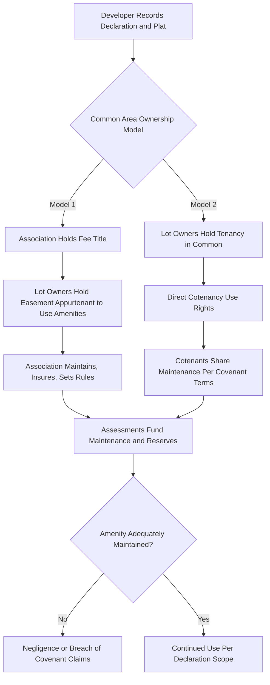

## Shared Amenities and Common Area Easements

### Overview

Shared amenities and common area easements concern the legal mechanisms by which owners in common interest communities acquire, hold, and exercise rights to use facilities and spaces they do not individually own in fee — pools, clubhouses, trails, parking areas, landscaped grounds, and recreational facilities. Unlike the ownership structures examined for condominiums and cooperatives, many common area interests in planned unit developments and subdivisions are structured as easements rather than as fractional fee ownership, producing distinct legal consequences for creation, scope, maintenance obligation, and termination.

### Legal Nature of Common Area Rights

**Key Points**

- In **condominiums**, common areas are typically held as **tenancy in common** interests appurtenant to each unit (an ownership share, not an easement).
- In **planned unit developments (PUDs)** and traditional subdivisions, common areas (parks, private streets, recreational facilities) are frequently owned in fee by the homeowners association itself, with individual lot owners holding an **easement appurtenant** over the association-owned land granting the right to use it.
- Some older or less formally structured developments instead grant use rights directly among neighboring lot owners without an intervening association, creating a network of reciprocal easements rather than a centralized ownership-and-license model.
- The choice of structure affects who bears liability for the common area (the fee owner, typically the association, bears primary premises liability exposure), who can be sued for maintenance failures, and how the right survives if the association dissolves.

### Creation of Common Area Easements

**Key Points**

- **Express grant in the declaration**: The overwhelmingly dominant method. The declaration, recorded against each lot, expressly grants every lot owner a non-exclusive easement to use specified common areas, subject to association rules.
- **Implication from a recorded plat**: Where a subdivision plat depicts common areas (parks, beaches, walkways) and lots are sold by reference to that plat, many jurisdictions imply an easement in favor of lot purchasers to use the depicted common areas, even absent an express grant — reasoning that purchasers reasonably relied on the amenity shown when buying.
- **Dedication**: A developer may dedicate common areas to public use (transferring them to a municipality) rather than retaining them as private community amenities; this shifts ownership, liability, and access rights entirely outside the association structure and is analytically distinct from a private common area easement.
- **Prescription**: Less common for developer-created amenities but theoretically available where use has been open, continuous, and adverse for the statutory period, particularly in older developments with informal historical use patterns.

### Scope, Use, and Restriction

**Key Points**

- Easements for community amenities are generally **appurtenant** (benefiting the lot, running with title to successive owners) rather than **in gross** (benefiting a specific person), meaning the right transfers automatically upon sale of the lot without separate assignment.
- The scope of permitted use is defined by the declaration and reasonably implied purpose — an easement "to use recreational facilities" does not typically extend to commercial use (e.g., renting out the clubhouse for a for-profit event business) absent express authorization.
- Associations may adopt **reasonable rules** governing amenity use (hours, capacity limits, guest policies, reservation systems) under their general rulemaking authority, subject to the same reasonableness review applicable to other association rules.
- **Suspension of amenity access** for unpaid assessments or rule violations is a commonly authorized enforcement tool, though courts distinguish suspension of purely recreational amenities (generally permitted) from suspension of access implicating basic habitability or safety (subject to closer scrutiny).

### Maintenance Obligations

**Key Points**

- The **fee owner** of the common area — typically the association — bears the primary obligation to maintain, repair, insure, and bear liability for common area amenities, funded through mandatory assessments levied against all benefited lot owners.
- Where common areas remain owned by lot owners as tenants in common (rather than by a separate association entity), maintenance and cost-sharing obligations derive from the declaration's covenants and, absent clear covenant language, default cotenancy principles — which can produce disputes over unequal contribution, particularly for major capital repairs.
- **Reserve funding** requirements — statutory or declaration-based obligations to accumulate funds for long-term capital replacement (roof replacement, pool resurfacing) — are increasingly mandated by state legislatures following high-profile instances of underfunded reserves leading to deferred maintenance and special assessment crises.
- Failure to maintain shared amenities can itself generate liability exposure distinct from restriction enforcement: negligence claims by injured users, and in some jurisdictions, breach-of-covenant claims by owners against the association for failing to maintain amenities as promised in marketing materials or the declaration.

### Termination and Modification

**Key Points**

- Common area easements, like other appurtenant easements, generally terminate only through recognized easement termination doctrines: release, merger (if the dominant and servient estates come under common ownership), abandonment, or the expiration of any stated term.
- Because these easements typically benefit an entire community of lot owners, unilateral termination by the association or a developer is usually barred; modification often requires supermajority owner consent as specified in the declaration's amendment provisions.
- Conversion of common area to a different use (e.g., converting an undeveloped "open space" easement area into an expanded parking lot) may require amendment procedures and can trigger claims from owners who relied on the original amenity designation when purchasing.

### Amenity Rights Structure

### Illustrative Example

A subdivision's recorded plat depicts a lakefront park labeled "Community Recreation Area." The declaration grants each lot owner a non-exclusive easement to use the park, and the homeowners association holds fee title to the parcel, funding its upkeep through annual assessments. A lot owner begins hosting paid kayak tours launching from the park's dock. The association can likely enjoin this activity as exceeding the scope of the personal recreational easement granted, since the declaration's grant does not extend to commercial exploitation of the shared facility. Separately, if the association fails to maintain the dock and a guest is injured due to rotted boards, the association — as the fee owner responsible for maintenance — bears primary premises liability exposure, distinct from and in addition to any restriction-enforcement dispute involving the kayak business.

### Related Topics

- Easements Appurtenant versus Easements in Gross
- Implied Easements from Recorded Plats
- Reserve Funding and Capital Replacement Planning
- Premises Liability in Common Interest Communities
- Amendment Procedures for Declarations
- Enforcement of Community Restrictions
- Public Dedication versus Private Common Area Retention