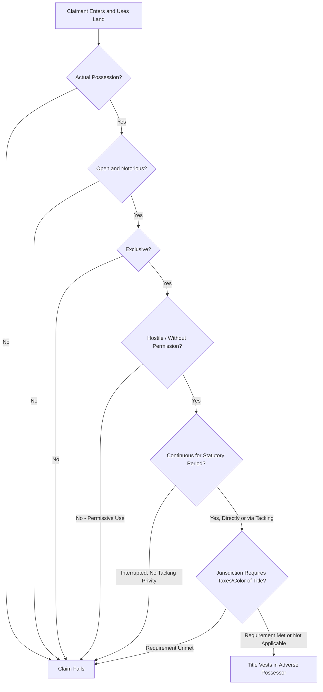

## Elements of Adverse Possession

### Overview

Adverse possession is the common law doctrine by which a non-titled possessor of land may acquire legal title through sufficiently prolonged, unauthorized possession, provided that possession satisfies a set of well-established elements. The doctrine operates as both a sword (creating title in the possessor) and a shield (barring the record owner's ejectment claim once the statutory period runs), and it reflects competing policy goals: rewarding productive land use and settling stale title disputes, against penalizing an owner's mere inattention or generosity. Precise articulation of the elements varies somewhat by jurisdiction, but the doctrine is generally organized around five to six core requirements.

### The Core Elements

#### Actual Possession

**Key Points**

- The claimant must physically use the land in a manner consistent with how a reasonable owner would use property of that type and character — cultivating farmland, fencing and grazing pastureland, maintaining and residing in a dwelling, or making other objectively verifiable improvements.
- The standard is relative to the nature of the land; a claimant need not build a structure on wilderness or vacant recreational land to satisfy actual possession, but must engage in acts consistent with an owner's use of such land (e.g., regular recreational use, timber harvesting, or seasonal use patterns typical for that terrain).
- Actual possession is distinguished from mere paper claims or occasional trespass; sporadic, casual entries generally do not suffice.

#### Open and Notorious Possession

**Key Points**

- Possession must be visible and obvious enough that a reasonably attentive owner, inspecting the property, would discover the adverse claim.
- This element serves a notice function: it is the mechanism by which the doctrine is not simply theft-by-limitation but rather places the true owner on constructive notice, giving the owner a fair opportunity to object or eject the possessor within the statutory period.
- Concealed or clandestine use (e.g., a hidden underground structure the owner would not discover through ordinary inspection) generally fails this element, though it may still satisfy other doctrines like prescriptive easement analysis with distinct notice requirements.

#### Exclusive Possession

**Key Points**

- The claimant must possess the land to the exclusion of the true owner and the general public, not sharing possession with the record owner or exercising rights merely in common with others.
- Exclusivity does not require that the claimant be the only person ever on the property (a claimant with invited guests still possesses exclusively), but the possession must be of a type that excludes the true owner's use and asserts the claimant's own dominion.
- Where multiple adverse claimants possess jointly (e.g., co-claimants acting together, not merely successively), some jurisdictions permit **tacking** of exclusive joint possession, distinct from succession by a single claim, though this is a more nuanced and less uniformly applied variation.

#### Hostile (Adverse) Possession

**Key Points**

- "Hostile" is a term of art that does not require ill will or subjective animosity; it means possession without the true owner's permission — possession asserted as of right, not as a licensee, tenant, or guest.
- Jurisdictions split on the required **state of mind**:
  - **Objective/majority standard**: The claimant's subjective belief is irrelevant; what matters is that possession occurred without permission, regardless of whether the claimant knew the land belonged to another or mistakenly believed it was their own.
  - **Good faith standard** (a minority, sometimes statutory approach): The claimant must have possessed under a good-faith but mistaken belief of ownership (common in boundary-dispute contexts, sometimes tied to "color of title" statutes).
  - **Aggressive trespasser (bad faith) standard**: A small minority historically required the claimant to know the land was not theirs and intend to claim it anyway; this approach has been widely criticized and is now disfavored in most jurisdictions, though it persists in modified forms in a few states.
- Permissive use (express or implied license from the owner) **defeats hostility entirely** and does not ripen into adverse possession no matter how long continued, unless the possessor later repudiates the permission and asserts an adverse claim with the owner's knowledge.

#### Continuous Possession for the Statutory Period

**Key Points**

- Possession must be continuous and uninterrupted for the full statutory period, which varies significantly by state — commonly ranging from roughly 5 to 21 years, with some states applying shorter periods where the claimant holds color of title and pays property taxes, and longer periods for possession lacking those features.
- "Continuous" is evaluated relative to the type of land and customary use, not literal uninterrupted physical presence; seasonal use consistent with how an owner would normally use that type of property (e.g., a summer cabin used only in summer months) can satisfy continuity.
- **Tacking**: Successive periods of possession by different adverse possessors may be combined to satisfy the statutory period if there is **privity** between the successive possessors — typically a voluntary transfer of possession (deed, even if defective, or other conveyance of possessory interest) rather than abandonment followed by a new, unrelated trespasser's independent claim.
- Any material interruption — the true owner reentering and reasserting possession, or the adverse possessor abandoning the land — resets the statutory clock.

### Additional Requirements in Some Jurisdictions

**Key Points**

- **Claim of right / claim of title**: Some states require an express or implied assertion that the claimant is possessing as owner, closely related to but analytically distinct from hostility.
- **Color of title**: Possession under a defective or invalid instrument purporting to convey title (e.g., a deed with a faulty description). Many states offer a shortened statutory period or expanded constructive possession (possession of the whole parcel described in the defective deed, even if the claimant only physically occupies part) when color of title is present.
- **Payment of property taxes**: A number of states require the adverse possessor to have paid property taxes on the parcel during the statutory period, particularly for claims lacking color of title; this requirement is often statutory rather than a common law element.
- Public land and government-owned property are typically **immune from adverse possession claims** under the doctrine of sovereign immunity, codified in most states as an explicit statutory exception.

### Burden of Proof

**Key Points**

- The adverse possessor bears the burden of proving each element, typically by a **clear and convincing evidence** standard in most jurisdictions (a heightened standard reflecting that adverse possession divests a title holder of property without compensation).
- Courts generally construe the elements strictly against the claimant and in favor of the record titleholder, reflecting the doctrine's character as an exception to ordinary title security rather than a favored mode of acquisition.

### Elements Interaction Diagram

### Illustrative Example

A landowner mistakenly builds a fence eighteen inches onto her neighbor's platted lot, believing the fence marks the true boundary. She mows, gardens, and maintains the strip continuously for the entire statutory period without ever asking the neighbor's permission. The neighbor, who rarely visits the parcel, never objects. Under the majority objective hostility standard, her mistaken belief is irrelevant — her unpermitted, exclusive, open, continuous use for the statutory period ripens into title regardless of her state of mind. If she later sells her home and the buyer continues maintaining the same strip believing it part of the purchased lot, most jurisdictions would permit tacking the buyer's possession onto the seller's because the deed conveyed possession of the yard as physically occupied, satisfying privity even though the strip was not accurately described in the deed's legal description.

### Related Topics

- Tacking and Privity Among Successive Possessors
- Color of Title and Constructive Possession
- Prescriptive Easements Compared to Adverse Possession
- Boundary Disputes and the Doctrine of Agreed Boundaries
- Disabilities and Tolling of the Statutory Period
- Adverse Possession Against Cotenants
- Government Land Immunity from Adverse Possession