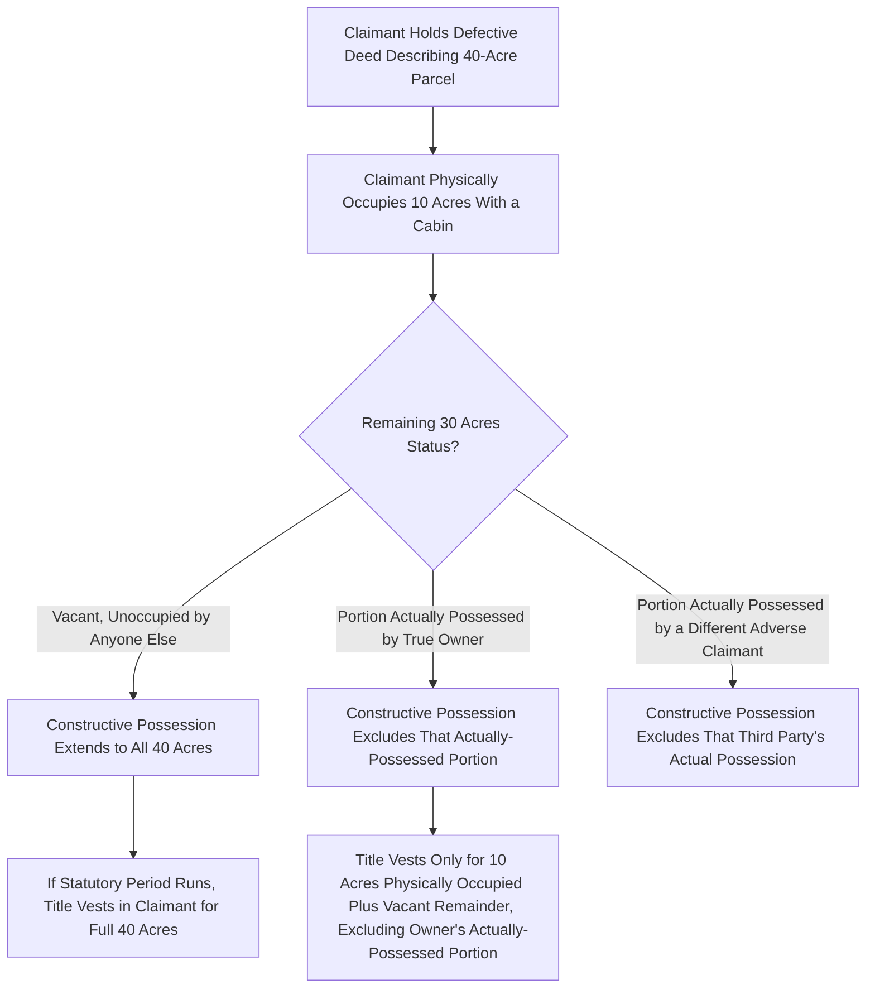

## Color of Title and Constructive Possession

### Overview

Color of title and constructive possession are related doctrines that expand the practical reach of adverse possession claims beyond the land a claimant physically occupies. Color of title refers to possession under an instrument that purports to convey title but is legally defective or invalid, while constructive possession allows a claimant with color of title to be treated as possessing an entire described parcel even though actual physical occupation covers only a portion of it. Together these doctrines significantly alter the scope and, in many states, the statutory timeline of an adverse possession claim.

### Color of Title Defined

**Key Points**

- Color of title exists when a claimant possesses land under a written instrument — a deed, will, or other conveyance — that **purports** to transfer title but is defective for some reason: a forged signature, a grantor who lacked actual authority or valid title, an improperly executed or unrecorded instrument, or a description that turns out to be erroneous.
- The instrument need not actually convey good title; its function is to give the claimant a **good-faith, document-based belief** that they own the described land, distinguishing color-of-title claimants from possessors who assert adverse possession based purely on physical occupation with no supporting paper claim.
- Common fact patterns include: a grantor who conveyed land they did not actually own (e.g., due to a prior undisclosed conveyance), a tax deed later invalidated for procedural defects, or a deed with an ambiguous or incorrect legal description that includes more land than the grantor actually held.
- Color of title is distinct from **claim of right** (an assertion of ownership that need not be based on any written instrument); a claimant can have claim of right without color of title, but color of title generally supports and strengthens a claim of right.

### Legal Significance of Color of Title

**Key Points**

- **Shortened statutory periods**: A substantial number of states provide a reduced adverse possession limitations period for claimants who possess under color of title compared to those who possess without any documentary basis, reflecting the view that color-of-title claimants present a more legitimate, less opportunistic claim.
- **Constructive possession of the whole parcel**: This is color of title's most significant practical effect — discussed in detail below.
- **Interaction with tax payment requirements**: Many statutes that condition adverse possession on payment of property taxes apply a relaxed or alternative standard when the claimant holds color of title and has paid taxes under that instrument, sometimes creating a distinct, faster path to title (occasionally called "adverse possession under color of title and payment of taxes").
- Color of title does not cure the underlying defect in the instrument for purposes of establishing record title; it operates purely within adverse possession doctrine as a possessory and notice-related concept, not as a title-curing mechanism in itself.

### Constructive Possession

**Key Points**

- Where a claimant holds color of title to a described parcel and has **actual physical possession of only part** of that parcel, many jurisdictions extend the legal fiction of possession to the **entire parcel described in the defective instrument**, provided the actual occupied portion is a meaningful part of the whole and the remainder is not otherwise possessed by another party.
- This differs sharply from adverse possession **without** color of title, where the claimant generally acquires title only to the specific portion of land actually, physically possessed — there is no constructive expansion to unoccupied land absent a supporting instrument.
- Constructive possession does not extend to portions of the described parcel that are, during the relevant period, in the **actual possession of another party** (including the true owner or a different adverse claimant) — the fiction fills gaps of vacant, unoccupied land within the described boundaries, but cannot dispossess someone already actually possessing a portion.
- The rationale mirrors the "open and notorious" notice function of adverse possession generally: because the claimant's possession is anchored to a recorded or otherwise identifiable instrument describing specific boundaries, the true owner has a documentary basis for discovering the scope of the adverse claim, justifying the extension of legal possession to the full described area.

### Constructive Possession Scope Illustration

### Interaction with Tacking

**Key Points**

- Color of title can also facilitate **tacking** between successive possessors, since a recorded (even if defective) instrument purporting to convey the described parcel supplies clear **privity** — a documentary chain connecting the predecessor's possession to the successor's claim — which is often harder to establish for claimants relying purely on physical possession without any instrument.
- Where a defective instrument's legal description is later corrected or reformed, courts generally look to the description as understood and relied upon by the parties in possession, rather than mechanically applying only the corrected description, to preserve the continuity color of title was meant to support.

### Distinguishing from Actual Possession Requirements

**Key Points**

- Constructive possession under color of title supplements but does not replace the other elements of adverse possession (open and notorious, exclusive, hostile, continuous) — those elements must still be satisfied, generally judged by reference to the claimant's actual, visible use of the physically occupied portion, which is then legally extended outward to the full described tract.
- A claimant cannot manufacture color of title through a self-serving, knowingly fraudulent instrument in most jurisdictions; genuine good-faith reliance on a facially plausible but legally defective conveyance is the doctrinal core, though jurisdictions vary in how closely they scrutinize the claimant's subjective belief given the general split on hostility's state-of-mind requirement discussed in adverse possession doctrine generally.

### Illustrative Example

A rancher purchases what she believes is a 200-acre parcel from a seller whose deed, unbeknownst to either party, contains a description overlapping a neighboring landowner's 15-acre strip due to a decades-old surveying error in the chain of title. The rancher fences and grazes cattle across the majority of the 200 acres, including part of the overlapping strip, but a small corner of that strip remains actively cultivated by the neighboring landowner throughout the period. Because the rancher holds color of title (her facially valid but ultimately defective deed) and has actually possessed a substantial portion of the described tract, most jurisdictions would extend her constructive possession to the full 200 acres described in her deed — except for the small corner still actually possessed by the neighboring landowner, which remains outside her constructive possession regardless of her deed's description. If the statutory period for color-of-title claims (often shorter than the standard period) runs, she acquires title to the 200 acres minus that actively-possessed corner.

### Related Topics

- Elements of Adverse Possession
- Tacking and Privity Among Successive Possessors
- Payment of Property Taxes as an Adverse Possession Requirement
- Boundary Disputes and the Doctrine of Agreed Boundaries
- Reformation of Deeds for Mutual Mistake
- Quiet Title Actions Following Adverse Possession Claims
- Marketable Title Acts and Their Interaction with Defective Instruments