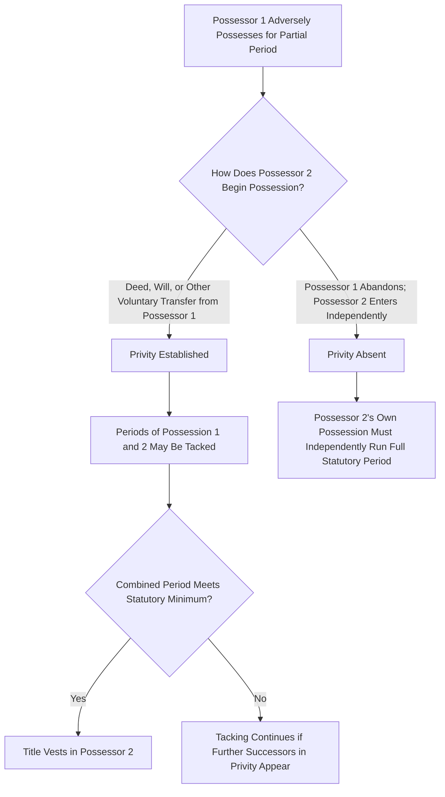

## Tacking and Privity Among Successive Possessors

### Overview

Tacking is the doctrine that allows an adverse possessor to combine (or "tack") their period of possession onto the possession period of a predecessor in order to satisfy the statutory limitations period, provided the required legal relationship — privity — exists between the successive possessors. Without tacking, a claimant whose own possession falls short of the statutory period could never acquire title even if the land had been continuously, adversely possessed by a chain of successive occupants for far longer than the statutory minimum. Tacking is therefore essential to the doctrine's practical operation in any setting where land changes hands informally among non-titled occupants over time.

### The Privity Requirement

**Key Points**

- **Privity** is the legal relationship that permits tacking: a voluntary transfer of the possessory interest from one adverse possessor to the next, such that the successor's claim is understood as a continuation of the predecessor's possession rather than an entirely new, independent act of trespass.
- Privity is typically satisfied by: a deed (even one that is defective or fails to actually convey good title, since the adverse possessor had no good title to convey in the first place), a will or intestate succession passing the decedent's possessory interest to an heir, or other recognized voluntary transfers of possession such as a contract of sale coupled with transfer of physical possession.
- Privity is **not** satisfied where the subsequent possessor's entry is independent of the prior possessor — for example, where the original adverse possessor abandons the land and a stranger later enters on their own initiative with no connection to the prior claimant. In that scenario, the second possessor cannot tack onto the first; their own possession must independently run the full statutory period.
- The privity requirement distinguishes tacking from a rule that would allow any sequence of trespassers, however unconnected, to aggregate their time; the requirement ensures the successive possession represents a continuous, transferred claim rather than a coincidental series of unrelated intrusions.

### Mechanics of Tacking

**Key Points**

- The combined periods of possession must, in the aggregate, meet or exceed the jurisdiction's statutory limitations period; if predecessor A possessed for 12 years and successor B (in privity with A) possesses for an additional 9 years in a state with a 20-year statute, the combined 21 years satisfies the requirement even though neither A nor B alone met it.
- The scope of the tacked possession is generally limited to the land actually (or constructively, under color of title) possessed by each successive claimant — a successor cannot tack onto a claim broader than what the predecessor's own possession, and any transferring instrument, actually covered.
- Tacking can apply symmetrically to benefit the **record owner's** side of the calculation as well: where the servient landowner's title itself passes through succession, courts generally treat the statutory period as continuing to run against the property regardless of changes in record ownership, since adverse possession runs against the land (and whoever holds title to it) rather than resetting merely because the record owner transferred title to a new owner unaware of the adverse claim.

### Privity Established vs. Privity Absent

### Interaction with Abandonment

**Key Points**

- **Abandonment resets the clock entirely.** If the original adverse possessor leaves the property with no intent to return and no transfer of the possessory claim to anyone, any subsequent adverse possession — even by the same original possessor returning later, or by a new occupant — begins a fresh statutory period with no tacking available to the earlier period.
- Distinguishing abandonment from a mere temporary absence consistent with the customary use of the land (e.g., a seasonal cabin owner absent in winter) matters significantly: temporary, customary absence does not break continuity or trigger the privity problem, since the claimant's own possession is treated as continuous throughout; the privity issue only arises when a **different person** subsequently claims possession.
- Courts examine the transferring possessor's intent and conduct closely where abandonment is alleged, since a successor's ability to tack — and therefore the entire claim's viability — often turns on this factual determination.

### Tacking Against the True Owner's Side

**Key Points**

- Just as successive adverse possessors can tack their possession, successive record owners are generally treated as bound by the running statutory period regardless of intervening transfers of record title — a new owner who purchases from the original owner does not get a fresh limitations period merely because they were personally unaware of the adverse possession at the time of purchase.
- This reflects the general property law principle that the statute of limitations runs against the land and the cause of action for ejectment, not merely against a particular titleholder personally, subject to jurisdiction-specific tolling rules for owner disabilities (minority, incapacity, imprisonment) which are analyzed separately from the tacking doctrine covering the possessor's side.

### Illustrative Example

A tenant farmer occupies a neglected parcel without the owner's permission, farming it openly for 8 years in a state with a 15-year adverse possession statute. He then sells his farming equipment and informally transfers his occupancy, by handshake agreement and a hand-written (legally insufficient to convey real property, but sufficient to evidence a transfer of possession) note, to a neighbor who continues farming the same parcel for another 9 years. Because the neighbor's entry was based on a voluntary transfer from the original farmer rather than an independent, unconnected entry, privity exists, and the two periods — 8 plus 9, totaling 17 years — may be tacked, satisfying the 15-year statute even though neither farmer individually possessed for the full period. Had the original farmer simply walked away from the land with no communication or transfer, and the neighbor later happened to start farming the same neglected parcel on his own initiative, no privity would exist, and the neighbor would need his own full 15 years of possession, unaided by any tacking onto the original farmer's 8 years.

### Related Topics

- Elements of Adverse Possession
- Color of Title and Constructive Possession
- Disabilities and Tolling of the Statutory Period
- Adverse Possession Against Cotenants
- Boundary Disputes and the Doctrine of Agreed Boundaries
- Quiet Title Actions Following Adverse Possession Claims
- Abandonment Doctrine in Property Law